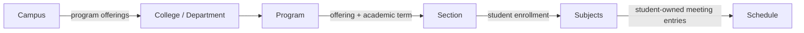

# My-Schedule Dynamic QCU Academic Structure and Configuration

Design date: 2026-08-30  
Status: planning only  
Basis: `AUDIT.md`, `ARCHITECTURE.md`, and `DATABASE.md`

## 1. Academic Hierarchy

My-Schedule is a QCU-specific application, but no authenticated page may assume that the current student is Habib, belongs to CCS or BSCS, uses a section such as SBCS-1B, studies at one fixed campus, or shares another student's schedule.

QCU is the institution root. The authenticated academic context is resolved from the student's active enrollment and shared catalog records:

```text
QCU institution configuration
-> active student enrollment
-> academic term
-> campus-specific program offering
-> college/department
-> program
-> year level and optional section
-> enrollment subjects
-> active schedule and meeting entries
```

The requested hierarchy is a presentation view assembled through normalized relationships, not one denormalized row:



The database does not store a direct Campus-to-Department ownership relation. A college appears under a campus when at least one of its programs has an active `Program_Offering` there. This supports a college operating at multiple campuses without duplicating the college or its programs.

### Resolution Path

For an active student:

1. `Users.userId` identifies the authenticated platform user.
2. `Student_Profiles.userId` supplies student identity fields.
3. The active `Enrollments` row supplies the term, program offering, year level, and section.
4. `Program_Offerings` resolves both `Programs` and `Campuses`.
5. `Programs.departmentId` resolves the college/department.
6. `Academic_Terms` resolves academic year and semester labels.
7. `Enrollment_Subjects` supplies that student's subjects for the enrollment.
8. The active `Schedules` row and its `Schedule_Entries` supply that student's meeting times and locations.

No frontend page should reconstruct identity from names, abbreviations, URL fragments, or hardcoded program switches.

## 2. Entity Relationships

| From | Relationship | To | Meaning |
|---|---|---|---|
| QCU configuration | has many | Campuses | Institution-wide campus catalog |
| Department | has many | Programs | A college/department owns academic programs |
| Program | has many | Program Offerings | A program may be available at multiple campuses |
| Campus | has many | Program Offerings | A campus may offer many programs |
| Program Offering + Term | has many | Sections | Sections are campus, program, and term specific |
| Program | many-to-many | Subjects | `Program_Subjects` records curriculum associations |
| User | has many | Enrollments | Student academic history by term |
| Enrollment | belongs to | Program Offering | Resolves campus and program |
| Enrollment | optionally belongs to | Section | Section is not used as an identity key |
| Enrollment | has many | Enrollment Subjects | Student-specific registered subjects |
| Enrollment | has many versions | Schedules | Only one schedule is active |
| Schedule | has many | Schedule Entries | One row per recurring class meeting |
| Schedule Entry | belongs to | Enrollment Subject | Connects a meeting to the student's subject |
| Building | belongs to | Campus | Physical catalog scope |
| Room | belongs to | Building | A room inherits its campus from the building |

### Section Is Not a Global Schedule

A section groups students within a program offering and academic term. It does not imply that every student has an identical subject list or timetable. Irregular, transferee, returning, or manually adjusted students may differ.

The current database therefore uses:

```text
Section
-> Enrollment
-> Enrollment_Subjects
-> Schedule
-> Schedule_Entries
```

If QCU later provides authoritative section schedule templates, that requires a separately designed template entity and import/override policy. It must not be inferred from one student's schedule.

## 3. Dynamic Configuration Model

Dynamic academic content comes from three coordinated sources:

| Source | Data | Update owner |
|---|---|---|
| `System_Settings` and approved asset registry | QCU name, default branding keys, catalog/config versions, allowed display options | Operator or configuration administrator |
| Shared catalog sheets | Campuses, departments, programs, offerings, terms, sections, subjects, buildings, rooms | Scoped catalog administrators |
| User-owned sheets | Profile, enrollment, enrollment subjects, schedule, tasks, notes | Authenticated owner through Apps Script |

Apps Script should compose a resolved read model. The browser should not download whole sheets and perform joins itself.

### Institution Configuration

Because the initial application serves only QCU, an `Institutions` table is unnecessary. Non-secret single-institution configuration belongs in `System_Settings` using controlled keys such as:

| Setting key | Example purpose | Exposure |
|---|---|---|
| `institution.name` | Full QCU display name | Public bootstrap |
| `institution.shortName` | `QCU` display label | Public bootstrap |
| `institution.logoAssetKey` | General QCU fallback logo | Public bootstrap |
| `institution.governmentLogoAssetKey` | Approved QC Government companion mark | Public bootstrap |
| `branding.assetRegistryVersion` | Cache invalidation for approved assets | Public bootstrap |
| `catalog.version` | Shared academic catalog cache version | Authenticated/public as needed |
| `academic.yearLevelLabels` | Configured numeric-to-display labels | Authenticated |
| `academic.defaultTimeZone` | Last-resort display time zone | Authenticated |

These settings are non-secret. Sheet IDs, Drive IDs, HMAC keys, OAuth secrets, and OCR credentials remain in Apps Script Properties.

### Resolved Academic Context

Conceptual `/api/v1/bootstrap` data:

```json
{
  "currentUser": {
    "userId": "usr_uuid",
    "displayName": "Sample Student"
  },
  "studentProfile": {
    "preferredName": "Sample",
    "studentNumberMasked": "20****123",
    "verificationStatus": "COR_REVIEWED"
  },
  "academicContext": {
    "enrollmentId": "enr_uuid",
    "campus": {
      "campusId": "cam_uuid",
      "code": "QCU-SB",
      "name": "QCU San Bartolome Campus",
      "shortName": "San Bartolome",
      "timeZone": "Asia/Manila"
    },
    "department": {
      "departmentId": "dep_uuid",
      "code": "CCS",
      "name": "College of Computer Studies",
      "shortName": "CCS"
    },
    "program": {
      "programId": "prg_uuid",
      "code": "BSIS",
      "name": "Bachelor of Science in Information Systems",
      "shortName": "BSIS"
    },
    "yearLevel": 1,
    "yearLevelLabel": "Year 1",
    "section": {
      "sectionId": "sec_uuid",
      "code": "SAMPLE-1A",
      "displayName": "Sample Section 1A"
    },
    "term": {
      "termId": "trm_uuid",
      "academicYearLabel": "2026-2027",
      "termCode": "FIRST_SEMESTER",
      "name": "First Semester AY 2026-2027"
    },
    "adviserName": "Sample Adviser"
  },
  "branding": {
    "institutionLogo": { "assetKey": "qcu-primary", "url": "/assets/approved/qcu.png" },
    "contextLogo": { "assetKey": "college-ccs", "url": "/assets/approved/ccs.png" },
    "contextLogoSource": "DEPARTMENT"
  },
  "catalogVersion": 1
}
```

The exact response shape is finalized with the API implementation, but these boundaries are required. The frontend receives already authorized, safe, resolved objects and stable IDs. Full student numbers should be returned only by a profile endpoint or view that genuinely needs them; global shell/bootstrap data should prefer a masked value.

## 4. College and Department Model

`Departments` is the technical sheet name from `DATABASE.md`. It represents colleges and nested academic departments through `unitType`.

| Field | Use in dynamic UI |
|---|---|
| `departmentId` | Stable relationship and selection value |
| `departmentCode` | Unique canonical admin/import code |
| `name` | Full presentation name |
| `shortName` | Compact presentation label when approved |
| `displayAbbreviation` | Optional non-unique visible abbreviation |
| `unitType` | `COLLEGE` or `DEPARTMENT` |
| `parentDepartmentId` | Optional nested structure |
| `logoAssetKey` | Approved branding reference |
| `status` | Whether selectable for new records |

### Identifier Rules

- `departmentId` is the primary identifier.
- `departmentCode` is unique and stable enough for administration/import matching, but API relations still use the ID.
- Names, short names, abbreviations, and logos may change without changing ownership or foreign keys.
- Display labels must come from the row. The UI must not derive a college name from a program prefix.
- Department-specific formatting rules are configuration, not conditionals such as `if department === "CCS"`.

### `COE` Conflict

`COE` can ambiguously mean College of Engineering or College of Education. It must never be a primary key, foreign key, unique URL key, or sole import match.

Use:

- Opaque IDs such as `dep_<uuid>` for relations.
- Unique canonical codes such as `ENG` and `EDUC`.
- Full names in ambiguous selection and administration screens.
- `COE` only as an optional display/legacy alias if QCU requires it.

An import that contains only `COE` must remain unresolved until another field, such as program code, safely disambiguates it or the student/admin confirms the match.

## 5. Program Model

`Programs` defines the degree catalog. `Program_Offerings` defines where a program is available.

```text
Departments.departmentId
-> Programs.departmentId
-> Program_Offerings.programId + campusId
-> Enrollments.offeringId
```

Program fields separate identity and presentation:

| Field | Purpose |
|---|---|
| `programId` | Stable PK and API value |
| `departmentId` | Owning college/department |
| `programCode` | Unique canonical code such as `BSCS` or `BSIS` |
| `name` | Official long name |
| `shortName` | Approved compact label |
| `description` | Optional admin-managed reference text |
| `logoAssetKey` | Optional approved program-specific logo |
| `status` | Active/inactive selection state |

A program is not automatically available at every campus. Administrators add or deactivate `Program_Offerings`. Existing enrollments continue resolving inactive historical rows, while new enrollments may select only active offerings.

Adding a future QCU program requires catalog and offering records, not source-code changes. The frontend renders returned records generically.

## 6. Campus Model

`Campuses` supplies both academic context and shared public/location configuration.

| Field | Purpose |
|---|---|
| `campusId` | Stable PK |
| `campusCode` | Unique canonical admin/import code |
| `name` / `shortName` | Full and compact labels |
| `timeZone` | Schedule calculations and display |
| `address` | Directory/profile display when approved |
| `latitude` / `longitude` | Campus map/status context |
| `logoAssetKey` | Optional campus branding |
| `mapConfigKey` | Approved public map/route configuration reference |
| `status` | Active/inactive |

### Multiple-Campus Rules

- User campus comes from the active enrollment's `Program_Offering`, not a global JavaScript constant.
- Buildings are filtered by `campusId`.
- Sections are scoped through the campus-specific offering and term.
- Schedule time calculations use the resolved campus time zone, with institution default only as a safe fallback.
- Public status/map endpoints must receive or resolve an approved campus configuration key. They must not trust arbitrary browser coordinates as an institutional campus.
- Route 4 may remain associated with San Bartolome only if that association is confirmed; it must not be presented as transport for every future campus.

Only San Bartolome is evidenced by the current codebase. No additional campus should be seeded as fact until QCU supplies authoritative data.

## 7. Building and Room Relationship

```text
Campus
-> Buildings
-> Rooms
-> Schedule_Entries
```

`Buildings` has `campusId`; `Rooms` has `buildingId`. A schedule entry may resolve `buildingId` and `roomId`, or retain reviewed `locationText` when a COR location has no catalog match.

Rules:

- Building codes are unique within a campus, not assumed globally unique.
- Room codes are unique within a building, not assumed globally unique.
- A selected room must belong to the selected building.
- The building's campus must match the student's enrollment campus unless an explicitly valid cross-campus class is supported later.
- Building short labels and floor labels are data, not name-matching logic.
- Buildings and rooms referenced historically are deactivated rather than deleted.
- The building directory may show the selected campus catalog and separately derive the current student's meetings. It must not present one student's subjects as an institutional building catalog.

The current building names and room codes are migration candidates only:

```text
New Academic Building: IL502A, IL601A, IL606A
Bautista Building: IK603 F1
Belmonte Hall: SB OG
```

Official names, codes, floor labels, images, and campus assignments require validation before seeding.

## 8. Subject and Section Model

### Subjects

`Subjects` is the shared canonical catalog. `Program_Subjects` is the curriculum association, and `Enrollment_Subjects` is the student's actual registration.

```text
Program -> Program_Subjects -> Subject
Enrollment -> Enrollment_Subjects -> optional Subject match
Enrollment_Subject -> Schedule_Entries
```

This separation supports:

- One subject used by multiple programs.
- Curriculum revisions without duplicating student records.
- COR subjects that have not yet matched the shared catalog.
- Subject snapshots that preserve what the student reviewed at enrollment time.
- Different schedules for students in the same program or section.

The UI should prefer the enrollment subject snapshot for the student's historical/current schedule, with the current shared subject record used for catalog metadata such as approved `colorKey`. An unmatched subject remains usable as a private reviewed snapshot and does not grant the student permission to create shared catalog data.

### Sections

`Sections` belongs to a `Program_Offering` and `Academic_Term` and contains:

- Stable `sectionId`.
- Admin/import `sectionCode`.
- Presentation `displayName`.
- `yearLevel`.
- Optional `adviserName`.
- Lifecycle status.

The active enrollment may use a `sectionId` or a reviewed `sectionLabelSnapshot` if the COR value is not yet in the catalog. Unknown labels are not silently promoted into shared sections.

### Adviser Resolution

There is no staff/adviser entity in the initial schema. Adviser display resolves in this order:

1. `Enrollments.adviserName`, preserving the reviewed term-specific value.
2. `Sections.adviserName`, when the enrollment has no adviser snapshot.
3. A neutral unavailable state.

If QCU later requires adviser accounts, assignments, or contact details, a separate staff model should be designed. Names alone must not be used as staff identifiers.

## 9. Academic Year and Semester Model

`Academic_Terms` represents both academic year and semester. Display text is never used as the key.

| Field | Example / rule |
|---|---|
| `termId` | Stable `trm_<uuid>` |
| `academicYearStart` | Numeric start year, for example `2026` |
| `academicYearLabel` | Approved display label, for example `2026-2027` |
| `termCode` | Controlled code such as `FIRST_SEMESTER` |
| `name` | Admin-managed full display label |
| `startsOn` / `endsOn` | Calendar dates |
| `status` | `PLANNED`, `ACTIVE`, `CLOSED`, `ARCHIVED` |

Rules:

- A term is shared QCU data initially; campus-specific calendars remain an open requirement.
- Historical terms remain resolvable after closure/archive.
- A section is term-specific.
- An enrollment belongs to exactly one term.
- Schedule recurrence dates should align with the term.
- The frontend displays `Academic_Terms` labels and never assembles an academic year by guessing from the current date.
- Semester names and year-level labels are configuration-driven so different naming conventions do not require page edits.

## 10. Logo and Branding Configuration

### Asset-Key Model

Catalog rows store `logoAssetKey`, not arbitrary URLs or HTML. An approved asset registry maps each key to a controlled descriptor:

```json
{
  "assetKey": "college-ccs",
  "url": "/assets/approved/college-ccs.png",
  "mimeType": "image/png",
  "alt": "College of Computer Studies logo",
  "version": 1,
  "status": "ACTIVE"
}
```

The initial registry may be a deployment-controlled manifest resolved by the backend. Administrators select from registered keys. Arbitrary remote image URLs, data URLs, SVG/HTML fragments, and student uploads are not accepted.

### Context Logo Resolution

For authenticated academic content, resolve the first active approved asset in this order:

```text
Program.logoAssetKey
-> Department.logoAssetKey
-> Campus.logoAssetKey
-> institution.logoAssetKey
-> neutral QCU text/mark fallback
```

The primary user-requested path remains valid:

```text
active enrollment
-> Program.departmentId
-> Departments.logoAssetKey
-> approved asset registry
-> UI context logo
```

A program logo is an optional higher-specificity override, not a requirement.

### Public App Identity vs Student Context

- PWA manifest icons, favicon, offline shell, and public landing identity should use a general approved QCU/My-Schedule asset.
- They should not change per signed-in department because browsers and service workers cache them outside the authenticated academic context.
- Department/program logos belong inside authenticated page content, profile surfaces, and the resolved shell after bootstrap.
- The QC Government companion logo remains a separate approved institutional asset.

### Existing Asset Candidates

The repository contains possible assets for CCS, BSIT, BSA, BS Entrepreneurship, BSIE, BSECE, and the College of Education, plus general QCU/QC images. Presence in the repository is not proof of official approval, correct ownership, or current branding. CHUNK 4 design treats them as candidates to be reviewed, renamed through stable asset keys, and either approved or excluded.

There is no identified BSIS-specific logo in the audited asset set. BSIS should use the approved CCS department logo, then campus/institution fallback, unless QCU supplies an approved program asset.

### Missing or Broken Logo Handling

- Missing key: continue down the fallback chain.
- Unknown/inactive key: reject on admin save and use fallback for existing bad data.
- Failed image load: attempt the next fallback once; avoid retry loops.
- Missing all images: render institution text/neutral mark without a broken-image placeholder.
- Alt text comes from the resolved asset descriptor or entity name.
- Cache by asset key plus version, never by student name/email.

## 11. Student-Specific vs Shared Data

| Classification | Data |
|---|---|
| Shared QCU data | Institution display configuration, campuses, departments/colleges, programs, program offerings, academic terms, sections, subjects, program-subject associations, buildings, rooms, approved branding keys |
| Student-specific data | Google-linked user account, student name, student number, preferred name, profile verification, enrollment, program/campus selection through offering, year level, section membership/snapshot, adviser snapshot, enrollment subjects, schedule versions/entries, tasks, notes, COR records, personal settings |
| Admin-managed data | Shared catalog rows, program availability, term/section status, department/program/campus logos, approved asset registry, building/room catalog, announcements, account status, roles/scopes, non-secret system configuration |
| System-managed data | Resolved ownership, schema version, mutation receipts, import worker states, audit events, secrets in Script Properties |

Student-specific data must never be placed in repository JSON, public static HTML, shared catalog rows, manifest metadata, or generic service-worker caches.

## 12. Admin-Managed Academic Configuration

Administrators operate through capability and scope checks defined in `DATABASE.md`.

### Managed Operations

| Configuration | Admin action | Integrity rule |
|---|---|---|
| Campus | Add, edit labels/config, deactivate | Canonical code unique; coordinates/time zone validated |
| College/department | Add, rename, nest, brand, deactivate | Stable ID retained; canonical code unique |
| Program | Add, rename, brand, deactivate | Must reference valid department |
| Program offering | Enable/disable program at campus | Unique active program-campus pair |
| Academic term | Create calendar and lifecycle | Unique year/term code; valid date range |
| Section | Add/update/deactivate term section | Offering and term compatible |
| Subject | Add/update/deactivate catalog subject | Canonical code rule from approved QCU source |
| Program subject | Maintain curriculum association | Program/subject/effective-term validity |
| Building/room | Maintain physical catalog and images | Campus/building relationships valid |
| Branding | Select approved asset keys | No arbitrary URL; fallback always available |
| Announcement | Draft/publish/archive scoped notice | Audience scope and dates validated |

Catalog changes use stable IDs, expected versions, deactivation rather than destructive deletion, and audit events. Scoped administrators may only change records within their assignment. A UI-hidden control is not authorization; Apps Script must enforce every write.

### Announcement Separation

Three announcement concepts must remain distinct:

1. `Announcements`: My-Schedule admin-managed notices scoped to QCU academic audiences.
2. QC/QCU public suspension feeds: existing safety-sensitive public status sources.
3. Google Classroom announcements: optional external integration data owned by Google/Classroom.

They may be presented near each other, but they have different sources, authorization, reliability, and retention rules.

## 13. Dynamic UI Field Resolution

| UI information | Authoritative source | Display rule |
|---|---|---|
| Student name | `Student_Profiles.preferredName` or reviewed name; fallback `Users.displayName` | Show preferred/appropriate name; never a source constant |
| Student number | `Student_Profiles.studentNumber` | Full value only in profile/necessary views; mask elsewhere |
| College name | Active enrollment -> offering -> program -> department `name` | Full label in profile; compact label when space-limited |
| College abbreviation | Department `shortName` or `displayAbbreviation` | Never use as relation or unique selector |
| College logo | Department `logoAssetKey` through registry | Apply fallback chain |
| Program/course | Program `name`, `shortName`, `programCode` | Presentation field chosen by container; ID remains internal |
| Year level | `Enrollments.yearLevel` plus configured label | Do not infer from section code |
| Section | `Sections.displayName/code` or enrollment snapshot | Do not parse program/year from label |
| Campus | Offering -> Campus | Use full/short campus label as appropriate |
| Academic year | Enrollment -> `Academic_Terms.academicYearLabel` | Do not derive from current date |
| Semester | `Academic_Terms.name/termCode` | Use configured name |
| Subjects | `Enrollment_Subjects` plus optional `Subjects` metadata | Use reviewed snapshots for student's record |
| Subject colors | `Subjects.colorKey` through approved palette | Deterministic neutral fallback |
| Rooms | `Schedule_Entries.roomId` -> Rooms | Fall back to reviewed `locationText`/TBA |
| Buildings | Room -> Building or entry `buildingId` | Use catalog short/full name; no substring matching |
| Advisers | Enrollment snapshot, then section adviser | Neutral unavailable state if missing |
| Schedule | Active Schedule + Schedule Entries | Always owner-scoped and term-specific |
| Announcements | Scoped `Announcements` plus separately labeled public/integration feeds | Filter server-side by active academic context |
| Profile information | Users + Student Profiles + active/historical Enrollments | Separate Google account data from QCU student data |

## 14. Current Hardcoded-Value Migration Map

This is a design map only. No listed source is changed in this chunk.

| Current value/behavior | Current location | New data source | Required future frontend/backend change |
|---|---|---|---|
| Greeting name `Habib` | `assets/js/app.js:510`, `:903` | Resolved student preferred/display name | Shell/Home consume authenticated bootstrap; neutral loading state before bootstrap |
| `BS Computer Science - San Bartolome` subtitle | `assets/js/app.js:249` | Active enrollment -> Program + Campus | Replace literal with academic-context formatter |
| CCS image as shell logo | `assets/js/app.js:246` | Resolved context branding | Load approved program/department/campus/institution asset after bootstrap |
| CCS image as favicon/apple icon on pages | Multiple HTML files | General institution/app branding | Use one approved general QCU/My-Schedule public icon, not per-user branding |
| CCS image as manifest icons | `manifest.json:12`, `:18` | General institution/app branding | Keep manifest stable and department-neutral |
| CCS image in service-worker precache/offline page | `service-worker.js:22`, `offline.html:18` | General institution/app fallback | Precache general QCU asset; never show CCS as universal identity |
| CCS image for Google update notifications | `assets/js/google-integration.js:408` | General app icon or resolved safe notification asset | Use approved app-level icon; do not expose department through stale browser notifications |
| Personal schedule literals | `assets/js/app.js:7-20` | Active Schedules, Schedule Entries, Enrollment Subjects | Remove production personal fallback; fetch owner-scoped API read model |
| Duplicate personal schedule JSON | `data/schedule.json` | Same owner-scoped schedule API | Treat JSON only as an explicit migration fixture if later approved |
| Building literals/room arrays | `assets/js/app.js:21-25`, `data/buildings.json` | Campuses, Buildings, Rooms | Load campus-filtered catalog; separate shared rooms from student meetings |
| Building short-name substring rules | `assets/js/app.js:662-669` | Building `shortName`/`name` | Render configured labels; remove building-name conditionals |
| Subject name map | `assets/js/app.js:907-918` | Enrollment Subject snapshots + Subjects catalog | Resolve names from API, not course-code switch |
| Subject color map | `assets/js/app.js:920-930` | Subject `colorKey` + approved palette | Resolve safe palette token with neutral fallback |
| Task/note subject list from personal defaults | `assets/js/app.js:946-951` | Active Enrollment Subjects | Populate owner-scoped options; preserve links to archived subjects where needed |
| Generic `qcu-tasks` and `qcu-notes` storage | `assets/js/app.js:955`, `:1197` | Tasks/Notes API and user-scoped cache | Namespace by `userId`; explicit legacy import prompt; purge private cache on logout |
| Fixed `Asia/Manila` time zone | `assets/js/app.js:52-53` | Active Campus `timeZone`; institution fallback | Initialize schedule clock from bootstrap context |
| San Bartolome coordinates/name | `assets/js/status.js:36-37`, `assets/js/eta.js:12` | Campus catalog + approved public map config | Resolve selected/active campus; preserve public fail-unknown behavior |
| Backend San Bartolome coordinates | `functions/api/flood.js`, `weather-alerts.js`, `route.js`; related scripts | Trusted campus/map configuration | Backend selects allowlisted campus config, not arbitrary client coordinates |
| `QCU Campus` / `San Bartolome` status labels | `assets/js/status.js:1176-1182` | Campus full/short labels | Render selected campus context |
| Route 4 page copy fixed to San Bartolome | `campus-eta.html`, `data/qcity-bus.json`, `assets/js/eta.js` | Public route config associated with a campus | Keep Route 4 facts static/versioned initially, but label campus association from config |
| Rooms/floors embedded in schedule rows | Current JSON/default schedule shape | Schedule Entry room IDs + Room/Building catalog | Normalize location joins; retain `locationText` for unresolved COR values |
| Student number, year, section, adviser, term absent from current UI model | No authoritative current source | Student Profile, Enrollment, Section, Academic Term | Add to future profile/bootstrap view models; do not infer from BSCS or section strings |
| Platform announcements absent | Current status and Google feeds only | Scoped `Announcements` entity | Add separate API/read model later; do not merge with suspension or Classroom semantics |
| `SBCS-1B` personal-section assumption | Not found in audited checkout; supplied as a value to eliminate | Active Enrollment -> Section or snapshot | Treat as student data if present, never an application default |

## 15. Frontend Data-Resolution Strategy

### Bootstrap First

Authenticated pages should follow this sequence:

```text
Verify session
-> GET /api/v1/bootstrap
-> validate API/schema version
-> resolve route state
-> render general QCU shell + authenticated academic context
-> fetch feature-specific data when not included in bootstrap
```

Before bootstrap completes, render a neutral general QCU loading shell. Do not render Habib, BSCS, CCS, a department logo, a cached prior user's context, or a personal schedule fallback.

### Client Services

The future frontend should centralize:

- `authBootstrapService`: session and current-user context.
- `academicContextService`: active enrollment and display model.
- `catalogService`: versioned shared catalog subsets.
- `brandingResolver`: approved asset keys and fallback order.
- `scheduleService`: active schedule and meeting view model.
- `workspaceService`: user-owned tasks/notes and subject options.
- `announcementService`: scoped platform announcements, distinct from public status and Classroom.
- `offlineCache`: namespaced by platform `userId` and catalog version.

Feature components should consume normalized models and should not call Sheets, parse section codes, map program names, or choose logo files.

### Presentation Labels

- Keep IDs in state and API payloads; render names/short names separately.
- Use full labels in profile, review, and admin contexts where ambiguity matters.
- Use approved short labels in compact headers only when available.
- Do not truncate by replacing official names with invented abbreviations.
- Do not scale text based on viewport width; use layout wrapping and container constraints.
- Dynamic text must be rendered through safe text operations, not unescaped `innerHTML`.

### Caching

- Cache shared catalogs by `catalogVersion`.
- Cache private academic context by `userId` and enrollment/schedule version.
- Invalidate branding by `assetRegistryVersion`.
- Purge active user's private cache on logout/account reset.
- A last-known schedule may be shown offline with a synchronization timestamp.
- No offline failure path may load the embedded personal timetable.

## 16. Missing and Invalid Configuration Handling

| Condition | Required behavior |
|---|---|
| No authenticated user | Public landing only; no private academic context |
| New user/no active enrollment | Resume onboarding or term-renewal flow |
| Missing program/department/campus FK | Treat as integrity error; show general QCU branding and unavailable academic information; log for repair |
| Referenced catalog row inactive | Allow historical display; block new selection |
| Missing section | Display reviewed section snapshot or `Section unavailable`; never infer from program/year |
| Missing subject catalog match | Use reviewed enrollment subject snapshot |
| Missing room/building match | Use reviewed `locationText` or `TBA` |
| Missing adviser | Show neutral unavailable state; do not guess from section |
| Missing subject color | Use one accessible neutral palette token |
| Missing/broken logo | Follow the approved fallback chain, then text/neutral QCU mark |
| Unknown department abbreviation | Display full configured name; never guess from code prefix |
| Ambiguous `COE` import | Keep unresolved until program/context disambiguates or user confirms |
| Invalid schedule time/day | Backend rejects activation/commit; frontend shows actionable correction state |
| No active announcements | Valid empty state, not an error |
| Catalog/API unavailable | Use user-scoped last-known cache when allowed and label it stale; never use personal repository defaults |
| Catalog version mismatch | Refresh catalog before rendering dependent selectors/mutations |

Backend APIs fail closed on invalid foreign keys, scope mismatches, and inactive selections. Frontend fallback affects presentation only and must not manufacture IDs or persist guessed academic data.

## 17. Seed QCU Academic Data

The following is seed/reference data supplied across the project requirements. It is not assumed permanently complete. Administrators must be able to add, update, and deactivate catalog records without frontend changes.

### Departments and Programs

| Department canonical code | Department display name | Program code | Program display name | Seed status |
|---|---|---|---|---|
| `CCS` | College of Computer Studies | `BSIT` | Bachelor of Science in Information Technology | Reference; confirm official naming |
| `CCS` | College of Computer Studies | `BSCS` | Bachelor of Science in Computer Science | Reference; confirm official naming |
| `CCS` | College of Computer Studies | `BSIS` | Bachelor of Science in Information Systems | User-requested addition; provisional pending QCU confirmation |
| `CBAA` | College of Business Administration and Accountancy | `BSA` | Bachelor of Science in Accountancy | Reference; confirm official naming |
| `CBAA` | College of Business Administration and Accountancy | `BSENTREP` | BS Entrepreneurship / Bachelor of Science in Entrepreneurship | Reference; confirm official canonical code and name |
| `ENG` | College of Engineering | `BSIE` | Bachelor of Science in Industrial Engineering | Reference; confirm official naming |
| `ENG` | College of Engineering | `BSECE` | Bachelor of Science in Electronics Engineering | Reference; confirm official naming |
| `EDUC` | College of Education | `BECED` | Bachelor of Early Childhood Education | Reference; confirm official capitalization/code |

The visible labels `BS Entrep` and `BECEd` from the supplied list may be retained as approved `shortName` values if QCU confirms them. Canonical codes are separate from display spelling.

### Campus and Offerings

The current application establishes San Bartolome as its campus context. A provisional campus record may be planned with a generated `campusId`, a canonical code such as `QCU-SB`, the official name after confirmation, `Asia/Manila`, approved coordinates/address, and a general QCU logo/map key.

Do not assume every listed program is offered at San Bartolome or every QCU campus. `Program_Offerings` must be seeded only from an authoritative QCU source.

### IDs

Seed manifests must assign opaque stable IDs once and preserve them across development/test/production mappings. They must not derive IDs from names:

```text
dep_<uuid>  not  department-ccs-name
prg_<uuid>  not  program-bscs
cam_<uuid>  not  san-bartolome
```

Codes remain useful for import matching and administration but are not database relations.

## 18. Extensibility Rules

1. Adding a college, program, campus, section, subject, or building is a catalog operation, not a frontend deployment.
2. New programs become selectable only through active campus-specific `Program_Offerings`.
3. Names, abbreviations, and logos may change without changing stable IDs.
4. Presentation code must not switch on CCS, BSCS, BSIS, CBAA, ENG, EDUC, or any current program code.
5. Department naming is row-driven; a future unit may use College, Institute, School, or another approved term.
6. Multiple academic terms coexist; history remains linked to the term used at enrollment.
7. Multiple campuses use the same entities and API contracts; campus-specific map/status data uses allowlisted config keys.
8. Subjects may serve multiple programs through `Program_Subjects`.
9. Student subject and schedule data remains private even when students share a section.
10. Unknown COR values remain draft/snapshots until matched; OCR never expands the shared catalog automatically.
11. Deactivation preserves historical foreign keys and removes records only from new-selection lists.
12. Asset keys are stable indirection; file paths and formats may change behind the registry.
13. Shared catalog API contracts expose IDs plus labels, never Sheet rows or A1 ranges.
14. A future SQL backend must preserve the same entity IDs, offering relationships, and resolved frontend models.
15. Institution multi-tenancy is out of scope. If the product expands beyond QCU, introduce an Institution entity deliberately instead of overloading current campus/department fields.

## 19. Open Questions and Assumptions

### Assumptions

- QCU is the only institution in the initial product.
- San Bartolome is the only campus evidenced by the current codebase; the model supports others without seeding them as fact.
- BSIS belongs under CCS because the user explicitly added it in this chunk; its official offering campus, long name, logo, and curriculum remain to be confirmed.
- College/department relationships are institution-wide; campus availability is represented by program offerings.
- Section membership does not define an identical schedule for all students.
- Existing image files are candidate assets, not automatically approved official logos.
- Platform announcements are separate from public suspension data and Classroom announcements.

### Questions Requiring Clarification

1. What is the authoritative QCU source and owner for campuses, colleges, programs, offerings, subjects, sections, buildings, and rooms?
2. What is the official full name, canonical code, campus availability, and approved logo policy for BSIS?
3. What official canonical codes should Engineering and Education use, and is `COE` required as a display alias for either?
4. What are the official names/capitalization for BS Entrepreneurship and BECEd?
5. Which listed programs are offered at which campuses?
6. Are academic terms institution-wide, or can calendars/status differ by campus or program?
7. What are the approved year-level labels and maximum year levels per program?
8. Are sections always tied to one offering and term, and who maintains section/adviser data?
9. Are subject codes globally unique across QCU and curriculum revisions?
10. Does QCU have authoritative section schedule templates, or only student-specific COR schedules?
11. Which existing logo/image files are official, current, licensed for use, and acceptable at each fallback level?
12. Should administrators initially select deployment-bundled assets only, or is a reviewed upload/public-hosting workflow required?
13. Should the full student number appear anywhere outside the profile and COR review flows?
14. Which platform announcement scopes and publishing roles are required for the first release?
15. Is Route 4 a San Bartolome-only feature, and should other campuses hide it when no configured route exists?

## CHUNK 5 Handoff: Authentication and User Identity Architecture

CHUNK 5 should define how a verified Google identity becomes the platform `userId` that owns and resolves the academic context designed here. It must:

1. Specify the Google OIDC login flow, minimal scopes, immutable `googleSub` handling, verified-email policy, and allowed-account/domain decision.
2. Define account creation/bootstrap states for unknown, onboarding, active, suspended, and closed users.
3. Define the session cookie, CSRF/origin protections, Cloudflare-to-Apps-Script signed identity envelope, replay protection, renewal, logout, and revocation behavior.
4. Define how `userId` resolves `Student_Profiles`, active `Enrollments`, roles/capabilities, and the dynamic academic/branding bootstrap without trusting browser-supplied IDs.
5. Keep Google login separate from optional Classroom/Gmail authorization and token storage.
6. Define duplicate Google account/email/student-number handling without automatic account merging.
7. Define shared-device privacy, user-scoped cache naming, logout cache deletion, and no-personal-fallback behavior.
8. Define administrator bootstrap, role assignment safeguards, account recovery/linking policy, audit events, and privacy-safe error responses.
9. Produce authentication and identity contracts only; do not implement OAuth, sessions, APIs, Sheets changes, or UI changes until a later chunk authorizes implementation.
