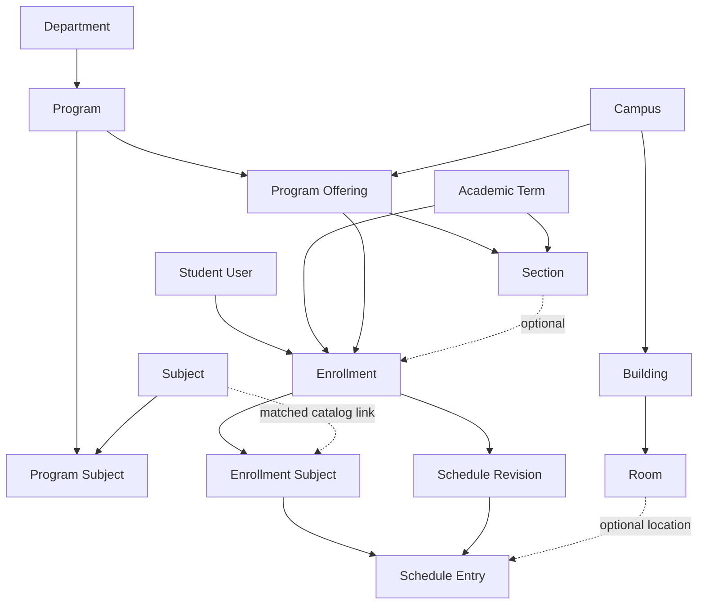
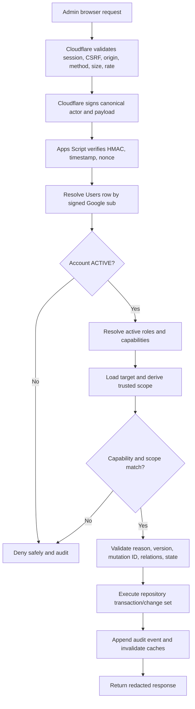

# My-Schedule Admin and Management CRUD Architecture

Status: Planning only  
Scope: Administrative management of shared QCU data and authorized student records  
Sources: `AUDIT.md`, `ARCHITECTURE.md`, `DATABASE.md`, `ACADEMIC_STRUCTURE.md`, `AUTHENTICATION.md`, `REGISTRATION_COR.md`, `COR_AI_PIPELINE.md`, `STUDENT_DASHBOARD.md`, `SCHEDULE_CRUD.md`, `LOCATION_MAP.md`, and `PRODUCTIVITY.md`

This document defines a separate, capability-scoped administrative application for My-Schedule. It does not create a universal super-admin, grant administrators ownership of student data, or authorize direct Google Sheets/Drive access through the browser.

## 1. Admin System Overview

The admin system manages shared QCU configuration and narrowly authorized support workflows through the same versioned Cloudflare-to-Apps-Script API boundary as the student application.

Core principles:

- Administrative access is an authenticated application state, not a hidden page or boolean frontend flag.
- Every privileged operation requires a specific capability and a matching `GLOBAL`, `CAMPUS`, `DEPARTMENT`, or `PROGRAM` scope.
- Shared catalog data and announcements are admin-managed; student profiles, enrollments, schedules, and COR records remain student-owned.
- Administrative corrections preserve origin, evidence, previous revisions, actor, reason, and time.
- Referenced records are deactivated or archived instead of being physically removed.
- Google Sheets is accessed only through Apps Script repositories. Admin users never receive direct Sheet or Drive sharing access.
- Infrastructure operators and application administrators are separate trust roles even if the same person temporarily performs both in a small deployment.

The initial management surface includes:

```text
Overview
Students
Academic Structure
Enrollments and Schedules
Locations
COR Support
Announcements
Access and Audit
System Configuration
```

## 2. Roles and Permissions

### Student

An active student may access only their own private records and approved shared data, as defined in `AUTHENTICATION.md`. Students never receive admin routes or shared-catalog mutations.

### Administrator

`ADMINISTRATOR` is an active role assignment combined with explicit capabilities and scope. The role name alone grants nothing.

Initial capability use:

| Capability | Administrative purpose | Scope behavior |
|---|---|---|
| `catalog.read` | Read shared catalogs | Approved active/historical projection |
| `catalog.write` | Create, update, deactivate catalog records | Must match target/parent scope |
| `users.read` | Read bounded student/account support projection | Scope-derived and audited for sensitive detail |
| `users.status.write` | Suspend/reactivate accounts | Scope, reason, expected version, audit |
| `roles.read` | View permitted assignments/capabilities | Cannot reveal unauthorized scopes |
| `roles.manage` | Grant/revoke approved roles | No self-escalation; delegation limits; lock and audit |
| `imports.review` | View safe COR metadata and reviewed draft support data | Does not include original document access |
| `documents.read.support` | Open a COR document for necessary support | Reason required; short-lived access; audit |
| `announcements.write` | Create/publish/archive scoped announcements | Audience must fit assignment scope |
| `audit.read` | Read filtered audit events | Mandatory filters and redaction |
| `system.config.read` | Read permitted non-secret configuration | Visibility rules apply |
| `system.config.write` | Change approved non-secret settings | Prefer operator/global restriction |

`SCHEDULE_CRUD.md` recommends adding `academic.correction.write` before implementation. This is justified and should remain separate from `imports.review`: reviewing an extraction must not authorize changes to trusted enrollments or schedules. A read capability such as `academic.support.read` should be added only if `users.read` is judged too broad during the capability review.

### Future Clerk or Department Administrator

Do not create `CLERK` in the initial role seed. If operational needs later justify it, define it as a bundle of existing narrow capabilities with campus/department/program scope. It must not receive:

- `roles.manage` by default.
- Global `system.config.write`.
- COR document access unless separately assigned.
- Student Tasks or Notes access.
- Permission to change Google identity links.

Role definitions remain extensible through `Roles`, `Capabilities`, `Role_Capabilities`, and `Role_Assignments`; domain authorization still validates the target and scope.

## 3. Admin Dashboard Information Architecture

The admin application should use a separate authenticated shell and route group, for example `/admin/*`. The student dashboard remains schedule-first and does not become an admin/student hybrid.

### Overview

- Catalog integrity warnings.
- COR jobs requiring authorized review, without student content previews.
- Enrollment/schedule conflicts requiring action.
- Announcements in draft, scheduled, published, or expiring soon.
- Recent privileged actions within the actor's permitted scope.
- Operational failure counts and stale-data indicators, not vanity metrics.

### Students

- Search by approved identifiers with bounded results.
- Account state, onboarding state, profile verification state, active academic context, and support flags.
- Separate account, profile, enrollment, schedule, and COR support views.

### Academic Structure

- Campuses and program offerings.
- Departments/colleges and programs.
- Academic terms.
- Sections.
- Subjects and program-subject curriculum links.

### Enrollments and Schedules

- Student-owned current/history views.
- Proposed admin corrections and schedule revisions.
- Conflicts, inactive catalog references, and provenance.

### Locations

- Campuses, buildings, rooms, and approved map configuration metadata.
- Dependency/impact view before deactivation.

### COR Support

- Safe import metadata, processing state, validation issues, and reviewed draft values.
- Original document action shown only with `documents.read.support`.

### Announcements

- Draft, scheduled, published, expired, and archived lists.
- Audience and visibility window controls.

### Access and Audit

- Role assignments, only for users with the corresponding capabilities.
- Filtered audit search.

### System Configuration

- Non-secret allowlisted settings only.
- Secrets, deployment IDs, Sheet IDs, Drive IDs, provider credentials, and HMAC keys never appear in the admin UI.

## 4. Student Management

Student management separates Google identity, platform account, QCU profile, and academic records.

### Create

- `Users` creation remains system-only after verified Google login.
- Administrators cannot invent a `googleSub`, set `emailVerified`, or create a normal login account manually.
- An `ADMIN_MIGRATION` path may be designed later for legacy data, but it must not create a fake Google identity or silently link a future Google account.
- Student profiles are normally created through onboarding/COR commit. Any manual onboarding path requires an approved policy, provenance, conflict checks, and audit.

### Read

`users.read` returns a bounded support projection, not every private field. List views should contain only what is needed to identify the record and state, such as:

- Internal user/profile ID.
- Display/student name according to approved privacy policy.
- Masked or permission-controlled student number.
- Account/onboarding/profile verification status.
- Campus/program/term summaries needed for scope decisions.
- Created/updated times and version.

Email, full student number, COR relationships, and other sensitive fields should be returned only in a justified detail view and audited where policy requires it. Google `sub` is never displayed as an editable field.

### Update

Allowed account operations:

- Suspend an `ACTIVE` account with a non-empty reason.
- Reactivate a `SUSPENDED` account after review.
- Initiate an approved closure workflow.
- Update an explicit support flag/state if the schema later defines one.

Allowed profile corrections require the approved academic/support capability, expected version, reason, and validation. Identity-critical changes such as student number or legal name must preserve prior value/provenance and may change `verificationStatus`.

Prohibited ordinary admin operations:

- Edit `googleSub`.
- Set Google email verification.
- Merge accounts based only on name/email/student number.
- Transfer records between users.
- Reset or reveal Google credentials.
- Browse Tasks, Notes, or private settings.

### Deactivate/Close

- Suspension is reversible and blocks normal private/privileged APIs through `Users.version` session revocation.
- `CLOSED` is terminal for normal flows and follows retention/redaction policy.
- Closing an account does not immediately delete enrollment history, audit records, or required provenance.
- Reopening a closed account, if ever allowed, is a separate high-risk workflow, not a normal status toggle.

Duplicate student numbers and Google-account conflicts enter a privacy-safe resolution state. The system never automatically merges or reveals the conflicting account.

## 5. Department and Program Management

Departments and programs are shared QCU catalog records. Internal IDs are immutable; labels, abbreviations, and codes are presentation/configuration fields.

### Departments

- Create a department/college with unique canonical `departmentCode`, approved name, `unitType`, optional parent, branding key, and `ACTIVE` status.
- Update labels, parent relation, branding key, and other allowlisted fields with `expectedVersion`.
- Do not use display abbreviations such as `COE` as identifiers or require them to be globally unique.
- Validate that a parent relation cannot create a cycle.

### Programs

- Create under an active department with unique canonical `programCode`.
- Update approved name, short name, description, degree level, logo key, and status.
- Manage campus availability through `Program_Offerings`, not by duplicating program rows.
- Manage curriculum membership through `Program_Subjects`, not arrays or frontend constants.

### Deactivation Effects

- Deactivated departments/programs remain readable through historical references.
- New offerings, sections, enrollments, and curriculum links cannot select inactive parents.
- A parent cannot be deactivated without an impact preview of active children and current enrollments.
- Deactivating a department should normally require its active programs to be deactivated or explicitly handled first.
- Existing program/student snapshots are preserved; no cascade deletion occurs.

The known QCU program list, including provisional BSIS, remains seed/reference data pending authoritative confirmation. Admin CRUD must not convert provisional labels into verified facts automatically.

### Administrative Resource Relationships



## 6. Campus, Building, and Room Management

Location data is shared catalog data, separate from student schedules and Route 4 transport assets.

### Campuses

- Create/update `campusCode`, name, timezone, approved address/coordinates, branding key, and safe map configuration key.
- Coordinates must be finite valid pairs and come from an approved source.
- Do not expose arbitrary map/style URLs; use allowlisted asset/config keys.

### Buildings

- Require an active parent campus and a code unique within that campus.
- Validate approved coordinates, image asset key, name, short name, and optional directory fields.
- Moving a building between campuses is not an ordinary edit once referenced. Prefer creating the correct record, deactivating the old one, and reconciling affected schedules explicitly.

### Rooms

- Require an active parent building and a code unique within that building.
- Room scope is derived through `room -> building -> campus`.
- A room cannot be assigned to another building/campus through a mismatched payload.

Deactivated locations remain displayable historically but cannot be selected for new active schedules. Map configuration changes use a separate capability if `map.config.write` is adopted; otherwise they remain deployment/operator managed.

## 7. Subject and Section Management

### Subjects

- Create with immutable `subjectId`, unique canonical `subjectCode` under the initial database decision, title, optional department, units, description, and approved `colorKey`.
- Update labels/metadata without rewriting enrollment subject snapshots.
- Add program relationships through `Program_Subjects` and a curriculum code.
- If QCU proves subject codes are not institution-wide unique, revise the uniqueness scope before implementation rather than adding duplicates ad hoc.

### Sections

- A section belongs to one `Program_Offering` and one `Academic_Term`.
- Validate unique active `(offeringId, termId, sectionCode)` and configured year level.
- Adviser remains a reviewed snapshot; this architecture does not invent a staff directory.
- Sections use `ACTIVE`, `INACTIVE`, or `ARCHIVED` according to term/lifecycle policy.

### Academic Terms

- Terms are shared configuration because sections, enrollments, schedules, and announcement visibility depend on them.
- Only approved term codes and valid date windows are accepted.
- Status transitions should follow `PLANNED -> ACTIVE -> CLOSED -> ARCHIVED`, subject to the final QCU calendar policy.
- Closing/archiving a term does not delete its sections, enrollments, schedules, tasks, or notes.

Catalog updates never rewrite trusted historical subject/section snapshots. Reconciliation updates optional catalog links while preserving the student's confirmed source values.

## 8. Enrollment and Schedule Management

Enrollment and schedules remain student-owned. Administrative access is support/correction authority, not ownership.

### Read

- Require a scoped support/read capability and a specific student target.
- Return current and historical enrollment/schedule projections with provenance and versions.
- Avoid an unbounded cross-student timetable export in the initial release.

### Correct Enrollment

- Use `academic.correction.write` with reason, scope, current versions, and an allowlisted correction type.
- Correct term/program offering only through a validated replacement/correction workflow.
- Correct or reconcile enrollment subjects without altering original COR evidence.
- Dropping/removing official subjects uses status transitions and provenance, not row deletion.

### Correct Schedule

- Build a new `Schedules` revision and complete set of `Schedule_Entries`.
- Validate subject ownership, term, day/time, modality, location, duplicates, and conflicts.
- Activate the new revision under the same lock used by student/COR updates.
- Archive the previous active schedule only after the replacement validates.

### Provenance Layers

```text
Original COR extraction
-> student-reviewed draft
-> confirmed enrollment/schedule
-> student-created correction or admin revision
```

- Raw/source and confirmed COR draft values are not rewritten after commit.
- `sourceType` remains `COR_IMPORT`, `MANUAL`, or `ADMIN_MIGRATION` according to origin; it is not replaced just because an administrator later edits the trusted record.
- `createdBy`, `updatedBy`, revision reason, and audit events identify later actors.
- UI history may say `Imported from COR`, `Edited by student`, or `Corrected by administrator` without exposing internal security IDs.

Emergency repair of a corrupted graph is an operator procedure requiring backup and integrity verification, not ordinary admin CRUD.

## 9. COR Administration

COR administration is split into metadata/draft support and original-document access.

### Metadata and Draft Review

`imports.review` may permit:

- View owned import ID, status, safe failure code, timestamps, size/type, attempt metadata, confidence summary, and validation issues.
- View normalized/reviewed draft fields necessary to resolve a support case within scope.
- Mark an issue for student review or retry through an approved state transition.
- Correct matching/review data only if the action is explicitly allowed, version checked, and does not bypass student confirmation.

It does not permit direct changes to trusted enrollment/schedule records; that requires `academic.correction.write`.

### Original Document Access

`documents.read.support` additionally requires:

- A specific `corRecordId`/opaque `documentId`.
- Verified scope and active account.
- A non-empty support reason.
- A short-lived authorized preview/download path.
- Audit of request, grant/denial, actor, target, reason, and time.

The API never returns Drive file IDs or permanent public URLs. Lists do not include document previews.

### Correction and Trust

- Provider/raw extraction remains untrusted.
- Admin-assisted draft corrections remain review data until the student confirms or a separately approved support policy authorizes a correction.
- Administrators cannot silently commit a pending COR as if the student confirmed it.
- A support correction to already trusted records uses the academic correction/revision path and preserves the COR evidence unchanged.

### Deletion and Retention

- Owners may request eligible COR deletion according to `REGISTRATION_COR.md`.
- Normal admins do not hard-delete original files from a record detail page.
- Retention workers transition `Document_Assets` through `DELETION_PENDING`, `DELETED`, or `DELETE_FAILED` and delete Drive assets auditably.
- An approved retention/operator action may cancel, quarantine, or schedule deletion, but it must be separate from `imports.review` if destructive authority is needed.
- Deleting source files does not silently delete confirmed enrollment/schedule history.

## 10. Announcement Management

Announcements provide simple scoped institutional notices and remain separate from public suspension/flood feeds and optional Classroom/Gmail updates.

### Model

| Field | Requirement |
|---|---|
| `announcementId` | Server-generated stable ID |
| `title` | Required bounded plain text |
| `body` | Required bounded plain text initially |
| `audienceType` | `ALL`, `CAMPUS`, `DEPARTMENT`, `PROGRAM`, or `SECTION` |
| `audienceId` | Null only for `ALL`; otherwise valid target ID |
| `publishAt` | Required visibility start |
| `expiresAt` | Optional visibility end after `publishAt` |
| `priority` | Optional controlled value |
| `sourceUrl` | Optional approved HTTPS URL |
| `announcementStatus` | `DRAFT`, `PUBLISHED`, `EXPIRED`, `ARCHIVED` |
| common fields | Creator/updater, timestamps, version |

### Lifecycle

- Create as `DRAFT`.
- Update while draft or through controlled published edits with versioning.
- Publish immediately or at `publishAt` after audience/scope validation.
- Treat an elapsed `expiresAt` as expired through system evaluation/job; do not rely only on a frontend clock.
- Unpublish returns a published notice to a non-visible state only if the final lifecycle policy allows it; otherwise archive and create a corrected version.
- Archive removes it from active delivery while preserving history.

Students receive only currently published, non-expired announcements matching their server-resolved active academic context. A scoped publisher cannot target a broader audience than their assignment permits.

## 11. Authorization Architecture

Every admin request passes both gateway and Apps Script authorization.



Rules:

1. The client may request an action but cannot assert `isAdmin`, role, capability, or scope.
2. Apps Script resolves assignments on each privileged request or from a short cache with prompt invalidation.
3. Target scope is derived from trusted relationships, for example room to building to campus or section to offering to program/department/campus.
4. Global operations require explicit global assignment; a null/omitted scope does not mean global.
5. Sensitive reads and writes require a reason where documented.
6. Mutations require `clientMutationId`; updates/deactivations require `expectedVersion`.
7. Role/status changes use narrow locks and increment relevant user versions to revoke stale sessions.
8. Frontend route guards and controls are presentation only.

## 12. Audit Logging

Use the append-only `Audit_Log` schema from `DATABASE.md`.

Audit at minimum:

- Student account suspension, reactivation, closure initiation, and denied status attempts.
- Sensitive student/profile reads where policy requires it.
- Student number or identity-critical profile correction.
- Enrollment subject/status correction.
- Schedule revision creation/activation/archival.
- Department, program, offering, term, section, subject, campus, building, room, and map-config mutation.
- COR metadata review, document access, correction, retry/cancel/quarantine/deletion action.
- Announcement publish/unpublish/archive and material published edits.
- Role grant, revoke, expiry, and denied escalation.
- System configuration mutation.
- Bulk operation preview approval and per-record/summary result.

Each event records request ID, actor, action, target type/ID, result, trusted scope, concise summary, optional reason, and bounded non-sensitive metadata. It must not contain student numbers, COR text, file names containing identity, document/Drive URLs, task/note content, access tokens, secrets, or full request payloads.

Audit rows are immutable. Corrections append a new event. `audit.read` responses are filtered, paginated, redacted, and themselves may be audited for sensitive searches.

## 13. CRUD Matrix

Legend: `S` system/worker, `O` student owner, `A` capability-scoped administrator, `OP` infrastructure operator.

| Resource | Create | Read | Update/correct | Delete/deactivate |
|---|---|---|---|---|
| Users | S at verified login | O safe fields; A `users.read` | O limited; A status only | A closure workflow; retention system |
| Student Profiles | S/O onboarding | O; A scoped support | O allowed fields; A audited correction | Inactivate/redact by approved workflow |
| Roles/Assignments | Deployment or A `roles.manage` | Own resolved keys; A `roles.read` | A controlled grant/revoke | Revoke/expire; no row deletion |
| Departments/Programs/Offerings | A `catalog.write` | Authenticated safe projection | A matching scope | Deactivate after impact checks |
| Academic Terms/Sections | A `catalog.write` | Authenticated safe projection | A matching scope | Close/archive/deactivate |
| Subjects/Program Subjects | A `catalog.write` | Authenticated safe projection | A matching scope | Deactivate relationship/subject |
| Campuses/Buildings/Rooms | A `catalog.write` | Authenticated/public safe projection | A matching scope | Deactivate after dependency checks |
| Enrollments/Enrollment Subjects | O through lifecycle/import; A approved migration | O; A scoped support | O limited; A `academic.correction.write` | Cancel/drop/status transition |
| Schedules/Entries | O/import/change service | O; A scoped support | New revision; A correction capability | Archive/remove through revision |
| COR Records/Drafts | O upload; S extraction | O; A `imports.review` safe fields | O review; S lifecycle; A narrow support | O request/S retention workflow |
| COR Documents | S stores | O authorized; A document-support capability | Metadata/lifecycle only | Retention worker deletes Drive asset |
| Announcements | A `announcements.write` | Matching students; scoped A | A matching scope | Archive, not hard-delete |
| System Settings | OP or A `system.config.write` | By visibility/capability | OP/A allowlisted values | Deactivate |
| Audit Log | S only | A `audit.read` | Never | Retention process only |
| Tasks/Notes | O only | O only | O only | O tombstone only |

## 14. API Contracts

All routes are versioned same-origin endpoints and use the stable response envelope/error codes from `DATABASE.md`.

### Resource Endpoints

| Route/action family | Main operations | Required authorization |
|---|---|---|
| `/api/v1/admin/overview` / `admin.overview.read` | Scoped counts/warnings | Any admin capability; projection filtered to capabilities/scopes |
| `/api/v1/admin/users` / `user.list/read` | Paginated student list/detail | `users.read` plus scope |
| `/api/v1/admin/users/{id}/status` / `user.status.update` | Suspend/reactivate/closure request | `users.status.write` plus scope |
| `/api/v1/admin/roles/assignments` / `role.assignment.*` | List/grant/revoke | `roles.read` or `roles.manage` |
| `/api/v1/admin/catalog/{entity}` / `catalog.*` | Catalog list/create/update/deactivate | `catalog.write` for mutations |
| `/api/v1/admin/enrollments/{id}` / `academic.enrollment.*` | Support read/correction | Approved read capability; `academic.correction.write` for mutations |
| `/api/v1/admin/schedules/{id}/revisions` / `academic.schedule.correct` | Create/activate correction revision | `academic.correction.write` |
| `/api/v1/admin/imports` / `import.support.*` | Safe COR list/read/review actions | `imports.review` |
| `/api/v1/admin/imports/{id}/document-access` / `document.support.access` | Short-lived original access | `documents.read.support`, reason |
| `/api/v1/admin/announcements` / `announcement.*` | List/create/update/publish/archive | `announcements.write` plus audience scope |
| `/api/v1/admin/audit` / `audit.list` | Filtered audit query | `audit.read` |
| `/api/v1/admin/system-settings` / `system.config.*` | Non-secret settings | `system.config.read/write` |

### List Contract

Lists accept only allowlisted filters, cursor, bounded `limit`, and stable sort keys. They do not accept arbitrary Sheet column names, A1 ranges, owner IDs, or raw scope overrides. Export is not implied by list access.

Example catalog mutation:

```json
{
  "clientMutationId": "client_uuid",
  "expectedVersion": 3,
  "reason": "Correct official building short name",
  "changes": {
    "shortName": "Approved short label"
  }
}
```

Example status mutation:

```json
{
  "clientMutationId": "client_uuid",
  "expectedVersion": 5,
  "newStatus": "SUSPENDED",
  "reason": "Approved account review reference SR-1042"
}
```

### Response and Errors

```json
{
  "ok": true,
  "data": {
    "targetId": "resource_uuid",
    "version": 4,
    "status": "ACTIVE"
  },
  "error": null,
  "meta": {
    "requestId": "req_uuid",
    "apiVersion": "v1",
    "schemaVersion": 1
  }
}
```

Use existing stable errors: `UNAUTHENTICATED`, `FORBIDDEN`, `NOT_FOUND`, `VALIDATION_FAILED`, `DUPLICATE`, `VERSION_CONFLICT`, `STATE_CONFLICT`, `RATE_LIMITED`, and `INTERNAL_ERROR`. Domain errors such as inactive catalog reference or invalid location relation may be used only when they improve recovery without leaking private data.

All mutations validate capability/scope, target state, expected version, foreign keys, uniqueness, idempotency, reason requirements, and impact rules before writing.

### Administrative CRUD Flow

```mermaid
sequenceDiagram
    participant UI as Admin UI
    participant CF as Cloudflare Gateway
    participant AS as Apps Script Service
    participant RP as Domain Repository
    participant SH as Google Sheets
    participant AU as Audit Log
    UI->>CF: Load scoped record and version
    CF->>AS: Signed read request
    AS->>RP: Authorize and load projection
    RP->>SH: Batched scoped read
    SH-->>UI: Record, dependencies, version
    UI->>CF: Confirm mutation, reason, mutation ID, expected version
    CF->>AS: Signed validated command
    AS->>RP: Reauthorize, validate impact, claim mutation, lock
    RP->>SH: Re-read version and apply change set
    RP->>AU: Append success/denial/failure event
    AS-->>UI: Stable result or conflict; invalidate affected caches
```

## 15. Data-Integrity Rules

1. Primary keys are immutable; names, codes, abbreviations, emails, and student numbers are not ownership keys.
2. `googleSub` is system-managed and globally unique.
3. Nonblank canonical student numbers remain unique across non-redacted profiles; conflicts never auto-merge.
4. Canonical department/program/subject/campus codes follow documented uniqueness rules.
5. Program offerings require active program and campus parents.
6. Sections must match their offering and academic term.
7. Program-subject links require valid program, subject, curriculum code, and effective-term rules.
8. Buildings belong to one campus; rooms belong to one building; room/building/campus mismatches are rejected.
9. Inactive catalog rows remain readable historically but cannot be selected for new active records.
10. One non-cancelled enrollment per user/term and one active enrollment per user remain initial invariants.
11. Schedule entries must belong to the same enrollment/schedule owner and enrolled subject.
12. Admin corrections use new schedule revisions or status transitions; they do not rewrite source evidence.
13. Announcement audience IDs must match `audienceType` and publisher scope.
14. Every existing-row mutation uses `expectedVersion`; no last-write-wins overwrite.
15. Multi-entity changes validate a complete change set before activation and use narrow `LockService` locks.
16. Core validation lives in Apps Script, never in frontend controls or Sheet formulas alone.

## 16. Security Requirements

- Validate the platform session, CSRF token, allowed origin, HTTP method, request size, and rate limit at Cloudflare.
- Verify HMAC, timestamp, nonce, actor/account version, capabilities, and trusted scope in Apps Script.
- Never authorize from client-supplied `isAdmin`, role, scope, user ID, or owner ID.
- Deny self-escalation, unauthorized delegation, and role grants broader than the grantor's approved authority.
- Invalidate authorization caches and increment affected user versions after role/status changes.
- Use privacy-safe `NOT_FOUND` where record existence is sensitive.
- Return bounded projections; do not expose whole Sheets, raw exports, row numbers, sheet names, Drive IDs, or infrastructure identifiers.
- Require reason and audit for sensitive student/COR reads and all material corrections.
- Serve COR documents only through short-lived authorized paths; never public Drive links.
- Render all admin/catalog/student/COR/announcement text with safe DOM operations; reject arbitrary HTML.
- Neutralize spreadsheet formula injection and validate allowlisted asset/source URLs.
- Store secrets only in deployment/Script secret storage, not Sheets or browser configuration.
- Rate-limit list search, document access, role/status changes, and mutations more strictly than ordinary catalog reads.
- Separate production administration from test data and use redacted fixtures for development.
- Protect the infrastructure account with MFA, individual operator access, recovery procedures, and periodic sharing review.

## 17. Deactivation and Deletion Strategy

| Resource | Normal removal meaning | Historical behavior |
|---|---|---|
| User | `SUSPENDED` or approved `CLOSED` workflow | Preserve required account/provenance; revoke sessions |
| Student profile | `INACTIVE` or `REDACTED` by policy | Preserve referential/audit integrity |
| Department/program/subject/campus/building/room | `INACTIVE` | Historical references remain displayable |
| Program offering | `INACTIVE` | Prior enrollments remain valid history |
| Section | `INACTIVE` or `ARCHIVED` | Prior enrollment snapshots remain |
| Academic term | `CLOSED` or `ARCHIVED` | Enrollments/schedules remain historical |
| Enrollment | `CANCELLED`/completed lifecycle | Subjects and revisions preserved |
| Enrollment subject | `DROPPED`, `COMPLETED`, or `REMOVED` | Tasks/notes are not cascade-deleted |
| Schedule | `ARCHIVED`/`ABANDONED` | Prior entries retained by revision |
| COR record/document | Metadata deletion state plus retention worker | Confirmed academic records are separate |
| Announcement | `ARCHIVED` or system `EXPIRED` | Audit/history remains |
| Role assignment | `REVOKED` or `EXPIRED` | Grant/revoke history remains |
| System setting | `INACTIVE` | Prior audit/migration context remains |

Hard deletion is limited to approved retention jobs after retention expiry, backup policy, legal/privacy review, and foreign-key checks. The UI must name the actual effect: `Deactivate`, `Archive`, `Suspend`, `Close`, or `Request deletion`, rather than using a misleading generic Delete action.

## 18. Bulk-Operation Considerations

Bulk operations are not required for the first implementation. When justified, they must be explicit jobs/change sets, not repeated unchecked browser requests.

Minimum design:

1. Upload/select only allowlisted fields and resource types.
2. Parse into a server-side dry-run with stable row/item identifiers.
3. Validate authorization/scope per target, not only once for the batch.
4. Report creates, updates, unchanged rows, duplicates, invalid references, out-of-scope targets, and dependency impacts.
5. Require explicit confirmation with a `clientMutationId`, expected catalog/schema version, reason, and preview hash.
6. Apply under bounded batches and narrow locks; avoid one global workbook lock for long jobs.
7. Never partially activate a multi-entity academic graph. Use staging and final activation where atomicity matters.
8. Return per-item results plus a safe summary; do not hide partial failure.
9. Audit the batch request and material per-record changes without copying sensitive payloads.
10. Support idempotent retry and a compensating/rollback plan before any destructive batch is enabled.

CSV export/import, mass student suspension, mass role assignment, and raw COR download are excluded until a concrete operational requirement and privacy review exist.

## 19. UI and UX Requirements

### Separation and Navigation

- Use a distinct admin shell, route prefix, navigation, and page title.
- A user with both student and admin permissions switches context explicitly; do not mix private schedule cards with management controls.
- Show only modules suggested by resolved capabilities, while still enforcing authorization server-side.
- Preserve the existing quiet QCU institutional visual language; the admin surface should be dense, organized, and scanning-oriented rather than marketing-like.

### Lists and Detail Views

- Desktop: compact data tables with stable columns, filters, pagination, status, and row actions.
- Mobile: stacked key-value summaries and explicit detail/edit routes; do not force wide editable tables into the viewport.
- Use full official labels where abbreviations are ambiguous.
- Keep identifiers and provenance visible in detail/history views without exposing secret/internal provider IDs.

### Forms and Changes

- Group related fields with clear labels and inline validation.
- Use controlled selectors populated from authorized active parents; never free-type foreign keys.
- Show current version and detect stale edits.
- Sensitive operations show target, effect, affected dependencies, reason field, and confirmation.
- Deactivation impact previews distinguish blocking dependencies from historical references.
- Admin correction screens show source, current trusted value, proposed value, provenance, and resulting revision.
- Do not use color alone for status, conflict, provenance, or destructive warnings.

### Loading, Empty, and Error States

- Preserve filters and form input on recoverable failures.
- Use independent module errors; an announcement failure should not erase catalog management.
- `FORBIDDEN` routes to a safe admin access page, not the student dashboard with leaked context.
- `VERSION_CONFLICT` reloads latest data and requires review; never silently overwrite.
- Empty states explain whether no records exist or current filters/scopes found none.
- Long-running bulk/COR actions use server-authoritative status and can be resumed.

### Accessibility

- Keyboard-operable navigation, filters, tables, menus, dialogs, and confirmations.
- Visible focus, semantic headings/forms/tables, associated errors, and restrained live regions.
- Dialogs trap/restore focus and make the background inert.
- Touch targets remain at least 44-48px on mobile.
- Respect reduced motion and WCAG AA contrast.

## 20. Implementation Dependencies

Before implementing the admin application:

1. Confirm the administrator bootstrap owner, role-grant policy, recovery path, and prohibition on self-escalation.
2. Approve global/campus/department/program scope semantics and inheritance.
3. Decide and seed the minimum capability set, including whether to add `academic.correction.write`, `academic.support.read`, and `map.config.write`.
4. Confirm authoritative owners for student-number conflict resolution and every academic/location catalog.
5. Finalize COR retention, support-document access reasons, approvals, and deletion authority.
6. Finalize student account suspension, closure, reactivation, redaction, and session-revocation policy.
7. Finalize academic term/status transitions and whether concurrent enrollments are possible.
8. Validate official seed/reference data, including BSIS and ambiguous department abbreviations.
9. Implement role/capability/scope repositories and prompt cache invalidation.
10. Implement signed Cloudflare-to-Apps-Script transport, CSRF/origin checks, nonce replay prevention, rate limits, and stable errors.
11. Implement schema migrations, stable IDs, FK/uniqueness validation, optimistic versions, idempotency receipts, and locks.
12. Implement append-only audit storage, redaction, retention, and filtered reads.
13. Implement repository-level impact analysis, deactivation, and cache invalidation.
14. Implement enrollment/schedule correction as revision-based domain services, not generic row CRUD.
15. Implement private COR metadata/document services and short-lived delivery.
16. Define announcement lifecycle, publisher/audience scope, text limits, and source URL allowlist.
17. Build a separate admin frontend shell using capability-aware navigation and safe renderers.
18. Add automated authorization tests for every capability/scope/resource combination and cross-scope ID tampering.
19. Add integrity/concurrency tests for deactivation dependencies, student-number conflicts, schedule activation, role grants, and idempotent retries.
20. Use redacted test fixtures and a non-production workbook/Drive root for acceptance testing.

## 21. Open Questions

1. Who may bootstrap the first `ADMINISTRATOR`, and how is that action independently verified and audited?
2. Are administrators global, campus-scoped, department-scoped, program-scoped, or some approved combination?
3. Does a campus-scoped catalog administrator implicitly manage all departments/programs offered there, or are campus and academic-unit scopes intentionally separate?
4. Is `academic.correction.write` approved, and which records/fields/correction types does it cover?
5. Is a separate `academic.support.read` capability needed instead of using `users.read` for enrollment/schedule detail?
6. Which administrators may see full student numbers and emails, and must every such view record a reason?
7. What evidence and authority are required to resolve duplicate student numbers or identity conflicts?
8. Can administrators ever create a manual student/profile before Google login, or must all users originate from verified login?
9. Is account closure reversible, and what data is redacted/deleted at each retention stage?
10. Which COR support actions may occur without student confirmation?
11. Which exact roles may access original COR documents, and is a support ticket/reference required?
12. What are the retention periods for COR files/drafts, audit events, role history, mutation receipts, and closed accounts?
13. Who owns official approval of departments, programs, BSIS, subjects, sections, campuses, buildings, rooms, logos, and coordinates?
14. Are subject codes institution-wide unique, or must uniqueness include curriculum/program/campus?
15. Can one student have concurrent programs or active enrollments?
16. Which announcement audiences, priority values, content limits, and publisher approval workflow are needed initially?
17. Should published announcement edits create revisions, or is audit plus version history sufficient?
18. Is map configuration runtime admin data or deployment-managed configuration for the first release?
19. Are any bulk imports/exports required at launch? If so, which resource and approved file format?
20. What measured Sheets latency, quota, lock contention, audit volume, or reporting requirements trigger database migration?

## CHUNK 14 Handoff: Security, Privacy and Data Protection Architecture

CHUNK 14 should consolidate the full platform threat model and privacy architecture across public pages, Google login, student/admin authorization, Sheets, Apps Script, Drive, COR/OCR providers, private caches, audit logs, optional Google integrations, maps, and infrastructure operations.

The next phase must define data classification, collection/minimization, lawful/approved purpose, consent/notices, encryption and secret management, session/CSRF/replay protections, role/scope enforcement, document access, retention/deletion/redaction, logging, incident response, backup/recovery, third-party processor requirements, student privacy rights, security testing, deployment hardening, and residual risks. It must explicitly cover administrator abuse, privilege escalation, cross-user exposure, Sheets/Drive sharing blast radius, COR document leakage, stored XSS, supply-chain dependencies, cache/account switching, and future database migration without implementing security controls or changing source/configuration.
