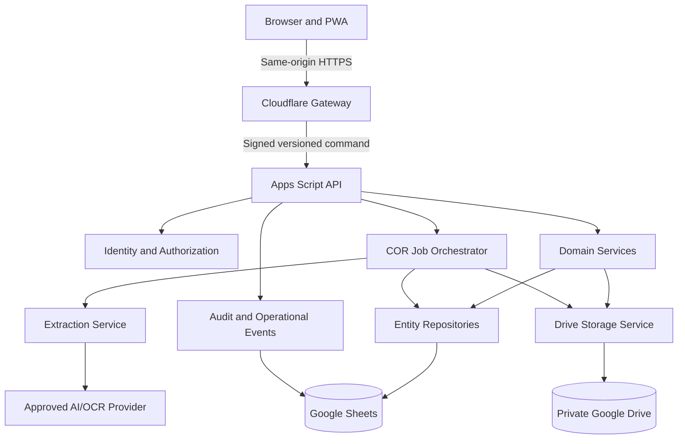
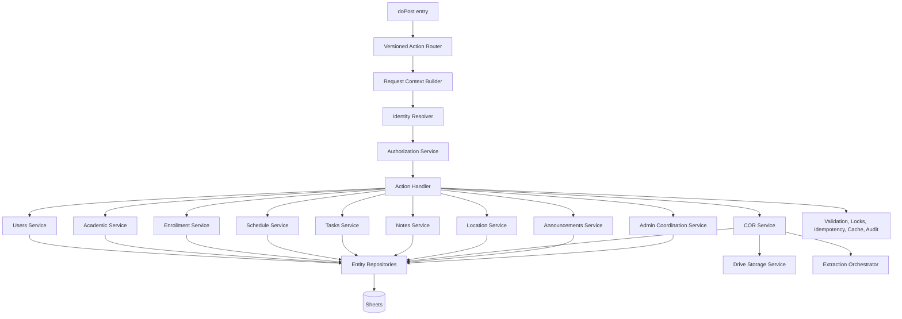
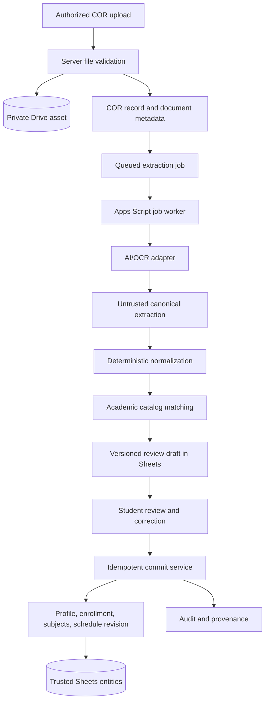

# My-Schedule Apps Script API and Backend Service Architecture

Status: Planning only. This document defines the target backend and API architecture. It does not implement or deploy Apps Script, create endpoints or credentials, modify Sheets or Drive, call an AI/OCR provider, or change application source/configuration.

## 1. Backend Architecture

My-Schedule uses two server-side boundaries for the initial release:

1. **Cloudflare Gateway** is the public, same-origin application gateway. It owns browser sessions, Google OIDC callbacks, CSRF and Origin checks, public HTTP semantics, edge request limits, and translation between browser routes and internal service actions.
2. **Google Apps Script API** is the trusted application and data layer. It resolves the internal user, enforces lifecycle, ownership, capabilities, and scope, validates domain rules, coordinates concurrency, and accesses Google Sheets, Drive, and approved AI/OCR providers.

The browser never receives spreadsheet credentials, Drive ownership, Apps Script secrets, AI provider credentials, or direct database access.



### Trust boundaries

- The browser may request an operation but cannot assert identity, ownership, role, capability, scope, row number, Sheet name, Drive ID, or provider choice.
- Cloudflare validates the browser session, but Apps Script independently verifies the signed service request and resolves current account/authorization state.
- Apps Script is the only component allowed to manipulate the workbook through `SpreadsheetApp` or the private Drive root through Drive services.
- AI/OCR output is untrusted draft input. It cannot directly create an active student profile, enrollment, or schedule.
- The dedicated infrastructure account physically owns Apps Script, Sheets, Drive folders, and triggers. Students never become Google-resource owners or editors.

### Practical deployment shape

Use one Apps Script project and one workbook/Drive root per environment. The Apps Script web app executes as the infrastructure owner and is reachable only as required for server-to-server Cloudflare calls. The deployment URL is kept in Cloudflare server configuration, but URL obscurity is not a security control. Every command requires a valid HMAC signature, timestamp, nonce, and action contract.

### Apps Script runtime model

The backend runs entirely within the Google Apps Script platform. Understanding its runtime constraints is essential for service design.

| Runtime primitive | Usage | Constraint |
|---|---|---|
| `doPost(e)` web app | Single command entry point for Cloudflare-signed requests | 6-minute execution limit per call; ~50 MB payload limit before base64 overhead |
| `doGet(e)` | Health checks, catalog-version polling, and optional non-mutating status probes only | Must not carry session state or perform writes |
| Time-driven triggers | COR job worker invocation, retention cleanup, announcement expiry, mutation receipt cleanup, integrity checks | Daily execution quota shared across all triggers (~90 min/day on free tier); each trigger execution has its own 6-min limit |
| `LockService.getScriptLock()` | Serialize critical sections: identity creation, job claims, commit activation, role grants, schedule activation | Script-wide (not row-level); contention signals migration need; never hold during I/O |
| `CacheService.getScriptCache()` | Best-effort catalog header maps, authorization resolution, nonce suppression | Default 210-second TTL; 50 KB per entry; 10 MB total; never rely for correctness |
| `PropertiesService.getScriptProperties()` | Deployment config: Sheet IDs, Drive folder IDs, HMAC secrets, schema version, provider keys, retention policies | ~500 KB total; not for runtime data; secrets never logged or exposed |
| `SpreadsheetApp` | All data access through repository layer only | Batch reads/writes; avoid full-sheet scans; 200 requests/minute per user quota |
| `DriveApp` | COR original file storage and deletion only through `DriveStorageService` | Per-user quotas; no public sharing; private folder structure only |
| `UrlFetchApp` | AI/OCR provider calls, approved external services | Response size limits; timeout below 6-minute execution limit; explicit connect/read timeouts |
| `ScriptApp.newTrigger()` | Schedule triggers for async jobs during deployment setup | Must be created by infrastructure operator, not application code at runtime |

**Action-time budget guidance:**

| Action category | Target max duration | Rationale |
|---|---|---|
| Standard reads (profile, task list, schedule, catalog) | 3-5 seconds | Keep browser UX responsive |
| Standard mutations (task/note CRUD, profile update) | 5-10 seconds | Acceptable for form submissions |
| Schedule revision publish | 15-20 seconds | Involves staged write, lock, activation |
| COR upload acceptance | 10-15 seconds | File validation, hash, metadata write |
| COR commit | 20-30 seconds | Full graph validation, staged write, activation under lock |
| COR job worker (trigger) | Up to 5 minutes | Use checkpoints; save progress before deadline |
| Bootstrap (composed) | 5-8 seconds | Multiple catalog + profile reads; cache-reliant |

When an action approaches the execution deadline, it must release locks, save no partial promoted draft, and return a retryable state. The browser receives a truthful processing/in-progress state, not a fabricated success.

## 2. API Conventions

### Browser-facing API

The frontend calls versioned same-origin routes under `/api/v1`. Browser routes use familiar HTTP semantics:

```text
GET     read/list
POST    create, command, upload, publish, confirm
PATCH   partial update
PUT     replace a complete review draft where defined
DELETE  request deletion, archive, remove, or cancel according to domain rules
```

GET requests never mutate state. State-changing requests require a valid session, allowed Origin, CSRF token, accepted content type, bounded body, and applicable mutation/idempotency fields.

### Cloudflare-to-Apps-Script transport

Apps Script exposes one internal command entry point through `doPost(e)`. Cloudflare translates every browser-facing route and method into an allowlisted action such as `task.create` or `schedule.revision.publish`. Apps Script must not expose a generic path-to-sheet mapper.

This single POST transport is intentional:

- Apps Script web apps do not provide the same reliable method routing, response-status, and response-header controls as a conventional server.
- One command router provides consistent signature verification, payload limits, schema validation, error conversion, audit correlation, and action allowlisting.
- Browser-facing HTTP status codes are selected by Cloudflare from the validated Apps Script result.

### Signed command envelope

Conceptual internal request:

```json
{
  "transportVersion": "1",
  "apiVersion": "v1",
  "requestId": "req_uuid",
  "issuedAt": "2026-08-30T04:15:00Z",
  "expiresAt": "2026-08-30T04:20:00Z",
  "nonce": "random-one-time-value",
  "keyId": "gateway-hmac-2026-01",
  "action": "schedule.entry.update",
  "actor": {
    "googleSub": "immutable-google-subject",
    "verifiedEmail": "verified@example.edu",
    "sessionUserVersion": 3,
    "sessionIdHash": "bounded-nonreversible-session-reference"
  },
  "payloadEncoding": "base64url-json",
  "payload": "base64url-encoded-utf8-json",
  "payloadSha256": "hex-or-base64url-digest",
  "signature": "hmac-sha256"
}
```

The HMAC canonical string uses fixed ordered fields and the exact payload digest, not re-serialized arbitrary JSON. For example:

```text
transportVersion

apiVersion
requestId
issuedAt
expiresAt
nonce
keyId
action
actor.googleSub
actor.sessionUserVersion
payloadSha256
```

Apps Script performs these checks before parsing the domain payload:

1. Body and envelope size are within the action limit.
2. Transport/API versions and action exist in the router registry.
3. `issuedAt` and `expiresAt` are valid and inside a short configured window.
4. `keyId` resolves to a current or bounded previous HMAC secret in Script Properties.
5. Payload digest and HMAC match using constant-time comparison.
6. The nonce/request ID has not been seen inside the acceptance window.
7. The decoded payload is valid UTF-8 JSON and satisfies the action schema.

Transport nonce suppression may use short-lived Script Cache entries. Durable mutation protection does not depend on cache eviction behavior: every retryable or sensitive mutation also uses `Mutation_Receipts` and a unique `clientMutationId`.

### Versioning

- `/api/v1` is the browser contract version.
- `transportVersion` versions the Cloudflare-to-Apps-Script envelope.
- `schemaVersion` identifies the workbook schema from `Schema_Migrations` or deployment configuration.
- `catalogVersion` versions shared academic/location configuration.
- COR extraction has separate pipeline, parser, matcher, and extraction-schema versions.
- Backward-compatible response additions remain within `v1`; breaking request/response or behavior changes require `v2`.
- Apps Script rejects unsupported versions with a stable error rather than guessing.

### Route-to-action registry

Cloudflare maintains a static registry mapping each browser route and HTTP method to an allowlisted Apps Script action name. This registry is the single source of truth for both gateways and must be defined from one reviewed contract source.

| Browser route | Method | Apps Script action |
|---|---|---|
| `/api/v1/bootstrap` | GET | `bootstrap.read` |
| `/api/v1/me` | GET | `profile.read` |
| `/api/v1/me` | PATCH | `profile.update` |
| `/api/v1/catalog/departments` | GET | `department.list` |
| `/api/v1/catalog/programs` | GET | `program.list` |
| `/api/v1/catalog/terms` | GET | `term.list` |
| `/api/v1/catalog/subjects` | GET | `subject.list` |
| `/api/v1/enrollments` | GET | `enrollment.list` |
| `/api/v1/enrollments/{id}` | GET | `enrollment.read` |
| `/api/v1/schedules/active` | GET | `schedule.active.read` |
| `/api/v1/schedules/{id}/revisions` | GET | `schedule.revision.list` |
| `/api/v1/schedules/{activeScheduleId}/revisions` | POST | `schedule.revision.createActivate` |
| `/api/v1/tasks` | GET | `task.list` |
| `/api/v1/tasks` | POST | `task.create` |
| `/api/v1/tasks/{id}` | PATCH | `task.update` |
| `/api/v1/tasks/{id}` | DELETE | `task.delete` |
| `/api/v1/notes` | GET | `note.list` |
| `/api/v1/notes` | POST | `note.create` |
| `/api/v1/onboarding/cor` | POST | `cor.upload.create` |
| `/api/v1/cor-records/{id}/confirm` | POST | `cor.commit` |
| `/api/v1/admin/users` | GET | `user.list` |
| `/api/v1/admin/catalog/{entity}` | POST | `catalog.create` |

Cloudflare rejects any route not in this registry before forwarding. Apps Script rejects any action not in its own allowlist. Drift between the two registries is a deployment failure caught by contract tests.

## 3. Service Boundaries

The backend is a modular monolith inside Apps Script, not a set of separately deployed microservices.



### Request and cross-cutting modules

| Module | Responsibility |
|---|---|
| `ApiEntry` | Read raw POST, reject unsupported content/body, return a service envelope |
| `ActionRouter` | Map exact action name/version to handler metadata; no dynamic function lookup from input |
| `TransportVerifier` | Verify HMAC, key ID, digest, time window, nonce, and request ID |
| `RequestContextFactory` | Create immutable request context with actor, internal user, roles, capabilities, request ID, clock, and environment |
| `ValidationService` | Execute strict primitive, object, relation, and domain validation |
| `AuthorizationService` | Enforce account lifecycle, ownership, capability, trusted scope, and sensitive reason requirements |
| `IdempotencyService` | Claim/read/finalize mutation receipts |
| `ConcurrencyService` | Expected-version checks, short critical sections, staged activation |
| `AuditService` | Append required non-sensitive audit events |
| `CacheServiceAdapter` | Versioned cache keys, invalidation, bounded safe projections |
| `ConfigService` | Read allowlisted Script Properties/system settings without exposing secrets |
| `Clock/IdService` | UTC timestamps and stable prefixed UUIDs; injectable for tests |

### Domain services

| Service | Scope |
|---|---|
| `AuthService` | Identity resolution, account state, session-version confirmation, login user creation |
| `UsersService` | Own profile projection/update, onboarding state, admin status workflow |
| `AcademicService` | Departments, programs, offerings, terms, subjects, sections, aliases, branding configuration |
| `EnrollmentService` | Enrollment lifecycle, subjects, term isolation, COR/manual/admin provenance |
| `ScheduleService` | Revision graph, meeting entries, conflicts, activation, history |
| `TasksService` | Owner-only task CRUD and optional owned academic references |
| `NotesService` | Owner-only note CRUD and optional owned academic references |
| `LocationService` | Campuses, buildings, rooms, map/transport configuration and schedule resolution |
| `CORService` | Upload metadata, private file storage, job state, draft review, confirmation, deletion request |
| `ExtractionOrchestrator` | Job claim/lease, provider adapters, normalization, matching, validation, retry/checkpoint |
| `AnnouncementsService` | Audience-scoped reads and capability-scoped publication lifecycle |
| `AdminService` | Coordinates capability-scoped workflows; does not bypass domain services |

Admin operations call the same domain services with a different authorized actor/scope. They do not use a second generic backdoor to edit Sheet rows.

### Apps Script runtime mapping

The following table maps each module to its Apps Script runtime primitives:

| Module | Primary runtime | Lock | Cache | Properties | UrlFetchApp |
|---|---|---|---|---|---|
| `ApiEntry` | doPost | | | | |
| `ActionRouter` | doPost | | | | |
| `TransportVerifier` | doPost | nonce | key cache | HMAC secrets | |
| `IdentityResolver` | doPost | identity | | | |
| `AuthorizationService` | doPost | | role cache | | |
| `ScheduleService` | doPost | activation | | | |
| `CORService` | doPost + trigger | commit | | | |
| `ExtractionOrchestrator` | trigger | job claim | catalog | provider config | provider calls |
| `DriveStorageService` | doPost + trigger | | | folder IDs | |
| `AuditService` | doPost | | | | |
| `CacheServiceAdapter` | doPost + trigger | | primary | | |

`doPost`-only modules run in the web app context. Trigger-based modules run in the trigger context with a separate execution queue. `CORService` straddles both: upload acceptance runs in `doPost`; job orchestration may run in a trigger.

## 4. Authentication Context

Google OIDC terminates at Cloudflare. Basic platform login uses only `openid email profile`; Classroom/Gmail authorization remains a separate optional integration.

### Identity resolution

```text
Verified Google ID token at Cloudflare
-> signed googleSub and verified email
-> Apps Script Users.googleSub lookup
-> immutable internal userId
-> accountStatus and onboardingState
-> active roles/capabilities/scopes
-> authorized request context
```

`googleSub` is the unique external identity key. Email is a verified mutable attribute and is never used as the primary account lookup or owner key.

### Request context

After transport verification, Apps Script builds a server-only context conceptually containing:

```text
requestId
action
actorUserId
googleSub
verifiedEmail
accountStatus
onboardingState
userVersion
capabilities[]
scopeAssignments[]
sessionIdHash
environment
nowUtc
```

Normal handlers receive `actorUserId` from this context. They do not accept a client `userId` or `ownerUserId` as authority.

### Login identity action

`identity.resolve` is allowed only for a signed identity assertion produced after Cloudflare validates Google OIDC. Under a short critical section it:

1. Finds `Users.googleSub`.
2. Returns the existing user and updates safe verified identity attributes if needed.
3. If absent, creates one `ONBOARDING` user with an immutable `userId`.
4. Never merges by email or student number.
5. Returns account/onboarding state and current `Users.version` for session creation.

### Three-cookie session architecture

Platform login, OAuth state, and optional Classroom/Gmail integration use separate cookies:

| Cookie | Purpose | Attributes | Lifetime |
|---|---|---|---|
| `qcu_platform_oauth` | Transient OAuth state during login flow | `HttpOnly`, `Secure`, `SameSite=Lax`, short path | 10 minutes; one-time use |
| `qcu_platform_session` | Platform authentication session | `HttpOnly`, `Secure`, `SameSite=Lax`, path `/api/` | Idle: 7 days; absolute: 30 days |
| `qcu_google_session` | Optional Classroom/Gmail integration tokens | `HttpOnly`, `Secure`, `SameSite=Lax`, path `/api/google/` | 30 days; separate from platform session |

Rules:
- Platform login must not require Classroom/Gmail consent.
- The platform session carries only session claims (userId, version, sessionIdHash), not Google API tokens.
- The integration cookie carries OAuth tokens for Classroom/Gmail and is cleared independently on disconnect.
- A single `qcu_platform_session` cookie does not contain Classroom/Gmail tokens.
- Cookie encryption uses a server-side secret; the encrypted blob is opaque to the browser.

### Session lifecycle

```text
Login start -> OAuth-state cookie set (10 min)
Login callback -> state validated, Google ID verified
                -> Apps Script identity.resolve
                -> Platform session cookie set
                -> Redirect to bootstrap

Normal API call -> Platform session validated
                -> Apps Script verifies sessionUserVersion
                -> Request context built

Session renewal -> Cloudflare refreshes cookie on activity
                -> sessionUserVersion rechecked
                -> No renewal if user version changed

Logout -> Platform session cookie cleared
       -> Integration cookie cleared (if present)
       -> Private browser cache invalidated
       -> Audit event appended
```

### Session version invalidation

`Users.version` is incremented for:
- Account suspension or closure.
- Role/security-sensitive revocation.
- Explicit global logout.
- Admin-initiated session termination.

When Cloudflare sends a request with a stale `sessionUserVersion`, Apps Script returns `SESSION_STALE` and Cloudflare clears the session cookie. The browser returns to the public landing.

### Logout sequence

1. Browser calls `POST /api/auth/logout`.
2. Cloudflare clears `qcu_platform_session` and `qcu_google_session` cookies.
3. Cloudflare sends a signed logout command to Apps Script.
4. Apps Script appends a logout audit event.
5. The browser clears private IndexedDB cache namespaces for the current user.
6. The browser navigates to the public landing page.

Apps Script does not receive or store the browser session cookie, OAuth authorization code, Google ID token, or platform session secret.

## 5. Authorization

Every private action requires:


### Owner-resource algorithm

For student-owned records:

1. Resolve actorUserId from googleSub.
2. Ignore/reject authoritative owner IDs in the domain payload.
3. Load the target by stable opaque ID.
4. Verify direct owner and parent-chain ownership.
5. Verify lifecycle and source restrictions.
6. Return privacy-safe NOT_FOUND where revealing another student record would leak existence.
7. On create, assign ownerUserId=actorUserId server-side.

### Capability and scope algorithm

For administrative actions:

1. Confirm accountStatus=ACTIVE.
2. Resolve active, non-expired role assignments and capabilities.
3. Load the target and derive its scope from trusted relations.
4. Require the exact capability and compatible GLOBAL, CAMPUS, DEPARTMENT, or PROGRAM assignment.
5. Treat missing scope as no authority, not global authority.
6. Prevent self-escalation and role delegation beyond the grantor authority.
7. Require a bounded reason for sensitive document/profile reads.
8. Audit success, denial, and material failure where required.

### Authorization matrix

| Resource | Student | Administrator |
|---|---|---|
| Own user/profile | Read safe own projection; update allowlisted fields | Scoped support read/correction only with exact capability |
| Other student profile | No access | users.read plus matching scope; sensitive access audited |
| Enrollments/subjects | Own current/history; lifecycle-limited writes | Scoped academic support/correction with reason and audit |
| Schedules/entries | Own read; publish validated replacement revisions | Scoped correction through Schedule Service |
| Tasks | Owner-only CRUD | No routine access, including global admins |
| Notes | Owner-only CRUD | No routine access, including global admins |
| COR metadata/draft | Own eligible records | imports.review and matching scope |
| COR original file | Own authorized retrieval | documents.read.support, matching scope, reason, audit |
| Departments/programs/terms/subjects/sections | Read active safe projections | catalog.write plus scope for mutations |
| Campuses/buildings/rooms/map config | Read safe shared projections | catalog.write or approved location capability |
| Announcements | Read currently published matching audience | announcements.write plus audience scope |
| Roles/assignments | Read own resolved capabilities only | roles.read/roles.manage; no self-escalation |
| Audit log | No | audit.read, filtered and redacted |
| System settings | Only visible safe projection | system.config.read/write; secrets remain inaccessible |
| Sheets/Drive/deployment | No direct access | No application-role direct ownership |

Frontend role checks and hidden routes are presentation behavior only.

## 6. CRUD API Matrix

The CRUD API matrix is defined in section 6 of the complete API_BACKEND.md document. The schedule API uses a batch revision model where students submit complete operations as one atomic revision rather than individual entry-level CRUD. See the full route-to-action mapping in section 2 and the detailed schedule revision request/response examples.

### Bootstrap, students, and settings

| Browser route | Method | Apps Script action | Authorization |
|---|---|---|---|
| /api/v1/bootstrap | GET | bootstrap.read | Authenticated lifecycle-allowed user |
| /api/v1/me | GET | profile.read | Owner |
| /api/v1/me | PATCH | profile.update | Owner |
| /api/v1/me/settings | GET | user.settings.read | Owner |
| /api/v1/me/settings | PATCH | user.settings.update | Owner |

### Shared academic and location configuration

| Browser route | Method | Apps Script action | Authorization |
|---|---|---|---|
| /api/v1/catalog/departments | GET | department.list | Authenticated |
| /api/v1/catalog/programs | GET | program.list | Authenticated |
| /api/v1/catalog/terms | GET | term.list | Authenticated |
| /api/v1/catalog/subjects | GET | subject.list | Authenticated |
| /api/v1/locations/campuses | GET | campus.list | Authenticated |
| /api/v1/locations/buildings | GET | building.list | Authenticated |
| /api/v1/locations/rooms | GET | room.list | Authenticated |
| /api/v1/locations/resolve | POST | location.resolve.batch | Authenticated |

### Enrollments and schedules (batch revision model)

| Browser route | Method | Apps Script action | Authorization |
|---|---|---|---|
| /api/v1/enrollments | GET | enrollment.list | Owner |
| /api/v1/enrollments/{id} | GET | enrollment.read | Owner |
| /api/v1/enrollments/{id}/subjects | POST | enrollment.subject.create | Owner |
| /api/v1/schedules/active | GET | schedule.active.read | Owner |
| /api/v1/schedules/{id}/revisions | GET | schedule.revision.list | Owner |
| /api/v1/schedules/{activeId}/revisions | POST | schedule.revision.createActivate | Owner |

### Tasks and notes

| Browser route | Method | Apps Script action | Authorization |
|---|---|---|---|
| /api/v1/tasks | GET/POST | task.list/create | Owner |
| /api/v1/tasks/{id} | PATCH/DELETE | task.update/delete | Owner |
| /api/v1/notes | GET/POST | note.list/create | Owner |
| /api/v1/notes/{id} | PATCH/DELETE | note.update/delete | Owner |

### COR and onboarding

| Browser route | Method | Apps Script action | Authorization |
|---|---|---|---|
| /api/v1/onboarding/cor | POST | cor.upload.create | Authenticated owner |
| /api/v1/cor-records/{id}/draft | GET/PUT | cor.draft.read/update | Owner |
| /api/v1/cor-records/{id}/confirm | POST | cor.commit | Owner |

### Administration

| Browser route | Method | Apps Script action | Authorization |
|---|---|---|---|
| /api/v1/admin/overview | GET | admin.overview.read | Any admin capability |
| /api/v1/admin/users | GET | user.list | users.read plus scope |
| /api/v1/admin/catalog/{entity} | GET/POST | catalog.list/create | catalog.write |
| /api/v1/admin/audit | GET | audit.list | audit.read |

Bulk mutation endpoints are excluded from the first implementation.

## 7. Request Validation

Validation occurs at Cloudflare for early rejection and again authoritatively in Apps Script. Gateway validation never replaces service validation.

### General validation pipeline

1. Reject unsupported method, content type, body size, API version, or action mapping at Cloudflare.
2. Verify session, Origin/CSRF for mutations, and edge rate class.
3. Apps Script verifies transport envelope before payload parsing.
4. Reject unknown top-level and mutation fields where strict schemas are practical.
5. Normalize only documented values, preserving original snapshots where required.
6. Validate primitive types and lengths.
7. Validate foreign keys, ownership, scope, lifecycle, uniqueness, versions, and domain invariants.
8. Return all safe bounded field errors where practical; perform no database mutation on validation failure.

### Primitive rules

| Type | Rule |
|---|---|
| IDs | Required prefixes and UUID shape; immutable; maximum length; never Sheet row numbers or A1 ranges |
| Strings | UTF-8, trimmed according to field policy, control characters rejected, explicit min/max length |
| Dates | ISO YYYY-MM-DD, real calendar date, policy range |
| Timestamps | UTC ISO 8601 with Z; server creates audit/timestamps |
| Times | Strict 24-hour HH:mm; campus-local wall time; startTime < endTime |
| Enums | Exact allowlisted uppercase values; no silent fallback |
| Booleans | JSON booleans only, not truthy strings |
| Numbers | Finite values, bounded range/precision |
| Arrays | Explicit maximum item count; item schema; no arbitrary nested depth |
| Objects | Known properties only for mutations; depth/size limits |
| Pagination | Bounded integer limit, opaque cursor, allowlisted stable sort key/direction |
| Filters | Resource-specific allowlist; no Sheet column, formula, or regex |

### Request validation examples

**Create task:** title 1-300 chars, description max 4000 chars, priority in [LOW, MEDIUM, HIGH], enrollmentSubjectId belongs to owner. See section 6 for the full request shape.

**Batch schedule revision:** dayOfWeek 1-7, times HH:mm, startTime < endTime, modality in enum, buildingId/roomId relationship, subject ownership. See section 6 batch revision request.

**Admin role grant:** roleKey exists and is grantable, scopeType/scopeId compatible, grantor has broader scope, no self-escalation.

### Spreadsheet formula injection

Repositories must treat user/admin/provider text as data. Before writing a text cell, neutralize leading formula markers. No untrusted value may be written as a formula. Sheet formulas are not used for authorization, joins, validation, or business state.

### File validation

Cloudflare performs declared size/content-type checks before forwarding. Apps Script repeats authoritative checks:

- Allowed extension and claimed MIME are only hints.
- Decode and verify magic bytes/file signature.
- Recompute content hash from bytes.
- Enforce configured bytes, page count, pixel/dimension limits.
- Reject encrypted/locked/corrupt documents.
- Sanitize the stored filename.
- Do not execute PDF JavaScript, embedded files, macros, actions, links, or external resources.

### Domain validation

- Student number normalization follows the approved QCU rule; conflicts never auto-merge users.
- Catalog codes use entity-specific uniqueness constraints.
- Deactivated catalog records remain valid for historical reads but cannot be selected for new active records.
- Enrollment section, offering, term, program, and campus relations must agree.
- Room belongs to building; building belongs to campus.
- Exact schedule duplicates are rejected. Overlaps return blocking or acknowledgement state.
- Task/note references must belong to the current actor.
- COR provider output cannot supply application owner IDs or trusted database IDs.

## 8. Response Format

Apps Script returns a JSON service envelope to Cloudflare. Cloudflare validates its shape and request correlation, removes any internal-only metadata, maps the result to a browser HTTP status, and sends the public envelope.

### Success

```json
{
  "ok": true,
  "data": {
    "scheduleEntryId": "sme_uuid",
    "version": 4
  },
  "error": null,
  "meta": {
    "requestId": "req_uuid",
    "apiVersion": "v1",
    "schemaVersion": 1,
    "serverTime": "2026-08-30T04:15:01Z"
  }
}
```

List response:

```json
{
  "ok": true,
  "data": {
    "items": [],
    "page": {
      "nextCursor": null,
      "hasMore": false,
      "limit": 25
    }
  },
  "error": null,
  "meta": {
    "requestId": "req_uuid",
    "apiVersion": "v1",
    "schemaVersion": 1,
    "catalogVersion": "cat_2026_08_30_01",
    "serverTime": "2026-08-30T04:15:01Z"
  }
}
```

### Bootstrap response

The bootstrap response is the first private API call after authentication. It determines routing (onboarding vs. dashboard vs. admin vs. restricted):

```json
{
  "ok": true,
  "data": {
    "user": {
      "userId": "usr_uuid",
      "displayName": "Student Name",
      "avatarUrl": null,
      "accountStatus": "ACTIVE",
      "onboardingState": "COMPLETE"
    },
    "profile": {
      "profileId": "prf_uuid",
      "firstName": "Student",
      "lastName": "Name",
      "studentNumber": "2024-00001",
      "verificationStatus": "COR_REVIEWED"
    },
    "academic": {
      "activeTerm": {
        "termId": "trm_uuid",
        "academicYearLabel": "2026-2027",
        "termCode": "FIRST_SEMESTER",
        "name": "First Semester AY 2026-2027"
      },
      "activeEnrollment": {
        "enrollmentId": "enr_uuid",
        "programName": "Bachelor of Science in Computer Science",
        "campusName": "QCU San Bartolome Campus",
        "yearLevel": 1,
        "sectionLabel": "A"
      }
    },
    "capabilities": ["catalog.read"],
    "scopeAssignments": [],
    "catalogVersion": "cat_2026_08_30_01",
    "schemaVersion": 1,
    "serverTime": "2026-08-30T04:15:01Z"
  }
}
```

For a new user:

```json
{
  "ok": true,
  "data": {
    "user": {
      "userId": "usr_uuid",
      "displayName": "New Student",
      "accountStatus": "ONBOARDING",
      "onboardingState": "AWAITING_COR"
    },
    "profile": null,
    "academic": null,
    "capabilities": ["catalog.read"],
    "catalogVersion": "cat_2026_08_30_01"
  }
}
```

### Error

```json
{
  "ok": false,
  "data": null,
  "error": {
    "code": "VALIDATION_FAILED",
    "message": "One or more fields are invalid.",
    "fields": {
      "startTime": "Must be earlier than endTime."
    },
    "retryable": false,
    "retryAfterSeconds": null
  },
  "meta": {
    "requestId": "req_uuid",
    "apiVersion": "v1",
    "schemaVersion": 1,
    "serverTime": "2026-08-30T04:15:01Z"
  }
}
```

### Conflict response

```json
{
  "ok": false,
  "data": null,
  "error": {
    "code": "VERSION_CONFLICT",
    "message": "The record was modified by another operation.",
    "conflictSummary": {
      "currentVersion": 5,
      "currentStatus": "ACTIVE"
    },
    "retryable": true
  }
}
```

Response rules:

- `message` is safe, stable enough for user recovery, and contains no stack trace, Sheet/Drive details, provider payload, secret, or another user's existence.
- `fields` contains bounded field-level messages only for fields the actor is allowed to know.
- Conflict responses may include current safe version and a bounded conflict summary, not arbitrary record data.
- Responses never expose `googleSub`, raw role assignments, HMAC metadata, spreadsheet IDs, Sheet names, row numbers, A1 ranges, Drive IDs, provider request IDs, or raw COR/provider text.
- Private responses use `Cache-Control: no-store` at Cloudflare unless a specific owner-scoped client cache policy is documented.

## 9. Error Model

### Public HTTP mapping

Cloudflare maps Apps Script service codes to browser-facing statuses. Apps Script may return its service envelope with an HTTP 200 transport response due to web-app limitations; `ok` and `error.code` are authoritative only after Cloudflare validates the response.

| Browser status | Stable service codes | Meaning/recovery |
|---:|---|---|
| 400 | `VALIDATION_FAILED`, `UNSUPPORTED_ACTION`, `UNSUPPORTED_VERSION`, `INVALID_CURSOR` | Correct the request; no write occurred |
| 401 | `UNAUTHENTICATED`, `SESSION_STALE` | Clear/renew session or sign in again |
| 403 | `FORBIDDEN`, `ACCOUNT_RESTRICTED`, `CAPABILITY_REQUIRED` | Actor is known but action/scope/lifecycle is not permitted |
| 404 | `NOT_FOUND` | Target absent or hidden for privacy |
| 409 | `DUPLICATE`, `VERSION_CONFLICT`, `STATE_CONFLICT`, `SCHEDULE_CONFLICT`, `IMPORT_NOT_READY` | Refresh/review current state; no last-write-wins behavior |
| 413 | `PAYLOAD_TOO_LARGE`, `FILE_TOO_LARGE` | Choose a smaller supported file/request |
| 415 | `UNSUPPORTED_FILE_TYPE`, `UNSUPPORTED_MEDIA_TYPE` | Use an allowed format |
| 429 | `RATE_LIMITED`, `QUOTA_DELAYED` | Retry after bounded delay when provided |
| 500 | `INTERNAL_ERROR`, `INTEGRITY_ERROR` | Generic failure; request ID for support; no internals |
| 503 | `SERVICE_UNAVAILABLE`, `PROVIDER_UNAVAILABLE`, `CATALOG_UNAVAILABLE`, `QUOTA_UNAVAILABLE` | Retryable dependency/service failure |

### Internal exception conversion

Handlers throw typed internal errors. The entry layer converts them once. Unknown exceptions become `INTERNAL_ERROR`; stack traces remain in restricted operational logs. Provider-specific errors are converted to stable internal provider categories before reaching COR state or the frontend.

### Partial failure

Ordinary single-resource mutations are all-or-no-effect at the domain level. Multi-sheet processes use staging so a partial write cannot become active. If cleanup or a non-active staged write partially fails, return a safe repair/retry state and preserve the prior active graph. Do not claim success merely because some rows were written.

## 10. Sheets Repository and Data-Access Layer

Endpoint handlers and domain services must not call `SpreadsheetApp` directly.

```text
Action Handler
-> Domain Service
-> Entity-specific Repository Interface
-> Sheets Repository Implementation
-> SpreadsheetApp batch operations
```

### Repository rules

- Use one entity-specific repository per logical sheet or aggregate boundary, such as `UsersRepository`, `EnrollmentsRepository`, and `ScheduleRepository`.
- Do not expose generic `readSheet(name)`, raw row update, arbitrary filter column, A1 range, or row-number APIs to handlers.
- Build header-to-column maps from a schema registry and validate required headers/schema version at startup or health checks.
- Use stable IDs as keys. Row order is never identity or lifecycle state.
- Read ranges in batches and build in-memory maps for the operation.
- Write complete bounded row sets/ranges rather than one cell at a time.
- Store timestamps in UTC ISO form and compare versions as integers.
- Project only requested safe fields into domain objects.
- Translate blank optional cells to `null`; never overload empty strings with multiple meanings.
- Invalidate affected catalog, authorization, and user cache keys after committed writes.

### Schema registry

A schema registry maps each logical entity to its sheet name, header row, column positions, and required fields. It is loaded at script startup and validated against `Schema_Migrations`. This prevents handler code from referencing sheet names or column indices directly.

```text
SchemaRegistry.get("Users") -> { sheet: "Users", headers: [...], version: 1 }
SchemaRegistry.get("Tasks") -> { sheet: "Tasks", headers: [...], version: 1 }
```

### Repository interfaces

Interfaces should be storage-neutral, for example:

```text
UsersRepository.findByGoogleSub(googleSub)
UsersRepository.getById(userId)
UsersRepository.create(userRecord)
UsersRepository.updateIfVersion(userId, expectedVersion, changeSet)

TasksRepository.listOwned(ownerUserId, query)
TasksRepository.getOwned(taskId, ownerUserId)
TasksRepository.insert(task)
TasksRepository.updateOwnedIfVersion(taskId, ownerUserId, expectedVersion, changeSet)

ScheduleRepository.loadRevisionGraph(scheduleId)
ScheduleRepository.writeStagedGraph(graph)
ScheduleRepository.activateRevision(enrollmentId, proposedScheduleId, expectedActiveId)
```

These interfaces do not mention Sheet names, row numbers, or Apps Script ranges. A future SQL implementation can satisfy the same domain contracts.

### Implementation pattern sketch

A repository implementation translates the interface to `SpreadsheetApp` operations:

```text
class TasksRepositoryImpl:
  findByOwnerAndId(taskId, ownerUserId):
    row = sheet.getRange(taskIdToRow[taskId]).getValues()
    if row.ownerUserId != ownerUserId: return null
    return mapToDomain(row)

  insert(task):
    appendRow([task.taskId, task.ownerUserId, task.title, ...])
    taskIdToRow[task.taskId] = lastRow

  updateOwnedIfVersion(taskId, ownerUserId, expectedVersion, changeSet):
    row = findByOwnerAndId(taskId, ownerUserId)
    if row.version != expectedVersion: throw VERSION_CONFLICT
    applyChanges(row, changeSet)
    row.version += 1
    writeRow(row)
```

Repository implementations are the only code that calls `SpreadsheetApp.getRange()`, `getValues()`, `setValues()`, or `appendRow()`. Domain services and handlers never import or reference `SpreadsheetApp`.

### Query strategy

Sheets has no relational indexes. Repositories should:

- Cache header maps and small active catalogs by schema/catalog version.
- Maintain bounded in-memory ID maps per request.
- Use scoped lookup/index sheets only if measured scans become a problem and the schema migration documents their consistency rules.
- Avoid full-workbook scans and formulas as joins.
- Filter and paginate before serializing admin responses.
- Measure scan size, execution time, and quota pressure to identify database migration triggers.

### Transaction substitute

For multi-entity writes:

1. Validate the complete proposed graph in memory.
2. Claim the idempotency receipt.
3. Create stable IDs and staged non-active rows.
4. Batch-write staged rows.
5. Re-read/verify staged graph.
6. Acquire the script lock only for the short uniqueness/version/activation critical section.
7. Re-read current versions/active IDs under the lock.
8. Activate the proposed graph and archive/transition the prior graph.
9. Finalize mutation receipt and append audit event.
10. Release lock and invalidate caches.

Apps Script provides a script-wide lock, not true named row locks or database transactions. The code must minimize the locked duration. Recommended maximum critical-section duration is 5 seconds. If lock contention becomes routine, that is a migration signal rather than a reason to hold broader locks longer.

## 11. Drive Storage Service

DriveStorageService is the only application module allowed to use Drive APIs for COR assets.

### Folder model

- Dedicated private root per environment, owned by the infrastructure account.
- Separate logical folders for quarantine/uploads, active processing, retained originals.
- No Anyone with the link or public sharing.
- Students and ordinary administrators are not Drive editors/viewers.
- Folder and Drive file IDs remain server-only.

### Upload

1. Cloudflare accepts a bounded multipart upload and applies early checks.
2. Cloudflare forwards validated metadata plus signed encoded bytes to Apps Script.
3. Apps Script decodes, recomputes size/hash, verifies signature/MIME.
4. Storage service writes a sanitized internal filename to the private folder.
5. Document_Assets and COR_Records store opaque application IDs, hash, metadata.

### File size guidance

| Constraint | Recommendation | Rationale |
|---|---|---|
| Browser upload | 20 MB | Reasonable mobile upload |
| Cloudflare body | 25 MB | Allow base64 overhead from 20 MB file |
| Apps Script payload | 30 MB decoded | Stay below 50 MB web app limit |
| Drive file | 25 MB | Reasonable for COR PDFs/images |

### COR_Extraction_Runs recommendation

Add the optional COR_Extraction_Runs sheet from COR_AI_PIPELINE.md. It stores per-run operational data: run ID, COR record ID, stage checkpoints, provider adapter key/version, attempt number, lease owner, duration, content-free usage metrics, and failure codes.

### Retrieval

- Browser requests an application document ID through Cloudflare.
- Apps Script verifies owner or exact support capability/scope/reason.
- Apps Script returns an authorized retrieval result or controlled bytes.
- Cloudflare streams/returns the file with private cache headers.
- No raw Drive ID, permanent share URL, or reusable public token is returned.

### Deletion and retention

- cor.delete.request transitions metadata and queues deletion.
- The retention worker rechecks policy, legal hold, owner/record state.
- Delete original, derivatives, and eligible raw artifacts.
- Failed deletion remains visible to operations for bounded retry.

## 12. COR Service

The COR service owns source-document lifecycle, job state, draft review, and trusted commit boundaries.



### States and actions

- Upload acceptance creates only document/COR metadata and a processing state.
- cor.process.request queues or confirms a pending job.
- A time-driven Apps Script worker claims jobs using a short lock and lease/checkpoint fields.
- Review saves require expectedDraftVersion.
- Confirmation requires current reviewed draft, explicit confirmation, commit mutation ID, and graph revalidation.

### Worker execution model

1. Apps Script time-driven trigger: Simple, no external dependencies. Limited by daily trigger quota (~90 min/day on free tier).
2. Cloudflare scheduled dispatch: More flexible; can use Cloudflare Queues. Requires CHUNK 17 infrastructure.

Recommendation: Start with time-driven triggers for simplicity.

### Commit behavior

1. Resolve the actor and owned COR record.
2. Verify state, current draft version, confirmed required fields, and mutation receipt.
3. Revalidate student number, term, offering, section, subject, location, schedule rules.
4. Build profile/enrollment/subject/schedule graph in memory.
5. Write staged non-active rows.
6. Activate under a short script-lock critical section.
7. Leave prior active schedule untouched if any step fails before activation.
8. Return the same successful result for a repeated commit mutation ID.

## 13. AI/OCR Provider Abstraction

No specific provider is selected by this architecture.

### Interfaces

| Interface | Input | Canonical output |
|---|---|---|
| DocumentTextAdapter | Private document/page reference | Page text/layout, geometry, language hints |
| OcrProviderAdapter | Validated page/image bytes | Canonical page text/layout independent of provider |
| StructuredExtractionAdapter | Bounded text/layout plus schema version | Student/enrollment/subject/meeting proposals |
| ProviderRegistry | File type, quality, policy, quota, retry history | Approved adapter configuration |
| ExtractionOrchestrator | COR record/run/job context | Versioned draft or stable failure state |

Provider adapters do not own normalization, QCU matching, validation, authorization, review, or database commit.

### Provider request rules

- Credentials remain in Script Properties or approved server secret boundary.
- Send only the necessary document content.
- Prefer embedded PDF text and deterministic parsing before paid OCR/AI work.
- Set explicit timeouts below Apps Script execution limits.
- Use schema-constrained output and reject extra fields.
- Treat document text as data, never as instructions.

### Retry and cost controls

- Maximum attempts configurable per COR_AI_PIPELINE.md policy.
- Retry only transient provider/network failures.
- Enforce per-import, per-user daily, and system/provider budgets.
- Record content-free usage metrics without student content.

## 14. Concurrency and Idempotency

### Optimistic concurrency

Every mutable row has an integer version. Updates require expectedVersion; repositories re-read the current row before writing. A mismatch returns VERSION_CONFLICT.

Review drafts use expectedDraftVersion. Schedule publication validates the whole draft/revision.

### Mutation receipts

Retryable/sensitive mutations require a globally unique clientMutationId. Mutation_Receipts enforces unique (actorUserId, clientMutationId, action).

### Locking

Use LockService.getScriptLock() only for short critical sections (recommended maximum 5 seconds):

- Unique Google identity creation.
- Student-number claim/critical identity change.
- Role grant/revoke and account status/session-version change.
- COR job claim/lease transition.
- COR commit activation.
- Active enrollment/schedule revision switch.

Do not hold a lock during provider calls, Drive upload/download, full-sheet scans, user input, or long validation.

## 15. Pagination and Filtering

### Pagination model

Use opaque keyset cursors for potentially large collections. The cursor contains or references:

```text
resource/action
filter hash
sort key and direction
last sort value
last stable ID
schema/catalog version where relevant
expiry
signature
```

Clients cannot edit or construct cursors. Invalid, expired, filter-mismatched, or unsupported-version cursors return INVALID_CURSOR.

### Defaults

- Lists use resource-specific bounded defaults and maximums, such as 25 default and 100 maximum only where tested/appropriate.
- Stable tie-breaking always includes the immutable ID.
- Sorting keys are allowlisted. Arbitrary Sheet columns, formulas, and expressions are rejected.
- Filters are normalized and included in the cursor hash.
- Total counts are optional because full counts may require expensive scans. Return them only when cheaply and safely available.

### Resources

| Resource | Pagination/filter approach |
|---|---|
| Students | Required; status, campus/department/program/term scope, bounded normalized search |
| Enrollments | Admin lists paginated; own small history may be bounded without cursor initially |
| COR records | Required for admin; owner history bounded/cursor as it grows |
| Audit log | Required; date range plus action/actor/target filters; mandatory bounded window |
| Announcements | Admin history paginated; active student feed bounded |
| Tasks/notes | Cursor by updated/due date plus stable ID; dashboard uses summaries only |
| Subjects | Bounded search/list; paginate if catalog size requires it |
| Campuses/departments/programs/terms | Usually small versioned lists; no unnecessary pagination |
| Buildings/rooms/sections | Filtered bounded list; cursor only when measured size justifies it |

Admin search must not become an unrestricted data export. Minimum search length, allowlisted fields, rate limits, scope filters, and result-field projections apply.

## 16. Caching

Caching must preserve authorization and version boundaries.

### Safe shared candidates

### Cache key format examples

| Category | Key format | TTL | Invalidation trigger |
|---|---|---|---|
| Schema/header maps | `schema:v{schemaVersion}` | Script Cache default (210s) | Schema migration |
| Active catalog list | `catalog:{entity}:list:v{catalogVersion}` | Script Cache default | Any catalog write |
| Single catalog entity | `catalog:{entity}:{id}:v{catalogVersion}` | Script Cache default | Any catalog write |
| Subject code lookup | `catalog:subject:code:{normalizedCode}:v{catalogVersion}` | Script Cache default | Subject write |
| Branding map | `catalog:branding:v{catalogVersion}` | Script Cache default | Department/program/asset write |
| Authorization | `auth:{userId}:v{userVersion}:v{roleVersion}` | Script Cache default | Role/status change |
| User bootstrap | `bootstrap:{userId}:v{userVersion}:v{catalogVersion}` | Script Cache default | User/profile/enrollment/catalog write |
| Public transport | `transport:route4:v{assetVersion}` | Script Config default | Asset replacement |
| Non-secret system | `sys:{settingKey}:v{version}` | Script Cache default | System settings write |

Cache entries are bounded, versioned, and reconstructible from Sheets. Correctness never depends on cache persistence.
Use Apps Script Script Cache only as a best-effort optimization. Default TTL is 210 seconds per entry; 50 KB per entry; 10 MB total.

### Authorization cache

Resolved roles/capabilities may be cached briefly by:

```text
auth:{userId}:v{Users.version}:v{roleAssignmentVersion}
```

Role/status mutations invalidate the user cache and increment the relevant version. Privileged handlers may bypass cache for especially sensitive operations.

### User-scoped data

Schedule/profile/bootstrap caching is optional and must key by user, selected term/enrollment, record versions, and authorization version:

```text
user:{userId}:schedule:{enrollmentId}:v{scheduleVersion}:v{authVersion}
user:{userId}:tasks:v{taskListVersion}:v{authVersion}
user:{userId}:notes:v{noteListVersion}:v{authVersion}
```

Tasks and notes should normally read current repository data; a shared cache key without owner identity is forbidden.

The browser may maintain owner/version-scoped IndexedDB snapshots after bootstrap confirms the owner. Cloudflare must not edge-cache private cookie-authenticated responses. Logout makes private namespaces inaccessible and triggers cleanup.

### Invalidation

- Catalog writes increment/replace `catalogVersion` and invalidate affected catalog keys.
- User/profile/enrollment/schedule/task/note writes invalidate actor-specific summaries and bootstrap keys.
- Role/status writes invalidate authorization and session-renewal data.
- Location changes invalidate location resolution and map catalog keys.
- Announcement publication changes invalidate audience feed keys.

Prefer versioned cache replacement over attempting to enumerate every stale key.

## 17. Rate Limiting and Quota Strategy

Cloudflare is the primary browser abuse-control layer because it has the session, request IP context, and reliable HTTP response controls. Apps Script is the secondary domain/quota guard and must still reject excessive high-cost actions even if a gateway rule is bypassed or misconfigured.

### Rate classes

| Class | Examples | Strategy |
|---|---|---|
| Authentication | Login start/callback, bootstrap/session renewal | Per IP/session/account limits; state/nonce single use; failure backoff |
| Standard reads | Own schedule, tasks, notes, shared catalogs | Per session/user burst and sustained limits; caching/batching |
| Standard mutations | Task/note/profile/settings changes | Per user/action limits plus idempotency; reject duplicate rapid submit |
| Sensitive mutations | Role/status/catalog/schedule publish | Stricter actor/action limits, reason/version/idempotency, audit |
| Admin lists/search | Users, imports, audit | Tight query/result limits, minimum search, mandatory scope/filter |
| File upload | COR upload/document access | Per user/IP bytes/count limits, size cap, hash dedupe |
| AI/OCR | Process/retry/extraction worker | Per import/user/day/system/provider budgets, queue/backoff |

### Apps Script platform quotas

| Resource | Free tier limit | Impact |
|---|---|---|
| Execution time per call | 6 minutes | All doPost/get handlers; worker must checkpoint before deadline |
| Execution time per day | 90 minutes total (triggers + manual) | Shared across all triggers and web app calls |
| Concurrent executions | 30 (consumer) | Burst traffic; queue/meter at gateway |
| Spreadsheet reads/writes | 200 requests/user/minute | Batch operations; avoid N+1 patterns |
| Drive operations | Per-user quotas | Bounded by Apps Script execution limits |
| UrlFetchApp | Per-call response ~50 MB | Provider responses must be bounded |
| Cache entries | 50 KB/entry, 10 MB total, 210s default TTL | Best-effort only; not for correctness |
| Properties | 500 KB total | Configuration only; not runtime data |
| Triggers | ~20 triggers/project, ~90 min/day execution | COR workers share this budget |

### Quota-sensitive operations

- Script execution duration and concurrent executions.
- Spreadsheet reads/writes and large-range serialization.
- Drive file creation/read/delete operations.
- UrlFetchApp provider calls and response sizes.
- Trigger frequency/runtime.
- Cache and Properties operations.

Mitigations include batch reads/writes, composed dashboard reads, catalog caching, no N+1 location queries, asynchronous COR processing, bounded retries, mutation receipts, short locks, and provider usage budgets.

Do not store a per-request rate counter in Sheets for every ordinary request. Cloudflare handles fine-grained limits. Apps Script persists only domain-significant usage, such as COR attempts/cost budgets or repeated sensitive admin failures, and may use best-effort cache counters as defense in depth.

When quota is exhausted, return a truthful delayed/retryable state with `retryAfterSeconds` only when reliably known. Never silently drop a mutation or mark a COR complete.

## 18. Observability and Logging

Use one `requestId` from browser gateway through Apps Script, repositories, provider calls, mutation receipts, and audit events.

### Operational logging

Apps Script structured logs may include:

- Timestamp, environment, deployment version.
- Request ID and action.
- Actor user ID only where needed, preferably hashed/pseudonymous for operational logs.
- Result category and stable error code.
- Total duration and bounded stage durations.
- Repository operation counts/rows scanned, not row contents.
- Cache hit/miss category.
- Lock wait/timeout category.
- COR run ID, stage, provider adapter key/version, attempt, duration, and content-free usage.
- Quota warning/failure category.

### Structured operational log entry

```json
{
  "ts": "2026-08-30T04:15:01Z",
  "env": "production",
  "deployVersion": "20260830_01",
  "requestId": "req_uuid",
  "action": "task.create",
  "actorId": "usr_abc123",
  "result": "SUCCESS",
  "durationMs": 450,
  "stages": {
    "transport": 12,
    "auth": 8,
    "validate": 15,
    "repository": 415,
    "cache": 10
  },
  "repoOps": {"reads": 2, "writes": 1},
  "cacheHit": false,
  "lockWaitMs": 0
}
```

### Structured audit log entry

```json
{
  "auditEventId": "aev_uuid",
  "occurredAt": "2026-08-30T04:15:01Z",
  "requestId": "req_uuid",
  "actorType": "USER",
  "actorUserId": "usr_abc123",
  "action": "role.assignment.grant",
  "targetType": "RoleAssignment",
  "targetId": "ras_uuid",
  "result": "SUCCESS",
  "scopeType": "CAMPUS",
  "scopeId": "cam_uuid",
  "summary": "Granted ADMINISTRATOR role with campus scope",
  "reason": "Campus coordinator assignment"
}
```

Never log full COR contents, student number, names, emails unless strictly required for a restricted identity audit, schedules, task/note content, OAuth tokens, session cookies, CSRF values, HMAC secrets/signatures, API keys, Drive URLs/IDs, provider payloads, or full request bodies.

### Audit log vs operational log

- `Audit_Log` is append-only business/security evidence for material actions and denied sensitive attempts.
- Operational logs diagnose performance and failures and should not create one Sheet row for every normal request.
- Audit entries contain actor/action/target/scope/result/reason/request ID and bounded non-sensitive metadata.
- Audit read is capability-gated, filtered, paginated, redacted, and may itself be audited.

### Monitoring signals

- Authentication resolution failures and session-version mismatches.
- HMAC, timestamp, nonce, and unsupported-action failures.
- Authorization denials by action/scope, aggregated without exposing target data.
- Validation and conflict rates.
- Slow Apps Script executions, full/large scans, lock wait/timeouts, and mutation retries.
- Spreadsheet/Drive/provider/trigger quota warnings.
- COR queue age, failures, retries, lease expiry, empty/partial extraction, and provider cost.
- Document access and deletion failures.
- Audit append failures and data-integrity verification failures.

Alert thresholds and destinations are deployment decisions for CHUNK 17. Security monitoring must avoid turning logs into a second sensitive database.

## 19. Security Requirements

### Trust zone: Browser

| # | Control | Source |
|---|---|---|
| 1 | Browser private APIs are same-origin Cloudflare routes only; no direct Apps Script calls | ARCHITECTURE.md |
| 2 | Private responses are not stored in shared caches. User-scoped caches are owner/version bound | AUDIT.md |
| 3 | Text is stored/rendered as data; formula injection, XSS, and untrusted HTML are rejected | AUDIT.md |

### Trust zone: Cloudflare Gateway

| # | Control | Source |
|---|---|---|
| 4 | Cloudflare validates OIDC tokens, session cookies, Origin, CSRF, method, content type, size | AUTHENTICATION.md |
| 5 | HMAC secrets use separate dev/prod values with key rotation support | SECURITY_PRIVACY.md |
| 6 | State-changing actions require versions/idempotency; replayed requests are rejected | DATABASE.md |

### Trust zone: Apps Script API

| # | Control | Source |
|---|---|---|
| 7 | Apps Script validates HMAC, payload digest, key ID, timestamp, nonce, version, request ID | API_BACKEND.md |
| 8 | Apps Script resolves googleSub to userId; client-supplied identity fields are ignored | AUTHENTICATION.md |
| 9 | Every record operation enforces owner or capability plus trusted target scope | ADMIN_ARCHITECTURE.md |
| 10 | Student A cannot access Student B data through ID tampering | SECURITY_PRIVACY.md |
| 11 | Administrators do not receive automatic task/note/COR access | ADMIN_ARCHITECTURE.md |
| 12 | COR files are private, validated, quarantined, never publicly shared | COR_AI_PIPELINE.md |
| 13 | Provider credentials remain server-side; output cannot choose actions or ownership | COR_AI_PIPELINE.md |

### Trust zone: Sheets and Drive

| # | Control | Source |
|---|---|---|
| 14 | Sheets and Drive remain private to infrastructure account. Students never receive access | DATABASE.md |
| 15 | Responses are bounded projections; never expose infrastructure IDs, secrets, or errors | API_BACKEND.md |
| 16 | Secrets never live in HTML, JS, Sheets, visible Drive metadata, Git, or logs | SECURITY_PRIVACY.md |

### Trust zone: Operations and Lifecycle

| # | Control | Source |
|---|---|---|
| 17 | Production and non-production use separate deployments, workbooks, and credentials | SECURITY_PRIVACY.md |
| 18 | Infrastructure account uses MFA, named access, recovery controls | SECURITY_PRIVACY.md |
| 19 | Backups and migrations precede destructive work; restore procedures are tested | DATABASE.md |
| 20 | Contract, auth, concurrency, malicious-file, and cross-user tests required before release | AUDIT.md |

### Signed response consideration

TLS provides the initial server-response channel. A response HMAC can be added if threat analysis requires it, but is not required for the initial release.

## 20. Deployment Dependencies

Before implementation/deployment:

1. Confirm Apps Script web-app access mode supports non-interactive Cloudflare calls while executing as the infrastructure owner.
2. Provision separate development/test and production Apps Script projects, workbooks, Drive roots, Script Properties, triggers, and Cloudflare secrets.
3. Finalize canonical request encoding, HMAC key rotation, nonce window/store, maximum body, and gateway timeout behavior.
4. Define the browser route-to-action registry and the Apps Script action metadata registry from one reviewed contract source.
5. Create and validate all schema migrations, required headers, stable IDs, statuses, uniqueness constraints, and add the COR_Extraction_Runs sheet.
6. Seed/verify academic and location catalogs, aliases, branding keys, and catalog-version strategy.
7. Resolve account lifecycle, admin bootstrap/grant policy, scope inheritance, and session-version behavior.
8. Finalize file types/size/page/pixel limits across browser, Cloudflare, Apps Script, Drive, and provider.
9. Approve COR retention/deletion, document access, quarantine/scanning requirements, and privacy/legal items.
10. Select AI/OCR adapters only after quality, privacy, retention, region, quota, cost, and redacted-fixture testing.
11. Define Apps Script time-driven triggers for COR jobs, retention cleanup, announcement expiry, receipt cleanup, and integrity checks.
12. Establish backup/export, restore, schema migration, rollback/compensation, and corrupted-workbook procedures.
13. Add service health/integrity checks that validate deployment version, schema version, required sheets/headers, Drive root access, and trigger ownership.
14. Implement automated tests with in-memory repository/provider fakes and a non-production fixture workbook/Drive root.
15. Add contract tests for every action envelope, response/error mapping, browser HTTP route, and unsupported version/action.
16. Add authorization matrix tests for owner, cross-user, global/scoped admin, expired/revoked assignment, self-escalation, and ID tampering.
17. Add integrity tests for identity/student-number duplicates, foreign keys, inactive catalogs, schedule conflicts, staged activation, and COR re-import.
18. Add concurrency/idempotency tests for retries, stale versions, lock timeout, worker lease expiry, duplicate upload/process/commit, and partial staged failure.
19. Add security tests for CSRF/Origin, signature/timestamp/nonce tampering, oversized payloads, formula/XSS values, malicious/corrupt files, and provider prompt-injection output.
20. Measure Apps Script/Sheets/Drive/UrlFetch latency, scan volume, lock contention, trigger backlog, provider usage, and quotas using synthetic/redacted data.
21. Define deployment promotion, rollback, version pinning, and secret rotation procedures. Do not edit production Apps Script manually without a controlled release record.

### Migration boundary

Domain services depend on repository and storage interfaces, not SpreadsheetApp/DriveApp details. Browser /api/v1 routes and domain response models remain stable when Sheets later moves to SQL/object storage. Measured triggers for migration include routine scan latency, lock contention, quota exhaustion, unreliable job durability, reporting needs, concurrent mutation volume, or operational recovery complexity.

## 21. Open Questions

### Resolved by architecture documents

| # | Question | Resolution | Source |
|---|---|---|---|
| 1 | Will COR work use Apps Script time-driven triggers? | Start with triggers; migrate to Cloudflare dispatch if quota becomes a bottleneck | COR_AI_PIPELINE.md |
| 2 | Will COR_Extraction_Runs sheet be added? | Yes, recommended to avoid bloating COR_Records JSON cells | COR_AI_PIPELINE.md |
| 3 | Which administrator capabilities in first release? | catalog.read/write, users.read/status.write, roles.read/manage, imports.review, documents.read.support, announcements.write, audit.read, system.config.read/write | ADMIN_ARCHITECTURE.md |
| 4 | Are concurrent enrollments allowed? | No. One active enrollment per user | SCHEDULE_CRUD.md |
| 5 | Which catalog subsets may be public? | Route 4 and campus summary may be public; all other catalog data requires authentication | LOCATION_MAP.md |

### Open decisions for CHUNK 17+

| # | Question |
|---|---|
| 6 | What exact Apps Script web-app access setting is acceptable? |
| 7 | Should nonce replay state use Script Cache plus receipts, or Cloudflare KV/Durable Objects? |
| 8 | What maximum Cloudflare-to-Apps-Script request size and timeout are proven safe? |
| 9 | Should COR upload bytes pass through Apps Script or use gateway-to-Drive? |
| 10 | What COR file types, byte/page/pixel limits, and malware-scanning standard are approved? |
| 11 | What is the final session idle/absolute lifetime and HMAC rotation overlap? |
| 12 | Who bootstraps the first administrator? |
| 13 | Which student profile/enrollment fields may students edit after COR commit? |
| 14 | What is the official student-number normalization/uniqueness rule? |
| 15 | What browser-facing list limits, search fields, and retention windows are required? |
| 16 | Should document retrieval be proxied through Apps Script or another delivery method? |
| 17 | What operational monitoring/alert destination is available? |
| 18 | What backup frequency, RPO, RTO, and retention are approved? |
| 19 | Is the existing Classroom/Gmail integration in the same Cloudflare environment? |
| 20 | What measured thresholds trigger migration from Sheets/Apps Script to SQL? |

## CHUNK 17 Handoff: Cloudflare Gateway, Deployment and Environment Architecture

CHUNK 17 should read all planning documents and design the deployable public gateway and environment boundary around this API. It must define Cloudflare route handlers, Google OIDC/session cookie implementation, CSRF/Origin protection, REST-to-Apps-Script action mapping, canonical payload encoding and HMAC key rotation, nonce/replay storage, HTTP error/status translation, COR upload and private document delivery limits, gateway timeouts/retries, rate limiting, public/private caching, environment variables and secrets, development/staging/production separation, Apps Script deployment URL/version promotion, CORS/CSP/security headers, observability/alerts, local test emulation, CI/CD, rollback, health checks, disaster recovery, and measured quota/performance acceptance criteria. It must explicitly resolve whether Cloudflare requires KV/Durable Objects/Queues/R2 or can remain within Pages Functions and existing free-tier constraints. Planning only: do not deploy Cloudflare or Apps Script, create credentials, modify configuration, upload documents, or change application source.
