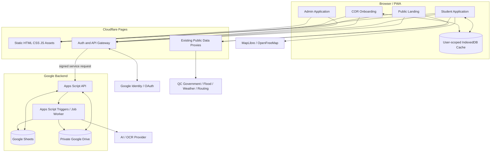
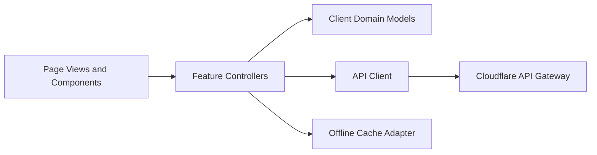
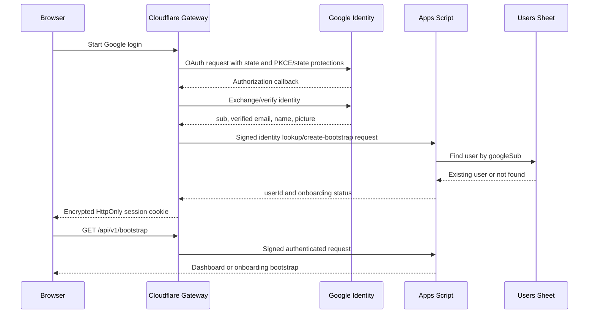
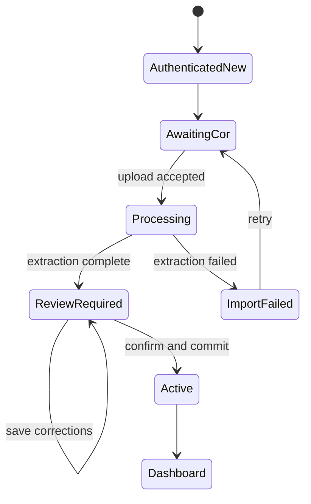
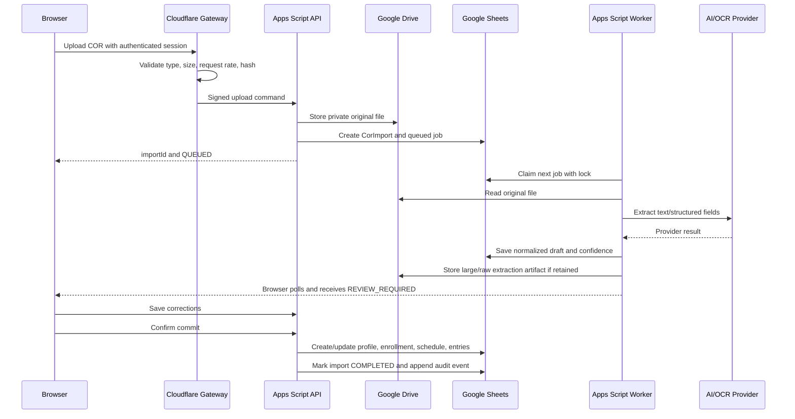
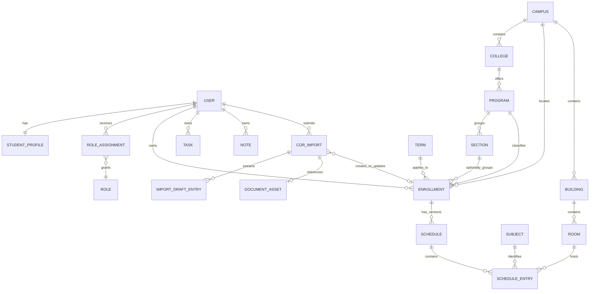

# My-Schedule Target Architecture

Architecture date: 2026-08-30  
Status: planning only  
Basis: `AUDIT.md` and the current static Cloudflare Pages application

## System Overview

My-Schedule will become a free, multi-user QCU student schedule platform while preserving the current schedule dashboard, tasks, notes, public status, building directory, and QCity Bus map.

The initial target remains deliberately small:

- Static HTML/CSS/JavaScript frontend on Cloudflare Pages.
- Google login for platform identity.
- Cloudflare Pages Functions as a thin same-origin authentication and API gateway.
- Google Apps Script as the application backend and authorization layer.
- Google Sheets as the initial structured datastore.
- Private Google Drive folders for COR documents and extraction artifacts.
- A replaceable AI/OCR provider behind an Apps Script service interface.

The browser never reads or writes Google Sheets directly. It also never decides record ownership or administrator access. Every private operation goes through the same-origin gateway and Apps Script authorization checks.

### Product Flow

```text
Landing Page
-> Google Login
-> Existing User? -> Dashboard
-> New User -> COR Registration
-> Extract COR
-> Review/Correct
-> Save Student + Enrollment + Schedule
-> Dashboard
```

### Architecture Goals

1. Replace the single hardcoded BSCS student with authenticated, user-owned data.
2. Keep shared QCU academic data separate from private student data.
3. Preserve the current mobile-first schedule experience and public safety behavior.
4. Make COR extraction assistive, reviewable, and non-authoritative until confirmed.
5. Keep Sheets and Apps Script replaceable through stable API and repository contracts.
6. Avoid a framework rewrite unless the existing multi-page frontend becomes an actual blocker.

### Non-Goals for the Initial Architecture

- Real-time collaboration on notes or schedules.
- A full learning-management system.
- Live QCity Bus tracking when no authoritative feed exists.
- Direct student access to the spreadsheet.
- Storing COR files or large OCR responses inside spreadsheet cells.
- Building a custom identity provider.
- Introducing microservices, message brokers, or other infrastructure that the initial scale does not require.

## Target Architecture



## Trust Boundaries

| Boundary | Trusted for | Must not be trusted for |
|---|---|---|
| Browser | Rendering, collecting input, local user experience | Identity claims, role checks, ownership, validation |
| Cloudflare gateway | Google session verification, CSRF/origin checks, rate limiting, signed Apps Script calls | Final domain authorization based only on browser input |
| Apps Script API | Domain validation, user lookup, permissions, ownership, Sheets/Drive access | Unsigned requests or gateway-supplied roles without lookup |
| Google Sheets | Initial persistent records | Public access, file storage, transactional guarantees |
| Google Drive | Private COR/document files | Public logo hosting by default, row-level application authorization |
| AI/OCR provider | Text/field extraction only | Final schedule correctness or account ownership |

## Component Architecture

### Public Web Components

- **Landing page**: product identity, Google sign-in command, privacy/terms links, and optionally existing public class-suspension/weather status.
- **Public status module**: preserves the current fail-unknown suspension behavior and public source links.
- **Public transport/map module**: preserves Route 4 information, map geometry, source attribution, and the no-live-tracking disclaimer.
- **Static legal pages**: updated privacy and terms that describe login, local cache, COR, OCR, Drive, and administrative processing.

No student name, schedule, tasks, notes, Google Classroom data, or COR state is rendered before authentication.

### Student Application Components

- Application shell and authenticated user header.
- Dashboard with current/next class, countdown, today timeline, weekly overview, and status panel.
- Schedule list and student-owned schedule CRUD.
- Student profile and current enrollment summary.
- Tasks and notes workspace.
- Campus/building/room directory.
- Settings, privacy controls, account logout, and optional Classroom/Gmail connection.
- COR import history and re-import workflow.

### Onboarding Components

- New-user route guard.
- COR upload screen.
- Processing status screen.
- Extracted profile/enrollment/schedule review.
- Correction controls.
- Final confirmation and commit.
- Recoverable error/retry state.

### Admin Components

- Shared catalog management for campuses, colleges, programs, sections, terms, subjects, buildings, rooms, and logo keys.
- User account status and role assignment, subject to explicit capabilities.
- COR/import support queue only if the administrator has the relevant permission.
- Audit-log viewer for privileged actions.
- System health/configuration visibility without exposing secrets.

Administrators do not receive blanket access to student tasks or notes. Access to a student's profile, schedule, or COR must be explicitly authorized, narrowly scoped, and audited.

## Frontend Architecture

### Delivery Model

Keep the existing static multi-page application for the initial migration. Introduce ES modules and shared services rather than adopting a frontend framework immediately.

Recommended page boundaries:

| Page group | Responsibility |
|---|---|
| `index.html` | Public landing and login |
| Dashboard page | Existing authenticated Home experience |
| Onboarding page(s) | COR upload, status, review, confirmation |
| Existing schedule/today/buildings/workspace/settings pages | Authenticated student features |
| Existing bus/map page | Public or authenticated read-only public information |
| Admin page(s) | Capability-gated management surfaces |

The exact filenames can be decided during implementation. The architectural requirement is that public, onboarding, student, and admin states have separate route guards and do not share private data accidentally.

### Frontend Layers



#### UI Layer

- Existing HTML templates, CSS tokens, schedule cards, tables, modals, status surfaces, and map UI.
- Renders only normalized view models.
- Uses text-safe DOM operations or a single encoding layer for all dynamic content.
- Does not call Sheets, Drive, or OCR providers.

#### Application Logic Layer

- Authentication bootstrap and route guards.
- Onboarding state machine.
- Schedule current/next/countdown calculations.
- Task/note filtering and optimistic UI state.
- Catalog resolution for program, college, building, room, and logo.
- API error, loading, offline, and conflict handling.

#### Data Access Layer

- `apiClient`: the only remote private-data transport.
- `publicDataClient`: current status/map/public feeds.
- `offlineCache`: per-user cached snapshots and optional mutation outbox.
- No feature component calls `fetch()` directly after migration.

### Frontend State Rules

- Bootstrap returns the authenticated user, onboarding state, roles/capabilities, active enrollment, active schedule summary, and public configuration version.
- Private cache keys are namespaced by the immutable platform `userId`, not email.
- Logout clears the session and all private cache namespaces for the active user.
- Public static/cache data is stored separately from private student data.
- A stale private cache must be labeled with its last synchronization time.
- The embedded Habib/BSCS schedule must never be a production fallback.

### Offline Strategy

Initial required behavior:

- Cache the static application shell.
- Cache the last successful student profile, active schedule, shared catalog subset, tasks, and notes in user-scoped IndexedDB.
- Allow read-only access to the last synchronized schedule when offline.
- Require an online connection for COR upload, onboarding commit, role/admin actions, and Google integration changes.

Offline task/note edits require a product decision before implementation. If retained, use a small outbox with `clientMutationId`, record `version`, and idempotent replay. Do not silently overwrite conflicting server versions.

## Backend and API Architecture

### Chosen Backend Split

The initial system uses two backend layers with narrow responsibilities:

1. **Cloudflare Pages Functions gateway**
   - Same-origin endpoint for the browser.
   - Google login and encrypted session cookie.
   - CSRF and Origin validation.
   - Request size/type limits and rate limiting.
   - Adds a server-generated request ID.
   - Signs a canonical service request to Apps Script.
   - Keeps the existing public Google/QC proxy functions where appropriate.

2. **Google Apps Script application API**
   - Verifies the gateway signature, timestamp, and replay token.
   - Resolves the user and role assignments from Sheets.
   - Enforces record ownership and capabilities.
   - Validates all payloads.
   - Implements application use cases.
   - Reads/writes Sheets through repositories.
   - Reads/writes private COR files in Drive.
   - Starts and processes OCR jobs.
   - Appends privileged and sensitive events to the audit log.

This split reuses the current Cloudflare OAuth/session foundation while making Apps Script the requested business backend. It also avoids direct browser-to-Apps-Script CORS behavior and prevents the Apps Script shared secret from reaching the browser.

### Gateway-to-Apps-Script Request

Conceptual signed envelope:

```json
{
  "requestId": "uuid",
  "timestamp": "ISO-8601",
  "nonce": "random-one-time-value",
  "action": "schedule.entry.update",
  "actor": {
    "googleSub": "immutable-google-subject",
    "email": "current-verified-email"
  },
  "payload": {},
  "signature": "HMAC-of-canonical-request"
}
```

Apps Script trusts the HMAC only as proof that Cloudflare sent the request. It still resolves the platform user and capabilities from Sheets. Browser-supplied `userId`, roles, owner IDs, or admin flags are ignored.

### API Response Contract

```json
{
  "ok": true,
  "data": {},
  "error": null,
  "meta": {
    "requestId": "uuid",
    "apiVersion": "v1",
    "schemaVersion": 1
  }
}
```

Errors use stable codes such as `UNAUTHENTICATED`, `FORBIDDEN`, `NOT_FOUND`, `VALIDATION_FAILED`, `VERSION_CONFLICT`, `RATE_LIMITED`, and `IMPORT_NOT_READY`. Internal stack traces, Sheet row numbers, Drive paths, and provider secrets are never returned.

### API Surface

The browser-facing API should be REST-like and versioned even though Apps Script internally routes commands through `doGet`/`doPost`.

#### Authentication and Bootstrap

- `GET /api/auth/google/start`
- `GET /api/auth/google/callback`
- `GET /api/auth/session`
- `POST /api/auth/logout`
- `GET /api/v1/bootstrap`

#### Student Profile and Onboarding

- `GET /api/v1/me`
- `PATCH /api/v1/me`
- `POST /api/v1/onboarding/cor`
- `GET /api/v1/onboarding/imports/{importId}`
- `PUT /api/v1/onboarding/imports/{importId}/draft`
- `POST /api/v1/onboarding/imports/{importId}/commit`

#### Schedule

- `GET /api/v1/schedules/active`
- `POST /api/v1/schedules`
- `PATCH /api/v1/schedules/{scheduleId}`
- `POST /api/v1/schedules/{scheduleId}/entries`
- `PATCH /api/v1/schedule-entries/{entryId}`
- `DELETE /api/v1/schedule-entries/{entryId}`

#### Tasks and Notes

- CRUD endpoints under `/api/v1/tasks`
- CRUD endpoints under `/api/v1/notes`
- Mutations accept `clientMutationId` and expected record `version`.

#### Shared Catalog

- Read endpoints under `/api/v1/catalog/*` for campuses, colleges, programs, sections, terms, subjects, buildings, rooms, and brand/logo metadata.

#### Administration

- Capability-gated endpoints under `/api/v1/admin/*` for catalog changes, account status, role assignments, import support, and audit events.

Exact fields and Sheet mappings belong to CHUNK 3.

### Apps Script Module Boundaries

| Module | Responsibility |
|---|---|
| Router | Decode action, dispatch handler, normalize response |
| ServiceAuth | Verify HMAC, timestamp, nonce, request ID |
| IdentityService | Resolve Google `sub` to platform user |
| AuthorizationService | Resolve roles/capabilities and ownership |
| Validation | Validate and normalize API payloads |
| UserService | User/profile/onboarding state |
| CatalogService | Shared QCU academic data |
| ScheduleService | Schedule versions and entry CRUD |
| WorkspaceService | Tasks and notes |
| CorImportService | Import lifecycle and review/commit |
| DocumentService | Private Drive file handling and retention |
| OcrService | Provider-neutral extraction interface |
| AuditService | Append security and privileged events |
| Repositories | Sheet-specific reads/writes and indexing |
| Config | Script Properties, schema version, folder/sheet IDs |

Services depend on repository interfaces, not direct spreadsheet calls scattered through handlers.

## Authentication Flow

Platform login and optional Classroom/Gmail integration are separate.

### Platform Login Scopes

Use minimal Google OpenID Connect scopes:

- `openid`
- `email`
- `profile`

Do not request Classroom or Gmail permissions during basic login.

### Login Sequence



### Identity Rules

- Google's immutable `sub` is the external identity key.
- Platform `userId` is an application-generated stable ID and is used for all ownership relations.
- Email is verified and stored as a mutable contact attribute, not as the primary key.
- A student number extracted from a COR must never automatically merge two accounts.
- Duplicate student-number conflicts block commit and require a defined resolution path.
- Hosted-domain restrictions, if any, must be configured and enforced at login and in Apps Script.
- Apps Script rechecks that the user is active and resolves current roles on private requests.

### Session Rules

- Use an encrypted, `HttpOnly`, `Secure`, `SameSite=Lax` or stricter cookie.
- Keep only platform session claims in the login session; do not place broad Google integration tokens in the same logical session.
- Use a short practical session lifetime with renewal policy defined before implementation.
- Logout clears the platform cookie and private browser cache.
- Optional Classroom/Gmail authorization has separate scopes, consent, tokens, and disconnect behavior.

## Student Onboarding Flow

### State Model



Suggested platform user states:

- `ONBOARDING`
- `ACTIVE`
- `SUSPENDED`
- `CLOSED`

Suggested COR import states:

- `UPLOADED`
- `QUEUED`
- `PROCESSING`
- `REVIEW_REQUIRED`
- `COMMITTING`
- `COMPLETED`
- `FAILED`
- `CANCELLED`

### Existing User Decision

After login, `/api/v1/bootstrap` checks the user by Google `sub`:

- Active user with an active enrollment/schedule: dashboard.
- Existing onboarding user: resume the latest valid onboarding state.
- Existing user without an active term: term/COR renewal flow, not a duplicate account.
- Unknown Google `sub`: create a minimal `ONBOARDING` user record and begin COR registration.

Creating the minimal user record does not make extracted profile or schedule data authoritative.

### Review and Commit Rules

- OCR output is always a draft.
- The student must see and confirm name/profile fields, academic term, program/section, subjects, days, times, rooms, and units.
- Low-confidence or unresolved fields are highlighted, not guessed silently.
- The commit endpoint revalidates the entire draft server-side.
- Commit is idempotent and may run only once per approved import version.
- The previous active schedule remains active until the new schedule and entries are fully written and validated.

## COR Processing Flow



### Processing Responsibilities

#### Cloudflare Gateway

- Authenticates upload owner.
- Enforces allowed MIME types and configured maximum size.
- Calculates or verifies a content hash for duplicate/idempotency detection.
- Rate-limits repeated uploads.
- Does not persist the document.

#### Apps Script API

- Generates `importId` and private Drive destination.
- Writes the import/job metadata.
- Never makes the file public.
- Returns only opaque IDs and safe status fields.

#### Apps Script Worker

- Runs from a time-driven trigger or controlled job invocation.
- Claims jobs using `LockService` plus status/version checks.
- Calls the selected OCR/AI adapter.
- Normalizes provider output into the internal draft model.
- Retries only retryable failures with a bounded attempt count.
- Records sanitized provider errors.

#### Student Review

- Displays normalized draft records, not raw provider JSON.
- Allows correction before commit.
- Requires explicit final confirmation.

### Upload Constraint

Apps Script web-app payload and execution limits make document size an implementation decision. The initial architecture assumes a small explicit COR upload limit and server-to-server forwarding through Cloudflare. Before implementation, representative COR PDFs/images must be tested. If common files exceed the reliable limit, document upload must move to a direct private object-storage flow while keeping the same `CorImport` API contract.

## Data Ownership Model

| Ownership class | Examples | Read | Write |
|---|---|---|---|
| Public data | Institution identity, public status sources, Route 4 data, public campus summary | Anyone | System/admin pipeline |
| User-owned data | Private profile fields, enrollments, schedules, tasks, notes, preferences, COR imports/documents | Owner; narrowly authorized admin when required | Owner through API; authorized support/admin actions audited |
| Shared QCU academic data | Campuses, colleges, programs, sections, terms, subjects, buildings, rooms | Authenticated users; selected records may be public | Authorized administrators |
| Admin-managed security data | Role assignments, user status, import support state, audit metadata | Capability-gated administrators | Higher-privilege capabilities only |
| System configuration | OAuth secrets, HMAC secret, Sheet/Drive IDs, OCR keys, schema version, retention settings | Runtime/operator only | Deployment operator only |

### Ownership Enforcement

- User-owned rows contain `ownerUserId` or derive ownership through an enrollment/schedule parent.
- Student endpoints ignore owner IDs supplied by the browser and use the authenticated platform `userId`.
- Shared catalog rows do not contain student ownership.
- Admin actions require capabilities and optional scope matches.
- Sensitive reads and every privileged write create an audit event.
- Tasks and notes are never exposed through normal administrator catalog APIs.

## Role and Permission Model

### Initial Roles

#### Student

- Read shared QCU catalog data.
- Read and update allowed fields on own profile.
- Create/read/update/delete own schedule entries, tasks, and notes.
- Upload, review, correct, commit, and delete own permitted COR imports.
- Manage own preferences and optional Google integrations.
- Read own audit-relevant import status, not global audit logs.

#### Administrator

- Includes normal authenticated access plus explicitly assigned capabilities.
- Manage shared academic catalogs and logo keys.
- View/manage user account status where authorized.
- Assign roles only when granted `roles.manage`.
- Review import failures only when granted `imports.review`.
- View audit records only when granted `audit.read`.

An administrator does not automatically gain access to student tasks/notes or all original COR files.

### Future Extensibility

Use role assignments plus capabilities rather than code such as `role === "admin"` throughout the application.

Conceptual assignment:

```text
RoleAssignment
- userId
- roleKey
- scopeType: GLOBAL | CAMPUS | COLLEGE | PROGRAM
- scopeId
- status
- grantedBy
- grantedAt
```

Potential future roles can be introduced by mapping them to capabilities without changing ownership rules. Examples might include catalog editor or import reviewer, but they are not required in the initial release.

### Core Capabilities

```text
catalog.read
catalog.write
users.read
users.status.write
roles.read
roles.manage
imports.review
documents.read.support
audit.read
system.config.read
```

CHUNK 3 must define how role and capability records are represented without placing permission logic in sheet formulas.

## Major Entities and Relationships



### Entity Responsibilities

| Entity | Purpose |
|---|---|
| User | Platform identity, Google `sub`, verified email, lifecycle status |
| StudentProfile | Student-facing identity and QCU profile fields |
| Role / RoleAssignment | Capability and scope assignment |
| Campus / College / Program / Section | Dynamic QCU organizational catalog |
| Term | Academic period and active/archive status |
| Enrollment | User's program/year/section state for one term |
| Subject | Shared course/subject catalog |
| Building / Room | Shared physical location catalog |
| Schedule | Versioned schedule owned through an enrollment |
| ScheduleEntry | Day/time/subject/location meeting record |
| Task / Note | User-owned workspace records, optionally linked to a subject |
| CorImport | Import job, state, provenance, confidence summary, commit state |
| ImportDraftEntry | Correctable extracted schedule rows before commit |
| DocumentAsset | Opaque Drive file metadata, retention, deletion status |
| AuditEvent | Append-only privileged/security action record |

Exact columns, required fields, indexes, and sheet partitioning are deferred to CHUNK 3.

## Google Sheets and Apps Script Architecture

### Spreadsheet Organization

Use one controlled application spreadsheet initially, owned by a dedicated institutional/operations Google account. Separate logical tables into sheets. Do not use student-owned sheets.

Candidate logical sheets:

- Users
- StudentProfiles
- Roles
- RoleAssignments
- Campuses
- Colleges
- Programs
- Sections
- Terms
- Enrollments
- Subjects
- Buildings
- Rooms
- Schedules
- ScheduleEntries
- Tasks
- Notes
- CorImports
- ImportDraftEntries
- DocumentAssets
- AuditLog
- SchemaMeta

CHUNK 3 may combine low-volume tables where justified, but API entities and ownership boundaries must remain separate.

### Sheet Data Rules

- Use UUID-style stable IDs; never expose or depend on row numbers.
- Store ISO-8601 UTC timestamps and convert for display.
- Include `createdAt`, `updatedAt`, and integer `version` on mutable rows.
- Use explicit status fields rather than row color or formulas as state.
- Avoid spreadsheet formulas for authorization, ownership, or core business rules.
- Use validation code and reference IDs rather than repeated display names.
- Maintain soft-delete/archive fields where history is required.
- Keep provider/raw document payloads out of cells when they can exceed safe size.
- Include schema version metadata and migration records.

### Repository Pattern

Apps Script services call repositories such as:

```text
UserRepository
CatalogRepository
EnrollmentRepository
ScheduleRepository
TaskRepository
NoteRepository
CorImportRepository
AuditRepository
```

Repositories hide sheet names, header positions, batching, indexing, and row lookup. Services operate on domain objects. This is the main boundary that allows Sheets to be replaced later.

### Performance and Concurrency

- Read header maps once and cache them.
- Read/write ranges in batches, not cell-by-cell.
- Use `CacheService` for low-risk shared catalog reads and user/role lookup with short TTLs.
- Use `LockService` for unique identity creation, role changes, import commit, and active-schedule switching.
- Use idempotency keys for upload, import commit, and client mutation replay.
- Use record versions for optimistic concurrency.
- Keep one active schedule pointer/status rather than deleting the prior schedule during replacement.
- Add pagination and filters to admin/user-list APIs; do not return entire sheets.
- Add operational metrics for request count, latency, errors, lock contention, and quota failures.

### Apps Script Configuration

Store in Script Properties, not Sheets or frontend code:

- Spreadsheet ID.
- Drive folder IDs.
- Cloudflare-to-Apps-Script HMAC secret.
- OAuth/provider configuration that Apps Script needs.
- OCR/AI API key.
- API/schema version.
- Retention and upload limits.

Apps Script is deployed to execute as the application owner. Because a server-to-server Cloudflare request cannot rely on `Session.getActiveUser()`, the web app must reject every unsigned request and resolve the actor from the signed verified Google identity.

### Transaction Substitute

Sheets has no multi-table transaction. Critical workflows use staged status transitions:

1. Acquire the narrow required lock.
2. Recheck versions and idempotency key.
3. Write a new schedule as `DRAFT`.
4. Batch-write and validate all entries.
5. Mark the new schedule `ACTIVE` and the prior one `ARCHIVED` in the final step.
6. Mark the import `COMPLETED`.
7. Append the audit event.
8. Release the lock.

If a failure occurs before activation, the prior active schedule remains valid and a repair/cleanup job can remove abandoned drafts.

## File and Document Storage Strategy

### COR Documents

- Store originals in a private Google Drive folder owned by the application account.
- Use opaque IDs in folder/file names; do not include student email or student number in paths.
- Store only `driveFileId`, hash, MIME type, size, owner user ID, import ID, timestamps, retention state, and deletion status in Sheets.
- Do not generate public share links.
- Apps Script is the only component with Drive file access during normal operation.
- Administrators need an explicit document-support capability and audited reason/path to view a file.

Conceptual folder layout:

```text
My-Schedule Private/
  cor/
    2026/
      <userId>/
        <importId>/
          original
          extraction-artifact (only if retained)
```

### Extraction Artifacts

- Normalized draft fields go to `CorImports`/`ImportDraftEntries`.
- Large raw OCR/AI output, if needed for support, goes to a private Drive JSON/text file with a shorter retention period.
- Provider prompts/responses should exclude unnecessary identity fields.

### Logo and Public Assets

Dynamic college/program branding should use an allowlisted `logoAssetKey` in catalog records.

Initial logo files can remain versioned static Pages assets. The Sheet maps a college/program to a key or controlled URL. Arbitrary user-supplied HTML or image URLs are not allowed. Admin logo upload/public hosting can be designed later if selecting existing approved assets is insufficient.

### Retention

The exact periods are unresolved, but the architecture requires separate configurable retention for:

- Original COR file.
- Raw OCR/AI artifact.
- Normalized committed academic data.
- Failed/cancelled imports.
- Audit events.

Deletion must remove or tombstone the Sheet metadata and delete the corresponding Drive files through an auditable job.

## Existing Feature Migration Strategy

### Public Landing and Dashboard

- Replace the current root personal dashboard with a public landing page.
- Move/reuse the current Home UI as the authenticated dashboard.
- Keep the live current/next/countdown and weekly schedule components.
- Public suspension/status may remain on the landing page because it contains no student-owned data.

### Personal Header and Branding

- Replace `Habib` with `bootstrap.currentUser.displayName`.
- Replace `BS Computer Science - San Bartolome` with the active enrollment/program/campus view model.
- Seed CCS and BSCS as ordinary College/Program catalog records, not defaults.
- Replace the universal CCS logo with a catalog-resolved logo and a general QCU fallback.

### Existing Schedule

- Remove the embedded personal timetable as a production fallback.
- Treat `data/schedule.json` as a migration fixture only.
- If the current timetable must be retained for Habib, attach it only after explicit account ownership confirmation or import it through an administrator migration script in a later phase.
- Keep all current schedule calculations and presentation behavior against the API view model.

### Tasks and Notes

- Preserve existing CRUD, filters, priorities, deadlines, and subject links.
- Move persistence to user-owned API records.
- On first login, detect legacy local tasks/notes and ask the student whether to import them into the signed-in account. Never attach them automatically on a shared device.
- Namespace and clear private offline caches per platform user.

### Buildings and Rooms

- Seed current buildings and rooms as shared catalog records.
- Resolve schedule locations by `roomId`/`buildingId` while still displaying familiar codes.
- Keep the building directory and modal, but populate them from catalog APIs.

### Map and QCity Bus

- Preserve the MapLibre route, Route 4 data, source attribution, and explicit no-live-tracking state.
- Keep large route geometry as versioned static public data unless administrators genuinely need to edit it.
- Resolve campus metadata from the shared catalog so future campuses can be added without changing map code.
- Keep the TomTom route function disabled/unowned until a defined student workflow requires it.

### Public Status

- Preserve weather, flood, suspension, source attribution, and fail-unknown semantics.
- Keep public-data endpoints separate from private student APIs.
- Pass the authenticated student's schedule to the existing schedule-aware interpretation only after authorization.

### Google Classroom/Gmail

- Preserve the existing normalized update-card UI and optional Gmail metadata consent.
- Move it behind a separate “Connect Google Classroom” action after platform login.
- Keep integration tokens logically separate from the platform login session.
- Namespace cached updates by platform user and purge them on disconnect/logout.

### Settings and Notifications

- Keep existing settings surfaces.
- Replace the misleading class-notification toggle with implemented behavior or accurate copy during the implementation phase.
- Add clear controls for logout, private cache deletion, COR deletion status, and optional integration disconnect.

## Security and Privacy Architecture

### Authentication and Account Ownership

- Google proves control of a Google account, not ownership of a QCU student number or COR.
- The platform links one Google `sub` to one platform user unless an explicit account-linking policy is later approved.
- COR identity fields are user-submitted evidence and remain unverified unless an institutional verification source is added.
- Duplicate student identifiers never trigger automatic account merging.

### Authorization

- Apps Script enforces ownership and capabilities for every private action.
- UI route guards are convenience only.
- Shared catalog writes and role changes require elevated capabilities.
- Admin support access is least-privilege and logged.

### API Security

- HTTPS only.
- Encrypted `HttpOnly` session cookie.
- OAuth state validation and minimal scopes.
- CSRF token or same-origin double-submit strategy for mutations.
- Origin/Referer validation at Cloudflare where reliable.
- HMAC-signed Cloudflare-to-Apps-Script requests with timestamp and one-time nonce.
- Short replay window and nonce cache.
- Request IDs across gateway, Apps Script, and audit records.
- Per-user/IP rate limits for login, upload, OCR retry, and admin APIs.
- Strict input schemas, length limits, enum validation, and safe output encoding.
- Content Security Policy and self-hosted/pinned frontend dependencies before private data is exposed.

### Data Minimization

- Store only fields required for schedule and account operation.
- Do not store Google passwords.
- Do not require Classroom/Gmail scopes for login.
- Do not retain raw OCR output longer than necessary.
- Do not expose Drive IDs or spreadsheet row details to the UI unless required.
- Avoid sending unnecessary profile identifiers to the OCR provider.

### Browser Privacy

- Private cache is per platform user and deleted on logout/account reset.
- Precise geolocation remains opt-in, expires, and is actively removed when stale or reset.
- Shared-device behavior must be clear.
- Cached Google updates, tasks, notes, and schedules must not survive a logout unless the user explicitly chooses device persistence and the security model supports it.

### Audit Events

At minimum, append events for:

- Account creation/status changes.
- Role grants/revocations.
- COR upload, processing result, support access, commit, and deletion.
- Schedule replacement/import commit.
- Administrator catalog changes.
- Sensitive user/document reads by administrators.

Audit records should describe who, what, target, result, timestamp, request ID, and reason where required. They must not copy full COR content or note/task bodies.

## Scalability Considerations

### Suitable Initial Scale

Sheets and Apps Script are appropriate for a controlled MVP with modest concurrent writes and disciplined batch access. They are not suitable for unbounded growth, heavy analytics, large files, or high-frequency synchronization.

### Required Safeguards

- Batch reads and writes.
- Cached shared catalogs.
- Indexed lookup maps in Apps Script memory/cache for high-use IDs.
- Pagination for admin lists and history.
- Idempotent mutations.
- Optimistic concurrency versions.
- Narrow locks only around critical changes.
- Asynchronous OCR jobs.
- File size and rate limits.
- Quota/error monitoring and retry policy.
- Avoid Git commits/deployments for live user data.

### Migration Signals

Begin database migration planning before any of these become routine:

- Apps Script execution or URL Fetch quotas are frequently approached.
- Sheet row scans or lock contention noticeably delay user requests.
- Concurrent writes produce repeated conflicts.
- Admin queries require complex filtering/reporting.
- OCR/job volume requires a durable queue.
- Dataset size makes backups, exports, or schema changes unsafe.
- More than one application instance/team needs transactional access.

An exact user/row/latency threshold must be chosen after measuring a representative prototype, not guessed in this document.

## Migration Path to a Future Database

### Stable Boundaries

- Browser calls only versioned Cloudflare APIs.
- Cloudflare calls an application service contract, not Sheets directly.
- Apps Script services call repository interfaces.
- API responses expose stable IDs and domain fields, never Sheet row positions.
- OCR/document interfaces are provider-neutral.

### Migration Sequence

1. Export each logical Sheet table using stable IDs and ISO timestamps.
2. Load data into the future relational/document database.
3. Implement the same repository/service contract in the new backend.
4. Run contract tests against Apps Script and the new backend.
5. Dual-read or shadow-read selected non-mutating endpoints.
6. Freeze or queue writes for a controlled cutover window.
7. Switch the gateway backend target without changing frontend routes.
8. Retain Sheets as a read-only archive for the approved period, then remove access.

### Schema Portability Rules

- No compound meaning encoded only in sheet names, colors, formulas, or row order.
- No API references to A1 ranges or row numbers.
- UUID-style IDs and explicit foreign keys.
- Explicit null/empty semantics.
- Explicit statuses and versions.
- Append-only audit export.
- Document storage remains separate and referenced by asset IDs.

## Architecture Decisions

### Resolved for This Plan

| Decision | Choice | Reason |
|---|---|---|
| Initial application datastore | Google Sheets | Required constraint and practical MVP cost |
| Initial business backend | Google Apps Script | Native Sheets/Drive/trigger integration |
| Browser access to Apps Script | Through Cloudflare gateway | Avoid CORS and untrusted direct identity claims |
| Platform authentication | Minimal Google OIDC | Reuses Google account ownership with minimal scopes |
| Classroom/Gmail | Optional separate integration | Avoid broad consent as a login requirement |
| External identity key | Google `sub` | Immutable compared with email |
| Primary application identity | Generated platform `userId` | Keeps ownership independent of provider/email |
| COR file storage | Private Google Drive | Sheets is not file storage; fits Apps Script backend |
| COR processing | Asynchronous with mandatory review | Apps Script/provider latency and OCR fallibility |
| Frontend rewrite | No immediate framework rewrite | Existing static UI is reusable |
| Existing map/status | Preserve as public/read-only modules | Valuable and independent of private data |
| Authorization | Apps Script capability and ownership checks | UI/gateway claims alone are insufficient |
| Future database migration | Stable API plus repository boundary | Prevent Sheets-specific coupling |

### Must Be Resolved Before Implementation

1. Allowed Google accounts and any QCU hosted-domain rule.
2. Whether student number is required, its source of truth, and duplicate-resolution process.
3. Initial administrator bootstrap and who can grant `roles.manage`.
4. Administrator scope: global, campus, college, program, or a combination.
5. OCR/AI provider, data-processing terms, allowed regions, quotas, and cost ceiling.
6. Reliable COR file formats and maximum upload size through the Apps Script path.
7. Original COR, raw extraction, failed import, and audit retention periods.
8. Whether complete OCR failure permits manual profile/schedule entry.
9. Whether students may freely edit imported schedules or whether some fields are locked/provenance-marked.
10. Exact definition of academic term, active enrollment, schedule replacement, and archive policy.
11. Offline task/note mutation requirement and conflict behavior.
12. Notification scope: foreground only, scheduled reminders, or web push.
13. Public logo hosting and whether administrators need upload capability initially.
14. Expected MVP users/concurrency and measurable database-migration thresholds.
15. Whether multiple campuses are in the first release or only supported by the model.
16. Whether QCity Bus remains public before login.
17. Privacy contact, deletion/export rights, and administrator support-access policy.

## Risks and Trade-Offs

| Risk/trade-off | Impact | Mitigation |
|---|---|---|
| Cloudflare plus Apps Script adds a network hop | Higher latency and more moving parts | Keep gateway thin, batch backend calls, use bootstrap responses |
| Apps Script web app is externally reachable | Attack surface | Require HMAC, timestamp, nonce, rate limits, reject unsigned requests |
| Sheets lacks transactions | Partial-write risk | Staged states, locks, versions, idempotency, prior active schedule preserved |
| Sheets scans become slow | Latency/quota risk | Repository indexes, cache, pagination, batch reads, migration signals |
| Drive upload through Apps Script may have practical size limits | COR failures | Test representative files early; define alternate object-storage path |
| OCR/AI can be wrong | Incorrect schedules | Mandatory review, confidence, provenance, atomic activation |
| Google login does not prove COR ownership | Account/identity ambiguity | No automatic merge; define duplicate and institutional verification policy |
| Admin access can expand privacy blast radius | Sensitive data exposure | Capability scopes, least privilege, audit sensitive reads |
| Offline synchronization adds conflict complexity | Lost/overwritten data | User-scoped cache, versions, idempotent outbox only if required |
| Dynamic logos from arbitrary URLs create security/privacy issues | Tracking/content injection | Allowlisted asset keys and controlled hosting |
| Existing public-data code is safety-sensitive | False clear status regression | Preserve fail-unknown tests and public/private separation |
| Free-tier/provider quotas can interrupt OCR or APIs | Onboarding delays | Queue, retry bounds, honest status, provider abstraction, monitoring |

## Implementation Phases and Dependencies

### Phase 0: Resolve Decisions and Provision Test Resources

Deliverables:

- Close the blocking architecture decisions above.
- Create non-production OAuth credentials.
- Create test spreadsheet and private Drive folders.
- Select/test OCR provider with representative redacted COR samples.
- Define initial admin bootstrap and privacy/retention policy.
- Define API error/envelope conventions.

Dependencies: product owner, Google Cloud project, institutional Sheet/Drive owner, privacy decisions.

### Phase 1: Backend Foundation and Authentication

Deliverables:

- Apps Script project skeleton, signed router, repositories, schema metadata.
- Cloudflare minimal Google login and session.
- User bootstrap by Google `sub`.
- Apps Script authorization/capability middleware.
- `/api/v1/bootstrap`, logout, CSRF/origin controls, audit foundation.

Dependencies: CHUNK 3 schema, OAuth policy, HMAC secret management.

### Phase 2: Shared Catalog and Dynamic Shell

Deliverables:

- Campus/college/program/section/term/subject/building/room APIs.
- Seed current CCS, BSCS, campus, buildings, and rooms as ordinary catalog data.
- Dynamic user header, program/campus label, and logo resolver.
- Public landing and authenticated dashboard route boundary.

Dependencies: authoritative initial catalog and approved logo assets.

### Phase 3: COR Onboarding

Deliverables:

- Authenticated upload, private Drive storage, import job state machine.
- OCR provider adapter and worker trigger.
- Review/correction UI contract.
- Idempotent commit into profile, enrollment, schedule, and entries.
- Retention/deletion jobs and import audit events.

Dependencies: file limits, OCR provider, retention policy, sample COR formats.

### Phase 4: Schedule and Dashboard Migration

Deliverables:

- Active schedule read model and schedule-entry CRUD.
- Existing current/next/countdown/today/week views backed by API data.
- User-specific offline schedule cache.
- Removal of personal production fallbacks.

Dependencies: onboarding commit, schedule schema, ownership tests.

### Phase 5: Tasks, Notes, and Settings

Deliverables:

- User-owned task/note CRUD APIs.
- Legacy local-data import prompt.
- User-scoped cache and chosen offline mutation behavior.
- Accurate notification/settings behavior and private-data reset.

Dependencies: version/idempotency fields and offline decision.

### Phase 6: Administration

Deliverables:

- Capability-gated catalog management.
- User status and role assignment.
- Import support workflow if approved.
- Audit-log viewer and sensitive-access logging.

Dependencies: admin scope/capability decisions and audit retention.

### Phase 7: Existing Integrations and Hardening

Deliverables:

- Optional Classroom/Gmail connection separated from login.
- Public map/status integration preserved and tested.
- CSP, pinned/self-hosted dependencies, XSS hardening, modal accessibility.
- Quota/latency/error monitoring and database migration dashboard/signals.

Dependencies: integration scope approval and security review.

## CHUNK 3 Handoff: Database and Google Sheets Schema

CHUNK 3 must turn the entities and ownership rules in this document into an exact Google Sheets schema. It should design:

1. The final list of sheets and whether any low-volume logical tables are combined.
2. Every column name, type, required/optional rule, enum, default, and validation rule.
3. Stable primary IDs and all foreign-key relationships.
4. User ownership columns and how ownership is derived for child records.
5. Role, capability, and scope representation for Student and Administrator.
6. User/onboarding/import/schedule lifecycle status enums.
7. Mutable-row `createdAt`, `updatedAt`, `version`, archive/delete, and idempotency fields.
8. One-active-enrollment and one-active-schedule invariants.
9. COR import, draft-entry, Drive asset, confidence, provenance, retry, and commit fields.
10. Task/note fields needed for sync and optional offline replay.
11. Catalog keys for campuses, colleges, programs, sections, terms, subjects, buildings, rooms, and logos.
12. Audit-event fields and retention/partition strategy.
13. Sheet indexes/cache maps, lookup strategy, batch-access patterns, and LockService boundaries.
14. Seed data mapping from the current CCS/BSCS/building/room implementation.
15. Schema versioning, migration records, backup/export process, and test fixtures.

CHUNK 3 should produce `DATABASE_SCHEMA.md` (or the agreed schema document), sample rows with non-personal test data, entity-to-sheet mappings, validation rules, and Apps Script repository access patterns. It must not implement the sheets or Apps Script code unless a later chunk explicitly requests implementation.
