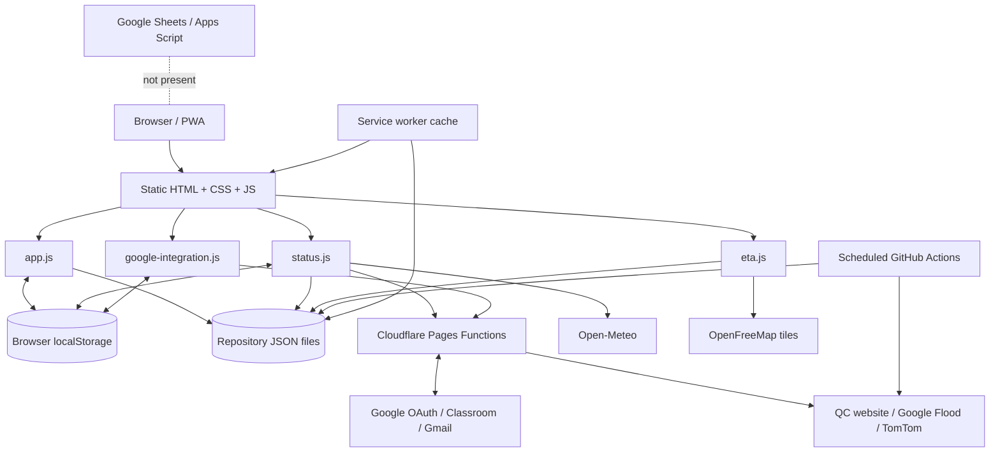

# My-Schedule Codebase Audit

Audit date: 2026-08-30  
Scope: current workspace checkout only  
Mode: analysis only; no application code or configuration was changed

## Executive Summary

My-Schedule is currently a static, single-student QCU progressive web app (PWA) deployed on Cloudflare Pages. The browser loads a shared schedule and building catalog from repository JSON files, falling back to a duplicate copy embedded in `assets/js/app.js`. Tasks and notes have complete browser-local CRUD through `localStorage`. The Google feature is an optional Google Classroom/Gmail integration implemented with Cloudflare Pages Functions and an encrypted `HttpOnly` cookie; it is not application login and does not create a platform user record.

There is no Google Apps Script project and no Google Sheets integration in this checkout. No `.gs` files, `appsscript.json`, spreadsheet IDs, Sheets API calls, Apps Script web-app URLs, or `SpreadsheetApp` usage were found.

The current frontend and public-information features are useful foundations, but multi-user behavior cannot be added safely by only making the existing JSON dynamic. A server-enforced identity, authorization, ownership, and persistence boundary must be introduced first. Google Sheets can be an initial structured store for an MVP, but it should sit behind authenticated server APIs and should store metadata/rows, not COR image or PDF binaries.

### Overall Readiness

| Area | Current state | Multi-user readiness |
|---|---|---|
| Static schedule UI | Functional and responsive | Reusable after data-service extraction |
| Schedule data | One shared personal timetable | Blocking limitation |
| Tasks/notes | Local browser CRUD | Must become user-owned and synchronized |
| Google integration | Optional Classroom/Gmail OAuth | Useful code, but not platform authentication |
| Authentication | None | Blocking limitation |
| Authorization/roles | None | Blocking limitation |
| Google Sheets | Not present | Must be designed and implemented |
| COR/OCR | Not present | Requires a new upload and processing pipeline |
| Offline support | Static shell plus embedded fallback data | Not suitable for user-specific data yet |
| Public status/map | Substantial existing functionality | Mostly preservable |

## Audit Assumptions

- The current checked-out workspace is the complete application under review.
- The existing QCU San Bartolome and Route 4 information is intended to remain available as institutional/public data.
- Google Sheets is an initial MVP datastore, not necessarily the permanent production database.
- COR files contain personal and academic information and therefore require private storage, retention rules, and explicit access controls.
- The pre-existing uncommitted version-query changes in `campus-eta.html` are user-owned and were not modified.

## Current Architecture

### Runtime and Deployment

- Static HTML, CSS, JavaScript, JSON, and images are deployed from the repository root to Cloudflare Pages (`wrangler.toml`).
- Cloudflare Pages Functions under `functions/api/` provide Google OAuth/API access and public-data proxies.
- The PWA service worker caches the application shell and selected static data (`service-worker.js`).
- GitHub Actions periodically run public-data fetchers and commit updated JSON into the repository (`.github/workflows/`).
- A Node development server emulates only the Google Pages Function routes locally (`scripts/dev-server.mjs`). It does not expose the public flood, route, weather-alert, or suspension functions.
- There is no framework, bundler, application server, migration tool, or database client. The only installed package is Wrangler.

### Frontend Composition

All main pages share `assets/js/app.js`, which owns the header/navigation shell, schedule calculations, buildings, settings, tasks, notes, modal behavior, clock, and service-worker registration. This is a 1,500-line global script with page selection driven by `body[data-page]`.

Page-specific scripts are:

- `assets/js/status.js`: weather, flood, and suspension status on Home.
- `assets/js/eta.js`: QCity Bus Route 4 schedule and MapLibre map.
- `assets/js/google-integration.js`: Google account settings and cached update feed.

The active stylesheet is primarily the merged `assets/css/styles.css`; `campus-eta.html` additionally loads `assets/css/eta.css`. Several older page stylesheets remain in the repository but are not referenced by any page.

### Data-Flow Diagram



### Current Request/Data Paths

1. Schedule pages request `data/schedule.json`; on failure or empty data, `QCU_DEFAULTS.schedule` is used (`assets/js/app.js:7`, `assets/js/app.js:69`, `assets/js/app.js:1400`).
2. Building pages request `data/buildings.json`; on failure, the embedded building defaults are used (`assets/js/app.js:21`, `assets/js/app.js:1401`).
3. Home status requests Open-Meteo directly, `/api/suspensions`, `/api/flood`, and the shared schedule JSON. Static repository feeds are fallbacks (`assets/js/status.js:35-61`, `assets/js/status.js:518-640`).
4. Google UI calls `/api/google/*`. The server exchanges and refreshes tokens, calls Classroom/Gmail, and returns normalized update cards. Tokens remain in an encrypted cookie; update cards and account email are copied to browser storage for offline display.
5. Bus/map UI reads `data/qcity-bus.json` and `data/route4-corridor.json`, then loads map tiles from OpenFreeMap (`assets/js/eta.js:12-14`, `assets/js/eta.js:447-450`).
6. GitHub Actions scrape/fetch suspension and flood data and commit changed JSON. Those commits can trigger another Pages deployment.

## File and Component Map

### Pages

| File | Purpose | Main dependencies |
|---|---|---|
| `index.html` | Home dashboard, today's classes, tracker, weather/flood/suspension | `app.js`, `status.js`, `styles.css` |
| `schedule.html` | Full weekly timetable | `app.js`, `styles.css` |
| `today.html` | Today's class cards | `app.js`, `styles.css` |
| `buildings.html` | Building directory and modal | `app.js`, `styles.css` |
| `campus-eta.html` | QCity Bus Route 4 information and map | `app.js`, `eta.js`, `eta.css`, MapLibre |
| `workspace.html` | Combined task and note workspace | `app.js`, `styles.css` |
| `tasks.html` | Redirect to `workspace.html#tasks` | Inline redirect |
| `notes.html` | Redirect to `workspace.html#notes` | Inline redirect |
| `google.html` | Google Classroom/Gmail settings and update feed | `google-integration.js`, `app.js` |
| `settings.html` | Local preferences and links | `app.js` |
| `offline.html` | PWA offline fallback | `styles.css` |
| `privacy.html` | Current privacy notice | `styles.css` |
| `terms.html` | Current terms | `styles.css` |

### JavaScript

| File | Ownership |
|---|---|
| `assets/js/app.js` | Shared shell, time/status calculations, schedule/buildings rendering, tasks/notes CRUD, settings, modals, service worker |
| `assets/js/status.js` | Weather cache, user geolocation, suspension interpretation, flood advisory rendering |
| `assets/js/google-integration.js` | Google UI state, local update cache, filters, notifications, preference calls |
| `assets/js/eta.js` | Bus data rendering, MapLibre map, route/stops/termini |
| `assets/js/lucide.min.js` | Vendored icon build; currently not referenced by pages |

### Cloudflare Functions

| Path | Purpose |
|---|---|
| `functions/api/google/connect.js` | Starts OAuth authorization |
| `functions/api/google/callback.js` | Exchanges code and creates encrypted session cookie |
| `functions/api/google/status.js` | Reports connection/configuration status |
| `functions/api/google/preferences.js` | Updates Classroom/Gmail/auto-refresh preferences |
| `functions/api/google/updates.js` | Reads and normalizes Classroom/Gmail updates |
| `functions/api/google/disconnect.js` | Revokes refresh token and clears session cookie |
| `functions/api/google/_lib.js` | OAuth, encryption, cookie, refresh, and Google API helpers |
| `functions/api/suspensions.js` | Scrapes and normalizes QC suspension announcements |
| `functions/api/flood.js` | Proxies Google Flood Forecasting data near QCU |
| `functions/api/weather-alerts.js` | Proxies Google Weather public flood alerts |
| `functions/api/route.js` | TomTom route/traffic proxy; no current frontend caller |

### Repository Data

| File | State |
|---|---|
| `data/schedule.json` | Active single-student timetable |
| `data/buildings.json` | Three buildings tied to that timetable |
| `data/qcity-bus.json` | Static Route 4/service/source metadata |
| `data/route4-corridor.json` | Generated indicative road geometry |
| `data/suspensions.json` | Scheduled fallback suspension feed |
| `data/flood.json` | Scheduled fallback flood envelope |
| `data/notifications.json` | Empty, invalid JSON placeholder |
| `data/rooms.json` | Empty, invalid JSON placeholder |
| `data/semester.json` | Empty, invalid JSON placeholder |
| `data/settings.json` | Empty, invalid JSON placeholder |
| `data/subjects.json` | Empty, invalid JSON placeholder |

### Automation and Configuration

- `service-worker.js`: static cache, network-first shell, network-only Google API behavior.
- `manifest.json`: install metadata and CCS-logo icons.
- `_headers`: cache policy; only Google API paths receive `Referrer-Policy: no-referrer`.
- `wrangler.toml`: Pages project and public OAuth client ID/origin.
- `.dev.vars`: ignored local secrets; present locally and untracked. Secret values were not copied into this audit.
- `.dev.vars.example`: required Google secret names.
- `.github/workflows/flood.yml`, `suspensions.yml`: scheduled feed refresh and repository commits.
- `scripts/fetch-*.mjs`: scheduled public-data ingestion.
- `scripts/build-route4-corridor.mjs`: manual OSRM-generated corridor.
- `scripts/configure-google-oauth.mjs`: writes local OAuth secrets.
- `scripts/_smoke-notice.mjs`: suspension-state smoke test.
- `scripts/_debug-*.mjs`: retained diagnostic scripts.

### Assets and Dead/Legacy Files

- Active institutional assets include the CCS logo, QCU/QC logos, and three building photos.
- `QC-App-logo.png` and `cropped-logo-removebg-preview.png` are present but not active.
- `Techboc HB bautista.jpg` is precached but not rendered.
- `assets/css/home.css`, `schedule.css`, `settings.css`, `buildings.css`, and `responsive.css` are not loaded; their content appears to have been merged into `styles.css`.
- `assets/css/styles.css.bak`, `temp_buildings.txt`, and `temp_schedule.txt` are repository residue.

## Current Data Model

There is no relational model, schema version, ownership field, or stable server-side primary-key policy.

### Schedule Entry

```text
day, start, end, subject, course, building, code, room, floor, units
or: day, noClasses=true
```

The model has no `userId`, term/semester ID, section ID, meeting modality, instructor, recurrence dates, exception dates, source/import ID, or audit metadata.

### Building

```text
code, name, image, description, rooms[], floors
```

Buildings are partly catalog data and partly derived from the current student's schedule. Rooms and subjects displayed per building are recalculated from schedule entries.

### Task

```text
id, title, description, subject, priority, deadline, done, createdAt
```

Stored as one array in `localStorage["qcu-tasks"]`. No user, update timestamp, sync version, soft delete, or conflict metadata.

### Note

```text
id, title, subject, body, createdAt
```

Stored as one array in `localStorage["qcu-notes"]`. No user, update timestamp, sync version, or conflict metadata.

### Google Session

```text
email, accessToken, refreshToken, expiresAt, scopes[],
preferences { classroom, gmail, autoRefresh }, connectedAt
```

The whole session is AES-GCM encrypted into `qcu_google_session`, an `HttpOnly`, `SameSite=Lax`, production-`Secure` cookie (`functions/api/google/_lib.js:40-72`, `functions/api/google/_lib.js:135-147`).

### Google Update Card

```text
id, externalId, type, source, courseName, title, description,
author, postedAt, dueAt, url, createdAt, isNew (client-added)
```

Stored in `localStorage["qcu-google-integration-v1"]` with account email, preferences, permissions, known IDs, and last-check time.

### Local Settings and Caches

| Key | Content |
|---|---|
| `qcu-notifications` | Boolean preference |
| `qcu-tasks` | All local tasks |
| `qcu-notes` | All local notes |
| `qcu-google-integration-v1` | Google email, feed cards, permissions/preferences |
| `qcu:user-location` | Precise latitude, longitude, accuracy, timestamp |
| `qcu-weather-view` | User/campus tab choice |
| `qcu-weather-cache:<rounded coords>` | Weather response cache |

## Hardcoded Personal and Institutional Data Inventory

### Personal Data

| Data | Locations | Assessment |
|---|---|---|
| Name `Habib` | `assets/js/app.js:510`, `assets/js/app.js:903` | Personal and must become the authenticated user's display name |
| Program `BS Computer Science` | `assets/js/app.js:249` | Personal/program-specific and must become dynamic |
| Section/year | No explicit value found | Must not be inferred; clarification required |
| Student number | Not found | Future sensitive identifier; should never be public client data |
| Hardcoded email | Not found | Connected Google email is dynamic and locally cached |

### College/Department Branding

- `assets/images/QCU college of computer studies logo.jpg` is used as header logo, favicon, apple-touch icon, manifest icon, offline logo, service-worker asset, and Google notification icon.
- The visible header subtitle is fixed to `BS Computer Science - San Bartolome` (`assets/js/app.js:249`).
- The general QCU/QC assets are also fixed: `cropped-logo.jpg` on Home and `Quezon_City_Government.png` in the header.
- No college/program/logo catalog exists. Logos are file paths embedded in templates and metadata.

### Subjects and Schedule

- The full personal timetable appears in both `data/schedule.json` and `QCU_DEFAULTS.schedule` (`assets/js/app.js:7-20`).
- Static subject labels and colors are embedded in `SUBJECT_NAMES` and `SUBJECT_COLORS` (`assets/js/app.js:907-943`).
- The catalog includes `FIL 1` and `RIZAL` even though they are not in the active schedule, showing that the subject list is manually curated rather than data-driven.
- Task/note subject filters use `QCU_DEFAULTS.schedule`, not the successfully loaded runtime schedule (`assets/js/app.js:946-950`). This will produce incorrect options when schedule data becomes dynamic.

### Campus, Building, and Room Data

- Buildings and rooms are duplicated in `data/buildings.json` and `QCU_DEFAULTS.buildings` (`assets/js/app.js:21-25`).
- Hardcoded buildings: New Academic Building, Bautista Building, Belmonte Hall.
- Hardcoded room/location codes: `IL502A`, `IL601A`, `IL606A`, `IK603 F1`, `SB OG`.
- QCU San Bartolome coordinates/address are repeated across `assets/js/status.js`, `assets/js/eta.js`, `functions/api/flood.js`, `functions/api/weather-alerts.js`, `functions/api/route.js`, and `scripts/build-route4-corridor.mjs`.
- Route 4, its stops, operating hours, and campus sequence are static repository data and page copy.

### Text Encoding Artifacts

Literal `???` placeholders are present in page metadata and visible loading text, including `index.html:7`, `index.html:11`, `index.html:44`, `index.html:64`, `today.html:28`, and `service-worker.js:104`. These are actual file contents, not terminal display encoding.

## Existing Features

### Schedule

- Current/next class calculation in Asia/Manila time.
- Live countdown updated every second.
- Home daily timeline with breaks.
- Weekly overview with day modal.
- Full schedule table and mobile layout.
- Today-only cards.
- Building/room/floor/unit display.
- Read-only only: there is no schedule create/update/delete/import workflow.

### Buildings and Map

- Three-building directory with derived rooms/subjects/classes.
- QCity Bus Route 4 schedule/service information.
- MapLibre map with static route geometry, stops, campus marker, and termini.
- Honest “no live tracking” handling.
- Unused TomTom route/traffic API exists but is not called by the current UI.

### Tasks and Notes

- Task create, read, update, delete, completion toggle, search, filters, priorities, deadlines, and sorting.
- Note create, read, update, delete, search, subject filter, and sorting.
- All data remains on one browser profile and is shared across anyone using that profile.

### Google

- OAuth connection/disconnection.
- Read-only Classroom courses, announcements, materials, and coursework.
- Optional Gmail metadata scope.
- Update normalization, filtering, deduplication, “new” state, local offline cache, and foreground browser notifications.
- Preference updates stored in the encrypted cookie.
- This is an integration connection, not login to My-Schedule.

### Settings and Notifications

- Browser notification permission toggle.
- Google integration link, building link, PWA/version information.
- “Reset All Preferences” clears only the notification flag and Google local cache. It does not clear tasks, notes, location, weather caches, or the Google server session.
- The “Class Notifications” copy claims reminders before class starts, but no class reminder scheduler or trigger exists. The only actual notification creation is for newly detected Google updates (`assets/js/google-integration.js:404-408`).

### Public Status

- Live Open-Meteo weather for campus or an explicitly requested user location.
- Suspension scraper plus repository fallback.
- Schedule-aware suspension interpretation.
- Google flood proxy plus static/rainfall-derived fallback.
- Strong fail-unknown behavior: a source failure is not presented as “classes are on.”

## Existing Integrations

| Integration | Direction | Secrets | Notes |
|---|---|---|---|
| Google OAuth/OIDC | Server-side | Client secret, session secret | Used for Classroom/Gmail integration |
| Google Classroom API | Server-side | OAuth tokens | Read-only; first 20 active courses requested, then truncated to 8 |
| Gmail API | Server-side | OAuth tokens | Metadata-only, optional |
| Open-Meteo | Browser direct | None | Receives campus or user coordinates |
| QC Government announcements | Cloudflare/GitHub server-side | None | HTML scraper/regex normalization |
| Google Flood Forecasting | Cloudflare/GitHub server-side | API key | QCU-centric nearest-gauge query |
| Google Weather Alerts | Cloudflare server-side | API key | Function exists; no current frontend caller found |
| TomTom Routing | Cloudflare server-side | API key | Function exists; no current frontend caller found |
| OpenFreeMap/MapLibre | Browser direct | None | Map tiles/style and JS/CSS CDN |
| OSRM demo router | Manual build script | None | Generates static indicative corridor |
| Google Sheets | None | N/A | Not implemented |
| Google Apps Script | None | N/A | Not implemented |

## CRUD and Authentication Matrix

| Domain | Create | Read | Update | Delete | Ownership enforcement |
|---|---:|---:|---:|---:|---|
| Schedule | No | Static global | No | No | None |
| Buildings/rooms | No | Static global | No | No | None |
| Tasks | Browser | Browser | Browser | Browser | Browser profile only |
| Notes | Browser | Browser | Browser | Browser | Browser profile only |
| Google preferences | OAuth default | Server cookie | Server cookie | Disconnect | Cookie possession only |
| Google updates | Google-owned | Server/API | Local read state only | Cache clear | Cookie possession only |
| Users | No | No | No | No | None |
| Roles/admin | No | No | No | No | None |
| COR imports | No | No | No | No | None |

## What Should Be Preserved

- The existing schedule presentation, time calculations, current/next logic, daily/weekly views, and mobile-first layouts.
- The fail-unknown suspension philosophy and test coverage for suspension states.
- Server-side handling of API secrets.
- Encrypted `HttpOnly` OAuth token storage rather than exposing tokens to frontend JavaScript.
- The normalized Google update-card contract and optional incremental Gmail authorization.
- The QCity Bus source attribution, static route disclaimer, and “no live tracking” language.
- Existing QCU/QC public-data integrations, provided they are separated from student-owned data.
- PWA installability and a deliberate offline experience.
- Existing HTML-escaping helpers and escaped task/note/update-card display paths.

## What Should Become Dynamic

- User name and profile.
- College, department, program, year level, and section.
- College/program logos and theme metadata.
- Academic term/semester.
- Subjects/course catalog and display colors.
- Student schedule entries and exceptions.
- Buildings, rooms, campuses, and mappings between them.
- Tasks and notes, keyed by authenticated user.
- Notification preferences and read state.
- COR import status, extracted rows, confidence, and user corrections.
- Role assignment and admin permissions.

Public institutional data such as QCU identity, campus coordinates, emergency sources, and QCity Bus information may retain configured defaults, but should be represented as institutional/campus records rather than scattered constants.

## What Should Be Refactored

1. Split `app.js` into shell, schedule domain, catalog, workspace, settings, storage, and API modules.
2. Introduce one data-service interface so schedule/building/task/note UI does not know whether data comes from JSON, Sheets-backed APIs, cache, or test fixtures.
3. Remove duplicated schedules/buildings from JavaScript. Keep a generic empty/error fixture, not a real student's timetable, as fallback.
4. Separate basic application authentication from optional Classroom/Gmail authorization. Login should request minimal OIDC identity scopes; integration scopes should be connected later.
5. Store and use Google's immutable `sub` claim as the external identity key. Email should be an attribute, not the primary key.
6. Add server-side authorization middleware and user/role resolution for every student/admin endpoint.
7. Replace localStorage arrays with user-scoped server records plus a versioned offline cache and conflict policy.
8. Consolidate campus constants into a campus/config record.
9. Centralize the suspension detector; it is currently intentionally duplicated across client, function, and ingestion script, which makes drift likely.
10. Replace manual query-string/cache-version coordination with a build/version manifest or generated service-worker asset list.

## What Should Be Removed or Replaced

- Hardcoded `Habib` greeting and fixed `BS Computer Science` subtitle.
- CCS logo as the universal app/user logo; retain it only as one college catalog asset if authorized.
- Personal schedule/building fallbacks in `QCU_DEFAULTS`.
- Empty invalid JSON placeholder files, or replace them with valid versioned schema documents.
- Unreferenced page CSS files after verifying the merged stylesheet is canonical.
- `styles.css.bak`, empty temp files, and obsolete debug artifacts from deployable output.
- Unused local Lucide bundle or, preferably, replace CDN usage with the reviewed vendored/pinned asset.
- Unused APIs such as `/api/route` and `/api/weather-alerts` unless CHUNK 2 assigns them an owner and feature.
- Git-repository commits as the long-term live-data database/update mechanism.

## Capability Assessment for the Target Platform

### Google Login

Partially reusable, but not ready as-is.

- Reusable: OAuth callback flow, encrypted cookies, token refresh helpers, canonical-origin handling.
- Missing: immutable Google subject ID, profile record, session/user lookup, email verification/domain policy, logout semantics for the platform, session revocation, and authorization middleware.
- Required direction: minimal Google OIDC login first; optional Classroom/Gmail integration second. Do not make broad Classroom consent a prerequisite for platform login.

### Multiple Students and Student-Specific Data

Not supported.

- All users receive the same schedule and catalog.
- Tasks/notes use non-namespaced localStorage keys.
- Switching Google accounts on one browser does not switch tasks, notes, schedule, or location data.
- The server has no user database and no ownership checks.

This requires a stable `userId`, user-owned records, authenticated APIs, and explicit per-record authorization before any multi-user launch.

### Dynamic Colleges, Programs, and Logos

Not supported by the current templates/data model.

The existing rendering can consume dynamic strings after extraction, but a catalog is needed for campuses, colleges, departments, programs, sections, logos, and active/inactive terms. Logo records should use controlled asset URLs/IDs and a fallback hierarchy rather than arbitrary HTML.

### COR Upload and AI/OCR Extraction

No current support exists.

Required new concerns:

- Private upload endpoint and file validation.
- Object/file storage for PDFs/images; do not place binary data in Sheets.
- Malware/content-type checks and size limits.
- OCR/AI provider adapter with server-side credentials.
- Asynchronous job states: uploaded, processing, needs review, approved, failed.
- Confidence per extracted field and mandatory student review before schedule replacement.
- Original-vs-corrected extraction audit trail.
- Retention/deletion policy and admin access policy.
- Idempotency to prevent duplicate schedule imports.

Cloudflare Pages Functions can front the workflow, but long-running OCR should use an asynchronous worker/queue or an external OCR service. Sheets should hold job metadata and normalized results only.

### Student and Admin Roles

Not supported.

Roles must be resolved server-side on every request. Hiding admin controls in JavaScript is not authorization. CHUNK 2 must define who assigns roles, whether admins are global or college-scoped, what records they can access, and what actions require audit logging.

### Google Sheets as the Initial Database

Feasible for a controlled MVP with modest scale and write volume, but only behind a trusted API.

Recommended initial logical tables/sheets:

- `Users`
- `Roles` or role columns with explicit scope
- `Campuses`
- `Colleges`
- `Programs`
- `Sections`
- `Terms`
- `Subjects`
- `Buildings`
- `Rooms`
- `Schedules`
- `ScheduleEntries`
- `Tasks`
- `Notes`
- `CorImports`
- `AuditLog`

Every mutable row needs a stable ID, owner/scope ID, `createdAt`, `updatedAt`, and version or revision field. Server code must batch reads/writes, validate schemas, enforce uniqueness, serialize sensitive writes where needed, and avoid scanning entire sheets for every request.

Two viable backend choices require an explicit CHUNK 2 decision:

1. Cloudflare Functions call the Google Sheets API using a service account. This keeps one backend/trust boundary but requires secure service-account credential handling and careful token setup.
2. Google Apps Script exposes a private API over Sheets. This provides native `SpreadsheetApp`, `LockService`, and simpler sheet operations, but introduces a second runtime, deployment/versioning concerns, and an authentication bridge from the Cloudflare session.

The browser must not receive spreadsheet credentials or write directly to Sheets.

## Problems and Technical Debt

### Architecture

- Single global mutable state and global functions dominate `app.js`.
- UI, domain rules, persistence, and transport are tightly coupled.
- Static JSON lacks schema versions and validation.
- Duplicate defaults can silently mask broken or stale network data.
- Subject filters are based on embedded defaults rather than loaded schedule data.
- Public institutional data and private student data have no boundary.
- There is no environment-aware API contract beyond ad hoc fetch calls.

### Data Quality

- Five `.json` files are empty and invalid JSON.
- Schedule and building records lack stable IDs and referential integrity.
- Buildings duplicate room/floor data already present in schedule rows.
- Route and campus constants are repeated across multiple files.
- Google Classroom reads only up to 20 active courses and then keeps 8; per-resource pagination is not implemented (`functions/api/google/updates.js:90-113`).

### Offline and Caching

- `data/schedule.json` is deliberately not cached, and failed requests resolve to the generic offline page. The app then uses the embedded personal timetable. This is not a usable model for dynamic student schedules.
- Tasks/notes are offline-only rather than offline-capable synchronized data.
- Google cards are cached without a schema version beyond the storage-key suffix or a per-user namespace.
- Cross-origin fonts, Lucide, MapLibre, and map tiles are excluded from the service-worker cache; offline UI may lose icons/fonts/map capability.
- Privacy/terms pages are not in the precache list.
- Cache-busting values differ across pages and must be manually coordinated with `CACHE_NAME`.

### Maintainability

- `styles.css` is a large merged stylesheet while old source styles remain alongside it.
- HTML templates contain substantial inline styles.
- The same Lucide CDN is repeated on most pages using mutable `@latest`.
- `README.md` contains only the project title; setup knowledge is scattered.
- Debug, backup, temp, and unused assets make ownership unclear.
- The local development server implements only Google endpoints, so local behavior differs from Cloudflare deployment.

### Accessibility and UX

- Many controls include labels, ARIA roles, keyboard tab handling, and reduced-motion rules, which should be preserved.
- Custom modals open by CSS class but do not implement a focus trap, initial focus, focus restoration, or background inertness.
- Literal `???` placeholders are user-visible.
- “Class Notifications” describes behavior that does not exist.
- The app says “Reset All Preferences” without explaining which local/private data remains.

## Security and Privacy Risks

1. **No application authorization boundary.** The Google cookie grants access to Google update endpoints, but there is no platform user/role model for future student records.
2. **Shared-browser data leakage.** Tasks, notes, cached Google cards, email, and location are stored in generic localStorage keys. A second student using the same browser profile can see the previous student's data.
3. **Precise location retention.** `qcu:user-location` stores precise GPS coordinates and accuracy for up to 24 hours; expired data is ignored but not deleted. Weather caches encode rounded coordinates in their keys. Reset does not remove either.
4. **Incomplete privacy disclosure.** The privacy policy covers Google data but not location collection, direct disclosure of coordinates to Open-Meteo, tasks/notes storage, retention periods, COR/OCR, administrators, or user deletion/export rights.
5. **Third-party script supply chain.** Most pages execute `https://unpkg.com/lucide@latest/...` without Subresource Integrity, and there is no site-wide Content Security Policy. A compromised/mutated dependency would execute with same-origin access, including the ability to call authenticated Google APIs and read local caches.
6. **Future injection risk.** Static schedule/building fields are inserted into `innerHTML` without consistently calling `esc()`. They are trusted today, but a Sheets/COR/admin source would turn this into stored HTML injection unless all dynamic fields are encoded or rendered with DOM text APIs.
7. **Local stored-XSS edge case.** Task/note card output is escaped, but edit modals inject task descriptions and note bodies raw into `<textarea>` templates (`assets/js/app.js:1143`, `assets/js/app.js:1350`). A `</textarea>` payload placed in localStorage can break out when edited. This becomes materially worse if notes/tasks are synchronized between users/devices.
8. **Session design limits.** Access and refresh tokens are stored in a client-carried encrypted cookie for 30 days. This is better than localStorage, but cookie-size limits, key rotation, global revocation, session inventory, and device management are not addressed.
9. **No explicit CSRF/origin validation on state-changing Google endpoints.** `SameSite=Lax` mitigates many cross-site requests, but server-side Origin/CSRF checks should be part of the future authenticated API baseline.
10. **COR data handling is undefined.** Uploading COR documents without a storage, retention, access, and deletion policy would introduce significant privacy exposure.

Positive security findings:

- `.dev.vars` is ignored and untracked; the public OAuth client ID in `wrangler.toml` is not a secret.
- OAuth state is encrypted and checked.
- OAuth tokens are not exposed to frontend JavaScript.
- API keys remain server-side.
- Suspension/flood failures generally degrade to unknown rather than a false all-clear.
- User-entered task/note cards and Google update cards are normally HTML-escaped in their display views.

## Scalability Limitations

- Repository JSON is global, deploy-coupled, and unsuitable for per-user writes.
- GitHub Action commits and Pages deployments are too heavy for live operational data updates at larger scale.
- LocalStorage cannot synchronize, authorize, query across users, or resolve concurrent edits.
- The current Google session is not a user directory.
- Sheets has quotas, weak transactional semantics, no indexes, and expensive row scans; naive one-row-at-a-time access will fail under concurrency.
- The Google update endpoint fans out multiple requests per course and lacks pagination/caching at the server layer.
- A static service worker cannot safely cache personalized responses without user-aware cache naming, logout purging, and data-expiry rules.
- COR OCR is compute/file intensive and cannot be modeled as a synchronous spreadsheet write.
- Campus, map, and status constants assume one campus and one route context.

## Migration Risks

- Removing embedded defaults before user-specific caching exists could leave students with no offline schedule.
- Keeping embedded defaults risks showing Habib's timetable to other students during API failures.
- Reusing the current Google session as “login” could force unnecessary Classroom consent and couple account access to integration failures.
- Keying users by email would break on address changes and complicate duplicate accounts; use Google `sub`.
- Directly syncing current localStorage data after login could attach shared-device data to the wrong student without an explicit migration prompt.
- Dynamic sheet/admin/COR strings inserted into current templates could create stored XSS.
- A single Sheets document can become a privacy blast radius if sharing permissions are too broad or row-level checks are only in the UI.
- OCR errors can create incorrect class times/rooms; imported schedules must require review and preserve provenance.
- Changing service-worker behavior can strand old cached shells unless versioning and logout cache cleanup are planned.
- Existing public feed semantics are safety-sensitive; refactors must preserve the tested unknown/failure states.
- College/program catalog design may be invalidated if campuses have different naming, section, or logo rules.

## Technical UI Quality Snapshot

| Dimension | Score (0-4) | Key finding |
|---|---:|---|
| Accessibility | 2 | Good semantic effort, but custom modal focus management is incomplete |
| Performance | 2 | Static and lightweight deployment, but large global CSS/JS and per-second rerendering remain |
| Responsive design | 3 | Strong mobile rules and narrow breakpoints; current design targets phone use |
| Theming | 3 | Central tokens and intentional light mode; inline/hardcoded colors remain |
| Anti-patterns | 3 | Intentional institutional design, not a generic gradient/card template |
| **Total** | **13/20** | **Acceptable; architecture and data ownership are the larger risks** |

Anti-pattern verdict: pass. The active UI has an explicit institutional design direction and avoids the common glass/gradient/marketing-dashboard pattern. The main design-system debt is duplication, unused historical CSS, and inline styling rather than an incoherent visual concept.

## Prioritized Findings

### Critical

1. **No multi-user identity, ownership, or authorization model.** There is no application user record, immutable external identity, role resolution, or server-side row ownership.
2. **All schedule/profile data is one student's global data.** Every visitor receives Habib's name, BS Computer Science branding, timetable, subjects, buildings, and rooms, including as failure fallback.
3. **No database or Sheets/Apps Script integration exists.** Student-specific schedules, roles, admin actions, and COR imports have nowhere to persist safely.

### High

1. **Google integration is not suitable as platform login without separation.** It combines identity with broad Classroom authorization and does not store Google `sub` or a platform user ID.
2. **Shared-browser privacy isolation is absent.** Tasks, notes, Google cache, and location are not namespaced or purged on account changes.
3. **Privacy disclosure and deletion controls are incomplete**, especially for precise location, local academic content, future COR files, and third-party processors.
4. **Mutable third-party scripts run without CSP/SRI**, including `lucide@latest`, creating avoidable supply-chain exposure on authenticated pages.
5. **Offline fallback is personal rather than user-specific.** API/data failure can intentionally expose the embedded timetable to every user.
6. **Dynamic-data rendering is not uniformly safe.** Current trusted JSON/template interpolation must be hardened before accepting Sheets, admin, or OCR data.
7. **COR/OCR requires a new private asynchronous pipeline.** It cannot be implemented safely as a direct browser-to-Sheets feature.
8. **The notification setting is misleading and unwired.** No class reminder engine exists despite the UI claim.
9. **Sheets scalability and concurrency controls are undefined.** A naive spreadsheet CRUD implementation would create correctness and quota failures.

### Medium

1. Five data files are empty invalid JSON rather than valid placeholders.
2. Schedule/building data is duplicated between JSON and JavaScript defaults.
3. Subject filters use embedded defaults instead of the loaded schedule.
4. The Google update reader truncates courses and does not paginate resources.
5. The Google session-cookie approach lacks rotation, revocation inventory, and device/session management.
6. State-changing endpoints rely mainly on cookie SameSite behavior rather than explicit request-origin/CSRF validation.
7. Tasks/notes edit dialogs have a local stored-XSS breakout edge case.
8. Custom modals lack complete focus management.
9. Public-data scrapers and suspension regex logic are brittle and duplicated.
10. The service worker does not provide a coherent personalized offline-data strategy.
11. Local development does not reproduce all deployed functions.
12. Automated coverage is concentrated on suspension rendering; schedule, CRUD, OAuth, Sheets-ready contracts, service worker, and role checks have no tests.
13. The monolithic global script and merged stylesheet increase change blast radius.
14. Several existing endpoints/assets have no active consumer or clear owner.

### Low

1. Literal `???` text appears in metadata and visible loading states.
2. Cache/query versions are inconsistent and manually maintained.
3. Privacy and terms pages are not precached.
4. README and operator/deployment documentation are minimal.
5. Backup, temp, unused CSS, unused image, and debug files remain in deployable scope.
6. A local Lucide bundle exists while pages load the CDN copy instead.

## Dependencies and Blockers

### Product Decisions Required

- Eligible Google accounts and any QCU-domain restriction.
- Source of truth for student identity, college, program, year, and section.
- Role assignment and admin scope.
- Authoritative source for college/program/logo/building/room catalogs.
- Whether Classroom/Gmail remains optional after platform login.
- COR retention, review, correction, deletion, and administrator access rules.
- Required offline behavior and conflict resolution.
- Expected user count, peak concurrency, and acceptable Sheets limits.

### Technical Dependencies

- Google Cloud OAuth consent/verification and approved scopes.
- Cloudflare Pages/Workers secrets and, if chosen, service-account credentials.
- A controlled Google Sheet owned by an institutional account, with documented backup/access policy.
- Apps Script deployment and authentication strategy if Apps Script is selected.
- Private object storage and an OCR/AI provider for COR documents.
- Content Security Policy and a pinned/self-hosted dependency strategy.
- A test environment with non-production OAuth credentials and test sheets.
- Privacy/legal approval for student records, Google data, geolocation, and OCR processing.

## Questions Requiring Clarification

1. Must login be limited to a QCU-managed email domain, or may students use personal Google accounts?
2. Is Google Classroom access optional, or must it be connected for core scheduling?
3. What is the immutable institutional student identifier, and may it be stored in Google Sheets?
4. Which profile fields are required: full name, student number, campus, college, program, year, section, avatar?
5. Who can grant/revoke admin roles, and are admins global, campus-scoped, college-scoped, or program-scoped?
6. Are schedules unique per student, inherited from section templates, or both?
7. What defines an academic term and when should prior schedules be archived?
8. Who owns and maintains the colleges/programs/logos/subjects/buildings/rooms catalog?
9. Which COR formats and layouts must be supported, and is manual review mandatory before publishing extracted classes?
10. Which OCR/AI provider is acceptable, and may COR data leave QCU/Google infrastructure?
11. How long should original COR files and extracted text be retained?
12. Should tasks and notes sync across devices, and how should offline edit conflicts be resolved?
13. Should existing local tasks/notes be offered for migration after first login, discarded, or left device-only?
14. What notifications are required: foreground browser notifications, scheduled local reminders, email, or web push when the app is closed?
15. How many students and concurrent users should the Sheets phase support before migrating to a database?
16. Are multiple QCU campuses and campus-specific transport/status data in scope?
17. Is the current QCity Bus page a permanent core feature or optional public information?
18. What export/delete/account-closure rights must students have?
19. Is there an institutional privacy contact and incident/audit-log retention requirement?

## Recommended Refactor Direction

Use the current UI as a presentation layer, but place a typed/versioned API boundary between it and all mutable data. Establish minimal Google login, a platform user record keyed by Google `sub`, server-side role/ownership middleware, and a normalized Sheets schema before migrating schedule/tasks/notes. Keep public status and map data in a separate public-data service path. Add a user-aware offline cache only after ownership/logout/cache-purge semantics are defined. Treat COR ingestion as a private asynchronous import workflow with human confirmation, not as direct schedule CRUD.

## Recommended Next Step for CHUNK 2 - System Architecture

Produce an architecture decision document that fixes the trust boundaries and contracts before coding: choose Cloudflare-to-Sheets versus Apps Script, define Google login versus optional Classroom authorization, specify the user/role and Sheets schemas, design authenticated API endpoints and offline ownership rules, and define the COR upload/OCR/review/retention pipeline. CHUNK 2 should end with diagrams, data contracts, and migration phases, not implementation.
