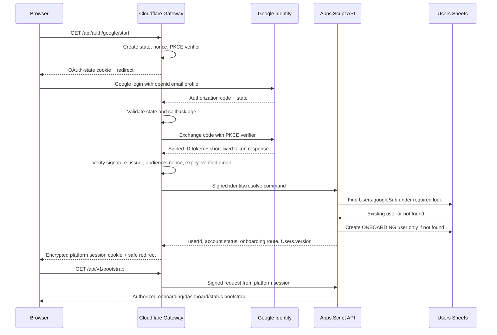
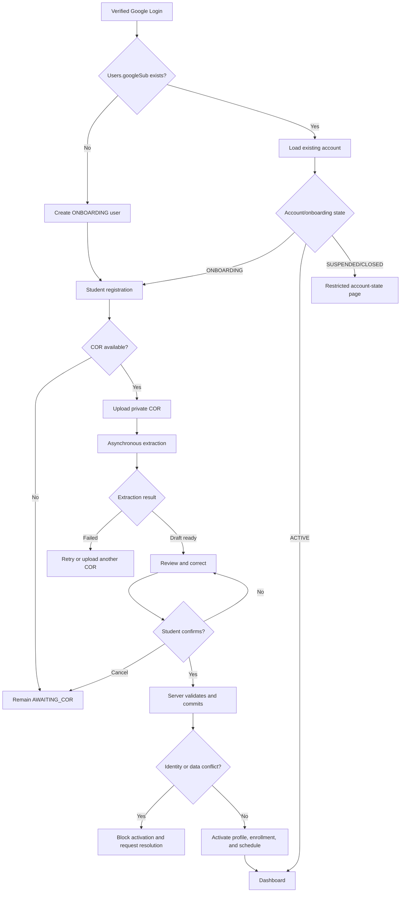
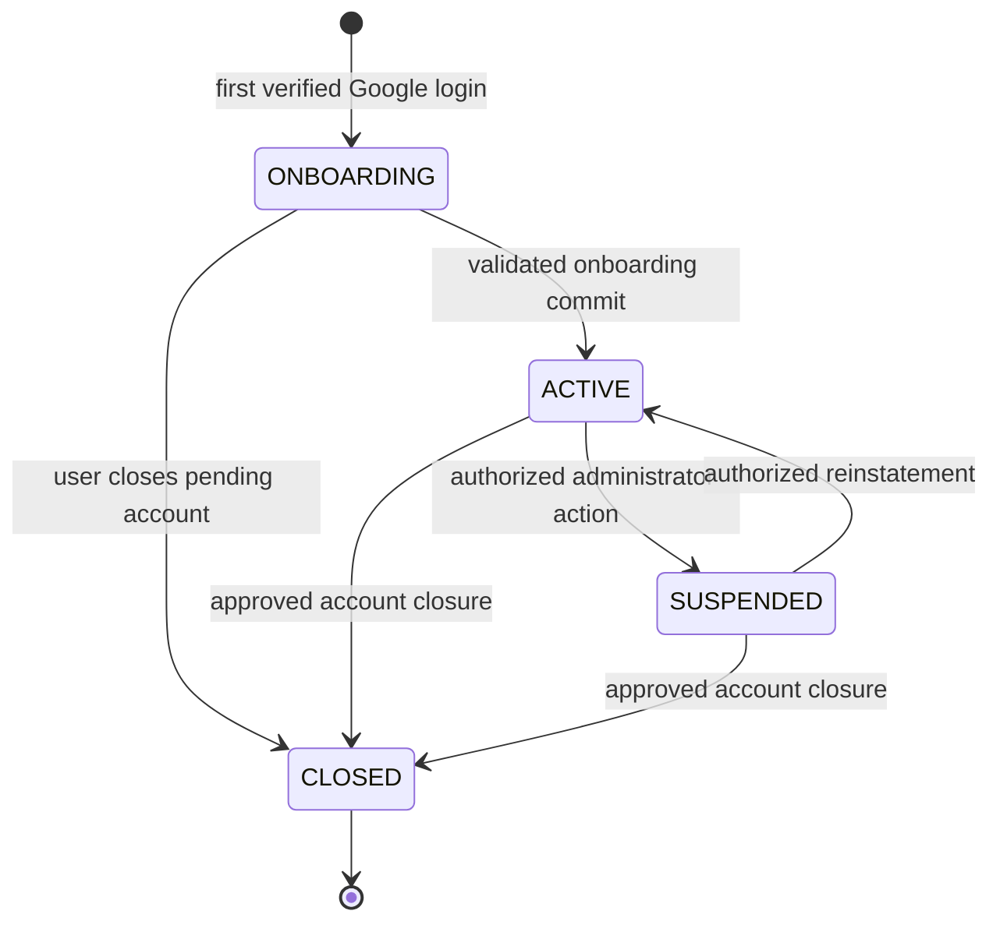
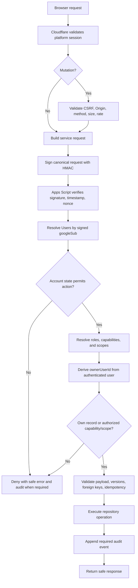

# My-Schedule Authentication and User Identity Architecture

Design date: 2026-08-30  
Status: planning only  
Basis: `AUDIT.md`, `ARCHITECTURE.md`, `DATABASE.md`, and `ACADEMIC_STRUCTURE.md`

## 1. Authentication Architecture

My-Schedule uses Google to prove control of a Google account. It uses its own `Users`, `Student_Profiles`, enrollments, and COR review process to establish application identity and student academic data.

Authentication and authorization are separate:

```text
Google authentication
-> proves Google account control
-> resolves one platform User by Google sub
-> creates an encrypted platform session

Apps Script authorization
-> verifies account state
-> resolves roles/capabilities
-> derives record ownership
-> allows or denies each operation
```

The initial trust path is:

```text
Browser
-> Cloudflare Pages Functions authentication/API gateway
-> signed service request
-> Google Apps Script authorization/business API
-> Google Sheets and private Google Drive
```

### Component Responsibilities

| Component | Responsible for | Must not be trusted for |
|---|---|---|
| Browser | Starting login, carrying secure cookies automatically, rendering state, collecting input | Identity claims, roles, `userId`, record ownership |
| Google Identity | Authenticating the Google account and issuing signed identity claims | Proving QCU student number, program, section, or COR ownership |
| Cloudflare gateway | OAuth callback, ID-token verification, encrypted session cookie, CSRF/origin checks, rate limiting, signed Apps Script requests | Final record authorization based only on cookie/browser claims |
| Apps Script | User lookup, account-state checks, capabilities, scopes, ownership, validation, Sheets/Drive access, audit | Unsigned gateway requests or browser-supplied roles/owners |
| Sheets | Persisting normalized records | Public access, passwords, tokens, or authorization formulas |
| Drive | Private COR/document storage owned by the system account | Public sharing or direct student ownership |

### Separation from Existing Google Integration

The current `/api/google/*` flow requests Classroom scopes, optionally Gmail metadata, obtains a refresh token, and stores Google API tokens in `qcu_google_session`. It is an integration connection, not platform login.

The target design uses separate platform endpoints and a separate cookie, conceptually:

```text
/api/auth/google/start
/api/auth/google/callback
/api/auth/session
/api/auth/logout

qcu_platform_oauth       transient OAuth state
qcu_platform_session     platform authentication session
qcu_google_session       optional Classroom/Gmail integration only
```

Platform login must not require Classroom/Gmail consent. Existing OAuth encryption, canonical-origin, safe-return-path, and cookie helper patterns are reusable after security hardening, but the existing token-bearing 30-day integration cookie must not be renamed or treated as the platform session.

## 2. Google OAuth and Login Flow

Use Google OpenID Connect Authorization Code flow through Cloudflare Pages Functions.

### Login Scopes

Basic platform login requests only:

```text
openid
email
profile
```

Do not request Classroom, Gmail, Drive, Sheets, or offline access for basic login. The callback may use the short-lived access token to obtain standard user information if needed, then discards it. It should not request or retain a Google refresh token for platform sessions.

### Required OAuth Protections

- Authorization Code flow with exact allowlisted redirect URI.
- Cryptographically random `state` and OpenID `nonce`.
- PKCE using `S256`, even though Cloudflare also holds a client secret.
- Short-lived encrypted `HttpOnly`, `Secure`, `SameSite=Lax` OAuth-state cookie.
- One-time state use and a maximum callback age, initially around 10 minutes.
- Strict allowlist for local return paths; no external redirect targets.
- Google ID-token signature verification using cached Google JWKS.
- Validate `iss`, `aud`, `exp`, `iat`, `nonce`, `sub`, `email`, and `email_verified`.
- Reject missing or false `email_verified`.
- Do not treat a userinfo response alone as sufficient ID-token validation.
- Do not log authorization codes, ID tokens, access tokens, or full callback URLs.

### Login Flow



### Account Identification

Google's immutable OpenID `sub` claim is the external identity key.

```text
Google sub
-> Users.googleSub (unique)
-> Users.userId (application primary key)
-> all user-owned application relationships
```

The callback must never find or create an account using email alone. If `googleSub` matches, the existing user is returned even if the verified email changed. The current verified email attribute is updated through a controlled identity service and the change is audited when appropriate.

## 3. User Identity Model

### Google Identity

Google identity contains:

- Immutable Google `sub`.
- Current verified email.
- Google display name and optional picture.
- Hosted-domain claim when Google supplies it.

It proves account control. It does not prove:

- Student number.
- Legal/student name used by QCU.
- Campus, college, program, year, section, adviser, term, subjects, or schedule.
- Ownership or authenticity of an uploaded COR.

### Platform User

`Users` is the application's account record:

- `userId` is the owner key used by application data.
- `googleSub` links the account to Google and is globally unique.
- `email` is a mutable verified attribute.
- `accountStatus` controls account lifecycle.
- `onboardingState` controls registration routing.
- `version` supports optimistic updates and session invalidation.
- `lastLoginAt` records successful login resolution.

Normal frontend responses should not expose `googleSub`.

### Student Profile

`Student_Profiles` contains confirmed or reviewed student data:

- Student number.
- Student/legal name components.
- Preferred name.
- Verification status.
- COR provenance where applicable.

It is linked by `Student_Profiles.userId -> Users.userId`. Google display name may prefill a review field, but it must not silently overwrite reviewed student identity.

### Identity Precedence

| Use | Preferred source | Fallback |
|---|---|---|
| Account identification | `Users.googleSub` | None |
| Data ownership | `Users.userId` | None |
| Login/contact email | Current verified Google email | None |
| Student record name | Confirmed `Student_Profiles` name | Google display name only before confirmation or as neutral account label |
| Greeting | `preferredName`, then confirmed student name | Google display name |
| Student number | Confirmed `Student_Profiles.studentNumber` | Unavailable; never infer |
| Academic context | Active Enrollment graph | Onboarding/renewal state; never infer from email/profile name |

No passwords are requested or stored by My-Schedule.

## 4. Registration and New-User Onboarding

An unknown verified `googleSub` creates only the minimum account needed to resume onboarding safely.

### Initial Records

Under an identity-creation lock, Apps Script:

1. Rechecks that no `Users.googleSub` exists.
2. Creates `Users` with `accountStatus=ONBOARDING` and `onboardingState=AWAITING_COR`.
3. Creates an unverified/inactive `Student_Profiles` row or reserves the one-to-one profile relationship, without treating Google/COR values as trusted.
4. Assigns the base `STUDENT` role needed for owner operations and shared catalog reads.
5. Appends an account-created audit event.
6. Returns the existing row if a retry races with the first creation.

Account creation is idempotent by `googleSub` and request/mutation ID.

### New-User Flow



### Activation Requirements

`Users.accountStatus` changes from `ONBOARDING` to `ACTIVE` only when:

- Required profile fields are reviewed/confirmed.
- Student-number policy passes or the number is validly omitted under an approved policy.
- Campus, program offering, and academic term resolve to active catalog rows.
- Included subjects and meetings pass validation.
- Duplicate student-number checks pass under a lock.
- The COR/manual commit completes idempotently.
- Profile, enrollment, schedule, and entries are consistent.

OCR completion alone never activates an account.

## 5. Existing-User Flow

After every successful Google callback, Apps Script resolves by `googleSub` and returns the current account state.

| Condition | Result |
|---|---|
| `ACTIVE` with active enrollment/schedule | Issue/renew platform session and route to dashboard |
| `ACTIVE` without current active term/enrollment | Keep account active; route to term renewal/COR enrollment flow |
| `ONBOARDING` with no usable import | Resume registration at COR requirement |
| `ONBOARDING` with queued/processing import | Resume processing status using latest owned import |
| `ONBOARDING` with review-ready import | Resume review at current draft version |
| `ONBOARDING` with failed/cancelled import | Explain safe failure and allow retry/new upload |
| `SUSPENDED` | Authenticate identity but deny normal private APIs; show restricted status/support/logout path |
| `CLOSED` | Do not create a replacement account for the same `googleSub`; show closed-account policy path |

The user's session proves account authentication, not entitlement to a dashboard. Apps Script remains authoritative for route state at `/api/v1/bootstrap`.

### Returning from an Interrupted Browser Session

On a valid session:

1. Browser requests `/api/auth/session`, then `/api/v1/bootstrap`.
2. Apps Script rechecks user state and finds the latest non-terminal owned COR record.
3. Frontend routes to processing, review, onboarding start, dashboard, or account-state page.
4. Unsaved browser-only form fields may be lost, but server-saved draft changes remain.

On an expired/invalid session, the user signs in again and resolves to the same `Users` row by `googleSub` before onboarding resumes.

## 6. User Lifecycle and State Model

Use the states already defined in `DATABASE.md`. Additional overlapping states such as `PENDING` or `DEACTIVATED` are unnecessary.

### Account Status



| State | Meaning | Allowed access |
|---|---|---|
| `ONBOARDING` | Authenticated account exists but student activation is incomplete | Own onboarding/COR draft, required catalogs, session/logout, limited profile |
| `ACTIVE` | Core student identity is activated | Normal owner features plus assigned capabilities |
| `SUSPENDED` | Account is temporarily blocked by authorized administration | Authentication status, restricted explanation/support path, logout; no normal private data mutations |
| `CLOSED` | Account is closed and cannot be recreated automatically | Generic closed-account/recovery path and logout only |

`CLOSED` is terminal for normal flows. Reopening, if allowed, requires a separately approved administrator/support process and audit event; it must not happen automatically on Google login.

### Onboarding State

`onboardingState` refines routing without replacing account status:

| State | Meaning | Typical next action |
|---|---|---|
| `AWAITING_COR` | No usable import is ready | Upload COR or use approved manual path |
| `PROCESSING` | Latest import is queued/processing | Poll status, allow safe cancel policy |
| `REVIEW_REQUIRED` | Draft extraction needs student review | Correct and confirm |
| `COMPLETE` | Initial onboarding committed | Dashboard |
| `NOT_REQUIRED` | Approved manual/admin migration path did not require COR | Complete remaining required registration |

If extraction fails or is cancelled, the COR record carries `FAILED` or `CANCELLED`; the user's onboarding state returns to `AWAITING_COR`.

## 7. Role and Permission Model

### Student

Student access is primarily ownership-based. An active student may:

- Read/update permitted fields on their own profile.
- Read their own enrollment history and active academic context.
- Create/read/update/archive their own schedule entries within lifecycle rules.
- Create/read/update/delete their own tasks and notes.
- Upload/read/review/cancel/delete their own eligible COR records/documents.
- Read active shared QCU catalog data and matching announcements.
- Manage their own safe settings and optional Google integrations.

The browser does not send an authoritative owner ID. Apps Script derives `ownerUserId` from the authenticated user.

### Administrator

Administrator is a role assignment plus explicit capabilities and scope. It is not a boolean stored in the session or frontend.

Examples:

- `catalog.write` for scoped campuses/departments/programs.
- `users.status.write` for account status operations.
- `roles.manage` for controlled role grants/revocations.
- `imports.review` for approved import support.
- `documents.read.support` for narrowly authorized COR file support.
- `announcements.write` for scoped notices.
- `audit.read` for authorized audit access.

An administrator does not automatically gain access to student tasks, notes, every profile, or every COR document. Sensitive support reads require the exact capability, a valid scope where applicable, a recorded reason, and an audit event.

### Role Resolution

Apps Script reads active `Role_Assignments`, `Roles`, `Role_Capabilities`, and `Capabilities` for the actor. It filters revoked/expired assignments and applies `GLOBAL`, `CAMPUS`, `DEPARTMENT`, or `PROGRAM` scope matching.

Capabilities are resolved on every privileged request or from a short server-side cache with prompt invalidation. They are not copied into a long-lived browser-trusted session as authoritative claims.

## 8. Data Ownership Rules

| Category | Logical owner | Ownership relation | Normal read/write authority |
|---|---|---|---|
| Google identity | Student controls Google account; platform stores link | `Users.googleSub` -> `Users.userId` | Identity service updates verified attributes; student cannot edit `googleSub` |
| Platform user | Application account associated with student | `Users.userId` | User reads safe own fields; admins manage status only with capability |
| Student profile | Student | `Student_Profiles.userId` | Owner-limited; sensitive support access audited |
| Enrollment | Student | `Enrollments.ownerUserId` | Owner through validated lifecycle; support narrowly authorized |
| Enrollment subjects | Student | Direct owner plus enrollment parent | Owner; catalog matching does not change ownership |
| Schedule and entries | Student | Direct owner plus enrollment/schedule parent | Owner only under normal operations |
| Tasks | Student | `Tasks.ownerUserId` | Owner only |
| Notes | Student | `Notes.ownerUserId` | Owner only |
| COR records/drafts | Student | `COR_Records.ownerUserId` and child parentage | Owner; approved import support only |
| COR Drive documents | Student logically; infrastructure account physically | `Document_Assets.ownerUserId` + COR parent | Served only through authorized Apps Script operations |
| Departments/programs/campuses | QCU/application shared catalog | No student owner | Read by authenticated users; scoped catalog admins write |
| Buildings/rooms/subjects/sections/terms | QCU/application shared catalog | No student owner | Read shared; scoped catalog admins write |
| Announcements | QCU/application | Audience scope fields | Matching students read; authorized publishers write |
| Roles/assignments/account status | Application administration | Scoped admin records | Capability-gated, audited |
| User settings | Student | `User_Settings.ownerUserId` | Owner only |
| System settings | Project/operator | No student owner | Visibility rules; operator/admin capability writes non-secret settings |
| Sheets, Drive, Apps Script deployment | Dedicated infrastructure account | Google resource ownership | Project operators only; never student accounts |

Physical ownership of a Drive file by the infrastructure account does not change logical student ownership or authorize operators to browse files casually. Application access policy and auditing still apply.

## 9. Authorization Strategy

Every private request is authorized independently by Apps Script.



### Owner Authorization

For user-owned targets:

1. Ignore `ownerUserId` or `userId` in the browser payload.
2. Resolve the actor by signed `googleSub`.
3. Load the target by stable ID.
4. Check direct `ownerUserId` and parent ownership consistency.
5. Ensure target lifecycle permits the operation.
6. Return `NOT_FOUND` rather than revealing another user's record existence where appropriate.

For creates, Apps Script writes the resolved actor's `userId`; it never copies an owner from the client.

### Administrative Authorization

For admin operations:

1. Confirm active user/account status.
2. Resolve active role assignments and capabilities.
3. Derive target scope from trusted catalog relations.
4. Match assignment scope to target scope.
5. Prevent self-escalation and unauthorized role delegation.
6. Require expected versions/idempotency for mutations.
7. Require reason text for sensitive support/document actions.
8. Audit success, denial, and material failure.

Hiding an admin page, route, button, or response field is only user experience. It is never an authorization control.

## 10. Session and Token Strategy

### Platform Session Cookie

Use an encrypted and authenticated cookie, conceptually containing:

```json
{
  "sid": "random-session-id",
  "googleSub": "immutable-google-subject",
  "userId": "usr_uuid",
  "email": "current-verified-email",
  "hostedDomain": null,
  "userVersion": 3,
  "issuedAt": 1788062400,
  "lastRenewedAt": 1788062400,
  "idleExpiresAt": 1788091200,
  "absoluteExpiresAt": 1788667200,
  "csrfBinding": "random-secret"
}
```

Cookie attributes:

- `HttpOnly`.
- `Secure` in every non-local environment.
- `SameSite=Lax` or stricter where OAuth flow compatibility permits.
- `Path=/`.
- No JavaScript access.
- Encrypted/authenticated with a dedicated platform session secret, separate from integration cookies and HMAC secrets.
- `Cache-Control: no-store` on session/auth responses.

The cookie may contain `userId` for routing efficiency, but Apps Script still resolves/validates the `googleSub` mapping and ignores browser payload IDs.

### Expiration and Renewal

Practical initial baseline, to be finalized before implementation:

- Idle timeout: approximately 8 hours.
- Absolute lifetime: approximately 7 days.
- Rotate/reseal the cookie after successful authenticated activity at a bounded interval, not every request.
- Renewal requires Apps Script confirmation that `Users.accountStatus` is allowed and `Users.version` still equals the session's `userVersion`.
- Google reauthentication is required after absolute expiry, invalid cookie, account-version mismatch, or session-secret rotation.

`Users.version` provides a practical global revocation generation without adding a session table. Suspending/closing an account or explicitly revoking sessions increments the user row and causes existing cookies to fail the version check. The tradeoff is no per-device session inventory or selective device logout. If device management becomes a requirement, add an explicit session store in a later schema rather than overloading Sheets now.

### CSRF

For every state-changing same-origin endpoint:

- Cloudflare verifies allowed `Origin` and, where reliable, `Referer`.
- Browser sends `X-CSRF-Token` obtained from a same-origin session/bootstrap response.
- Token is cryptographically bound to the encrypted session's `sid`/`csrfBinding`.
- Compare in constant time.
- Reject missing/mismatched tokens before calling Apps Script.
- GET endpoints do not mutate state.

SameSite cookies are defense in depth, not the only CSRF control.

### Google Tokens

- Platform login validates the ID token and discards Google tokens after callback processing.
- Platform session cookie does not contain Google access or refresh tokens.
- Optional Classroom/Gmail refresh/access tokens remain in a separate logical integration session/storage design.
- Optional integration credentials must be bound to the active platform `userId`/`googleSub`, and integration endpoints must reject a platform-user mismatch.
- Disconnecting Classroom/Gmail does not log the user out of My-Schedule.
- Logging out of My-Schedule must remove the browser's ability to reuse an integration credential for another platform user. With the current cookie-carried integration design, that means clearing the integration cookie on platform logout. Revoking the Google authorization grant remains an explicit separate disconnect action.

### Logout

`POST /api/auth/logout`:

1. Requires same-origin/CSRF validation.
2. Clears the platform session cookie even if backend calls fail.
3. Purges or instructs the frontend/service worker to purge the active user's private IndexedDB/cache namespaces.
4. Leaves public static/cache data intact.
5. Does not revoke the user's Google account or password.
6. Clears or disables the local optional-integration credential so a subsequent platform user cannot reuse it.
7. Does not automatically revoke optional Classroom/Gmail authorization at Google unless the user selected disconnect.

For a stateless cookie, local logout cannot invalidate a stolen copy. Global invalidation requires incrementing `Users.version` or rotating the session secret. This limitation must be reflected in support/admin controls.

## 11. Duplicate-Account Handling

### Duplicate Google Login

- Unique constraint: `Users.googleSub`.
- A repeat callback returns the existing user.
- User creation runs under a lock and is idempotent.
- Concurrent first logins cannot create two users for one `googleSub`.

### Email Changes and Collisions

- Email is normalized lowercase and must be verified.
- Same `googleSub` plus changed email updates the existing user's email attribute.
- Email is never used to merge, transfer, or find ownership by itself.
- A verified email already present on another `googleSub` is flagged for support/security review; neither account is automatically merged.

### Duplicate Student Number

- A nonblank normalized student number is unique across active/non-redacted profiles.
- The check occurs during onboarding commit under a lock.
- A duplicate blocks activation and leaves COR/profile data in review/conflict state.
- The response does not disclose the other account's name, email, or details.
- Support resolution follows an approved account-link/transfer policy and is audited.

### Multiple Google Accounts for One Student

A second Google account creates a second `ONBOARDING` user because its `googleSub` is different. When the same student number is confirmed, commit is blocked. My-Schedule does not automatically decide which Google account is legitimate.

Account linking or identity transfer is not part of the initial model. If required, define proof requirements, old-account notification, session revocation, audit history, and a single surviving owner before implementation.

### Google Account Already Linked

One `googleSub` maps to one platform user. It cannot be linked to a second student profile through normal APIs. If a COR's identity conflicts with the existing linked profile, the system blocks commit and requires correction or support review; it must not overwrite the profile or create a second owner.

## 12. Failed and Interrupted Onboarding

| Situation | Account state | Required behavior |
|---|---|---|
| COR missing | `ONBOARDING/AWAITING_COR` | Allow later upload; explain requirement; manual path only if approved |
| Upload rejected | Remains `AWAITING_COR` | Return safe MIME/size/rate error; store no partial trusted data |
| Extraction fails | COR `FAILED`; user returns to `AWAITING_COR` | Preserve sanitized status; allow bounded retry or new upload |
| Extracted information incorrect | `REVIEW_REQUIRED` | Student edits reviewed fields; original source remains unchanged |
| Required field unresolved | `REVIEW_REQUIRED` | Block commit and highlight exact unresolved field |
| Student cancels import | COR `CANCELLED`; user `AWAITING_COR` | Keep/erase source according to retention policy; allow new upload |
| Student cancels registration | User remains `ONBOARDING` or explicitly requests closure | Logout safely; do not silently activate/delete account |
| Browser closes during processing | Server state unchanged | Resume latest owned import after next login/session bootstrap |
| Browser closes during unsaved edits | Last saved draft retained | Warn that only saved corrections persist |
| Login repeats during onboarding | Same `Users` row | Resume by latest authoritative onboarding/import state |
| Commit request repeats | Same result | Use `commitMutationId`/mutation receipt idempotency |
| Student number already exists | User/profile conflict; not active | Block and route to privacy-safe resolution path |
| Google account conflicts with current profile | Existing user remains unchanged | Block replacement/merge; require correction/support |
| User abandons onboarding long term | Remains pending until retention policy | Optional reminder/closure job only after policy approval |

Deleting or closing an onboarding account must also address pending COR files, drafts, audit retention, and the rule preventing immediate duplicate recreation. It is not a simple Sheet row deletion.

## 13. Security Requirements

### Unauthorized and Forged Requests

- Browser calls private APIs only through same-origin Cloudflare routes.
- Cloudflare rejects invalid/expired sessions before forwarding.
- Cloudflare signs a canonical request body with HMAC, timestamp, nonce, and request ID.
- Apps Script rejects unsigned, malformed, expired, or replayed requests.
- The shared HMAC secret is never present in browser code, Sheets, logs, or API responses.
- Apps Script web-app URLs are not treated as secrets; security depends on request verification.

### User-to-User Access

- Derive actor `userId` from authenticated `googleSub`.
- Ignore client owner IDs.
- Check direct and parent ownership for reads and writes.
- Use non-enumerating `NOT_FOUND` responses where appropriate.
- Namespace private browser caches by `userId` and purge on logout.
- Never use the embedded personal timetable as an auth/data fallback.

### Privilege Escalation and Admin Abuse

- Resolve roles/capabilities server-side.
- Reject browser role/admin flags.
- Scope admin capabilities to trusted target relations.
- Prevent self-grant and unauthorized delegation of `roles.manage`.
- Require expected row versions and locks for role/account changes.
- Rate-limit admin APIs and sensitive searches.
- Audit grants, revocations, status changes, sensitive reads, and denials.
- Administrators do not receive Sheets/Drive ownership merely by having an application role.

### Session and OAuth Misuse

- Encrypt/authenticate cookies and rotate secrets through an approved procedure.
- Use short idle/absolute lifetimes and account-version checks.
- Validate state, nonce, PKCE, issuer, audience, expiry, and verified email.
- Use CSP and pinned/self-hosted scripts before private data is exposed, reducing session-riding XSS risk.
- Use `no-store` for private/auth responses.
- Do not place private data or tokens in URLs.
- Do not expose detailed login/account-existence errors to unauthenticated users.

### Request and Payload Integrity

- Strict schema, type, length, enum, and foreign-key validation in Apps Script.
- Expected versions for updates and idempotency keys for retryable mutations.
- File type/size/hash validation for COR upload.
- Safe text rendering for all Google, Sheet, admin, and COR-derived fields.
- Reject unknown fields on sensitive operations rather than silently accepting them.

### Credential and Infrastructure Protection

- OAuth client secret and platform session secret stay in Cloudflare encrypted environment secrets.
- Cloudflare-to-Apps-Script HMAC and OCR/provider secrets stay in appropriate server properties/secrets.
- No credential values in Sheets, repository files, frontend JavaScript, URLs, or audit logs.
- Dedicated infrastructure Google account uses strong MFA, recovery controls, and least-privilege operator access.
- Spreadsheet and Drive sharing are private and periodically reviewed.

### COR and Document Protection

- Files are stored privately under opaque user/import identifiers.
- No public sharing links.
- Browser receives opaque `documentId`, not raw Drive file IDs/paths.
- Owner reads go through Apps Script authorization.
- Support reads require `documents.read.support`, an approved reason, and audit.
- Downloads use short-lived authorized streaming/proxy behavior or another private delivery design, never permanent public URLs.
- Retention/deletion workers update metadata and remove Drive files auditably and retry failed deletions.

## 14. Apps Script Authorization Strategy

Apps Script cannot rely on `Session.getActiveUser()` for Cloudflare service requests because the web app executes as the application owner. It authenticates Cloudflare and resolves the end user from the signed actor identity.

### Signed Service Envelope

Conceptual envelope:

```json
{
  "requestId": "req_uuid",
  "timestamp": "2026-08-30T04:15:00Z",
  "nonce": "one-time-random-value",
  "action": "schedule.entry.update",
  "actor": {
    "googleSub": "immutable-google-subject",
    "userId": "usr_uuid",
    "email": "current-verified-email",
    "hostedDomain": null,
    "sessionId": "random-session-id",
    "userVersion": 3
  },
  "payload": {},
  "signature": "HMAC-of-canonical-envelope"
}
```

The HMAC proves Cloudflare sent the envelope. It does not make `actor.userId` or roles authoritative by itself. Apps Script:

1. Recomputes HMAC in constant time.
2. Checks timestamp against a short replay window.
3. Claims nonce/request ID using `CacheService` plus idempotency records where durability matters.
4. Loads `Users` by `googleSub`.
5. Confirms returned `userId` and current `Users.version`.
6. Checks `accountStatus` and action allowance.
7. Resolves capabilities/scopes or owner policy.
8. Validates target ownership and payload.
9. Executes through repositories.
10. Appends required audit events.

### Account-State Enforcement

| Account state | Apps Script policy |
|---|---|
| `ONBOARDING` | Allow onboarding, own COR draft, required catalogs, bootstrap, logout-related status only |
| `ACTIVE` | Allow owner operations and assigned capabilities |
| `SUSPENDED` | Deny normal private reads/writes and privileged actions; allow minimal account-state/bootstrap handling |
| `CLOSED` | Deny normal operations and prevent automatic user recreation |

### Caching Authorization Data

Short-lived caching may be used for user lookup and capability maps, but:

- Account status and role changes must invalidate relevant cache keys.
- Sensitive writes should re-read authoritative rows under a lock where necessary.
- Cached browser capabilities are presentation hints only.
- A cache miss or cache failure must fall back to authoritative Sheets reads, not allow access.

## 15. Dedicated Infrastructure-Account Strategy

The project infrastructure account and student Google accounts have fundamentally different roles.

### Project Infrastructure Account

The dedicated system account should:

- Own or be the controlled primary operator for the application spreadsheet.
- Own the private Drive root for COR files and extraction artifacts.
- Own/deploy the Apps Script web application executing as the application owner.
- Hold appropriate IAM responsibility for the Google Cloud project/OAuth configuration.
- Receive operational quota/error notifications through an approved monitored channel.
- Use MFA, documented recovery, and at least two approved human recovery/administration paths without sharing passwords.

It must not be used as a student's login identity or ordinary application administrator account.

### Student Google Accounts

Student accounts:

- Authenticate through Google OIDC.
- Are linked logically by `googleSub` to a platform `userId`.
- Do not own or receive sharing access to the shared spreadsheet, Apps Script project, Drive folders, COR files, or OAuth project.
- Do not call Sheets/Drive APIs directly.
- Cannot transfer application records by changing email or sharing Google resources.

### Application Administrators vs Infrastructure Operators

Application administrators are users with scoped `Role_Assignments`. Infrastructure operators control deployment/secrets/resources. These groups may overlap in a small project, but the permissions are independent:

- Application admin role does not grant Google resource ownership.
- Infrastructure access does not automatically grant in-app permission to inspect student data through the UI.
- Sensitive operator access outside the application should be limited, documented, and reviewed.

### Resource Sharing

- Never use "Anyone with the link" on Sheets, Drive folders, or COR files.
- Do not make students spreadsheet editors/viewers.
- Grant human operator access individually and minimally; review it periodically.
- Avoid using a personal developer account as the permanent sole owner.
- Document ownership transfer/recovery before production use.

## 16. QCU Email-Domain Considerations

No QCU-only restriction is enabled by this architecture until the project owner confirms it.

### Configurable Policy

Server-side non-secret configuration should support:

```text
auth.domainPolicy.mode = DISABLED | ALLOWLIST
auth.domainPolicy.allowedDomains = [approved domains]
auth.domainPolicy.enforcement = NEW_USERS_ONLY | ALL_LOGINS
```

Default planning assumption: `DISABLED`, allowing any verified Google account while student identity is separately reviewed through COR/profile onboarding.

If an allowlist is later enabled:

- Cloudflare validates verified email domain and Google's hosted-domain (`hd`) claim according to the approved policy.
- Apps Script independently enforces the configured eligibility result during identity resolution/account creation.
- Frontend text reads policy/configuration and does not hardcode a domain.
- Existing-user/grandfathering behavior is decided before activation.
- Domain match still does not prove student number or COR ownership.
- Changing a user's email/domain never changes `userId` or automatically transfers ownership.

Rejecting personal accounts may exclude legitimate students if QCU account availability is inconsistent. Allowing personal accounts increases duplicate-account and recovery risk. The policy requires a product/institution decision, not a technical guess.

## 17. Threat and Risk Analysis

| Threat/risk | Impact | Required mitigation | Residual/tradeoff |
|---|---|---|---|
| Forged `userId` in request | Cross-user access | Ignore client owner; resolve actor from signed Google sub | Authorization bugs still require tests/review |
| Stolen platform cookie | Account impersonation | Secure HttpOnly cookie, CSP, short expiry, user-version revocation | Stateless design lacks per-device revocation |
| CSRF mutation | Unauthorized actions using victim cookie | Origin/Referer checks, bound CSRF token, SameSite, no GET mutations | Same-origin XSS can bypass CSRF |
| XSS from Sheets/COR/admin text | Session riding/data theft | Text-safe rendering, CSP, pinned dependencies, schema limits | Requires frontend migration before private launch |
| OAuth login CSRF/code interception | Account confusion | State, nonce, PKCE, exact redirect URI, callback age | Misconfiguration remains operational risk |
| Fake/invalid Google token | Unauthorized login | JWKS signature and claim validation | Google/JWKS outage can block login |
| Direct Apps Script invocation | Backend bypass | HMAC, timestamp, nonce, strict router | Apps Script URL remains public but unusable unsigned |
| Replay of signed service request | Duplicate mutation | Short time window, nonce cache, idempotency receipts | Cache is not a durable queue; critical mutations use receipts |
| Role self-escalation | Admin compromise | Server capability/scope checks, no self-grant, lock and audit | Initial admin bootstrap remains sensitive |
| Broad admin access | Privacy exposure | Least privilege, scoped roles, separate document capability | Small-team operators still have infrastructure access |
| Duplicate student number/accounts | Wrong ownership/merge | Unique constraint, locked commit, no automatic merge | Requires human resolution policy |
| Email change | Lost/misassigned ownership | Key by Google sub; update email attribute | Google account recovery itself remains Google's responsibility |
| COR public link/Drive ID exposure | Sensitive document leak | Private Drive, opaque IDs, authorized proxy, audit | Infrastructure operators retain technical access |
| Shared-browser cache leak | Previous student's data visible | User-scoped cache and purge on logout/account switch | Abrupt browser/device compromise remains possible |
| Session secret compromise | All sessions forgeable/decryptable | Secret manager, rotation, incident plan, user-version/session invalidation | Rotation logs out all users |
| Infrastructure-account loss | Backend/resource outage | MFA, recovery, documented ownership and backup | Dedicated account is still a concentration of risk |
| Domain-policy mistake | Legitimate users blocked or ineligible users admitted | Configurable disabled-by-default policy, test mode, dual enforcement | Institutional policy must be accurate |

## 18. Implementation Dependencies

Before authentication implementation begins:

1. Confirm eligible Google accounts and whether a domain restriction is disabled or configured.
2. Provision non-production and production OAuth clients/redirect URIs under the controlled Google Cloud project; do not reuse undocumented personal credentials.
3. Decide whether platform login and Classroom/Gmail integration use separate OAuth client IDs. Separate clients are preferable when operationally manageable; at minimum use separate endpoints, cookies, scopes, and token handling.
4. Provision Cloudflare secrets for OAuth client secret and platform session encryption, with a documented rotation process.
5. Provision Apps Script Properties for the Cloudflare-to-Apps-Script HMAC secret and trusted configuration identifiers.
6. Create the test spreadsheet/Drive resources under the dedicated infrastructure account using the CHUNK 3 schema.
7. Implement/seed `Users`, `Student_Profiles`, roles, capabilities, assignments, audit, and mutation receipt repositories before onboarding features.
8. Define the initial administrator bootstrap and who may grant `roles.manage`.
9. Confirm student-number normalization, uniqueness, conflict resolution, and account-link/transfer policy.
10. Define account closure, onboarding abandonment, COR deletion, audit retention, and support-access policy.
11. Finalize session idle/absolute lifetimes, `Users.version` revocation behavior, and whether per-device sessions are required.
12. Add CSP, safe dynamic rendering, private cache namespacing, and logout purge before exposing student data.
13. Define OAuth/login/privacy copy, privacy contact, and user-visible error/support paths.
14. Build contract tests for login identity resolution, state/nonce/PKCE, cookie validation, account states, ownership, capability scopes, CSRF, HMAC replay, duplicate student numbers, and logout/cache cleanup.
15. Test Cloudflare preview/canonical-origin behavior so OAuth cookies and callbacks remain on one registered origin.

No credential is created or requested in this planning chunk.

## 19. Open Questions

1. May students use personal Google accounts, QCU accounts, or both?
2. If a QCU domain restriction is enabled, what exact domains and `hd` behavior are authoritative?
3. Should a future domain policy apply only to new users or also block existing users?
4. Is student number mandatory for activation, and what normalization/source-of-truth rules apply?
5. Who resolves duplicate student numbers or two Google accounts claiming one student?
6. Is account linking or Google-account transfer required in the initial release?
7. What proof is required to reopen a closed account or transfer ownership after Google account loss?
8. Who is the initial administrator, and who can grant/revoke `roles.manage`?
9. Are administrators global, campus, department, program scoped, or a combination?
10. Should suspended users be allowed to export data or view a reason/support contact?
11. What idle and absolute session lifetimes are acceptable for shared student devices?
12. Is per-device session inventory/selective logout required, or is stateless global revocation sufficient initially?
13. Should platform logout leave Classroom/Gmail connected, prompt for optional disconnect, or always disconnect?
14. How long may incomplete onboarding accounts and failed/cancelled COR files remain?
15. Is manual registration allowed when a student has no COR or extraction repeatedly fails?
16. Which support roles may view original COR documents, and what reason/approval is required?
17. Which dedicated Google account owns production, and what are its recovery/operator access procedures?
18. Are separate OAuth client IDs required for platform login and optional Google integrations?

## CHUNK 6 Handoff: Public Landing Page and Student Entry Experience

CHUNK 6 should design the unauthenticated entry experience and the visible routing states that consume this authentication architecture. It must:

1. Define a public landing page using general QCU/My-Schedule branding, with no personal student data or CCS/BSCS assumptions.
2. Define the `Continue with Google` action, safe return paths, loading/cancel/error/retry states, and domain-neutral account copy.
3. Define routing after authentication for new onboarding users, returning active users, interrupted onboarding, expired sessions, suspended accounts, and closed accounts.
4. Define privacy/terms links and concise consent explanations for Google identity, COR upload, OCR review, private Drive storage, and optional Classroom/Gmail separation.
5. Define behavior for offline/no-network, OAuth configuration failure, callback failure, denied consent, and unavailable backend without exposing account existence or internal errors.
6. Decide which existing public status and Route 4/map information remains available before login while preserving fail-unknown safety semantics.
7. Define accessible responsive page states and a neutral authenticated-loading shell that never flashes Habib, CCS, BSCS, a prior user's schedule, or a department logo.
8. Define logout/account-switch entry behavior and confirmation that private device caches were cleared.
9. Produce entry-flow wireframes/content/state contracts only; do not implement OAuth, pages, APIs, source changes, or credentials until a later chunk authorizes implementation.
