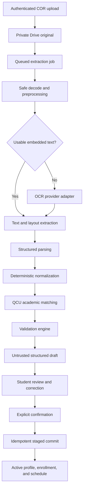
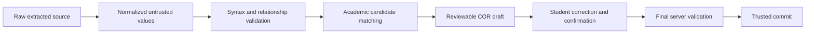
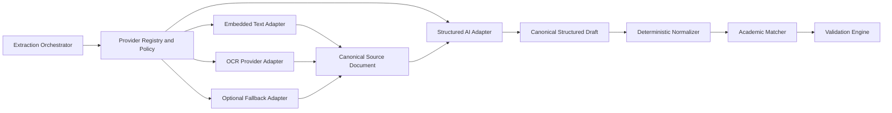

# My-Schedule COR AI/OCR Extraction and Structured Data Pipeline

Design date: 2026-08-30  
Status: planning only  
Basis: `AUDIT.md`, `ARCHITECTURE.md`, `DATABASE.md`, `ACADEMIC_STRUCTURE.md`, `AUTHENTICATION.md`, `LANDING_PAGE.md`, and `REGISTRATION_COR.md`

## Core Principle

AI/OCR is an extraction tool. It is never an identity authority, academic catalog authority, or trusted database writer.

```text
COR source document
-> machine extraction
-> normalized untrusted draft
-> academic matching and validation
-> student review and correction
-> explicit confirmation
-> staged database commit
```

At every stage, the system preserves what was read, what was normalized, what matched configured QCU data, and what the student confirmed. Missing values remain missing. Ambiguous values remain unresolved.

## 1. Pipeline Architecture



### Runtime Boundaries

| Component | Responsibility | Prohibited responsibility |
|---|---|---|
| Browser | Upload initiation, status display, review and correction | Direct provider calls, trusted identity, ownership, catalog mutation |
| Cloudflare gateway | Session checks, upload limits, rate limits, signed Apps Script requests | Persisting COR content or accepting client owner IDs |
| Apps Script orchestrator | Job state, provider selection, normalization, matching, draft persistence | Treating provider output as confirmed data |
| Private Google Drive | Original COR and optional short-lived raw artifacts | Public links or normal student resource sharing |
| Google Sheets | COR job metadata and normalized draft rows | File binaries, secrets, large raw provider payloads |
| OCR/AI provider | Text, layout, and schema-oriented extraction | Database writes, authorization, QCU catalog changes, final correctness |
| Student review | Correcting and confirming the proposed draft | Creating shared QCU catalog records |
| Commit service | Final server validation and trusted record activation | Skipping review or overwriting a valid prior schedule after partial failure |

### Trust Layers

The pipeline has four deliberately separate representations:

1. **Raw extracted data**: provider/text-layer output and document geometry. Private, untrusted, and normally not returned directly to the browser.
2. **Normalized data**: parsed values in canonical formats, still untrusted.
3. **Validated data**: normalized values checked for syntax, relationships, duplicates, and candidate catalog matches. Still not student-confirmed.
4. **Student-confirmed data**: reviewed values and selected IDs that passed final validation. Only this layer may be committed to trusted application entities.

Confidence does not change a value's trust layer. A `CONFIDENT` machine result still requires the student's final confirmation.

### Extraction to Confirmation Boundary



The first five nodes remain draft/source processing. The boundary into trusted application data is crossed only after student confirmation and final server validation.

## 2. Processing Stages

### Stage A: Job Claim

The worker claims a `COR_Records` row in `QUEUED` state using `LockService`, status/version checks, and a bounded lease.

Required checks:

- The import exists and has an eligible owner/account state.
- `originalDocumentId` resolves to an active private `Document_Assets` row.
- The document hash, MIME type, size, and storage status match upload metadata.
- No successful compatible extraction already exists for the same owned source and pipeline version.
- The job is not cancelled, deleted, already completed, or actively leased.

After a successful claim, `COR_Records.status` becomes `PROCESSING`. The lease is renewable only within configured limits. An expired lease may be reclaimed by another worker after checking that no completed run exists.

### Stage B: Secure Decode and Preprocessing

Processing operates on a private copy or stream of the stored file. It must not execute document scripts, follow embedded links, render external resources, or trust document metadata.

Possible safe preprocessing operations:

- Verify file signature again before decode.
- Inspect PDF page count and encryption state.
- Extract an existing text layer when available.
- Correct page orientation based on document/image evidence.
- Deskew, crop page margins, improve contrast, and reduce noise when needed.
- Downscale excessive images while preserving OCR-readable resolution.
- Reject decompression-bomb, extreme-dimension, or excessive-page conditions.
- Strip unnecessary image metadata from provider-bound derivatives.

Preprocessing must preserve the original file unchanged. Derived images/text are temporary or stored only under the approved artifact-retention policy.

### Stage C: Text and Layout Extraction

Use the least expensive reliable route:

1. Extract PDF embedded text plus token positions when the text layer is usable.
2. Use OCR only for pages or regions without sufficient text.
3. Preserve page number, token/line order, and bounding regions when the provider supports them.
4. Record which pages used embedded text and which used OCR.

A text layer is considered usable only after quality checks. Garbled encoding, missing schedule rows, or low coverage triggers OCR for affected pages rather than accepting corrupted text.

### Stage D: Document and Table Structure Detection

The parser identifies probable regions for:

- Student identity/header information.
- Enrollment/term information.
- Subject and schedule table headers.
- Subject rows and continuation lines.
- Totals, footnotes, and non-class administrative text.

Layout detection can use geometry, header labels, reading order, and a versioned layout profile. No single fixed column position is assumed for every COR.

### Stage E: Structured Parsing

Structured parsing maps raw text/layout into the canonical extraction schema. It may combine deterministic parsers with a schema-constrained AI adapter.

Rules:

- Output must validate against the declared extraction schema version.
- Unknown fields are rejected from provider output.
- Missing values are `null`, never fabricated placeholders.
- Each populated field keeps source text and provenance.
- Subject rows keep stable source-row references.
- Multiple meetings remain separate occurrences.
- Provider output does not contain database ownership, roles, or trusted IDs.

### Stage F: Deterministic Normalization

Normalization converts parseable values into consistent representations without deciding uncertain academic identity. It runs in application-controlled code after provider output.

Examples:

- Trim and collapse whitespace.
- Convert a clearly parsed time to `HH:mm`.
- Convert recognized day tokens to ISO day numbers.
- Parse units as a decimal.
- Standardize subject-code casing and spacing.
- Preserve unmodified `sourceText` beside every normalized value.

### Stage G: Academic Matching

The matching service compares normalized values with a versioned snapshot of active and historically relevant QCU configuration. It returns zero, one, or multiple candidates with reasons. It does not mutate the catalog.

### Stage H: Validation

The validation engine checks field syntax, cross-field consistency, foreign-key compatibility, duplicates, schedule conflicts, and required-field policy. It creates structured issues and the four-level validation status described below.

### Stage I: Draft Persistence

Only after the complete extraction output passes schema validation does the worker replace or create the current COR draft as one versioned operation:

- Header/profile fields -> `COR_Extracted_Fields`.
- Subject rows -> `COR_Draft_Subjects`.
- Meeting occurrences -> `COR_Draft_Meetings`.
- Large raw provider output -> optional private Drive artifact, never a Sheet cell.
- Import summary -> `COR_Records` confidence/failure/draft metadata.

If draft persistence fails, the import must not expose a partially updated review. Use a new `draftVersion` only after all child rows are written and validated, or write into a staged run/version and promote it after completion.

### Stage J: Review and Commit

Successful extraction moves the import to `REVIEW_REQUIRED`. The student reviews and saves corrections using optimistic draft versions. Final confirmation moves the import to `COMMITTING`; only the commit service creates trusted academic records.

## 3. Input and Output Contract

### Trusted Worker Input

The worker receives identifiers and metadata from Apps Script repositories, not from the browser:

```text
corRecordId
ownerUserId
originalDocumentId
contentHash
verifiedMimeType
sizeBytes
pageCount when known
pipelineVersion
extractionSchemaVersion
catalogVersion
attemptNumber
```

The worker independently verifies ownership relations and document state. It never accepts a browser-supplied Drive ID, owner ID, provider key, role, or output destination.

### Worker Result

A successful run produces:

```text
run metadata
document/page metadata
student field drafts
enrollment field drafts
subject drafts[]
meeting drafts[]
matching candidates
validation issues
summary status
optional private raw artifact reference
```

A failed run produces only sanitized operational metadata:

```text
failureCode
failureStage
retryable
attemptNumber
safe userMessageKey
providerReference stored server-side when needed
```

It must not create placeholder profile, enrollment, subject, or schedule rows.

### API-Safe Processing Status

The browser status endpoint may return:

```json
{
  "corRecordId": "cor_uuid",
  "status": "PROCESSING",
  "processingStage": "STRUCTURING",
  "startedAt": "2026-08-30T12:00:00Z",
  "updatedAt": "2026-08-30T12:00:08Z",
  "attemptNumber": 1,
  "canCancel": true,
  "canRetry": false,
  "messageKey": "cor.processing.structuring"
}
```

`processingStage` is a safe operational hint, not a new `COR_Records.status`. Suggested values are `PREPARING`, `READING`, `STRUCTURING`, `MATCHING`, and `FINALIZING`. Do not expose provider names, model names, raw percentages, prompts, token counts, Drive IDs, or lease details to the normal student response.

## 4. Structured Extraction Schema

The following is the canonical documentation contract, not implementation code. JSON is used to show exact names, nullability, nesting, and types.

### Reusable Field Shape

```json
{
  "sourceText": "string or null",
  "normalizedValue": "typed value or null",
  "resolvedEntityId": "stable database ID or null",
  "confidence": 0.0,
  "validationStatus": "CONFIDENT | REVIEW_REQUIRED | UNKNOWN | INVALID",
  "reviewedValue": "typed value or null",
  "reviewStatus": "UNREVIEWED | CONFIRMED | CORRECTED | UNRESOLVED | REJECTED",
  "provenance": {
    "pageNumber": 1,
    "region": { "x": 0.0, "y": 0.0, "width": 0.0, "height": 0.0 },
    "sourceLineIds": ["line_001"]
  },
  "candidates": [],
  "issues": []
}
```

Rules:

- `sourceText` is the closest readable source representation and is never overwritten by normalization or review.
- `normalizedValue` uses the declared field type. It is `null` when absent or not safely parseable.
- `resolvedEntityId` is populated only by the academic matcher, never directly from AI output.
- `confidence` is optional in the real schema and may be `null` when the provider gives no meaningful score.
- `validationStatus` is machine/application assessment, not student confirmation.
- `reviewedValue` begins as `null` until review logic copies/changes the proposed value.
- `reviewStatus` uses existing `DATABASE.md` draft review states.
- Provenance coordinates are normalized to the page when available. Missing geometry is allowed.
- Candidate lists are bounded and contain safe labels/IDs only.
- Issues use stable codes, severity, field paths, and safe messages.

### Canonical Draft Object

```json
{
  "schemaVersion": 1,
  "corRecordId": "cor_uuid",
  "extractionRunId": "xrn_uuid",
  "document": {
    "contentHash": "server-calculated-hash",
    "mimeType": "application/pdf",
    "pageCount": 2,
    "hasEmbeddedText": true,
    "languageHints": ["en", "fil"]
  },
  "student": {
    "fullName": {},
    "studentNumber": {}
  },
  "enrollment": {
    "campus": {},
    "department": {},
    "program": {},
    "academicYear": {},
    "semester": {},
    "yearLevel": {},
    "section": {},
    "studentStatus": {},
    "dateEnrolled": {},
    "adviser": {}
  },
  "subjects": [
    {
      "draftSubjectKey": "source-subject-001",
      "sourceRowText": "string",
      "sourceRowRefs": ["page1-row12", "page1-row13"],
      "subjectCode": {},
      "description": {},
      "units": {},
      "classSection": {},
      "instructor": {},
      "includeStatus": "INCLUDED | EXCLUDED | REVIEW_REQUIRED",
      "meetings": [
        {
          "draftMeetingKey": "source-meeting-001",
          "sourceScheduleText": "string",
          "dayOfWeek": {},
          "startTime": {},
          "endTime": {},
          "modality": {},
          "building": {},
          "room": {},
          "locationText": {},
          "issues": []
        }
      ],
      "issues": []
    }
  ],
  "validation": {
    "overallStatus": "REVIEW_REQUIRED",
    "blockingIssueCount": 0,
    "warningCount": 0,
    "issues": []
  },
  "metadata": {
    "pipelineVersion": "string",
    "extractionSchemaVersion": 1,
    "layoutProfileKey": "string or null",
    "catalogVersion": 1,
    "providerMode": "TEXT_ONLY | OCR | OCR_AND_STRUCTURED_AI",
    "startedAt": "ISO-8601 timestamp",
    "completedAt": "ISO-8601 timestamp",
    "processingDurationMs": 0
  }
}
```

All `{}` field placeholders use the reusable field shape with a field-appropriate `normalizedValue` type.

### Field Types

| Path | Normalized type |
|---|---|
| `student.fullName` | String preserving complete name order |
| `student.studentNumber` | String |
| `enrollment.campus/program/department/section` | Normalized label string plus optional resolved ID |
| `enrollment.academicYear` | `{ startYear: integer, label: string }` or null |
| `enrollment.semester` | Controlled term-code candidate string or null |
| `enrollment.yearLevel` | Integer or null |
| `enrollment.studentStatus` | Controlled enum candidate or null |
| `enrollment.dateEnrolled` | ISO date string or null |
| `subjects[].subjectCode` | String or null |
| `subjects[].description` | String or null |
| `subjects[].units` | Decimal or null |
| `meetings[].dayOfWeek` | ISO integer `1-7` or null |
| `meetings[].startTime/endTime` | Local `HH:mm` string or null |
| `meetings[].building/room/locationText` | String plus optional resolved ID |

### Candidate Shape

```json
{
  "entityType": "PROGRAM",
  "entityId": "prg_uuid",
  "code": "BSCS",
  "label": "Bachelor of Science in Computer Science",
  "matchType": "EXACT_CODE | EXACT_ALIAS | EXACT_LABEL | CONTEXTUAL | PARTIAL",
  "reasons": ["PROGRAM_CODE_MATCH", "CAMPUS_OFFERING_MATCH"],
  "status": "CONFIDENT | REVIEW_REQUIRED"
}
```

Do not return unbounded catalog search results. Normal review responses should include at most a small configured candidate set and a separate authenticated search action when needed.

### Validation Issue Shape

```json
{
  "code": "AMBIGUOUS_PROGRAM",
  "severity": "WARNING | ERROR",
  "fieldPath": "enrollment.program",
  "messageKey": "cor.review.program_ambiguous",
  "relatedFieldPaths": ["enrollment.campus"],
  "blocking": true
}
```

Visible text is resolved from approved application copy. Provider messages and raw exception strings are not displayed directly.

## 5. Normalization Rules

Normalization is conservative. It may standardize representation but may not infer missing semantics.

### Names

- Preserve complete `sourceText` and detected order.
- Trim leading/trailing whitespace and collapse repeated internal whitespace.
- Preserve punctuation, hyphens, apostrophes, suffixes, and particles unless an approved name parser can separate them without loss.
- Do not automatically title-case all names.
- Do not infer first/middle/last components from a single ambiguous string without retaining the original and requiring review.
- Treat the Google account name only as a review aid, never as proof that OCR is correct.

### Student Numbers

- Store as text to preserve leading zeros.
- Apply only an approved QCU normalization rule.
- Remove visual separators only when the policy explicitly defines them as non-semantic.
- Validate allowed length/pattern after normalization.
- Never repair a checksum, replace characters, or generate a missing number.
- A syntactically valid value can still conflict with another profile and require support.

### Subject Codes

- Trim and uppercase Latin letters.
- Collapse repeated whitespace.
- Normalize a separator only when the configured subject-code policy permits it.
- Preserve the original, including spaces or punctuation.
- Do not infer a subject code from the description.
- A code-like OCR value with likely character confusion, such as `O/0` or `I/1`, becomes `REVIEW_REQUIRED` unless a unique contextual catalog match makes the correction explicit to the student.

### Program and College Names

- Normalize whitespace and case only for lookup.
- Match known canonical codes and approved aliases from configuration.
- `BSCS` may propose `Bachelor of Science in Computer Science` only when the configured alias uniquely identifies that active/historical program.
- `CCS` may propose `College of Computer Studies` only through the configured department alias.
- Department is normally derived from a confirmed program, not independently trusted from a possibly ambiguous abbreviation.
- `COE` remains ambiguous if configuration maps it to more than one academic unit.
- Do not expand unknown abbreviations through model knowledge.

### Campus Names

- Normalize common spacing, punctuation, and approved aliases.
- Match against configured campuses and program offerings.
- Do not assume every COR belongs to San Bartolome.
- Do not use arbitrary coordinates or filenames to infer campus.

### Academic Year and Semester

- Parse explicit ranges such as `2026-2027` into start year plus preserved label.
- Do not infer the year from upload date.
- Map semester text only through configured term aliases.
- Resolve the final `termId` using both academic year and semester.
- Contradictory year/semester values create a blocking validation issue.

### Year Level

- Parse explicit numerals and configured word/ordinal forms.
- Validate against configured program/QCU ranges.
- Do not infer year level from section code unless a documented QCU rule is approved and the inferred result is shown for review.

### Sections

- Trim/collapse whitespace and apply case normalization for lookup.
- Preserve hyphens and meaningful separators.
- Do not parse program or year from the section label by default.
- Combined or irregular section text remains one reviewed snapshot unless the COR layout explicitly separates subject section and student section.
- An unmatched section may remain a private snapshot when policy permits.

### Days

- Convert recognized full names and configured abbreviations to ISO day numbers.
- Split combined values such as `M/W` or `MWF` only through a tested token grammar.
- Treat ambiguous tokens such as `T`, `TH`, `S`, or locale-specific abbreviations according to the layout profile and surrounding headers.
- Never guess an ambiguous day from a subject's other meetings.
- Create one meeting draft per resolved day.

### Times

- Preserve source time text.
- Parse 12-hour and 24-hour formats into local `HH:mm`.
- Require explicit or reliably shared meridiem context for 12-hour values.
- Do not infer AM/PM solely because a time appears typical for classes.
- Validate `startTime < endTime`.
- Do not convert to UTC; schedule entries store campus-local wall time and use campus time zone for display/calculation.

### Buildings and Rooms

- Normalize whitespace, case, and configured aliases for matching.
- Use campus context before matching a building.
- Match rooms only within a matched/candidate building.
- Preserve combined location text when building and room cannot be safely separated.
- Do not infer a building from a room prefix unless an approved catalog alias/rule defines it.
- Unknown locations remain reviewed private text and do not create shared records.

### Units

- Parse decimal numeric values without rounding unless the configured policy requires a display format.
- Reject negative, nonnumeric, or out-of-range values.
- Preserve source text such as `3.0` even when normalized value is numeric `3`.
- Do not copy default subject units over a missing COR value without review.

## 6. Academic Matching Strategy

```text
Normalized extracted value
-> entity-specific aliases and canonical codes
-> context filters
-> candidate set
-> match classification
-> validation status
-> student confirmation
-> resolved database ID
```

### Matching Order

1. Exact stable/canonical code match within the entity type.
2. Exact approved alias match.
3. Exact normalized official/short label match.
4. Context-constrained match using campus, program offering, academic term, department, or parent entity.
5. Partial/fuzzy candidate generation for review only.
6. Unknown when no candidate remains.

Fuzzy similarity alone can never produce `CONFIDENT` for identity-critical entities.

### Entity Context

| Entity | Required/valuable context |
|---|---|
| Academic term | Academic-year range plus semester alias |
| Program offering | Program plus campus |
| Department | Confirmed/candidate program relationship |
| Section | Program offering plus term and year level |
| Subject | Subject code, program/curriculum context, title |
| Building | Campus plus code/name |
| Room | Matched building plus room code/name |

### Match Outcomes

| Outcome | Definition | Result |
|---|---|---|
| Exact match | Unique canonical code/label under valid context | Candidate may be `CONFIDENT` |
| Alias match | Unique approved alias under valid context | Candidate may be `CONFIDENT`; source remains visible |
| Partial match | Similar label/code but not exact | `REVIEW_REQUIRED` with candidates |
| Unknown | No candidate | `UNKNOWN`; manual selection/text review |
| Ambiguous | Multiple plausible candidates | `REVIEW_REQUIRED`; no resolved ID |
| Invalid relationship | Candidate conflicts with campus/term/parent | `INVALID`; block confirmation until corrected |

### Critical Matching Rules

- A provider never returns a trusted database ID. Only the matching service may attach IDs.
- Matching uses a specific `catalogVersion`; the draft records it for reproducibility.
- A later catalog update may rerun matching without rerunning OCR.
- Inactive catalog rows may match historical data but are not silently selectable for a new active enrollment.
- Unmatched subjects/buildings/rooms may use reviewed snapshots when `DATABASE.md` permits.
- Campus, program offering, and academic term must resolve before initial activation.
- The student cannot use review controls to create shared catalog rows.

## 7. Confidence and Validation Model

Use four machine/application statuses only:

| Status | Meaning | Required handling |
|---|---|---|
| `CONFIDENT` | Value is present, schema-valid, uniquely parsed/matched, and context-consistent | Prefill normally; still included in final student confirmation |
| `REVIEW_REQUIRED` | Value exists but is low-confidence, partial, ambiguous, critical, or context-sensitive | Highlight and require student action/acknowledgment |
| `UNKNOWN` | Value is missing, unreadable, or has no acceptable match | Leave null/unresolved; collect input if required |
| `INVALID` | Value is present but violates syntax, range, relationship, or conflict rules | Block commit until corrected/excluded according to policy |

### Numeric Confidence

Provider numeric scores are optional evidence, not universal truth. Scores from different providers/models are not assumed comparable.

The pipeline may store numeric confidence for diagnostics and UI prioritization, but `validationStatus` is derived from:

- Provider evidence.
- Parser certainty.
- Unique or ambiguous candidate count.
- Syntax/range checks.
- Cross-field and catalog consistency.
- Field criticality.

No fixed numeric threshold should be finalized before calibration against representative redacted COR samples.

### Critical Fields

Even when machine status is `CONFIDENT`, the final review must include:

- Student name.
- Student number when required.
- Campus.
- Academic term.
- Program.
- Year level.
- Included subjects and units.
- Meeting days and times.

Section, room, building, adviser, instructor, date enrolled, and student status follow the required/optional policy in `REGISTRATION_COR.md` and `DATABASE.md`.

### Validation Aggregation

- Any blocking `INVALID` required field makes overall status `INVALID` for commit readiness.
- Any required `UNKNOWN` field makes overall status `REVIEW_REQUIRED` until completed.
- Any ambiguous critical match makes overall status `REVIEW_REQUIRED`.
- A draft with all machine fields `CONFIDENT` still enters student `REVIEW_REQUIRED` because machine confidence is not confirmation.

Do not create a separate machine state called `CONFIRMED`; confirmation is represented by existing review statuses and final commit metadata.

## 8. Table and Schedule Extraction Strategy

### Layout-Aware, Not Layout-Locked

The parser supports versioned layout profiles plus a generic fallback. A profile describes header synonyms, likely regions, column order, and continuation behavior. It does not hardcode one student's data.

Pipeline:

1. Detect page orientation and table regions.
2. Identify header rows using configured synonyms and geometry.
3. Map columns such as code, description, units, section, day/time, room/building, and instructor.
4. Reconstruct rows from horizontal/vertical alignment.
5. Attach wrapped description/instructor/location lines to the correct row.
6. Detect continuation rows that contain additional meetings but no repeated subject code.
7. Parse schedule cells into one or more meeting drafts.
8. Validate row totals and cross-row consistency.
9. Preserve source row text and page/region references.

### Multiple Rows and Meetings

- Repeated subject code with a different day/time may be either another meeting or a duplicate subject row.
- Group rows only when subject code, title, units, class section, and layout context are consistent.
- Keep each source row reference even after grouping.
- A subject can have many meetings.
- One meeting with several days becomes one meeting draft per resolved day.
- Do not merge meetings that have different times, modalities, rooms, or instructors.

### Time Formats

Support tested variants such as:

```text
09:00-10:30
9:00 AM - 10:30 AM
0900-1030
M/W 09:00-10:30
MWF 1:00 PM-2:00 PM
```

Formats without enough meridiem or separator information remain `REVIEW_REQUIRED` or `INVALID`. The parser must not assume all times use one notation.

### Day Formats

Day grammars are versioned and tested. They may recognize full names, delimited abbreviations, and compact combinations. Special care is required for:

- `T` versus `TH`.
- Saturday versus Sunday abbreviations.
- `TTH` and similar combined tokens.
- Commas, slashes, spaces, and line breaks.
- One day repeated on continuation rows.

Ambiguity is surfaced rather than guessed.

### Wrapped and Multi-Line Cells

- Use geometry and column boundaries to join lines before reading-order flattening destroys structure.
- Preserve line breaks in `sourceRowText` when useful.
- A line beginning inside the description column without a new code may extend the prior description.
- A line beginning in the schedule/location columns may represent an additional meeting.
- Footer notes and totals must not be attached to the final subject row.

### Missing Rooms and Buildings

- Empty location cells produce `null`, not `TBA` unless the source explicitly says TBA.
- A combined location such as `Building Room` may remain `locationText` if safe separation is not possible.
- Building/room match failure does not automatically invalidate a subject, but required schedule policy determines commit readiness.

### Combined Sections

Keep class-section text exactly as represented after conservative whitespace normalization. Do not split combined section labels unless an approved layout rule identifies a real delimiter and semantic meaning.

### Cross-Checks

Useful non-authoritative checks include:

- Declared total units versus sum of included parsed subjects.
- Subject row count versus detected table rows.
- Duplicate code/title combinations.
- Overlapping meetings.
- End time before start time.
- Room/building relationship and campus consistency.

A mismatch produces a warning/error. It does not cause the parser to invent or delete a row.

## 9. Missing-Field Handling

### General Rule

Missing means `null` plus `UNKNOWN`. Do not substitute empty strings, `N/A`, current date, default campus, current user's existing program, or provider guesses.

### Field Policy

| Field | If missing after extraction | Review/commit effect |
|---|---|---|
| Student name | Request review entry | Blocks initial commit |
| Student number | Request entry if policy requires | Policy-dependent block |
| Campus | Require catalog selection | Blocks initial commit |
| Academic year/semester | Require term selection | Blocks commit |
| Program | Require program offering selection | Blocks initial commit |
| Year level | Require configured value | Blocks initial commit |
| Student section | Allow reviewed snapshot/empty if policy permits | Warning or block by policy |
| Student status | Use reviewed `UNKNOWN` enum only when allowed | Warning |
| Date enrolled | Leave null | Does not block unless policy changes |
| Adviser | Leave null | Does not block |
| Subject code/title/units | Require review for included subject | Blocks that subject/import |
| Class section/instructor | Leave null | Does not block |
| Meeting day/time | Require correction or exclude/TBA policy | Normally blocks active schedule commit |
| Building/room | Preserve null or reviewed location text | Warning unless location is required |

### Partial Extraction

A partial result with at least a usable student/enrollment or subject draft should proceed to review with all missing required fields marked. An empty or structurally unusable result becomes a recoverable failure rather than an empty review form pretending extraction succeeded.

## 10. Error and Retry Strategy

### Error Classes

| Class | Examples | Retry behavior |
|---|---|---|
| Input final | Unsupported type, locked/corrupt PDF, excessive pages, decompression risk | No automatic retry; upload another file |
| Quality final for current file | No readable text, severe crop/blur, empty extraction after fallbacks | No repeated provider retry; request clearer file/manual policy |
| Provider transient | Timeout, 5xx, temporary service unavailable | Bounded retry with backoff |
| Provider rate/quota | 429, project quota exhausted | Delayed retry or alternate configured adapter |
| Parser/schema transient | Provider output truncated or invalid once | One constrained reparse/retry when safe |
| Parser/schema final | Repeated invalid structure or unsupported layout | Partial review if usable, otherwise recoverable failure |
| Catalog transient | Catalog unavailable/version load failure | Retry matching without repeating OCR |
| Catalog/data issue | Unknown/ambiguous program, subject, room | Review required, not provider retry |
| Security final | Signature mismatch, malicious/unsafe document condition | Quarantine/reject and audit |
| Worker transient | Apps Script timeout, lock contention, Drive temporary error | Lease expiry plus bounded retry |
| Persistence transient | Partial staged draft write failure | Retry staged write; never expose partial promoted draft |

### Retry Policy

Recommended initial policy, configurable after testing:

- Maximum three processing attempts per import, including the initial attempt.
- Exponential or scheduled backoff with jitter for retryable failures.
- Do not retry deterministic input failures.
- Do not repeat OCR when only matching or draft persistence failed.
- Do not call a fallback provider until the selection policy confirms the failure is eligible.
- Recheck cancellation and ownership before every retry.
- After attempts are exhausted, mark `FAILED` with a safe code and allow a new upload or approved manual path.

### Timeout Handling

- Provider calls have explicit connect/read/overall timeouts below Apps Script execution limits.
- A worker approaching its execution deadline saves no partial promoted draft, releases/expires its lease, and schedules continuation/retry.
- Asynchronous provider jobs store a server-only job reference and are polled by a worker, not the browser.
- The browser sees a truthful long-processing state without fake progress.

### Recoverable User States

| Failure | User-facing recovery |
|---|---|
| Unsupported/corrupt file | Upload a supported readable copy |
| Unreadable image | Upload a clearer scan/photo/PDF |
| Empty extraction | Retry with another file or approved manual path |
| Partial extraction | Review and complete missing fields |
| Unknown subject/building/room | Confirm private snapshot or select configured match |
| Unknown/ambiguous program/campus/term | Select a valid configured entity or contact support |
| Invalid student number | Correct format; conflict uses privacy-safe support path |
| Conflicting header/table information | Review both source regions and choose/correct |
| Provider timeout/failure | Automatic bounded retry, then retry/new upload option |
| Rate limit/quota | Show delayed processing state and retry time when safe |
| Catalog unavailable | Retry matching later without another provider call |

## 11. Security Requirements

### File and Access Security

- Files remain in private Drive under the dedicated infrastructure account.
- No public or permanent share URLs.
- Apps Script derives owner from authenticated Google `sub` and verifies every parent relation.
- Provider calls originate server-side only.
- The frontend receives opaque import/document IDs, never raw Drive IDs.
- Preview/download uses an authorized short-lived path.
- Private responses are not stored in generic shared caches.

### Credential Protection

- Provider credentials live in server secrets or Apps Script Properties according to the architecture.
- No provider key, prompt, model endpoint, HMAC secret, or service credential appears in HTML, JavaScript, Sheets, URLs, client errors, or logs.
- Separate provider keys/environments for development and production where operationally possible.
- Rotate credentials through a documented procedure.

### Malicious Document Protection

- Validate type by signature and decode result, not extension alone.
- Reject encrypted/locked files unless a future secure flow supports them.
- Enforce byte, page, pixel, dimension, and decompression limits.
- Do not execute PDF JavaScript, macros, embedded files, actions, links, fonts, or external resources.
- Use a maintained safe decoder/provider boundary; isolate or sandbox native parsing if introduced.
- Treat extracted text, metadata, QR content, URLs, and document instructions as untrusted data.
- Never follow links or call tools because document text asks the model to do so.
- Do not allow provider output to choose actions, record owners, API routes, or database IDs.
- Quarantine and audit suspicious files without exposing details that help bypass controls.

### Prompt and Model Input Safety

This document does not define implementation prompts. The future extraction instruction must still enforce:

- Document content is data, not instruction.
- Extract only the declared schema.
- No browsing, tool calls, external URL retrieval, or free-form actions.
- No inferred values when text is absent.
- Output is schema-validated and rejected on unexpected fields/types.
- Provider text is length-bounded and separated from system instructions.
- The application performs all authorization, matching, and validation after the provider response.

### Output Security

- Render all extracted/reviewed values as text, never unescaped HTML.
- Reject control characters and enforce field length limits.
- Keep raw provider payloads out of normal API responses.
- Do not log COR text, student numbers, names, subjects, or schedules.
- Audit only metadata such as actor, import ID, action, status, reason, and request ID.

## 12. Privacy and Retention Strategy

### Data Minimization

- Send only necessary document pages/regions to external providers when technically reliable.
- Do not add Google account email, Google `sub`, platform `userId`, or unrelated profile data to provider input.
- Prefer embedded-text/deterministic parsing when sufficient.
- Store normalized draft fields required for review, not every OCR token indefinitely.
- Raw layout/provider artifacts are optional and short-lived.

### Retention Classes

| Data | Proposed handling |
|---|---|
| Original COR | Private, time-limited according to approved onboarding policy |
| Provider request/response artifact | Store only when required for support; shortest approved retention |
| Extracted page text/layout | Delete with raw artifact unless needed for active review provenance |
| Normalized COR draft | Retain through review/recovery and configured post-completion window |
| Student-reviewed values | Retain as COR provenance and confirmed academic records according to account policy |
| Usage/cost metadata | Retain without content for operations and budgeting |
| Audit events | Metadata only under separate security retention |

Use the provisional retention baseline in `REGISTRATION_COR.md` only after privacy approval. All periods must be configuration, not provider assumptions or frontend constants.

### Provider Requirements

Before selection, confirm:

- Whether inputs/outputs are retained and for how long.
- Whether data is used for model training.
- Available zero-retention or enterprise privacy controls.
- Processing/storage regions.
- Subprocessor terms.
- Deletion and incident procedures.
- Whether asynchronous job data persists after completion.

### Deletion

Deleting a COR must also address:

- Original Drive document.
- Raw extraction artifacts.
- Pending provider job where cancellation is supported.
- Draft rows and/or tombstones under retention policy.
- Extraction-run operational records without content.
- Confirmed academic records, which follow separate account/history rules and are not silently deleted with the source file.

The UI must distinguish `source file deleted` from `confirmed schedule/history deleted`.

## 13. Cost and Performance Strategy

### Minimize Provider Work

1. Use embedded PDF text before OCR.
2. OCR only pages/regions that need it when partial processing is reliable.
3. Use deterministic parsing and normalization before a structured AI call.
4. Send bounded relevant text/layout rather than an unnecessary full raw artifact.
5. Use one schema-constrained structured call per document or logical table where feasible, not one call per field/row.
6. Run academic matching locally against configured catalogs.
7. Do not rerun extraction for UI refreshes, draft edits, or catalog-only rematching.

### Reuse and Cache Keys

Reuse is owner-scoped and versioned:

```text
source extraction key
= ownerUserId + contentHash + textExtractorVersion + OCR provider configuration

structured parse key
= sourceArtifactHash + parserVersion + extractionSchemaVersion

academic match key
= normalizedDraftHash + catalogVersion + matcherVersion
```

Rules:

- Never reveal or reuse another user's import merely because the file hash matches.
- A safe same-owner retry can reuse the private original and successful source extraction.
- A catalog change can rerun matching without repeating OCR or structured parsing.
- A parser/schema change may reuse retained source text/layout if policy permits.
- A material OCR/provider change requires a new extraction run, not silent mutation of the old source.

### Usage Budgets

Record content-free usage metadata per run when available:

- Pages/images processed.
- OCR units or characters.
- Input/output token counts for structured AI.
- Provider duration.
- Retry/fallback count.
- Estimated cost in configured currency, if the provider exposes reliable rates.

Set configurable per-import and daily account/system ceilings. When a ceiling is reached, queue/delay or return a recoverable quota state rather than performing unbounded calls.

### Performance Targets

Do not promise a fixed processing time before testing. The initial design should:

- Acknowledge upload quickly and process asynchronously.
- Avoid holding a browser request open for the full extraction.
- Keep Apps Script work below execution limits through leases/checkpoints.
- Use batch Sheet reads/writes.
- Cache active catalog maps by version.
- Avoid full-sheet scans per field.
- Provide truthful status timestamps and bounded polling.

### Provider Fallback

A secondary adapter is optional, not automatic complexity. Use it only when:

- Privacy and cost policies approve both providers.
- The primary result is retryably unavailable or structurally unusable.
- The fallback does not duplicate a successful expensive stage unnecessarily.
- The run history records which adapter produced each retained result.

If no fallback is configured, fail honestly into review/new-upload/manual-policy handling.

## 14. Persistence Rules

### Persistence Timeline

| Moment | Allowed persistent data | Forbidden effect |
|---|---|---|
| Upload accepted | `Document_Assets`, `COR_Records` upload/job metadata | No student profile/enrollment/schedule creation |
| Extraction running | Lease/run metadata, optional temporary/raw artifact | No trusted academic rows |
| Draft ready | COR extracted fields, draft subjects, draft meetings, validation issues | No active profile/schedule changes |
| Student saves review | Reviewed values/statuses and incremented `draftVersion` | No active schedule changes |
| Student confirms | `confirmedAt`, `commitMutationId`, `COMMITTING` | No partial activation |
| Commit succeeds | Profile/enrollment/subjects/schedule graph and provenance | Prior active schedule archived only after new graph validates |
| Commit fails | Safe failure/return-to-review metadata | No duplicate graph; prior schedule remains active |
| Import abandoned/failed | COR/document/draft retention state only | No accidental active account |

### Draft Promotion

Provider results never write directly to:

- `Student_Profiles`.
- `Enrollments`.
- `Enrollment_Subjects`.
- `Schedules`.
- `Schedule_Entries`.

The commit service reads the current student-reviewed draft version, revalidates it against the current required catalog/integrity rules, and writes a staged academic graph.

### Initial Onboarding

The user remains `Users.accountStatus=ONBOARDING` until commit succeeds. Empty, partial, failed, cancelled, or abandoned extraction cannot change the account to `ACTIVE`.

### Existing Student and Term Updates

- A new academic term creates a new enrollment/schedule only after confirmation.
- A same-term updated COR creates a new schedule revision or staged enrollment update.
- The current active schedule remains available until the replacement activates.
- Historical imports and schedule revisions retain provenance according to policy.

### Idempotency

- Upload deduplication uses owner-scoped content hash and active import state.
- Extraction uses a versioned run key and does not duplicate a compatible successful result.
- Draft persistence uses a run/draft version.
- Review saves require `expectedDraftVersion`.
- Commit requires unique `commitMutationId` and a durable mutation receipt.
- Repeated successful commit requests return the same enrollment/schedule result.

## 15. AI Provider Abstraction Strategy



### Interfaces

#### `DocumentTextAdapter`

Input: private document/page reference and safe preprocessing options.  
Output: page text, tokens/lines, geometry, language hints, quality metrics, and warnings.

#### `OcrProviderAdapter`

Input: validated image/PDF pages or derivatives.  
Output: the same canonical page-text/layout contract regardless of provider.

#### `StructuredExtractionAdapter`

Input: bounded canonical page text/layout plus extraction schema version.  
Output: schema-valid student/enrollment/subject/meeting proposals without database IDs.

#### `ProviderRegistry`

Resolves approved adapters from server configuration based on file type, text-layer quality, availability, privacy policy, quota, and retry history. The browser cannot choose a provider.

#### `ExtractionOrchestrator`

Owns stages, leases, checkpoints, retries, run metadata, cancellation checks, and draft promotion. It does not contain provider-specific response parsing outside adapters.

#### Application-Controlled Services

The following are never provider plugins:

- Normalization.
- QCU academic matching.
- Validation.
- Ownership/authorization.
- Student review state.
- Database commit.

### Adapter Contract Rules

- Version every adapter and canonical response schema.
- Convert provider-specific errors into stable internal codes.
- Convert provider-specific coordinates/confidence into documented canonical forms.
- Reject incomplete/extra/invalid output before application use.
- Support deterministic test fixtures without network calls.
- Keep provider request IDs server-side.
- Allow provider replacement without changing browser API or database trusted entities.

### Provider Selection Criteria

No provider is selected in this chunk. Future evaluation must cover:

- PDF/image and table extraction quality on redacted QCU COR variants.
- Structured output/schema enforcement.
- Layout geometry and confidence support.
- Privacy, retention, training, region, and subprocessor terms.
- Free-tier and ongoing cost.
- Synchronous/asynchronous API behavior.
- Apps Script/Cloudflare request-size and timeout compatibility.
- Rate limits, quotas, reliability, and fallback options.
- Testability and stable versioning.

## 16. Example Extraction Flow

This example is synthetic and demonstrates behavior only. It is not authoritative QCU data.

### Source Fragments

```text
Program: BSCS
Academic Year: 2026-2027
Semester: First Semester

CS 101 | Sample Computing Subject | 3.0 | M/W | 9:00 AM-10:30 AM | IL502A
```

### Raw Extraction

- Program source text: `BSCS`.
- Academic-year source text: `2026-2027`.
- Semester source text: `First Semester`.
- One table row with combined day/time/location text.

No database IDs are present.

### Normalization

- Academic year -> `{ startYear: 2026, label: "2026-2027" }`.
- Semester -> configured term-code candidate `FIRST_SEMESTER`.
- Subject code -> `CS 101`.
- Units -> numeric `3` while source remains `3.0`.
- Days -> Monday (`1`) and Wednesday (`3`).
- Times -> `09:00` to `10:30`.
- Location source remains `IL502A` until building/room matching.

### Academic Matching

- `BSCS` finds one configured approved alias candidate only if the current catalog contains it.
- Academic year plus semester proposes one `Academic_Term` only if configured.
- `CS 101` may match a subject only if it exists in the active/historical catalog and context.
- `IL502A` may match a room only within the resolved campus/building context.
- Any missing/multiple candidate remains unresolved.

### Validation

- Two meeting drafts are created, one for Monday and one for Wednesday.
- Start/end times are valid.
- Subject units are valid.
- Program, term, subject, and room statuses depend on configured matches.
- Overall draft status remains `REVIEW_REQUIRED` regardless of high machine confidence.

### Student Confirmation

The student sees detected source values, proposed normalized values, configured labels, and any unmatched location. The student confirms or corrects the draft. Only the reviewed version is passed to the commit service.

### Persistence

The commit service rechecks ownership, student-number rules, program offering, term, included subjects, meetings, overlaps, and idempotency. On success it activates the academic graph and marks the import `COMPLETED`. On failure it leaves the prior account/schedule state intact.

## 17. Open Questions

1. Which redacted QCU COR layouts and historical/current variants are available for calibration and tests?
2. Do production COR PDFs normally contain a usable text layer, scanned pages, or both?
3. Which languages and abbreviations appear in COR headers, tables, and schedule day formats?
4. Are PDF, JPG, and PNG sufficient, or must HEIC and multi-image imports be added?
5. What exact file/page/pixel limits are reliable through Cloudflare, Apps Script, Drive, and candidate providers?
6. Which OCR/AI providers satisfy the required privacy, retention, region, cost, and quality constraints?
7. May COR content leave Google/QCU-controlled infrastructure?
8. Is zero-retention provider processing required?
9. Which fields are mandatory for activation, especially student number, section, and scheduled meetings?
10. Can a subject with `TBA` day/time be committed, and how is it displayed?
11. What official aliases exist for programs, departments, campuses, terms, sections, subjects, buildings, and rooms?
12. What compact day/time notations occur in actual QCU CORs, and which are ambiguous?
13. Are subject codes globally unique across curricula and campuses?
14. What total-units or enrollment-summary cross-checks exist on real CORs?
15. Is a secondary provider/fallback required at launch, or is retry plus manual recovery sufficient?
16. What per-import and daily processing budget is acceptable for a free platform?
17. How long may raw page text, geometry, provider output, and usage metadata be retained?
18. Is an administrator allowed to inspect raw extraction artifacts, and under which capability/reason policy?
19. Should same-term updated CORs create an explicit `supersedesCorRecordId` relationship?
20. Is a dedicated `COR_Extraction_Runs` sheet approved for attempt/provider/version/usage history?

## 18. Implementation Dependencies

Before extraction implementation begins:

1. Resolve the open policy questions in `REGISTRATION_COR.md`, especially file limits, manual fallback, retention, and required fields.
2. Obtain representative synthetic or properly redacted COR fixtures with approved use.
3. Define canonical test expectations for every supported layout and schedule notation.
4. Select provider adapter(s) only after privacy, cost, quota, region, and quality evaluation.
5. Provision non-production provider credentials in server-side secrets without placing them in Sheets or frontend code.
6. Test upload and provider payload limits across Cloudflare, Apps Script, and Drive.
7. Finalize the extraction schema version and strict validator.
8. Build deterministic normalization grammars for names, student numbers, academic terms, subjects, days, times, units, and locations.
9. Seed/validate versioned academic aliases and catalog lookup maps, including BSIS and the `COE` ambiguity rule.
10. Define job triggers, leases, checkpoints, cancellation, retry backoff, timeouts, and quota monitoring.
11. Define safe artifact storage, retention, deletion, and administrator support access.
12. Add contract-level error/message codes for upload, extraction, parsing, matching, validation, and persistence.
13. Decide and migrate any schema extensions before code depends on them.
14. Add content-safe logging, metrics, provider usage/cost tracking, and audit events.
15. Build offline provider fakes and fixture-based tests before connecting a real API.
16. Test malicious/corrupt/locked PDFs, decompression limits, extreme images, prompt-injection text, invalid provider output, and XSS payloads.
17. Test wrapped tables, multi-page rows, continuation meetings, ambiguous days/times, missing rooms, duplicate subjects, overlaps, and partial extraction.
18. Test idempotent upload/extraction/draft promotion/commit and recovery after Apps Script timeout or lease expiry.

### Recommended Schema Review Before Implementation

The current `DATABASE.md` supports the core pipeline. These additions should be decided through a documented schema migration rather than improvised in code:

- Optional `COR_Extraction_Runs` sheet for `extractionRunId`, `corRecordId`, attempt, adapter/provider key, pipeline/schema/parser versions, catalog version, status, timestamps, sanitized failure code, content-free usage metrics, and raw artifact reference.
- `COR_Records.lastExtractionRunId`, `pipelineVersion`, and `extractionSchemaVersion` if not derived from the latest run.
- Bounded multi-region/source-row provenance for wrapped or multi-page subject rows.
- Optional `supersedesCorRecordId` for explicit same-term COR replacement history.
- A safe processing-stage field or latest-run projection for UI status if `COR_Records` remains intentionally coarse.

If these extensions are rejected, the implementation must document how the existing `COR_Records` fields preserve equivalent idempotency, versioning, and operational history without large JSON cells.

## CHUNK 9 Handoff: Student Dashboard and Personalized Application Architecture

CHUNK 9 should design the authenticated experience that consumes only confirmed, owner-scoped records produced by the COR commit pipeline. It must:

1. Define the dashboard bootstrap/read model for current user, confirmed student profile, active enrollment, dynamic branding, active schedule, current/next class, tasks, notes, announcements, and public status.
2. Define route guards and neutral loading states that never flash Habib, BSCS/CCS defaults, another user's cache, or unconfirmed COR drafts.
3. Map existing Home, Today, Schedule, Buildings, Workspace, Settings, Google integration, status, and Route 4 components into the authenticated application shell.
4. Define current/next/today/week schedule calculations using campus time zone, confirmed schedule entries, academic term, and schedule revisions.
5. Define active-term selection and historical-term behavior without mixing archived schedules into the current dashboard.
6. Define student-specific branding and academic-context resolution through stable catalog IDs and approved logo fallbacks.
7. Define dashboard empty, offline, stale-cache, no-active-term, onboarding-incomplete, suspended, and backend-error states.
8. Define user-scoped IndexedDB caching, logout purge, service-worker boundaries, and privacy rules for shared devices.
9. Preserve the existing mobile-first schedule experience, fail-unknown public status behavior, building/map value, tasks/notes CRUD, and optional Classroom/Gmail separation.
10. Produce dashboard component, data-flow, API/view-model, responsive, accessibility, and migration plans only. Do not implement UI, APIs, authentication, Sheets, or source changes until a later chunk authorizes implementation.
