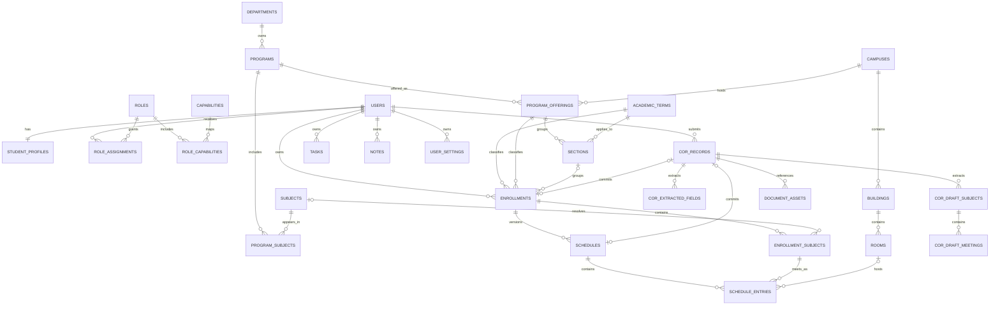

# My-Schedule Database and Google Sheets Schema

Schema date: 2026-08-30  
Status: planning only  
Basis: `AUDIT.md` and `ARCHITECTURE.md`

## 1. Database Overview

My-Schedule will initially use one controlled Google Sheets workbook as its structured database, Google Apps Script as the only data-access and authorization layer, and private Google Drive storage for COR files and large extraction artifacts.

The schema replaces the current shared BSCS timetable and browser-only records with:

- Stable application IDs and explicit foreign keys.
- A platform user keyed externally by Google `sub`, never by email or Sheet row number.
- Separate user identity, student profile, term enrollment, subject enrollment, schedule, and meeting records.
- Shared QCU catalogs managed by administrators rather than frontend constants.
- User-owned tasks, notes, COR imports, and settings.
- Untrusted OCR source/draft records that cannot become active academic data without review and a validated commit.
- Explicit roles, capabilities, lifecycle states, timestamps, optimistic versions, idempotency, and audit history.

The browser must never access the workbook or Drive directly. Apps Script repositories hide sheet names, headers, row positions, batching, and lookup behavior from services. API objects expose stable IDs and domain fields only, allowing a later SQL implementation to preserve the same contracts.

### Naming Decision

The sheet `Departments` represents QCU academic units. A row may have `unitType=COLLEGE` or `unitType=DEPARTMENT`. This keeps the user-requested entity name while representing units such as the College of Computer Studies accurately. Frontend labels come from data and must not assume every row is literally called a department.

### Storage Boundaries

| Store | Contains | Must not contain |
|---|---|---|
| Google Sheets | Normalized records, foreign keys, lifecycle metadata, small reviewed extraction fields | COR/PDF/image binaries, secrets, large provider payloads |
| Google Drive | Private COR originals and optional short-lived raw OCR artifacts | Public links, filenames containing student number/email |
| Apps Script Properties | Spreadsheet/folder IDs, HMAC secret, OCR credentials, upload/retention limits | Student records or browser-readable configuration |
| Browser IndexedDB | User-scoped cached API view models after implementation | Shared unnamespaced private data or authoritative identity/role state |

## 2. Conventions

### Types and Formats

| Type | Sheet representation | Rule |
|---|---|---|
| ID | Text | Opaque prefixed UUID, for example `usr_<uuid>`; never reused |
| Timestamp | Text | ISO-8601 UTC, for example `2026-08-30T04:15:00Z` |
| Date | Text | ISO date `YYYY-MM-DD` |
| Time | Text | Local campus wall time `HH:mm` in 24-hour format |
| Integer | Number | No decimal component |
| Decimal | Number | Used for units/confidence; explicit allowed range |
| Boolean | Boolean | Actual Sheet boolean, not `yes/no` text |
| Enum | Text | Uppercase controlled value validated by Apps Script |
| JSON | Text | Allowed only for bounded metadata that is not relational or queried by fields |

Times are interpreted using the related campus time zone, initially `Asia/Manila`. Empty optional cells map to API `null`; empty string is not a distinct domain value. IDs, student numbers, codes, and times must be stored as text to prevent spreadsheet auto-formatting.

### Common Mutable Columns

Unless an entity explicitly says otherwise, every mutable sheet includes:

| Column | Type | Required | Meaning |
|---|---|---:|---|
| `createdAt` | Timestamp | Yes | First persisted time |
| `createdBy` | User ID or `SYSTEM` | Yes | Actor that created the row |
| `updatedAt` | Timestamp | Yes | Last persisted change |
| `updatedBy` | User ID or `SYSTEM` | Yes | Actor that last changed the row |
| `version` | Integer | Yes | Starts at `1`; incremented on every mutation |

Rows that support removal also use `status` and, where relevant, optional `deactivatedAt`, `deactivatedBy`, `deletedAt`, or `deletedBy`. Deletes normally produce tombstones or inactive rows so foreign keys and synchronization history remain valid.

### Primary-Key Prefixes

| Entity | Prefix | Entity | Prefix |
|---|---|---|---|
| User | `usr_` | Enrollment | `enr_` |
| Student profile | `prf_` | Enrollment subject | `ens_` |
| Role | `rol_` | Schedule | `sch_` |
| Capability | `cap_` | Schedule entry | `sme_` |
| Campus | `cam_` | COR record | `cor_` |
| Department | `dep_` | COR draft subject | `cds_` |
| Program | `prg_` | COR draft meeting | `cdm_` |
| Program offering | `off_` | Document asset | `doc_` |
| Academic term | `trm_` | Task | `tsk_` |
| Section | `sec_` | Note | `nte_` |
| Subject | `sub_` | Announcement | `ann_` |

## 3. Complete Entity and Workbook List

Use one sheet per logical entity. The initial workbook contains the following sheets; none are exposed by name through the API.

| Sheet | Ownership | Purpose |
|---|---|---|
| `Users` | Admin/system | Platform identity and account lifecycle |
| `Student_Profiles` | User-owned | Student identity and QCU profile fields |
| `Roles` | Admin-managed | Named roles such as Student and Administrator |
| `Capabilities` | System-managed | Stable permission keys |
| `Role_Capabilities` | System/admin-managed | Role-to-capability mapping |
| `Role_Assignments` | Admin-managed | Scoped role grants to users |
| `Campuses` | Shared catalog | Campus identity, time zone, map/config references |
| `Departments` | Shared catalog | Colleges/departments and branding metadata |
| `Programs` | Shared catalog | Degree programs owned by academic units |
| `Program_Offerings` | Shared catalog | Programs available at particular campuses |
| `Academic_Terms` | Shared catalog | Academic year and semester periods |
| `Sections` | Shared catalog | Term-specific student sections |
| `Subjects` | Shared catalog | Canonical subject/course catalog |
| `Program_Subjects` | Shared catalog | Programs' subject/curriculum associations |
| `Enrollments` | User-owned | One student's academic context for a term |
| `Enrollment_Subjects` | User-owned | Subjects taken under an enrollment |
| `Schedules` | User-owned | Versioned schedule headers |
| `Schedule_Entries` | User-owned | Individual recurring class meetings |
| `COR_Records` | User-owned/system-processed | COR import lifecycle and provenance |
| `COR_Extracted_Fields` | User-owned draft | Untrusted extracted profile/header fields |
| `COR_Draft_Subjects` | User-owned draft | Untrusted/reviewed subject lines |
| `COR_Draft_Meetings` | User-owned draft | Untrusted/reviewed meeting occurrences |
| `Document_Assets` | User-owned/system-managed | Opaque metadata for private Drive files |
| `Announcements` | Admin-managed | Published notices with scoped audiences |
| `Tasks` | User-owned | Personal task CRUD and synchronization |
| `Notes` | User-owned | Personal note CRUD and synchronization |
| `User_Settings` | User-owned | Per-user application preferences |
| `System_Settings` | Operator/admin-managed | Non-secret runtime configuration |
| `Audit_Log` | System append-only | Security, support, import, and privileged events |
| `Mutation_Receipts` | System-managed | Idempotency records for retried mutations |
| `Schema_Migrations` | Operator-managed | Applied schema versions and migration history |

`Program_Offerings`, `Program_Subjects`, `Enrollment_Subjects`, and `COR_Draft_Meetings` are justified junction/child entities. Without them, multiple campuses, cross-program subjects, multiple meetings per subject, and SQL migration would require duplicated or comma-separated values.

## 4. Identity and Authorization Schemas

### `Users`

Purpose: platform account and immutable Google identity link. PK: `userId`.

| Field | Type | Req. | Constraints / meaning |
|---|---|---:|---|
| `userId` | ID | Yes | Primary key |
| `googleSub` | Text | Yes | Unique immutable Google subject; never returned to normal catalog APIs |
| `email` | Text | Yes | Current verified Google email, normalized lowercase |
| `emailVerified` | Boolean | Yes | Must be true at account creation |
| `displayName` | Text | Yes | Google/account display name, 1-120 characters |
| `avatarUrl` | Text | No | Approved Google profile URL; never used as identity |
| `accountStatus` | Enum | Yes | `ONBOARDING`, `ACTIVE`, `SUSPENDED`, `CLOSED` |
| `onboardingState` | Enum | Yes | `AWAITING_COR`, `PROCESSING`, `REVIEW_REQUIRED`, `COMPLETE`, `NOT_REQUIRED` |
| `lastLoginAt` | Timestamp | No | Last successful platform login |
| `suspendedReason` | Text | No | Admin-only, required when suspended |
| `closedAt` | Timestamp | No | Required for `CLOSED` |
| common mutable fields | - | Yes | As defined above |

Unique constraints: `googleSub`. A current email collision is flagged for review but does not merge accounts. Create is system-only during verified login; students read their own safe fields and update only allowed display preferences; administrators with `users.status.write` may suspend/reactivate; closure follows the approved retention process rather than a hard delete.

### `Student_Profiles`

Purpose: student-specific QCU identity distinct from Google profile data. PK: `profileId`; one row per user.

| Field | Type | Req. | Constraints / meaning |
|---|---|---:|---|
| `profileId` | ID | Yes | Primary key |
| `userId` | User ID | Yes | FK `Users.userId`; unique |
| `studentNumber` | Text | No | Canonical normalized identifier; sensitive |
| `firstName` | Text | Yes after onboarding | 1-80 characters |
| `middleName` | Text | No | 0-80 characters |
| `lastName` | Text | Yes after onboarding | 1-80 characters |
| `suffix` | Text | No | 0-20 characters |
| `preferredName` | Text | No | User-editable display preference |
| `verificationStatus` | Enum | Yes | `UNVERIFIED`, `COR_REVIEWED`, `INSTITUTION_VERIFIED`, `CONFLICT` |
| `sourceCorRecordId` | COR ID | No | FK to confirmed `COR_Records` |
| `status` | Enum | Yes | `ACTIVE`, `INACTIVE`, `REDACTED` |
| common mutable fields | - | Yes | As defined above |

Unique constraints: `userId`; nonblank canonical `studentNumber` across non-redacted profiles. A duplicate blocks COR commit and never causes automatic account merging. Owner may read and edit permitted personal fields; identity-critical changes may require re-confirmation. Authorized support reads are audited. Normal administrators cannot browse tasks/notes through this relationship.

### `Roles`, `Capabilities`, `Role_Capabilities`, `Role_Assignments`

| Sheet | PK | Required fields | Optional fields / status | Unique constraints and access |
|---|---|---|---|---|
| `Roles` | `roleId` | `roleKey` text, `displayName`, `description`, `status`, common fields | Status `ACTIVE/INACTIVE`; `isSystemRole` boolean | Unique `roleKey`. System/operator creates core roles; `roles.manage` may manage approved custom roles later. |
| `Capabilities` | `capabilityId` | `capabilityKey`, `description`, `status`, common fields | Status `ACTIVE/INACTIVE` | Unique `capabilityKey`. System-managed; authenticated users receive only resolved keys in bootstrap. |
| `Role_Capabilities` | `roleCapabilityId` | `roleId` FK, `capabilityId` FK, `status`, common fields | Status `ACTIVE/REVOKED` | Unique active pair `(roleId, capabilityId)`. Managed only through `roles.manage` or deployment-controlled seed. |
| `Role_Assignments` | `roleAssignmentId` | `userId` FK, `roleId` FK, `scopeType`, `status`, `grantedBy`, `grantedAt`, common fields | `scopeId` conditional, `expiresAt`, `revokedAt`, `revokedBy`; status `ACTIVE/REVOKED/EXPIRED` | Unique active `(userId, roleId, scopeType, scopeId)`. `roles.manage` required; grant/revoke is audited and locked. |

`scopeType` is `GLOBAL`, `CAMPUS`, `DEPARTMENT`, or `PROGRAM`. `scopeId` is null only for `GLOBAL`; otherwise it must reference the matching catalog entity. Scope compatibility is validated in code, not formulas.

Initial capability keys:

```text
catalog.read
catalog.write
users.read
users.status.write
roles.read
roles.manage
imports.review
documents.read.support
audit.read
system.config.read
system.config.write
announcements.write
```

Initial roles are `STUDENT` and `ADMINISTRATOR`. `STUDENT` grants normal owner operations and `catalog.read`; owner rights remain domain rules rather than broad capabilities. `ADMINISTRATOR` is useful only with an active role assignment and matching scope. It does not implicitly grant document, task, or note access.

## 5. Shared QCU Catalog Schemas

All catalog rows include the common mutable fields. Students may read active rows. Only actors with `catalog.write` and a matching scope may create, update, or deactivate them. Referenced rows are deactivated, not hard-deleted.

### Catalog Definitions

| Sheet | PK and foreign keys | Required fields | Optional fields | Unique constraints / statuses |
|---|---|---|---|---|
| `Campuses` | PK `campusId` | `campusCode`, `name`, `timeZone`, `status` | `shortName`, `address`, `latitude`, `longitude`, `logoAssetKey`, `mapConfigKey` | Unique `campusCode`; status `ACTIVE/INACTIVE` |
| `Departments` | PK `departmentId`; optional self-FK `parentDepartmentId` | `departmentCode`, `name`, `unitType`, `status` | `shortName`, `displayAbbreviation`, `logoAssetKey`, parent | Unique canonical `departmentCode`; type `COLLEGE/DEPARTMENT`; status `ACTIVE/INACTIVE` |
| `Programs` | PK `programId`; FK `departmentId` | `programCode`, `name`, `degreeLevel`, `status` | `shortName`, `description`, `logoAssetKey` | Unique `programCode`; degree `BACHELOR/OTHER`; status `ACTIVE/INACTIVE` |
| `Program_Offerings` | PK `offeringId`; FKs `programId`, `campusId` | both FKs, `status` | `effectiveFromTermId`, `effectiveToTermId` | Unique active `(programId, campusId)`; status `ACTIVE/INACTIVE` |
| `Academic_Terms` | PK `termId` | `academicYearStart` integer, `academicYearLabel`, `termCode`, `name`, `startsOn`, `endsOn`, `status` | `enrollmentOpensOn`, `enrollmentClosesOn` | Unique `(academicYearStart, termCode)`; term `FIRST_SEMESTER/SECOND_SEMESTER/SUMMER`; status `PLANNED/ACTIVE/CLOSED/ARCHIVED` |
| `Sections` | PK `sectionId`; FKs `offeringId`, `termId` | FKs, `sectionCode`, `yearLevel`, `status` | `displayName`, `adviserName`, `capacity` | Unique active `(offeringId, termId, sectionCode)`; status `ACTIVE/INACTIVE/ARCHIVED` |
| `Subjects` | PK `subjectId`; optional FK `departmentId` | `subjectCode`, `title`, `status` | `description`, `defaultUnits`, `departmentId`, `colorKey` | Unique canonical `subjectCode`; status `ACTIVE/INACTIVE` |
| `Program_Subjects` | PK `programSubjectId`; FKs `programId`, `subjectId` | FKs, `curriculumCode`, `status` | `recommendedYearLevel`, `recommendedTermCode`, `unitsOverride`, `effectiveFromTermId`, `effectiveToTermId` | Unique active `(programId, subjectId, curriculumCode)`; status `ACTIVE/INACTIVE` |

`logoAssetKey`, `colorKey`, and `mapConfigKey` are allowlisted keys resolved by controlled configuration/static assets. Arbitrary HTML and arbitrary student-supplied URLs are invalid.

The canonical identifier for a department is `departmentId`; the canonical human-maintained code must also be unique. A display abbreviation such as `COE` is not an identifier and need not be unique.

## 6. Enrollment and Schedule Schemas

### `Enrollments`

Purpose: one student's academic context for a specific term. PK: `enrollmentId`.

| Field | Type | Req. | Constraints / meaning |
|---|---|---:|---|
| `enrollmentId` | ID | Yes | Primary key |
| `ownerUserId` | User ID | Yes | FK `Users.userId`; set from authenticated actor/import owner |
| `termId` | Term ID | Yes | FK `Academic_Terms.termId` |
| `offeringId` | Offering ID | Yes | FK `Program_Offerings.offeringId` |
| `sectionId` | Section ID | No | FK `Sections.sectionId`; must match offering and term |
| `sectionLabelSnapshot` | Text | No | Reviewed COR label when no catalog match exists |
| `yearLevel` | Integer | Yes | Initially `1-6`; final allowed values are QCU configuration |
| `studentStatus` | Enum | Yes | `REGULAR`, `IRREGULAR`, `TRANSFEREE`, `RETURNING`, `OTHER`, `UNKNOWN` |
| `dateEnrolled` | Date | No | Reviewed COR value |
| `adviserName` | Text | No | Snapshot until an instructor/adviser catalog is justified |
| `sourceType` | Enum | Yes | `COR_IMPORT`, `MANUAL`, `ADMIN_MIGRATION` |
| `sourceCorRecordId` | COR ID | No | Required for `COR_IMPORT` |
| `status` | Enum | Yes | `DRAFT`, `ACTIVE`, `COMPLETED`, `CANCELLED` |
| common mutable fields | - | Yes | As defined above |

Unique constraint: at most one non-cancelled enrollment for `(ownerUserId, termId)` in the initial product. At most one `ACTIVE` enrollment per user overall unless the product later approves concurrent programs. Students read their own records; creation normally occurs through COR commit or an approved manual onboarding flow; edits are owner-limited; cancellation/history changes are audited as appropriate.

### `Enrollment_Subjects`

Purpose: the subjects a student takes under one enrollment, separate from meeting times. PK: `enrollmentSubjectId`.

| Field | Type | Req. | Constraints / meaning |
|---|---|---:|---|
| `enrollmentSubjectId` | ID | Yes | Primary key |
| `enrollmentId` | Enrollment ID | Yes | FK `Enrollments.enrollmentId` |
| `ownerUserId` | User ID | Yes | Redundant indexed owner; must equal enrollment owner |
| `subjectId` | Subject ID | No | FK `Subjects.subjectId` when catalog matched |
| `subjectCodeSnapshot` | Text | Yes | Reviewed code preserved from COR/manual input |
| `subjectTitleSnapshot` | Text | Yes | Reviewed title/description snapshot |
| `units` | Decimal | Yes | `0-12`, reasonable increments validated by policy |
| `classSection` | Text | No | Subject-level class section if printed on COR |
| `instructorName` | Text | No | Snapshot; no instructor entity in initial scope |
| `sourceType` | Enum | Yes | `COR_IMPORT`, `MANUAL`, `ADMIN_MIGRATION` |
| `sourceCorDraftSubjectId` | Draft subject ID | No | Provenance link |
| `status` | Enum | Yes | `ACTIVE`, `DROPPED`, `COMPLETED`, `REMOVED` |
| common mutable fields | - | Yes | As defined above |

Unique active constraint: `(enrollmentId, normalized subjectCodeSnapshot)`. `subjectId` is optional so an unrecognized COR subject can remain private without giving a student permission to create a shared catalog row. Administrators can reconcile the catalog link later without changing the snapshot.

### `Schedules`

Purpose: versioned schedule headers so replacement is atomic from the application's perspective. PK: `scheduleId`.

| Field | Type | Req. | Constraints / meaning |
|---|---|---:|---|
| `scheduleId` | ID | Yes | Primary key |
| `enrollmentId` | Enrollment ID | Yes | FK `Enrollments.enrollmentId` |
| `ownerUserId` | User ID | Yes | Must equal enrollment owner |
| `revisionNumber` | Integer | Yes | Starts at 1 within enrollment |
| `name` | Text | Yes | User-visible label, for example `Official Schedule` |
| `sourceType` | Enum | Yes | `COR_IMPORT`, `MANUAL`, `ADMIN_MIGRATION` |
| `sourceCorRecordId` | COR ID | No | Required for COR source |
| `status` | Enum | Yes | `DRAFT`, `ACTIVE`, `ARCHIVED`, `ABANDONED` |
| `activatedAt` | Timestamp | No | Required when active/archived after activation |
| `archivedAt` | Timestamp | No | Required when archived |
| common mutable fields | - | Yes | As defined above |

Unique constraints: `(enrollmentId, revisionNumber)` and at most one `ACTIVE` schedule per enrollment. The prior active schedule remains active until a complete draft passes validation and is switched under a lock.

### `Schedule_Entries`

Purpose: one recurring meeting occurrence. A class meeting on Monday and Wednesday is two rows. PK: `scheduleEntryId`.

| Field | Type | Req. | Constraints / meaning |
|---|---|---:|---|
| `scheduleEntryId` | ID | Yes | Primary key |
| `scheduleId` | Schedule ID | Yes | FK `Schedules.scheduleId` |
| `ownerUserId` | User ID | Yes | Must equal schedule owner |
| `enrollmentSubjectId` | Enrollment subject ID | Yes | FK; same enrollment as schedule |
| `dayOfWeek` | Integer | Yes | ISO day `1=Monday` through `7=Sunday` |
| `startTime` | Time | Yes | Must be earlier than `endTime` |
| `endTime` | Time | Yes | Must be later than `startTime` |
| `modality` | Enum | Yes | `ONSITE`, `ONLINE`, `HYBRID`, `TBA` |
| `buildingId` | Building ID | No | FK `Buildings.buildingId` |
| `roomId` | Room ID | No | FK `Rooms.roomId`; room must belong to building |
| `locationText` | Text | No | Required if no resolved room/location exists |
| `effectiveFrom` | Date | No | Optional recurrence start |
| `effectiveTo` | Date | No | Optional recurrence end; not before start |
| `sourceCorDraftMeetingId` | Draft meeting ID | No | Provenance link |
| `status` | Enum | Yes | `ACTIVE`, `CANCELLED`, `REMOVED` |
| common mutable fields | - | Yes | As defined above |

Unique active constraint: `(scheduleId, enrollmentSubjectId, dayOfWeek, startTime, endTime)`. Overlapping meetings for the same user's active schedule are rejected or returned as an explicit validation conflict. The schema is not a room-booking authority, so it does not reject different students sharing the same room/time.

## 7. Campus Location Schemas

### `Buildings`

PK `buildingId`; FK `campusId`. Required: `buildingCode`, `name`, `campusId`, `status`, common fields. Optional: `shortName`, `description`, `imageAssetKey`, `latitude`, `longitude`, `floorCount`. Unique active `(campusId, buildingCode)`. Status is `ACTIVE/INACTIVE`. Students read; scoped catalog admins create/update/deactivate.

### `Rooms`

PK `roomId`; FK `buildingId`. Required: `roomCode`, `name`, `buildingId`, `status`, common fields. Optional: `floorLabel`, `capacity`, `roomType`, `description`. Unique active `(buildingId, roomCode)`. Status is `ACTIVE/INACTIVE`. A room cannot be assigned to a building from another campus through an API payload because campus is derived from its building.

Existing New Academic Building, Bautista Building, Belmonte Hall, and room codes found in the current application are migration candidates, not automatically authoritative records. CHUNK 4 must validate their official names/codes before seed creation.

## 8. COR and Document Schemas

### Trust Model

OCR/AI output is source evidence, not trusted application data. The workflow is:

```text
Drive original
-> COR_Records processing metadata
-> extracted field/subject/meeting drafts
-> student review and correction
-> server validation and explicit confirmation
-> Enrollment + Enrollment_Subjects + Schedule + Schedule_Entries
```

Shared catalog records are never created automatically from a student's extraction. Matches resolve to catalog IDs; unresolved subject/location values remain reviewed private snapshots. The commit records provenance but never overwrites the original extracted value.

### `COR_Records`

Purpose: one upload/import job. PK: `corRecordId`.

| Field | Type | Req. | Constraints / meaning |
|---|---|---:|---|
| `corRecordId` | ID | Yes | Primary key |
| `ownerUserId` | User ID | Yes | FK `Users.userId` |
| `originalDocumentId` | Document ID | Yes after storage | FK `Document_Assets.documentId` |
| `rawArtifactDocumentId` | Document ID | No | Optional provider artifact |
| `contentHash` | Text | Yes | SHA-256 or equivalent server-calculated hash |
| `status` | Enum | Yes | `UPLOADED`, `QUEUED`, `PROCESSING`, `REVIEW_REQUIRED`, `COMMITTING`, `COMPLETED`, `FAILED`, `CANCELLED`, `DELETION_PENDING`, `DELETED` |
| `providerKey` | Text | No | Provider adapter identifier, not a secret |
| `providerJobId` | Text | No | Server-only external job reference |
| `attemptCount` | Integer | Yes | Starts at 0; bounded retry count |
| `nextAttemptAt` | Timestamp | No | Retry scheduling |
| `leaseOwner` | Text | No | Worker claim token |
| `leaseExpiresAt` | Timestamp | No | Prevents abandoned job claims |
| `confidenceSummary` | Decimal | No | `0-1`; informational only |
| `failureCode` | Text | No | Sanitized stable code |
| `failureMessage` | Text | No | Sanitized, no provider secret/raw content |
| `draftVersion` | Integer | Yes | Increments when review draft changes |
| `confirmedAt` | Timestamp | No | Explicit student confirmation time |
| `committedEnrollmentId` | Enrollment ID | No | Result of successful commit |
| `committedScheduleId` | Schedule ID | No | Result of successful commit |
| `commitMutationId` | Text | No | Unique idempotency key for commit |
| `completedAt` | Timestamp | No | Required for completed import |
| common mutable fields | - | Yes | As defined above |

Unique constraints: `commitMutationId` when nonblank; duplicate `(ownerUserId, contentHash)` uploads within a configurable window return/reuse an existing active import rather than creating duplicates. Owner may create/read/update draft/cancel/delete own eligible imports. Worker transitions processing states. Support access requires explicit capability and audit. Only the commit service creates trusted academic records.

### `COR_Extracted_Fields`

Purpose: untrusted and reviewed COR header/profile values. PK: `corFieldId`; FK `corRecordId`.

| Field | Type | Req. | Constraints / meaning |
|---|---|---:|---|
| `corFieldId` | ID | Yes | Primary key |
| `corRecordId` | COR ID | Yes | Parent import |
| `ownerUserId` | User ID | Yes | Must equal import owner |
| `fieldKey` | Enum | Yes | See mapping below |
| `sourceText` | Text | No | Exact normalized OCR-visible source value |
| `normalizedValue` | Text | No | Provider/parser normalization |
| `reviewedValue` | Text | No | Student-corrected value |
| `resolvedEntityType` | Enum | No | `CAMPUS`, `PROGRAM`, `PROGRAM_OFFERING`, `TERM`, `SECTION` |
| `resolvedEntityId` | ID | No | Valid matching catalog ID |
| `confidence` | Decimal | No | `0-1` |
| `reviewStatus` | Enum | Yes | `UNREVIEWED`, `CONFIRMED`, `CORRECTED`, `UNRESOLVED`, `REJECTED` |
| `pageNumber` | Integer | No | Source page |
| `sourceRegion` | JSON | No | Bounded coordinates only, if retained |
| common mutable fields | - | Yes | As defined above |

Unique constraint: `(corRecordId, fieldKey)`. Allowed field keys initially include `STUDENT_NAME`, `STUDENT_NUMBER`, `CAMPUS`, `ACADEMIC_YEAR`, `SEMESTER`, `PROGRAM`, `YEAR_LEVEL`, `SECTION`, `STUDENT_STATUS`, `DATE_ENROLLED`, and `ADVISER`. These rows remain draft/source data even after commit and follow COR retention rules.

### `COR_Draft_Subjects`

Purpose: one extracted COR subject line before commit. PK `corDraftSubjectId`; FK `corRecordId`.

Required on row creation: `corRecordId`, `ownerUserId`, `lineNumber` integer, `sourceLineText`, `reviewStatus`, and common fields. Optional until review: `sourceSubjectCode`, `sourceSubjectTitle`, `sourceUnits`, `reviewedSubjectCode`, `reviewedSubjectTitle`, `reviewedUnits`, matched `subjectId`, `classSection`, `instructorName`, per-field confidence values, and page number. Reviewed code, title, and units become required for every included row at commit. Status/review values: `UNREVIEWED`, `CONFIRMED`, `CORRECTED`, `UNRESOLVED`, `EXCLUDED`. Unique `(corRecordId, lineNumber)`. Students may edit reviewed fields on their own import only while status permits review.

### `COR_Draft_Meetings`

Purpose: one parsed meeting associated with a draft subject. PK `corDraftMeetingId`; FK `corDraftSubjectId`.

Required on row creation: parent ID, `ownerUserId`, `sequenceNumber`, `sourceScheduleText`, `reviewStatus`, and common fields. Optional until review: source day/time/building/room strings, reviewed `dayOfWeek`, `startTime`, `endTime`, `modality`, matched `buildingId` and `roomId`, reviewed `locationText`, and confidence values. Reviewed day, start, end, and modality become required for every included row at commit. Unique `(corDraftSubjectId, sequenceNumber)`. Time/location validation matches `Schedule_Entries`; unresolved locations are allowed as reviewed text, but unresolved/invalid day or time blocks commit.

### `Document_Assets`

Purpose: metadata for files in private Drive. PK `documentId`.

Required: `ownerUserId`, `corRecordId`, `assetType`, `driveFileId`, `mimeType`, `sizeBytes`, `contentHash`, `storageStatus`, `retentionUntil`, common fields. Optional: `originalFilename` (sanitized), `deletedAt`, `deletionFailureCode`. Asset type: `COR_ORIGINAL` or `OCR_RAW_ARTIFACT`. Storage status: `ACTIVE`, `QUARANTINED`, `DELETION_PENDING`, `DELETED`, `DELETE_FAILED`. Unique `driveFileId`; optionally unique active `(ownerUserId, assetType, contentHash)` according to deduplication policy. The normal student API returns `documentId`, type, size, and status, not `driveFileId`.

## 9. Workspace, Announcement, and Settings Schemas

### `Tasks`

PK `taskId`; required `ownerUserId`, `title`, `priority`, `taskStatus`, common fields. Optional `description`, `enrollmentSubjectId`, `dueAt`, `completedAt`, `clientMutationId`, `deletedAt`. Priority: `LOW`, `MEDIUM`, `HIGH`. Status: `OPEN`, `COMPLETED`, `DELETED`. Unique `(ownerUserId, clientMutationId)` when present. Owner-only CRUD; delete creates a tombstone for synchronization. Titles and descriptions have explicit length limits and are rendered as text.

### `Notes`

PK `noteId`; required `ownerUserId`, `title`, `body`, `noteStatus`, common fields. Optional `enrollmentSubjectId`, `clientMutationId`, `deletedAt`. Status: `ACTIVE`, `ARCHIVED`, `DELETED`. Unique `(ownerUserId, clientMutationId)` when present. Owner-only CRUD; no routine administrator read permission.

### `Announcements`

PK `announcementId`; required `title`, `body`, `audienceType`, `publishAt`, `announcementStatus`, common fields. Optional `audienceId`, `expiresAt`, `priority`, `sourceUrl`. Audience: `ALL`, `CAMPUS`, `DEPARTMENT`, `PROGRAM`, `SECTION`; `audienceId` is null only for `ALL` and otherwise references the selected type. Status: `DRAFT`, `PUBLISHED`, `EXPIRED`, `ARCHIVED`. Authenticated students read currently published announcements matching their active enrollment. `announcements.write` with matching scope is required for mutations.

### `User_Settings`

PK `userSettingId`; required `ownerUserId`, `settingKey`, `valueType`, `value`, `status`, common fields. Unique active `(ownerUserId, settingKey)`. Allowed keys and values are server-defined; clients cannot create arbitrary keys. Initial candidates are display/notification preferences only after the related behavior is implemented. Status: `ACTIVE`, `RESET`. Owner reads/updates own settings. Sensitive OAuth tokens and precise location history are not stored here.

### `System_Settings`

PK `systemSettingId`; required `settingKey`, `valueType`, `value`, `visibility`, `status`, common fields. Optional `description`, `scopeType`, `scopeId`. Unique active `(settingKey, scopeType, scopeId)`. Visibility: `PUBLIC_BOOTSTRAP`, `AUTHENTICATED`, `OPERATOR_ONLY`. Status: `ACTIVE`, `INACTIVE`. This sheet may store non-secret flags, active catalog version, public asset keys, and approved limits intended for display. Secrets, spreadsheet IDs, Drive IDs, HMAC keys, and OCR credentials remain in Script Properties. Writes require `system.config.write`; reads respect visibility and `system.config.read`.

## 10. Operational Schemas

### `Audit_Log`

Append-only PK `auditEventId`. Required fields: `occurredAt`, `requestId`, `actorType` (`USER/SYSTEM/WORKER`), optional `actorUserId`, `action`, `targetType`, optional `targetId`, `result` (`SUCCESS/DENIED/FAILED`), `scopeType`, optional `scopeId`, and `summary`. Optional: `reason`, `ipHash`, `userAgentHash`, `metadata` bounded JSON, `retentionUntil`. `occurredAt` is the creation timestamp; append-only rows intentionally have no `updatedAt` or mutable `version`. There are no update or normal delete APIs. `audit.read` is required for filtered/paginated reads. Entries must not contain COR text, student numbers, task/note bodies, access tokens, secrets, or raw documents.

### `Mutation_Receipts`

System-managed idempotency table. PK `mutationReceiptId`. Required: `actorUserId`, `clientMutationId`, `action`, `requestHash`, `resultStatus`, `expiresAt`, and common mutable fields. Optional: `targetType`, `targetId`, `responseReference`, `completedAt`, `errorCode`. Unique `(actorUserId, clientMutationId, action)`. Status: `IN_PROGRESS`, `SUCCEEDED`, `FAILED_RETRYABLE`, `FAILED_FINAL`. No browser CRUD. A cleanup job removes expired receipts after the retention window.

### `Schema_Migrations`

Operator-managed append-only history. PK `migrationId`. Required: `schemaVersion` integer, `migrationKey`, `description`, `appliedAt`, `appliedBy`, `checksum`, `status`. Optional: `backupReference`, `notes`. `appliedAt` is the creation timestamp; rows are immutable and intentionally have no `updatedAt` or mutable `version`. Unique `schemaVersion` and `migrationKey`. Status: `APPLIED`, `ROLLED_BACK`, `FAILED`. A rollback or retry appends a new migration event rather than editing history. The current schema version returned by the API is derived from the highest valid applied migration or a deployment property, never from a frontend constant alone.

## 11. Relationships and ER Diagram



## 12. User-Data Ownership Model

| Data class | Owner/source | Student access | Administrator access |
|---|---|---|---|
| User account/profile | Individual user | Own safe fields | Status/support only with capability; sensitive reads audited |
| Enrollment, subjects, schedules | Individual user | Own CRUD within lifecycle rules | Narrow support/catalog reconciliation; audited |
| Tasks and notes | Individual user | Owner only | No routine access; exceptional support requires a separately approved capability not defined initially |
| COR drafts/documents | Individual user | Own import workflow | `imports.review` and, for files, `documents.read.support`; reason and audit required |
| Shared academic/location catalog | QCU/application | Read active rows | Scoped `catalog.write` |
| Announcements | QCU/application | Read matching published rows | Scoped `announcements.write` |
| Roles/account status | Application administration | Own resolved permissions only | Capability and scope gated |
| Settings/secrets | User or operator | Own/user-visible values only | Non-secret configured visibility; secrets operator-only outside Sheets |

Child ownership is derived from its parent and also stored as `ownerUserId` on high-volume user-owned sheets to make authorization queries efficient. Apps Script must verify that the redundant owner matches the parent before write. Browser-supplied owner IDs are ignored.

## 13. COR Data Mapping

| COR value | Draft representation | Trusted destination after confirmation |
|---|---|---|
| Student name | `COR_Extracted_Fields.STUDENT_NAME` | `Student_Profiles` name fields |
| Student number | `STUDENT_NUMBER` | `Student_Profiles.studentNumber`, subject to global conflict check |
| Campus | `CAMPUS` plus resolved ID | `Program_Offerings.campusId` through `Enrollments.offeringId` |
| Academic year | `ACADEMIC_YEAR` | `Enrollments.termId` -> `Academic_Terms` |
| Semester | `SEMESTER` | Same term resolution |
| Program | `PROGRAM` plus resolved ID | `Enrollments.offeringId` -> `Programs` |
| Year level | `YEAR_LEVEL` | `Enrollments.yearLevel` |
| Section | `SECTION` | `Enrollments.sectionId` or reviewed snapshot |
| Student status | `STUDENT_STATUS` | `Enrollments.studentStatus` |
| Date enrolled | `DATE_ENROLLED` | `Enrollments.dateEnrolled` |
| Adviser | `ADVISER` | `Enrollments.adviserName` snapshot |
| Subject code/description/units | `COR_Draft_Subjects` | `Enrollment_Subjects` snapshots and optional `subjectId` |
| Day/start/end | `COR_Draft_Meetings` | `Schedule_Entries` |
| Building/room | Draft meeting source/review fields | Catalog IDs when matched; otherwise reviewed `locationText` |

Commit prerequisites:

1. Import owner is the authenticated user and import status is `REVIEW_REQUIRED`.
2. Expected `draftVersion` and unique `commitMutationId` match.
3. Required fields are confirmed/corrected, not merely extracted.
4. Campus, program offering, and academic term resolve to active catalog rows.
5. Student-number uniqueness is checked under a lock; conflicts block commit.
6. All included subjects have reviewed code/title/units.
7. All included meetings have valid day/time and no user schedule conflicts unless explicitly resolved.
8. Server writes a draft enrollment/schedule graph, validates it, then activates it and archives the previous active schedule.

## 14. CRUD and Authorization Matrix

Legend: `O` owner, `A` authorized scoped administrator, `S` system/worker, `R` authenticated reader.

| Entity group | Create | Read | Update | Delete/deactivate |
|---|---|---|---|---|
| Users | S at verified login | O; A with `users.read` | O limited; A status fields | A closes; S retention cleanup |
| Student profiles | S/O onboarding | O; audited support | O allowed fields | Close/redact workflow only |
| Roles/capabilities | S or A `roles.manage` | Own resolved keys; A `roles.read` | A `roles.manage` | Revoke/deactivate, audited |
| Shared catalogs | A `catalog.write` | R active rows | A scoped | A deactivates |
| Enrollments/subjects | O through validated onboarding/manual flow | O | O lifecycle-limited; support audited | Cancel/drop; preserve history |
| Schedules/entries | O | O | O with expected version | Archive/remove/tombstone |
| COR records/drafts | O upload; S extraction | O; narrow A support | O review; S lifecycle | O requests deletion; S deletes Drive asset |
| Announcements | A `announcements.write` | Matching R | A scoped | Archive |
| Tasks/notes | O | O only | O | O tombstone |
| User settings | O | O | O | Reset/tombstone |
| System settings | Operator/A `system.config.write` | By visibility/capability | Same | Deactivate |
| Audit log | S only | A `audit.read` | Never | Retention job only |
| Mutation receipts | S only | S only | S only | Expiry cleanup |
| Schema migrations | Operator only | Operator/system health | Append new migration only | No routine deletion |

## 15. Apps Script API Contract

### Transport Envelope

The browser calls versioned same-origin Cloudflare endpoints. Cloudflare authenticates the session and sends a signed canonical command to Apps Script:

```json
{
  "requestId": "req_uuid",
  "timestamp": "2026-08-30T04:15:00Z",
  "nonce": "one-time-random-value",
  "action": "schedule.entry.update",
  "actor": {
    "googleSub": "immutable-google-subject",
    "email": "verified@example.edu"
  },
  "payload": {
    "scheduleEntryId": "sme_uuid",
    "expectedVersion": 3,
    "clientMutationId": "client_uuid",
    "changes": {
      "startTime": "09:00",
      "endTime": "10:30"
    }
  },
  "signature": "hmac"
}
```

Apps Script verifies signature, time window, nonce, actor/account status, ownership/capability, schema, and expected versions. It ignores browser-supplied roles and owner IDs.

```json
{
  "ok": true,
  "data": {
    "scheduleEntryId": "sme_uuid",
    "version": 4
  },
  "error": null,
  "meta": {
    "requestId": "req_uuid",
    "apiVersion": "v1",
    "schemaVersion": 1
  }
}
```

Error responses use `ok=false`, `data=null`, and:

```json
{
  "code": "VALIDATION_FAILED",
  "message": "One or more fields are invalid.",
  "fields": {
    "startTime": "Must be earlier than endTime."
  },
  "retryable": false
}
```

Stable codes: `UNAUTHENTICATED`, `FORBIDDEN`, `NOT_FOUND`, `VALIDATION_FAILED`, `DUPLICATE`, `VERSION_CONFLICT`, `STATE_CONFLICT`, `RATE_LIMITED`, `IMPORT_NOT_READY`, `IMPORT_FAILED`, `PAYLOAD_TOO_LARGE`, `UNSUPPORTED_FILE_TYPE`, and `INTERNAL_ERROR`.

### Major Operations

| Browser route | Apps Script action | Auth/authorization | Main validation |
|---|---|---|---|
| `GET /api/v1/bootstrap` | `bootstrap.read` | Active/onboarding user | User, roles, active enrollment/schedule consistency |
| `GET/PATCH /api/v1/me` | `profile.read/update` | Owner | Allowlisted fields, expected version |
| `GET /api/v1/catalog/{entity}` | `catalog.list` | Authenticated; selected public subset may be unauthenticated | Active filters, pagination, catalog version |
| Admin catalog CRUD | `catalog.create/update/deactivate` | `catalog.write` plus scope | Codes, FKs, uniqueness, expected version |
| `GET /api/v1/enrollments` | `enrollment.list` | Owner | Owner derived from session |
| Enrollment mutations | `enrollment.create/update/cancel` | Owner within lifecycle or scoped support | Term/offering/section compatibility, one-active rules |
| `GET /api/v1/schedules/active` | `schedule.active.read` | Owner | Active enrollment/schedule invariant |
| Schedule CRUD | `schedule.create/update/archive` | Owner | Expected version, source, active switching lock |
| Schedule-entry CRUD | `schedule.entry.create/update/remove` | Owner | Parent ownership, subject enrollment, day/time/location, overlap |
| Task CRUD | `task.create/read/update/delete` | Owner | Lengths, priority/status, subject ownership, idempotency/version |
| Note CRUD | `note.create/read/update/delete` | Owner | Lengths, subject ownership, idempotency/version |
| `POST /api/v1/onboarding/cor` | `cor.upload.create` | Authenticated owner; rate limited | MIME, size, hash, duplicate upload |
| `GET /api/v1/onboarding/imports/{id}` | `cor.read` | Owner or audited support | Ownership and safe field projection |
| `PUT .../{id}/draft` | `cor.draft.update` | Owner | Import state, expected draft version, full draft validation |
| `POST .../{id}/commit` | `cor.commit` | Owner | Confirmation, idempotency, uniqueness, all graph invariants |
| `DELETE .../{id}` | `cor.delete.request` | Owner | Retention/legal hold/import state |
| Announcement reads | `announcement.list` | Authenticated | Audience derived from active enrollment |
| Admin announcement CRUD | `announcement.*` | `announcements.write` plus scope | Audience FK, dates, expected version |
| Admin user status | `user.status.update` | `users.status.write` | No self-escalation, reason, scope, version |
| Admin role assignment | `role.assignment.grant/revoke` | `roles.manage` | Role, scope, no invalid escalation, lock, audit |
| Admin audit list | `audit.list` | `audit.read` | Mandatory filters, pagination, no sensitive payloads |

List responses use cursor pagination and a bounded `limit`; no endpoint returns an entire high-volume sheet. Mutations require `clientMutationId` where retries are plausible and `expectedVersion` for existing mutable rows.

### Batch Pair: `snapshot.read` and `batch.write`

The table above describes one action per operation. The student-facing Functions do not call it that way, because an Apps Script round trip costs 300-900 ms and a single request touches the repository many times — `/api/v1/dashboard` reads about 31 times, `/api/v1/cor/confirm` writes about 37. One action per operation would put a page load in the 15-30 s range, past the point where Cloudflare gives up.

Two batch actions carry that traffic instead:

| Action | Payload | Returns |
|---|---|---|
| `snapshot.read` | `{ kinds: [...] }` — optional; defaults to every user-owned entity | `{ userId, isNew, entities: { kind: [row, ...] } }` — every row the actor owns |
| `batch.write` | `{ ops: [{ kind, id, row } \| { kind, id, remove }] }`, at most 500 | `{ applied, inserted, updated, removed, skipped }` |

A request therefore costs two round trips regardless of how much it reads or changes:

1. `resolveUser()` calls `Repo.hydrate()`, which issues one `snapshot.read` and loads the rows into the repository's maps.
2. Endpoint code runs against those maps synchronously, exactly as it did before any of this existed. Each mutating call records which row it touched.
3. A mutating endpoint calls `flushRepo()`, which issues one `batch.write` for the recorded set under `LockService`.

`kind` is one of `users`, `profiles`, `corRecords`, `corDrafts`, `enrollments`, `enrollmentSubjects`, `schedules`, `scheduleEntries`, `tasks`, `notes`. Apps Script resolves each to its sheet, primary key and owner column from a single registry, so a new user-owned entity is one line on each side.

Ownership is never taken from the payload. `batch.write` overwrites the owner column with the resolved actor and rejects any op whose existing row belongs to somebody else, so a forged `ownerUserId` changes nothing. The `users` kind is additionally pinned to the actor's own row.

Fine-grained actions remain valid and implemented for callers that want one operation at a time, including admin tooling. The batch pair is an addition to this contract, not a replacement.

### Field Mapping and `extraJson`

The repository's in-memory objects predate this schema and disagree with it in two ways: some fields are named differently (`smeId` vs `scheduleEntryId`, `userId` vs `ownerUserId`, `dueDate` vs `dueAt`), and some have no column at all (`sortOrder`, `dayLabel`, `isActive`, `roomSnapshot`, `matchedSubjectId`).

`functions/api/repo/sheets-adapter.js` declares, per entity, which repo field maps to which column. Anything left over is serialized into that sheet's `extraJson` column and merged back on read. The visible columns stay meaningful to somebody reading the spreadsheet, and nothing is silently dropped — `npm run sheets:test-mapping` asserts every field of every entity survives the round trip.

COR file bytes are the one thing never written. A cell holds 50 000 characters and a COR scan is megabytes, so `/api/v1/cor/upload` runs extraction in the same request that receives the file and persists only the resulting draft, as `draftJson` on `COR_Drafts`.

## 16. Validation and Data-Integrity Rules

### Identity and Duplicates

1. `googleSub` is globally unique. A second login with the same subject resolves the existing user.
2. Email is normalized and verified but is not an ownership key. Email changes update the attribute.
3. Student numbers are normalized by an approved QCU rule and globally unique when nonblank. A conflict blocks commit and creates an audited support state; it never merges users.
4. Every primary key is immutable. Foreign keys must reference existing rows in an allowed status.

### Catalog Integrity

1. Canonical codes are trimmed, case-normalized, and unique according to each table's constraint.
2. A `Program_Offering` requires active program and campus rows.
3. A section's offering and term must match the enrollment that selects it.
4. A room belongs to exactly one building; a building belongs to exactly one campus.
5. Deactivated catalog rows remain readable when referenced historically but cannot be selected for new active records.
6. Subject codes are globally unique initially. If QCU proves codes vary by curriculum/campus, CHUNK 4 must explicitly revise the uniqueness scope before implementation.

### Academic-Term and Schedule Integrity

1. Academic years use a numeric start year plus a display label; display text is not the key.
2. Initial invariant: one non-cancelled enrollment per user per term and one active enrollment per user.
3. One enrollment may have many enrollment subjects and schedule revisions, but only one active schedule.
4. Enrollment subject duplicates use normalized subject-code snapshot within the enrollment.
5. Schedule entries must reference a subject in the same enrollment as the schedule.
6. `startTime < endTime`; recurrence dates, when present, fall within or reasonably align with the academic term.
7. Exact duplicate meetings are rejected. Overlaps in the same active student schedule return a conflict for explicit correction.
8. Empty days are derived from no active meeting rows; no synthetic `noClasses` row is stored.

### COR Integrity

1. Provider data cannot write directly to trusted entities.
2. Draft edits require the current `draftVersion`; commit requires confirmed/corrected required fields.
3. A commit mutation is idempotent. Repeating a successful key returns the same enrollment/schedule result.
4. New schedule activation is the final step; failures leave the prior schedule active.
5. Raw provider output is kept out of Sheets and retained only if policy requires it.
6. Deletion changes metadata state and deletes Drive assets through an auditable worker; failed deletion is visible for retry.

### Deletion, Concurrency, and Sheet Safety

1. User-facing delete normally means deactivate/archive/tombstone, not row removal.
2. Hard cleanup occurs only after retention expiry, backup policy, and foreign-key checks.
3. Unique identity creation, student-number claim, role changes, job claims, COR commit, and active schedule switching use narrow `LockService` locks.
4. Existing-row updates require `expectedVersion`; mismatches return `VERSION_CONFLICT` with no silent overwrite.
5. Repositories batch range reads/writes, cache header maps and low-risk catalogs, and never use row order as business state.
6. Core validation and authorization live in Apps Script code, not Sheet formulas, colors, filters, or data-validation dropdowns.

## 17. Example Records

Examples are non-personal and abbreviated; timestamps/common fields are omitted where they do not add clarity.

```json
{
  "campus": {
    "campusId": "cam_demo_sb",
    "campusCode": "QCU-SB",
    "name": "QCU San Bartolome Campus",
    "timeZone": "Asia/Manila",
    "status": "ACTIVE"
  },
  "department": {
    "departmentId": "dep_demo_ccs",
    "departmentCode": "CCS",
    "name": "College of Computer Studies",
    "unitType": "COLLEGE",
    "logoAssetKey": "college-ccs",
    "status": "ACTIVE"
  },
  "program": {
    "programId": "prg_demo_bscs",
    "departmentId": "dep_demo_ccs",
    "programCode": "BSCS",
    "name": "Bachelor of Science in Computer Science",
    "degreeLevel": "BACHELOR",
    "status": "ACTIVE"
  },
  "term": {
    "termId": "trm_demo_2026_1",
    "academicYearStart": 2026,
    "academicYearLabel": "2026-2027",
    "termCode": "FIRST_SEMESTER",
    "name": "First Semester AY 2026-2027",
    "startsOn": "2026-08-01",
    "endsOn": "2026-12-20",
    "status": "ACTIVE"
  },
  "subject": {
    "subjectId": "sub_demo_cs101",
    "subjectCode": "CS 101",
    "title": "Sample Computing Subject",
    "defaultUnits": 3,
    "status": "ACTIVE"
  }
}
```

```json
{
  "enrollment": {
    "enrollmentId": "enr_demo_001",
    "ownerUserId": "usr_demo_student",
    "termId": "trm_demo_2026_1",
    "offeringId": "off_demo_bscs_sb",
    "yearLevel": 1,
    "studentStatus": "REGULAR",
    "sourceType": "COR_IMPORT",
    "status": "ACTIVE"
  },
  "enrollmentSubject": {
    "enrollmentSubjectId": "ens_demo_001",
    "enrollmentId": "enr_demo_001",
    "ownerUserId": "usr_demo_student",
    "subjectId": "sub_demo_cs101",
    "subjectCodeSnapshot": "CS 101",
    "subjectTitleSnapshot": "Sample Computing Subject",
    "units": 3,
    "sourceType": "COR_IMPORT",
    "status": "ACTIVE"
  },
  "scheduleEntry": {
    "scheduleEntryId": "sme_demo_001",
    "scheduleId": "sch_demo_001",
    "ownerUserId": "usr_demo_student",
    "enrollmentSubjectId": "ens_demo_001",
    "dayOfWeek": 1,
    "startTime": "09:00",
    "endTime": "10:30",
    "modality": "ONSITE",
    "locationText": "Room pending catalog match",
    "status": "ACTIVE"
  }
}
```

## 18. QCU Seed and Reference Data

These are proposed catalog seeds from the supplied structure. IDs shown are symbolic; implementation must generate opaque IDs and preserve them across environments through a seed manifest.

| Department canonical code | Department name | Program code | Program name |
|---|---|---|---|
| `CCS` | College of Computer Studies | `BSIT` | Bachelor of Science in Information Technology |
| `CCS` | College of Computer Studies | `BSCS` | Bachelor of Science in Computer Science |
| `CBAA` | College of Business Administration and Accountancy | `BSA` | Bachelor of Science in Accountancy |
| `CBAA` | College of Business Administration and Accountancy | `BSENTREP` | Bachelor of Science in Entrepreneurship |
| `ENG` | College of Engineering | `BSIE` | Bachelor of Science in Industrial Engineering |
| `ENG` | College of Engineering | `BSECE` | Bachelor of Science in Electronics Engineering |
| `EDUC` | College of Education | `BECED` | Bachelor of Early Childhood Education |

The exact official long names and capitalization require QCU confirmation before implementation.

### `COE` Conflict Strategy

Do not use `COE` as a primary key, foreign key, URL key, or unique canonical code. Use:

- Opaque immutable IDs such as `dep_<uuid>` for relationships.
- Unique canonical codes such as `ENG` and `EDUC` for administration/import matching.
- `COE` only as an optional display abbreviation/legacy alias, where duplicates are allowed and context is shown.

Frontend logic must request catalog records and display names/logo keys; it must not contain a switch statement for CCS, CBAA, Engineering, or Education.

## 19. Google Sheets Operations and Scalability

### Repository Access

- Cache header-to-column maps per schema version.
- Batch-read relevant ranges and build in-memory maps keyed by stable IDs.
- Cache active shared catalogs and user/role lookups for short bounded periods.
- Invalidate affected cache keys after writes.
- Filter and paginate before returning admin lists.
- Avoid one-cell-at-a-time writes, formulas as joins, and full-workbook scans per request.
- Never expose A1 ranges, row numbers, Drive IDs, or sheet names in responses.

### Backups and Recovery

Before a schema migration or destructive retention job:

1. Create a timestamped workbook backup/export owned by the application account.
2. Record the backup reference in `Schema_Migrations` without exposing it to clients.
3. Apply an idempotent migration with a checksum.
4. Validate headers, required sheets, FK counts, uniqueness, and active-state invariants.
5. Mark the migration applied only after validation.

Audit logs should be exported/partitioned by retention period before a single sheet becomes operationally unwieldy. COR binaries remain in Drive and are backed up/retained according to the separate document policy.

### Migration Signals

Move toward a proper database when row scans, Apps Script quotas, lock contention, latency, concurrent conflicts, admin reporting, or OCR job durability become routine concerns. The trigger should be measured behavior, not an invented user-count threshold.

## 20. Future SQL Migration

This schema maps directly to relational tables because it uses one logical entity per sheet, stable primary keys, foreign keys, junction tables, explicit statuses, and ISO timestamps.

Migration rules:

1. Preserve every application ID as the SQL primary/business key.
2. Translate blank optional cells to SQL `NULL`.
3. Add SQL foreign-key and partial unique indexes matching the documented active-row constraints.
4. Keep Drive/object-storage references as document metadata rather than database blobs.
5. Implement repository interfaces against SQL without changing `/api/v1` routes or response models.
6. Run contract and integrity tests against both backends.
7. Shadow-read selected endpoints, then use a controlled write freeze/queue for cutover.
8. Retain Sheets as a read-only archive for the approved period.

Potential SQL indexes include `Users(googleSub)`, `StudentProfiles(studentNumber)`, all foreign keys, `(ownerUserId, status)` on user-owned tables, active enrollment/schedule partial indexes, catalog canonical codes, COR `(status, nextAttemptAt)`, and Audit Log `(occurredAt, actorUserId, action)`.

## 21. Open Questions and Assumptions

### Assumptions

- One active enrollment per user is sufficient for the initial release.
- Academic terms are institution-wide; campus-specific calendars are not yet required.
- Subject codes are institution-wide unique until QCU data proves otherwise.
- Unmatched subjects and locations may be committed as reviewed user-owned snapshots without creating shared catalog rows.
- Adviser and instructor names remain snapshots; a staff directory is outside current requirements.
- Existing map geometry and public status feeds remain outside the workbook except for catalog/config keys.

### Questions Requiring Resolution

1. Are personal Google accounts allowed, or must login use a QCU-managed domain?
2. What is the exact student-number format, source of truth, and duplicate-resolution authority?
3. Can one student have concurrent programs/enrollments, or is one active enrollment a firm rule?
4. What are the official academic term codes, year-level range, student-status values, and summer-term rules?
5. Who owns the authoritative campus, department, program, subject, section, building, and room catalogs?
6. Are sections always term-specific and tied to one program offering?
7. Are subject codes globally unique, and how are curriculum revisions identified?
8. Which COR layouts, file types, sizes, and schedule notations must be supported?
9. May onboarding continue through manual entry when OCR fails completely?
10. Which imported fields may students edit after commit, and which require a new COR/import?
11. What are the retention periods for originals, raw artifacts, failed imports, normalized academic data, mutation receipts, and audit events?
12. Which administrators may access COR files, and what reason/approval is required?
13. What are the initial administrator bootstrap and role-escalation rules?
14. Are administrator scopes global, campus, department, program, or all four?
15. Is offline mutation/replay required for tasks and notes, or only offline read access?
16. Which announcement audiences and publishers are required initially?
17. What official logo assets and fallback order are approved?
18. What expected load and measured thresholds should trigger migration away from Sheets?

## CHUNK 4 Handoff: Dynamic QCU Academic Structure and Configuration

CHUNK 4 should turn the shared catalog portion of this schema into an authoritative, implementation-ready QCU configuration plan. It must:

1. Confirm official campus, department/college, program, subject, section, building, and room naming sources and data owners.
2. Assign stable seed IDs and unique canonical codes, explicitly using separate Engineering and Education codes such as `ENG` and `EDUC` while treating `COE` only as a display alias.
3. Define program-to-campus offerings, academic-term codes/calendars, year levels, student statuses, section naming rules, and curriculum/version identifiers.
4. Define the approved logo/asset registry, `logoAssetKey` values, fallback order, and update ownership without arbitrary frontend URLs.
5. Define campus configuration keys needed by the existing map, coordinates, status, buildings, and Route 4 features while keeping public route geometry outside student data.
6. Specify seed/import validation, catalog deactivation/versioning, and admin scope rules using the exact IDs and foreign keys in this document.
7. Produce non-personal seed/reference records and configuration contracts only; do not hardcode the QCU structure into frontend logic or implement application features until a later chunk authorizes it.
