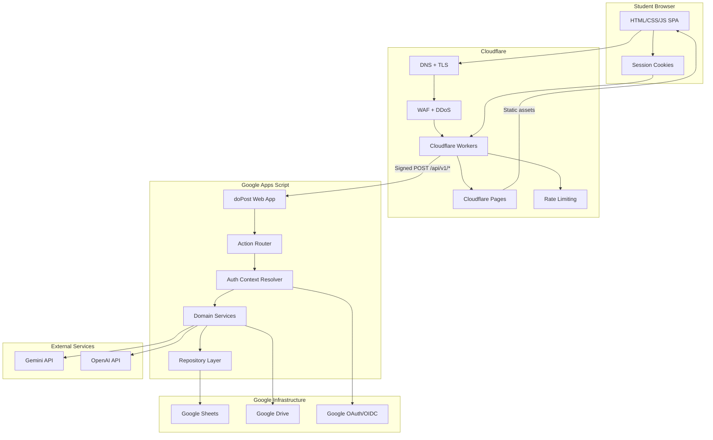
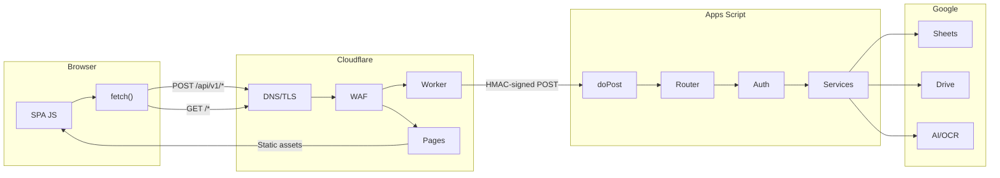
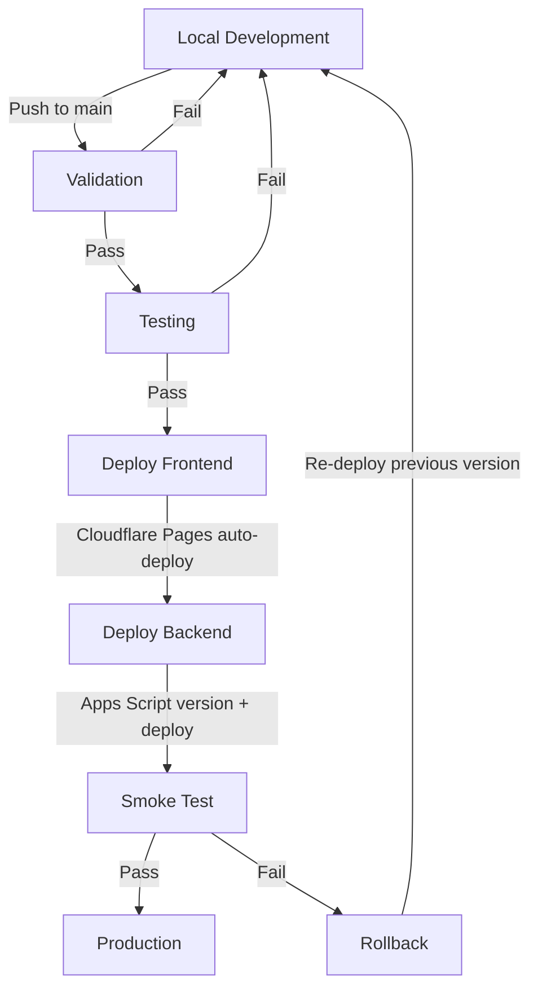

# My-Schedule Deployment, Infrastructure & Environment Architecture

> **Status:** Planning only. This document defines the target deployment and infrastructure architecture.
> It does not create Cloudflare settings, credentials, Apps Script deployments, or modify source/configuration files.
>
> **Basis:** `API_BACKEND.md`, `SECURITY_PRIVACY.md`, `AUTHENTICATION.md`, `ARCHITECTURE.md`, `DATABASE.md`, `COR_AI_PIPELINE.md`
>
> **Date:** 2026-08-31

---

## 1. Production Architecture

### 1.1 Layer Responsibilities

```text
Student Browser (native HTML/CSS/JS SPA)
    |
    | HTTPS + session cookies
    v
Cloudflare Edge
    |-- Cloudflare Pages (static hosting)
    |-- Cloudflare Workers/API Gateway (proxy, auth, rate limiting)
    |-- DNS, SSL/TLS termination
    |-- DDoS protection, WAF rules
    |
    | Signed API requests (HMAC + nonce)
    v
Google Apps Script (doPost web app)
    |-- Authentication context (Google OIDC session)
    |-- Authorization (owner + capability checks)
    |-- Domain services (academic, enrollment, tasks, notes, COR, admin)
    |-- Repository/data-access layer
    |
    v
Google Sheets / Google Drive / AI Provider (Gemini/OpenAI)
```

### 1.2 Layer Responsibilities Table

| Layer | Owner | Responsibilities | Does NOT |
|---|---|---|---|
| **Browser** | Frontend | UI rendering, form validation, optimistic updates, session cookies | Store secrets, call backend directly |
| **Cloudflare Edge** | Infrastructure | TLS termination, DNS, DDoS, WAF, static hosting, request routing | Execute business logic, access Sheets |
| **Cloudflare Workers** | Infrastructure | HMAC signing, nonce injection, CORS, rate limiting, cookie management | Store student data, render UI |
| **Apps Script** | Backend | Authentication resolution, authorization, CRUD, file storage, AI/OCR | Serve static assets, manage DNS |
| **Google Sheets** | Data | Persistent storage, transactional records | Execute business logic |
| **Google Drive** | Storage | COR file storage (private) | Serve files publicly |
| **AI Provider** | External | OCR/text extraction from COR images | Store persistent data |

### 1.3 Mermaid: Full Production Architecture



---

## 2. Cloudflare Architecture

### 2.1 Cloudflare Pages (Frontend Hosting)

| Property | Value |
|---|---|
| Framework | Static HTML/CSS/JS (no build step) |
| Asset types | HTML, CSS, JS, images (PNG/SVG), fonts |
| Routing | SPA client-side routing via `History API` |
| Cache-Control | Immutable assets: `max-age=31536000, immutable`; HTML: `no-cache` |
| Preview deployments | Per-branch for staging |

### 2.2 Cloudflare Workers (API Gateway)

The Worker sits between the browser and Apps Script. It is the **only component that talks to Apps Script** — the browser never sees the Apps Script URL.

#### Core responsibilities:

```text
1. CORS preflight handling (OPTIONS)
2. Origin validation
3. HMAC signature generation (nonce + timestamp + body hash)
4. Rate limiting (per-user, per-action)
5. Request logging (anonymized)
6. Response proxying
7. Error normalization
```

#### Request lifecycle:

```text
Browser POST /api/v1/tasks
    |
    v
Worker receives request
    |-- Validate Origin header
    |-- Check rate limit (KV-backed)
    |-- Generate HMAC signature:
    |     - timestamp (ms)
    |     - nonce (crypto.randomUUID)
    |     - body SHA-256 hash
    |     - sign with HMAC-SHA256(secret)
    |-- Inject headers:
    |     X-Signature: <hmac>
    |     X-Timestamp: <ms>
    |     X-Nonce: <uuid>
    |     X-Forwarded-For: <sanitized>
    |
    v
Proxy to Apps Script doPost URL
    |
    v
Apps Script validates HMAC, processes, returns JSON
    |
    v
Worker validates response signature
    |
    v
Browser receives response
```

### 2.3 Cloudflare WAF Rules

| Rule | Action | Purpose |
|---|---|---|
| Block known bot categories | Block | Reduce noise |
| Rate limit `/api/*` per IP | Throttle | Abuse protection |
| SQL injection patterns | Block | Defense-in-depth |
| XSS patterns | Block | Defense-in-depth |
| File upload size limit | Block | Prevent oversized COR uploads |
| Challenge suspicious traffic | JS Challenge | Bot mitigation |

### 2.4 DNS Configuration

```text
Domain: myschedule.example.com
    |-- myschedule.example.com          -> Cloudflare Pages (frontend)
    |-- api.myschedule.example.com      -> Cloudflare Worker (proxy)
    |-- *                              -> Cloudflare Pages (SPA fallback)
```

---

## 3. Frontend Hosting

### 3.1 Static Asset Architecture

| Asset Type | Cache Strategy | Cache-Control Header |
|---|---|---|
| `index.html` | Always revalidate | `no-cache` |
| `*.css` | Content-hashed filenames | `max-age=31536000, immutable` |
| `*.js` | Content-hashed filenames | `max-age=31536000, immutable` |
| Images (PNG/SVG) | Content-hashed filenames | `max-age=31536000, immutable` |
| Fonts | Content-hashed filenames | `max-age=31536000, immutable` |

### 3.2 SPA Routing

```text
All routes:
    /dashboard
    /schedule
    /tasks
    /notes
    /cor
    /admin/*
    /login
    /onboarding
    |
    v
Cloudflare Pages serves index.html (SPA fallback)
    |
    v
Client-side router handles navigation
```

### 3.3 Build/Deployment Process

```text
Local:
    Edit HTML/CSS/JS files
    |
    v
Validation:
    - HTML validator
    - CSS linter
    - JS linter + type checks (if applicable)
    |
    v
Build:
    - Content-hash filenames for cache-busting
    - Generate asset manifest
    - Optimize images
    |
    v
Deploy:
    - Push to git branch
    - Cloudflare Pages auto-deploys (preview) or manual promote (production)
    |
    v
Smoke test:
    - Verify all routes load
    - Verify API proxy works
    - Verify authentication flow
```

### 3.4 Environment Configuration

| Variable | Development | Production |
|---|---|---|
| `API_BASE_URL` | `http://localhost:8787/api` (Wrangler) | `https://api.myschedule.example.com` |
| `GOOGLE_CLIENT_ID` | Dev OAuth client | Production OAuth client |
| `APP_VERSION` | `dev` | Semantic version |

These are embedded at build time, **not** at runtime. The frontend is fully static.

---

## 4. API Routing

### 4.1 Route Structure

```text
/api/v1/{action}
```

All API requests are `POST` to `/api/v1/{action}`. The action is extracted from the URL path.

### 4.2 Request Flow Mermaid Diagram



### 4.3 Cloudflare Worker Route Mapping

| Worker Route | Target | Method |
|---|---|---|
| `/api/v1/*` | Apps Script `doPost` | POST |
| `/*` (non-API) | Cloudflare Pages | GET |

### 4.3 API Discovery

The frontend discovers the API base URL from a build-time constant:

```javascript
const API_BASE = 'https://api.myschedule.example.com/api/v1';
```

The browser never learns the Apps Script deployment URL. The Worker is the sole proxy.

### 4.4 Request Envelope (Browser to Worker)

```json
{
    "action": "tasks.create",
    "payload": { "title": "Review notes", "dueDate": "2026-09-05" },
    "requestId": "uuid-v4",
    "clientVersion": "1.0.0"
}
```

### 4.5 Worker-Injected Headers

| Header | Value | Purpose |
|---|---|---|
| `X-Signature` | HMAC-SHA256(body + timestamp + nonce) | Request integrity |
| `X-Timestamp` | Unix milliseconds | Replay prevention |
| `X-Nonce` | UUID v4 | Replay prevention (5-min TTL) |
| `X-Forwarded-For` | Sanitized IP | Server-side rate limiting |

### 4.6 HMAC Signature Algorithm

```text
message = timestamp + "." + nonce + "." + SHA256(body)
signature = HMAC-SHA256(secret, message)
```

Apps Script validates:
1. Signature matches (using shared secret from PropertiesService)
2. Timestamp is within 5 minutes of server time
3. Nonce not seen in last 5 minutes (CacheService)

---

## 5. Apps Script Deployment

### 5.1 Deployment Model

| Property | Value |
|---|---|
| Type | Web App (`doPost`) |
| Execute as | Owner (service account Google identity) |
| Who has access | Anyone (access controlled by HMAC + auth context) |
| Versioning | Versioned deployments with labels |
| Endpoint URL | `https://script.google.com/macros/s/{DEPLOYMENT_ID}/exec` |

### 5.2 Version Management

```text
Development:
    Edit code in Apps Script editor
    Test with latest code (no deployment)
    |
    v
Staging:
    Create new version: v{N}
    Deploy to staging web app
    Test against staging Sheets
    |
    v
Production:
    Deploy version v{N} to production web app
    Update Cloudflare Worker's APPS_SCRIPT_URL secret
    Verify smoke tests pass
    |
    v
Rollback:
    Re-deploy previous version label to production
    (no code changes needed — just redeploy)
```

### 5.3 Rollback Strategy

| Scenario | Recovery |
|---|---|
| Bad code deployed | Re-deploy previous version via Apps Script UI |
| Cloudflare Worker URL wrong | Update Worker secret `APPS_SCRIPT_URL` |
| HMAC secret rotated wrong | Re-rotate via PropertiesService + Worker KV |
| Sheets schema broken | Restore from backup spreadsheet |

### 5.4 Apps Script Environment Configuration

| Property | Storage | Access |
|---|---|---|
| `HMAC_SECRET` | Script Properties | Server-side only |
| `APPS_SCRIPT_URL` | Worker KV | Worker only |
| `SHEET_IDS` | Script Properties | Server-side only |
| `DRIVE_FOLDER_IDS` | Script Properties | Server-side only |
| `AI_PROVIDER_API_KEY` | Script Properties | Server-side only |
| `SESSION_SECRET` | Script Properties | Server-side only |

---

## 6. Google Infrastructure Ownership

### 6.1 Resource Ownership Model

```text
Google Account (Project Owner)
    |-- Project: myschedule-prod
    |     |-- Google Sheets (database)
    |     |-- Google Drive (COR storage)
    |     |-- Google Apps Script (backend)
    |     |-- OAuth/OIDC (authentication)
    |     |-- APIs: Sheets, Drive, Gemini
    |
    |-- Separate: Student Google Accounts
          |-- Used only for OIDC authentication
          |-- No project resource access
```

### 6.2 Access Control Matrix

| Resource | Project Owner | Service Account (Apps Script) | Students |
|---|---|---|---|
| Google Sheets | Full | Read/Write (scoped) | None |
| Google Drive (project) | Full | Read/Write (scoped) | None |
| Google Drive (students) | None | None | Own files only |
| Apps Script | Edit + Deploy | Execute | None |
| OAuth Config | Admin | Validate tokens | Authenticate |
| AI Provider | Billing | API calls | None |

### 6.3 Separation from Student Accounts

- Students authenticate via Google OIDC — their Google identity is used **only** for identity verification.
- The project's Google infrastructure (Sheets, Drive, Apps Script) is owned by a separate service Google account.
- Students never have direct access to project Sheets, Drive, or Apps Script.
- The Apps Script `Session.getActiveUser()` returns the student's Google identity for authorization checks.

---

## 7. Environment Separation

### 7.1 Environment Definitions

| Environment | Purpose | Data | Apps Script | Cloudflare |
|---|---|---|---|---|
| **Development** | Local iteration | Local mock or dev Sheets | Unpublished (editor only) | Wrangler dev |
| **Production** | Live users | Production Sheets | Published web app | Cloudflare Pages + Workers |

### 7.2 Configuration Isolation

| Config | Development | Production |
|---|---|---|
| Google Sheets | Dev spreadsheet (project owner only) | Production spreadsheet |
| Google Drive | Dev folder | Production folder |
| OAuth Client ID | Dev OAuth client | Production OAuth client |
| HMAC Secret | Dev secret (local) | Production secret (Worker KV) |
| AI Provider Key | Dev/test key | Production key |
| API Base URL | `http://localhost:8787/api` | `https://api.myschedule.example.com/api` |
| Rate limits | Disabled or very high | Enforced per API_BACKEND.md |

### 7.3 Prevention of Cross-Environment Contamination

```text
Rules:
    1. Dev and prod use different Google OAuth Client IDs
    2. Dev and prod use different HMAC secrets
    3. Dev and prod point to different Google Sheets
    4. Dev never has access to production secrets
    5. Production never uses dev configuration
    6. Cloudflare Workers use separate Worker bindings per environment
```

---

## 8. Configuration Management

### 8.1 Configuration Categories

| Category | Examples | Storage | Deployment |
|---|---|---|---|
| **Public** | App version, public feature flags | Build-time constants | Embedded in JS bundle |
| **Private** | API base URL, OAuth client ID | Build-time or Worker env | Per-environment |
| **Secrets** | HMAC key, AI API keys, session secret | Worker KV / Script Properties | Manual rotation |

### 8.2 Configuration Sources

```text
Browser:
    - Build-time constants (embedded in JS)
    - Never secrets

Cloudflare Worker:
    - Environment bindings (per Worker)
    - KV namespace for dynamic secrets
    - Never committed to git

Apps Script:
    - Script Properties (encrypted at rest by Google)
    - Drive metadata (folder IDs)
    - Never hardcoded in source
```

---

## 9. Secrets Management

### 9.1 Secret Classification

| Secret | Where Stored | Who Accesses | Rotation |
|---|---|---|---|
| HMAC signing secret | Worker KV + Script Properties | Worker + Apps Script | Quarterly |
| Session encryption key | Script Properties | Apps Script | Quarterly |
| AI provider API key | Script Properties | Apps Script | As needed |
| Google OAuth client secret | Google Cloud Console | OAuth flow only | As needed |
| Apps Script deployment URL | Worker KV | Worker | On redeploy |

### 9.2 Secrets That Must NEVER Appear In

- Frontend JavaScript bundles
- HTML files
- Git repository (any branch)
- Google Sheets (any sheet)
- Cloudflare Pages configuration
- Logs or error messages
- URL query parameters
- Client-side localStorage/sessionStorage

### 9.3 Secret Rotation Procedure

```text
1. Generate new secret
2. Update Apps Script Properties (if GAS-side)
3. Update Worker KV (if Worker-side)
4. Deploy new Apps Script version (if needed)
5. Update Worker (if needed)
6. Verify all API calls succeed
7. Invalidate old secret after grace period
```

---

## 10. CORS & Browser Security Headers

### 10.1 CORS Strategy

```text
Allowed Origins:
    - https://myschedule.example.com (production)
    - http://localhost:8787 (development via Wrangler)
    - https://*.pages.dev (preview deployments)

NOT Allowed:
    - * (wildcard)
    - Any other origin
```

### 10.2 CORS Headers (Set by Worker)

```text
Access-Control-Allow-Origin: https://myschedule.example.com
Access-Control-Allow-Credentials: true
Access-Control-Allow-Methods: POST, OPTIONS
Access-Control-Allow-Headers: Content-Type, X-Request-Id, X-Client-Version
Access-Control-Max-Age: 86400
```

### 10.3 Security Headers (Set by Cloudflare)

| Header | Value | Purpose |
|---|---|---|
| `Strict-Transport-Security` | `max-age=31536000; includeSubDomains` | Force HTTPS |
| `X-Content-Type-Options` | `nosniff` | Prevent MIME sniffing |
| `X-Frame-Options` | `DENY` | Prevent clickjacking |
| `Content-Security-Policy` | `default-src 'self'; script-src 'self'; style-src 'self' 'unsafe-inline'` | XSS prevention |
| `Referrer-Policy` | `strict-origin-when-cross-origin` | Referrer control |
| `Permissions-Policy` | `camera=(), microphone=(), geolocation=()` | Feature restrictions |

### 10.4 Preflight Behavior

```text
Browser sends OPTIONS /api/v1/tasks.create
    |
    v
Worker responds:
    204 No Content
    Access-Control-Allow-Origin: https://myschedule.example.com
    Access-Control-Allow-Methods: POST, OPTIONS
    Access-Control-Allow-Headers: Content-Type, X-Request-Id, X-Client-Version
    Access-Control-Max-Age: 86400
    |
    v
Browser sends actual POST (no preflight for 24h)
```

---

## 11. Cache Strategy

### 11.1 Cloudflare Cache Rules

| Resource | Cache Level | TTL | Invalidation |
|---|---|---|---|
| Static assets (hashed) | Standard | 1 year | Content-hash new filename |
| `index.html` | Bypass | None | Always revalidate |
| `/api/*` | Bypass | None | Never cached by Cloudflare |
| Fonts | Standard | 1 year | Content-hash new filename |

### 11.2 Browser Cache Rules

```text
Static assets: Cache-Control: max-age=31536000, immutable
HTML shell: Cache-Control: no-cache (revalidate every time)
API responses: No cache headers (browser default: revalidate)
```

### 11.3 Shared Academic Configuration (Apps Script)

| Data | Cache Key Pattern | TTL | Invalidation Trigger |
|---|---|---|---|
| Departments | `cfg:departments:{semester}` | 1 hour | Admin mutation |
| Programs | `cfg:programs:{semester}` | 1 hour | Admin mutation |
| Campuses | `cfg:campuses` | 24 hours | Admin mutation |
| Buildings | `cfg:buildings:{campus}` | 24 hours | Admin mutation |
| Rooms | `cfg:rooms:{building}` | 24 hours | Admin mutation |
| Subjects | `cfg:subjects:{program}` | 1 hour | Admin mutation |
| Sections | `cfg:sections:{semester}` | 30 min | Admin mutation |

### 11.4 Private User Data (Apps Script CacheService)

| Data | Cache Key Pattern | TTL | Scope |
|---|---|---|---|
| User profile | `usr:{uid}:profile` | 5 min | User-only |
| Active schedule | `usr:{uid}:schedule:{term}` | 2 min | User-only |
| Tasks list | `usr:{uid}:tasks` | 1 min | User-only |
| Notes list | `usr:{uid}:notes` | 1 min | User-only |
| Session context | `sess:{uid}:{version}` | 30 min | User-only |

### 11.5 Cache Isolation Rule

```text
CRITICAL: Cache keys MUST include user_id or session scope.
Never return cached data across user boundaries.
Admin queries are NEVER cached.
COR file metadata is NEVER cached beyond the request.
```

---

## 12. Monitoring

### 12.1 Cloudflare Monitoring

| Signal | Method | Alert Threshold |
|---|---|---|
| Worker errors (5xx) | Cloudflare Analytics | > 1% error rate |
| Worker invocations | Cloudflare Analytics | Unusual spike |
| CPU time per request | Worker logs | > 50ms average |
| DDoS events | Security Events | Any active mitigation |
| WAF blocks | Security Events | Sustained spike |

### 12.2 Apps Script Monitoring

| Signal | Method | Alert Threshold |
|---|---|---|
| Execution time | Execution log | > 30 seconds average |
| Quota exhaustion | Apps Script dashboard | Any daily limit hit |
| Uncaught exceptions | Stackdriver Logging | Any occurrence |
| Trigger failures | Apps Script dashboard | Any failure |
| Rate limit hits | Operational log | > 10 per minute |

### 12.3 API-Level Monitoring

| Signal | What It Means | Action |
|---|---|---|
| 401 spike | Auth context resolution failures | Check Google OAuth status |
| 403 spike | Authorization policy changes | Review admin mutations |
| 409 spike | Concurrency conflicts | Review session version logic |
| 413 spike | File upload issues | Review COR file size limits |
| 429 spike | Rate limiting active | Review rate limit configuration |
| 500 spike | Server errors | Check execution logs |
| 503 spike | Provider failure (AI/OCR) | Check external API status |

### 12.4 What NOT to Log

```text
NEVER log:
    - Student passwords or tokens
    - COR file contents or extracted text
    - HMAC secrets or session keys
    - Google OAuth refresh tokens
    - Full student profile data
    - Schedule/task/note content (beyond IDs)
```

### 12.5 Structured Log Format

```json
{
    "timestamp": "2026-08-31T10:00:00Z",
    "level": "ERROR",
    "service": "api-gateway",
    "action": "tasks.create",
    "userId": "anon_abc123",
    "statusCode": 500,
    "duration_ms": 450,
    "error": "SHEETS_TIMEOUT",
    "requestId": "uuid-1234"
}
```

---

## 13. Backup & Recovery

### 13.1 Backup Strategy

| Resource | Backup Method | Frequency | Retention |
|---|---|---|---|
| Google Sheets (database) | Automated copy to backup spreadsheet | Daily | 30 days |
| Google Drive (COR files) | Google Workspace backup | Continuous (Google-side) | Per policy |
| Apps Script source | Git repository | On every change | Indefinite |
| Cloudflare config | Infrastructure-as-code (if used) | On every change | Indefinite |
| Cloudflare KV (secrets) | Manual export | On rotation | Until rotated |

### 13.2 Recovery Scenarios

| Scenario | Recovery Steps | RTO | RPO |
|---|---|---|---|
| Sheets corruption | Restore from daily backup spreadsheet | < 1 hour | < 24 hours |
| Accidental row deletion | Restore individual rows from backup | < 30 min | < 24 hours |
| Apps Script bad deploy | Re-deploy previous version | < 5 min | 0 |
| Cloudflare misconfiguration | Rollback Worker via dashboard | < 10 min | 0 |
| COR Drive failure | Google-side restore from trash | < 24 hours | 24 hours |
| Complete infrastructure loss | Rebuild from git + backup sheets | < 4 hours | < 24 hours |

### 13.3 Data Recovery Priority

```text
Priority 1 (Critical): Student enrollments and schedules
Priority 2 (High): Academic configuration and COR records
Priority 3 (Medium): Tasks and notes
Priority 4 (Low): Announcements and audit logs
```

---

## 14. Deployment Workflow

### 14.1 Deployment Pipeline



**Deployment steps (detailed):**

```text
1. Local Development
   Edit HTML/CSS/JS (frontend) or Apps Script code (backend)

2. Validation
   Frontend: HTML validation, CSS lint, JS lint
   Backend: Apps Script editor checks
   Architecture docs: Update planning documents

3. Testing
   Manual testing in Wrangler dev (frontend)
   Apps Script editor testing (backend)
   Integration testing (full stack)

4. Deploy Frontend (Cloudflare Pages)
   Push to main branch
   Cloudflare Pages auto-deploys
   Verify static assets load

5. Deploy Backend (Apps Script)
   Create new version in Apps Script editor
   Deploy as web app
   Update Cloudflare Worker config if URL changed
   Verify HMAC handshake works

6. Smoke Test
   Authentication flow
   Bootstrap response
   CRUD operations (tasks, notes)
   Schedule operations
   COR upload (if applicable)

7. Production
   Monitor error rates for 15 minutes
   Confirm all smoke tests pass
```

### 14.2 Deployment Checklist

```text
Pre-deployment:
    [ ] All architecture docs updated
    [ ] Frontend changes tested locally
    [ ] Backend changes tested in Apps Script editor
    [ ] No secrets in committed code
    [ ] HMAC secret rotation not needed (or planned)

Deployment:
    [ ] Frontend deployed to Cloudflare Pages
    [ ] Backend deployed to Apps Script
    [ ] Cloudflare Worker config updated (if needed)
    [ ] DNS propagation verified

Post-deployment:
    [ ] Smoke tests pass
    [ ] Authentication flow works end-to-end
    [ ] No error spike in first 15 minutes
    [ ] Rollback plan confirmed (previous Apps Script version)
```

---

## 15. Rollback Strategy

### 15.1 Frontend Rollback

```text
Cloudflare Pages:
    1. Go to Cloudflare Pages dashboard
    2. Select the deployment history
    3. Promote the previous deployment to production
    4. Verify the rollback worked
```

### 15.2 Backend Rollback (Apps Script)

```text
Apps Script:
    1. Go to Apps Script editor
    2. Deploy > Manage deployments
    3. Edit the current deployment
    4. Select previous version
    5. Deploy
    6. Verify API calls succeed
```

### 15.3 Worker Rollback

```text
Cloudflare Workers:
    1. Go to Workers dashboard
    2. Select the Worker
    3. View deployment history
    4. Roll back to previous deployment
    5. Or: update environment variable to point to previous Apps Script URL
```

### 15.4 Data Rollback

```text
If data is corrupted:
    1. Stop all write operations (take Apps Script offline temporarily)
    2. Identify corruption scope
    3. Restore from daily backup spreadsheet
    4. Verify data integrity
    5. Re-enable write operations
```

---

## 16. CI/CD Recommendation

### 16.1 Current State Assessment

Given the architecture (static HTML/CSS/JS frontend + Google Apps Script backend):

| Component | CI/CD Applicable? | Recommendation |
|---|---|---|
| Frontend (static) | Yes | Cloudflare Pages auto-deploy from git |
| Apps Script | Limited | Manual deployment via editor (no git-native CI) |
| Architecture docs | Yes | Lint/validation checks on PR |

### 16.2 Recommended CI/CD Setup

```text
GitHub Actions:
    Trigger: Push to main
    |
    v
    Jobs:
        1. Lint & validate HTML/CSS/JS
        2. Check architecture doc consistency
        3. Deploy to Cloudflare Pages (via Wrangler or Pages API)
    |
    v
    Manual gate:
        4. Deploy Apps Script version (human decision)
        5. Verify smoke tests
```

### 16.3 Secrets in CI/CD

| Secret | Storage | Used By |
|---|---|---|
| Cloudflare API token | GitHub Actions secrets | Frontend deployment |
| Cloudflare Account ID | GitHub Actions secrets | Frontend deployment |
| Apps Script deployment | Manual (human) | Backend deployment |

### 16.4 What CI/CD Should NOT Do

- Automatically deploy Apps Script (always manual, human-gated)
- Access production Google Sheets
- Store or expose HMAC secrets in logs
- Run against production data

---

## 17. Failure Scenarios

### 17.1 Failure Matrix

| Scenario | Impact | Detection | Recovery | Prevention |
|---|---|---|---|---|
| Google Sheets API down | All writes fail | 5xx spike | Retry + user notification | Quota monitoring |
| Apps Script timeout | Request fails | 408/504 response | Client retry | Optimize queries |
| Cloudflare Worker crash | API unreachable | Worker error rate | Auto-restart + alert | Error handling |
| AI/OCR provider down | COR processing fails | Processing errors | Queue + retry | Fallback provider |
| HMAC secret mismatch | All requests rejected | 401 spike | Re-sync secrets | Rotation procedure |
| Google OAuth outage | No authentication | 401 spike | User notification | Google status monitoring |
| DNS failure | Site unreachable | User reports | DNS failover | Multi-provider DNS |
| COR Drive full | Uploads fail | 413/errors | Archive old files | Retention policy |
| Apps Script quota exceeded | Slow/no responses | Dashboard alerts | Wait + optimize | Quota monitoring |
| Cache corruption | Stale data served | User reports | Cache flush | Cache versioning |

### 17.2 Graceful Degradation

```text
If AI/OCR is down:
    - COR upload accepted (stored in Drive)
    - Processing queued
    - User notified: "COR received, processing will resume shortly"
    - Batch processing when AI recovers

If Sheets is slow:
    - Cache serves recent data
    - Writes queued in background
    - User sees "Saving..." indicator
    - Conflict resolution on next read

If rate limited:
    - Client receives 429 with Retry-After header
    - Client implements exponential backoff
    - User sees "Please wait a moment" message
```

---

## 18. Security Deployment Gates

### 18.1 Pre-Deployment Security Checks

```text
Must pass before any deployment:
    [ ] No secrets in source code
    [ ] No secrets in HTML/JS bundles
    [ ] HMAC secret is properly stored (Worker KV + Script Properties)
    [ ] CORS allowed origins are explicit (no wildcards for authenticated APIs)
    [ ] CSP headers are set correctly
    [ ] HSTS is enabled
    [ ] OAuth redirect URIs are correct for production domain
    [ ] Apps Script execute-as is set to owner (not user)
    [ ] Drive permissions are scoped (not public)
    [ ] Rate limiting is active on production Worker
```

### 18.2 Runtime Security Verification

```text
After deployment:
    [ ] Verify CORS headers on API responses
    [ ] Verify HMAC validation rejects tampered requests
    [ ] Verify rate limiting triggers under load
    [ ] Verify auth context resolution works for test accounts
    [ ] Verify student cannot access admin endpoints
    [ ] Verify COR files are not publicly accessible
    [ ] Verify error responses do not leak internals
```

### 18.3 Ongoing Security Maintenance

```text
Monthly:
    [ ] Review WAF block/allow lists
    [ ] Review rate limit thresholds
    [ ] Verify backup integrity

Quarterly:
    [ ] Rotate HMAC secret
    [ ] Rotate session encryption key
    [ ] Review Apps Script permissions
    [ ] Review OAuth client configuration
    [ ] Audit access logs
```

---

## 19. Cost & Quota Considerations

### 19.1 Apps Script Platform Quotas

| Resource | Free Tier Limit | Impact |
|---|---|---|
| Execution time | 6 min per execution | Long COR processing must chunk |
| Daily execution | 90 min/day (triggers) | Batch jobs must be scheduled carefully |
| Spreadsheet cells | 10 million cells per spreadsheet | Schema design must be efficient |
| Drive storage | 15 GB (personal) / varies (Workspace) | COR file retention must be managed |
| UrlFetchApp | 20,000 calls/day | AI/OCR calls must be counted |
| CacheService | 50,000 read/write per day | Cache strategy must be selective |
| PropertiesService | 500 KB total | Secrets storage must be compact |
| Concurrent executions | 30 per user | Burst traffic must be handled |

### 19.2 Cloudflare Costs

| Service | Free Tier | Paid Consideration |
|---|---|---|
| Pages | 500 builds/month, unlimited sites | Sufficient for static site |
| Workers | 100,000 requests/day | Sufficient for moderate traffic |
| KV | 100,000 reads/day, 1,000 writes/day | Sufficient for rate limit state |
| DDoS | Unlimited | Free for all plans |

### 19.3 AI Provider Costs

| Provider | Pricing Model | Cost Control |
|---|---|---|
| Gemini | Per-token pricing | Batch processing, max tokens limit |
| OpenAI | Per-token pricing | Fallback to Gemini first |

### 19.4 Quota-Sensitive Operations

```text
CRITICAL QUOTA OPERATIONS (Apps Script):
    1. COR AI/OCR processing: ~5-10 UrlFetchApp calls per COR
       - Budget: ~2,000-4,000 CORs per day maximum
    2. Spreadsheet reads: ~1-3 cells per read operation
       - Budget: ~3-5 million reads per day
    3. Cache reads/writes: ~2-5 per request
       - Budget: ~10,000-25,000 requests per day
    4. Trigger execution: 90 minutes/day
       - Budget: ~900 6-second executions or ~450 12-second executions
```

---

## 20. Open Questions

### 20.1 Resolved

| # | Question | Resolution |
|---|---|---|
| 1 | Frontend hosting platform | Cloudflare Pages (static) |
| 2 | API gateway | Cloudflare Workers |
| 3 | Backend runtime | Google Apps Script |
| 4 | Authentication provider | Google OIDC |
| 5 | DNS provider | Cloudflare |
| 6 | CORS strategy | Explicit origins, no wildcards |
| 7 | Static asset caching | Content-hashed, immutable |
| 8 | Environment separation | Dev + Production |

### 20.2 Open for CHUNK 18+

| # | Question | Notes |
|---|---|---|
| 1 | Should we use GitHub Actions for CI/CD? | Depends on team workflow |
| 2 | Do we need a staging environment? | Current scope: dev + prod only |
| 3 | How often should we back up Sheets? | Daily recommended, but needs confirmation |
| 4 | What is the expected daily active user count? | Determines quota planning |
| 5 | Should COR processing be async (queue) or sync? | Sync is simpler but blocks on AI |
| 6 | Do we need a monitoring dashboard (e.g., Datadog)? | Or is Cloudflare analytics sufficient? |
| 7 | Should we implement blue/green Apps Script deployments? | Currently single deployment |
| 8 | What is the rollback SLA? | Currently manual, could be automated |
| 9 | Should we use Cloudflare R2 instead of Google Drive for COR? | R2 has better CDN integration |
| 10 | How do we handle Apps Script quota exhaustion in production? | Need monitoring + alerting |
| 11 | Should we implement request queuing for high-load scenarios? | Current: direct proxy |
| 12 | What monitoring budget is available? | Cloudflare free vs. paid tools |
| 13 | Should we add a status page (e.g., status.myschedule.example.com)? | For transparency |
| 14 | How do we handle zero-downtime deployments for Apps Script? | Version promotion |
| 15 | Should we implement canary deployments for frontend? | Cloudflare Pages supports this |

---

## CHUNK 18 — Testing, Validation & Quality Assurance Architecture

Design the complete testing, validation, and quality assurance architecture for the My-Schedule platform.

**Planning only. Do not modify application source/configuration files.**

Read all previous planning documents, especially:

- `API_BACKEND.md` (request validation, error model, CRUD matrix)
- `ARCHITECTURE.md` (frontend state, data fetching, service boundaries)
- `AUTHENTICATION.md` (identity flow, session lifecycle)
- `SECURITY_PRIVACY.md` (defense-in-depth, trust boundaries)
- `SCHEDULE_CRUD.md` (revision model, conflict detection, batch operations)
- `ADMIN_ARCHITECTURE.md` (capability model, admin operations)
- `COR_AI_PIPELINE.md` (extraction stages, retry, cost controls)
- `DATABASE.md` (schema, constraints, authorization matrix)

### Testing Strategy

Define:

- Unit testing approach
- Integration testing approach
- End-to-end testing approach
- Security testing approach
- Performance testing approach
- Accessibility testing approach

### Test Coverage Matrix

Create a matrix mapping:

- Services/endpoints to test types
- Frontend components to test types
- Database operations to test types
- Authentication flows to test types
- Error scenarios to test types

### Validation Framework

Define:

- Frontend validation rules (per form/field)
- Backend validation rules (per endpoint)
- Database constraint validation
- Cross-layer validation consistency

### Quality Gates

Define:

- Pre-commit checks
- Pre-deployment checks
- Post-deployment checks
- Production monitoring checks

### Deliverable

Create **`TESTING_QA.md`** containing:

1. Testing strategy overview
2. Unit testing architecture
3. Integration testing architecture
4. End-to-end testing architecture
5. Security testing approach
6. Performance testing approach
7. Accessibility testing approach
8. Test coverage matrix
9. Validation framework (frontend + backend + database)
10. Quality gates
11. Test data management
12. Test environment management
13. Defect tracking and resolution
14. Testing tool recommendations
15. Open questions

Include Mermaid diagrams for:

- Testing pyramid
- CI/CD test integration pipeline

### Constraints

- Planning only.
- Do not modify source/configuration files.
- Do not create test files.
- Do not set up testing frameworks.
- Do not create test databases.
- Follow every previous architecture document.

End with a precise **CHUNK 19 — Performance, Scalability & Monitoring Architecture** handoff.