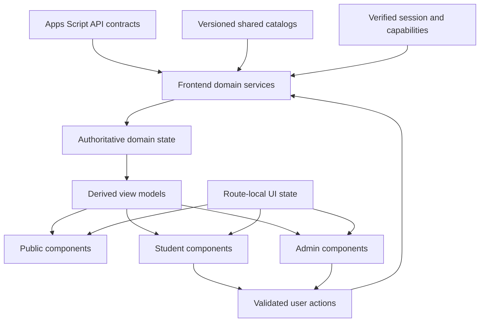
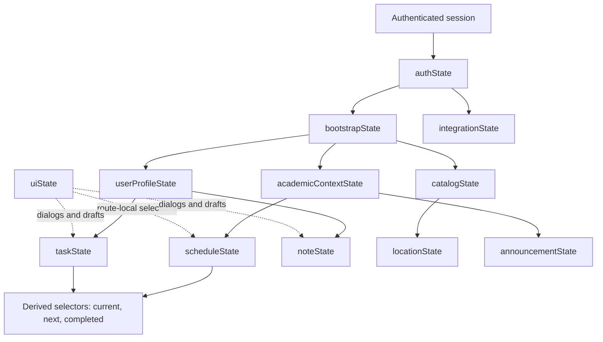
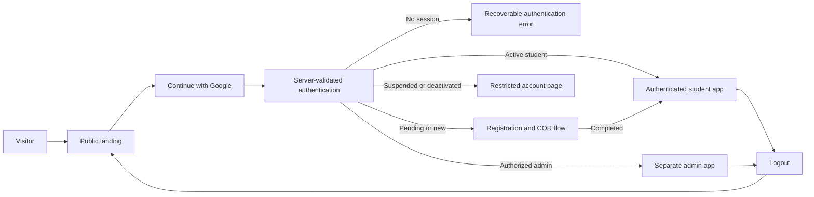

# My-Schedule Frontend UI/UX and Design System Migration

Status: Planning only. This document defines the target frontend architecture and migration rules. It does not authorize source, configuration, API, database, authentication, or UI implementation changes.

Design read: a preservation-focused redesign of a QCU student service with a trust-first, white-first institutional language. The target is a practical student tool, not a marketing-heavy site or a generic AI dashboard.

Design calibration:

```text
DESIGN_VARIANCE: 3
MOTION_INTENSITY: 2
VISUAL_DENSITY: 6
```

The existing native HTML, CSS, and vanilla JavaScript stack remains the initial frontend foundation. A framework migration is not required by the audit and would add implementation risk without solving the main problems: identity, ownership, dynamic data, API boundaries, and duplicated state.

## 1. Design Principles

1. **Student utility first.** The current or next class, today's schedule, and useful actions take precedence over decoration and promotional content.
2. **QCU-focused, not student-specific.** Public surfaces represent My-Schedule and QCU generally. Authenticated surfaces resolve the student's actual college, program, section, campus, subjects, and schedule from backend data.
3. **White-first institutional language.** Preserve the clean white and soft-gray surfaces, QCU blue, restrained red and gold, compact borders, and quiet shadows already present in the project.
4. **Targeted evolution.** Keep reliable workflows and familiar interaction patterns. Change the data source, ownership boundary, accessibility, and responsive behavior before changing visual character.
5. **Sharp, consistent geometry.** Use 4px radii for controls, 8px for framed content, and 12px for dialogs or bottom sheets. Reserve full rounding for avatars, switches, segmented controls, and compact semantic chips.
6. **Information before containers.** Use spacing, headings, dividers, and layout groups before adding cards. Avoid cards inside cards and avoid framing entire page sections as floating panels.
7. **One source of truth.** Server data owns identity and domain records. Derived states such as current class, overdue task, and resolved branding are computed from authoritative records rather than stored separately.
8. **Explicit uncertainty.** Unknown, incomplete, stale, or unmatched data must appear as such. The frontend must not fill gaps with the original student's values or silently accept uncertain COR matches.
9. **Mobile first.** The primary use case is checking a schedule on a phone. Important content must remain readable at 320px without horizontal page overflow.
10. **Accessible by default.** Semantic structure, visible focus, keyboard access, clear labels, reduced motion, and non-color status cues are component requirements.
11. **Fast by default.** Public pages do not load private application code or data. Map, COR preview, admin, and optional Google integration code load only when needed.
12. **Privacy visible in behavior.** The UI must avoid showing a full student number in global chrome, exposing private identifiers in URLs, or rendering cached private data before the authenticated owner is confirmed.

### Visual foundation

Retain and consolidate the existing tokens rather than creating a new visual system:

| Token role | Initial value | Rule |
|---|---:|---|
| Page background | `#F7F8FA` | Default application background |
| Soft background | `#EEF1F5` | Subtle grouping, not a decorative band on every section |
| Surface | `#FFFFFF` | Primary content and controls |
| Border | `#E5E7EB` | Compact 1px separation |
| Primary blue | `#005BAC` | Main action, active navigation, links |
| Dark blue | `#0A4DA2` | Hover/pressed state where contrast remains valid |
| Soft blue | `#E8F2FC` | Selected or informational background |
| Navy | `#0A3D6E` | High-emphasis institutional text where needed |
| Gold | `#F4B400` | Restrained institutional detail, never a competing primary CTA |
| Red | `#C62828` | QCU detail and destructive/error semantics where context is clear |
| Text | `#202124` | Primary content |
| Muted text | `#5F6368` | Secondary content with verified contrast |
| Success | `#2E7D32` | Confirmed success only |

Use Public Sans initially because it is already established and readable. Self-host or pin it during implementation instead of depending on a runtime Google Fonts request. Keep typography compact and use fixed responsive steps, not font sizes calculated from viewport width. Use the spacing scale `4, 8, 12, 16, 20, 24, 32, 40, 48, 64`.

Avoid gradients, glass effects, oversized hero typography, decorative blobs, excessive animation, one-color blue screens, arbitrary pills, and visual patterns that suggest an AI product rather than a student service. Light mode is the documented initial theme; dark mode should not be implied until its tokens and all states are designed and tested.

## 2. Existing UI Assessment

### Current frontend structure

The application is a static HTML/CSS/vanilla JavaScript PWA with no build framework. Shared behavior is concentrated in `assets/js/app.js`; visual rules are concentrated in a large merged stylesheet plus page-specific CSS. The current pages are:

| Page | Current purpose | Assessment |
|---|---|---|
| `index.html` | Personal dashboard | Strong operational content, but unsuitable as a public root because it exposes personal defaults |
| `today.html` | Today's classes | Preserve the focused daily schedule workflow |
| `schedule.html` | Full timetable | Preserve the weekly view and details behavior, then make it responsive and dynamic |
| `workspace.html` | Tasks and Notes tabs | Preserve shared implementation and convert records to authenticated ownership |
| `tasks.html`, `notes.html` | Redirect stubs | Replace with valid route/deep-link behavior using the shared workspace implementation |
| `buildings.html` | Building directory and modal | Preserve and move to shared, admin-managed location data |
| `campus-eta.html` | Route 4 and MapLibre map | Preserve the existing experience and route facts; parameterize campus/location data |
| `google.html` | Classroom/Gmail integration | Keep optional and separate from Google login identity |
| `settings.html` | Local preferences | Convert to user-scoped server settings with accurate cache/privacy wording |
| `privacy.html`, `terms.html` | Public policy pages | Preserve as public routes and revise only when policies are institutionally approved |
| `offline.html` | PWA fallback | Preserve as a public, neutral fallback without personal or CCS-specific branding |

### Strong elements to preserve

- Mobile-first layout, safe-area handling, and compact navigation.
- Public Sans, existing QCU blue/red identity, white surfaces, 1px borders, and restrained shadows.
- Current/next class calculation, countdown behavior, daily status, and week strip where the underlying logic is reliable.
- Schedule cards, weekly timetable, day details, and bottom-sheet behavior.
- Tasks/Notes combined workspace and subject-aware filtering.
- Building cards, building details, campus map, and Route 4 route display.
- Weather, flood, and suspension behavior that fails to an explicit unknown state instead of claiming safety.
- Existing focus styles, touch-target effort, reduced-motion rules, and semantic markup where already correct.
- Service-worker offline shell as a starting point, after public/private caching is separated.

### Main frontend debt

- The public root and authenticated dashboard are the same personal page.
- Personal schedule, name, program, campus, CCS branding, subjects, and locations are embedded in JavaScript, HTML, JSON, or assets.
- `QCU_DEFAULTS` can silently restore one student's data after a fetch failure.
- Browser-global `localStorage` keys are not scoped to the authenticated owner.
- Navigation reflects legacy features rather than the planned student application structure.
- Shared `app.js` and merged CSS create broad coupling and make public/private code separation difficult.
- Responsive schedule behavior still depends on a wide table in places.
- Dialog/bottom-sheet behavior needs complete keyboard focus management.
- The project loads `lucide@latest` from a CDN despite including a local bundle, which weakens reproducibility and offline behavior.
- Metadata, favicon, manifest, offline content, and some labels still present CCS or personal portal identity.
- Authentication, loading, empty, and failure states are inconsistently represented because the current app assumes data always exists.

## 3. Hardcoded-Value Migration

Not every literal must become backend data. Stable product copy, semantic status labels, route names, validation messages, and visual tokens may remain static system values. Academic labels, ownership data, and schedule facts must not.

### Categories

| Category | Definition | Examples |
|---|---|---|
| Static system value | Product-wide value that changes only with a release | Product name, route label, accessibility copy, visual token |
| Shared QCU configuration | Institution-wide admin-managed information | Campus, building, room, announcement, approved asset |
| Authenticated user data | Private identity/profile information for the current account | Preferred/display name, student number, settings |
| Academic configuration | Structured academic catalog and the student's academic context | College, program, term, section, subject |
| Schedule data | User-scoped enrollment and meeting records | Day, time, subject, building, room, provenance |
| UI state | Temporary client interaction state | Active tab, open dialog, unsaved form, loading state |

### Migration inventory

| Current source/value | Category | New data source | UI affected | Priority |
|---|---|---|---|---|
| `assets/js/app.js` greeting and profile values containing `Habib` | Authenticated user data | Authenticated bootstrap profile using `user_id` resolved server-side | Header, greeting, student identity | Critical |
| `BS Computer Science - San Bartolome` in shared header logic | Academic configuration | Active academic context: Program Offering -> Program plus Campus | Header subtitle, profile context | Critical |
| CCS logo in HTML, JavaScript, manifest, service worker, icons, and notifications | Static system value on public surfaces; academic branding on private surfaces | General My-Schedule/QCU app asset for public shell; approved branding resolver for authenticated context | Header, favicon, install metadata, offline page, notification | Critical |
| Personal timetable and subject rows in `app.js` and `data/schedule.json` | Schedule data | Authenticated enrollment/schedule API for selected academic term | Dashboard, Today, Schedule, task/note references | Critical |
| `QCU_DEFAULTS` personal fallback | Schedule data and authenticated user data | Neutral loading/error states or verified owner-scoped cache | All authenticated views | Critical |
| Default subject list and colors in `app.js` | Academic configuration | Current user's enrollments joined to Subjects, with stable presentation `color_key` | Schedule, filters, task/note editors | High |
| Task/note subject options derived from defaults | Academic configuration | Active enrollment subjects for authenticated user | Workspace forms and filters | Critical |
| `qcu-tasks` and `qcu-notes` browser-global records | Authenticated user data | User-owned API records plus optional owner/version-scoped IndexedDB snapshot | Workspace and dashboard summaries | Critical |
| Building/room/descriptions/images in `app.js` and `data/buildings.json` | Shared QCU configuration | Campuses, Buildings, Rooms, and approved asset registry | Schedule location, directory, map | High |
| Building-name substring logic for short labels | Shared QCU configuration | `Buildings.short_name` and explicit aliases | Schedule cards/table and location actions | High |
| San Bartolome name and coordinates in status, ETA, functions, or page code | Shared QCU configuration | Campus configuration and public status service | Status, campus map, Route 4 context | High |
| `Asia/Manila` in schedule/time logic | Shared QCU configuration | Active campus `time_zone`, with institution-approved fallback | Clock, current/upcoming calculations | High |
| Route 4 coordinates, labels, route JSON, and disclaimers | Shared QCU configuration | Versioned transport configuration separated from academic data | Route 4 and map | Medium |
| Static building photographs and college logos addressed by filenames | Shared QCU configuration | Approved asset registry keys resolved to controlled paths | Branding, building cards, details | Medium |
| `saved locally` settings copy | Authenticated user data | User Settings API plus precise cache state | Settings | High |
| Notification preferences and Google integration data in generic local storage | Authenticated user data | User settings/integration APIs plus owner-scoped cache | Settings, status, Google integration | Critical |
| Generated navigation array: Home, Bus, Tasks & Notes, Google, Settings | Static system value | Central route configuration for target authenticated IA | Header and bottom navigation | High |
| `QCU Student Portal`, `QCU Portal`, and inconsistent page titles | Static system value | Central product metadata: My-Schedule plus route title | Header, browser metadata, install UI | Medium |
| Full student number where shown in general identity UI | Authenticated user data | Verified profile, displayed only in profile/administrative contexts with masking where appropriate | Header, profile, admin | High |
| Fixed college/program labels such as CCS and BSCS in reusable presentation | Academic configuration | Branding view model resolved through stable IDs | Header, identity, schedule, profile | Critical |
| Existing QCU academic seed labels | Shared QCU configuration | Departments, Programs, Program Offerings, Sections, Subjects sheets/API | Registration and authenticated academic context | High |
| BSIS addition | Shared QCU configuration | Seed/admin-managed Program record under the confirmed department, using a stable ID and alias set | Registration, profile, filters, branding | High |
| Page-level open tab, selected day, modal visibility, and form draft | UI state | Route-local state or explicit URL-safe route state without private identifiers | Schedule, workspace, dialogs, admin | Low |
| Stable copy such as `No classes scheduled today` | Static system value | Localized/static copy catalog | Empty states | Low |

Migration must remove personal values from runtime fallbacks, not merely hide them. Repository assets that contain legacy branding can remain temporarily during implementation only if no public or authenticated route references them after the new asset resolver is active.

## 4. Dynamic Branding

Branding is a derived presentation concern, not a property inferred from free-form text. Reusable components must consume a centralized `BrandingViewModel` rather than inspect program names, abbreviations, email domains, or asset filenames.

### Resolution path

```text
Authenticated bootstrap
-> active enrollment and academic term
-> program offering
-> program
-> department/college
-> campus and approved asset registry
-> BrandingViewModel
-> UI components
```

Suggested safe presentation contract:

```text
institutionName
productName
departmentName
departmentShortName
programName
programShortName
campusName
logoAssetKey
logoUrl
fallbackText
```

The API may return resolved presentation values or stable IDs plus a bounded catalog. It must not return arbitrary executable markup or unrestricted URLs. The frontend should map approved asset keys to controlled assets, or accept only validated same-origin/provider URLs defined by the backend architecture.

### Fallback order

1. Program-approved asset, only when the academic model supports program-level branding.
2. Department/college-approved asset.
3. Campus-approved asset.
4. General QCU/My-Schedule asset.
5. Text lockup or generated initials from trusted display labels.

Missing branding must never block schedule access. Use a neutral QCU/My-Schedule lockup, retain the textual college/program label if verified, reserve fixed image dimensions to avoid layout shift, and log only the missing configuration key. Do not fall back to CCS.

Public pages always use general QCU/My-Schedule branding. Department/program branding begins only after an authenticated bootstrap resolves the user's current academic context. Where a student has multiple academic contexts, the selected term/enrollment determines the label without changing the global product identity.

## 5. Component Architecture

The current stack should be reorganized into native ES modules and reusable rendering functions/custom component conventions during implementation. A framework or state library is not required. Extract a component when it is reused across domains or contains meaningful accessibility, state, or validation behavior. Do not create a component for every wrapper.

### Shells and navigation

| Component | Responsibility |
|---|---|
| `PublicShell` | Public header, landing content, policy/footer links, authentication states |
| `AuthenticatedShell` | Verified student context, primary navigation, route outlet, session handling |
| `AdminShell` | Separate admin navigation and authorized management context |
| `AppHeader` | Product lockup, route title, compact student context, profile menu trigger |
| `PrimaryNavigation` | One route model rendered as mobile bottom navigation or desktop compact sidebar |
| `ProfileMenu` | Profile, settings, optional integrations, and logout |
| `BrandLockup` | General or resolved approved branding with safe fallback |
| `StudentContext` | Name, program, year/section, campus, and term presentation without exposing unnecessary identifiers |

### Shared interaction primitives

Use a small consistent set: Button, IconButton, Field, Select, Textarea, SegmentedControl, StatusBadge, InlineAlert, LoadingSkeleton, EmptyState, ErrorState, Dialog, BottomSheet, ConfirmDialog, and Pagination. Familiar icons should use the existing Lucide family, served from the local pinned bundle. Provide tooltips and accessible names for unfamiliar icon-only controls.

Dialogs use a bottom sheet on mobile and a centered modal on desktop when the content remains short. Both variants require an accessible name, initial focus, trapped focus, inert background, Escape handling where cancellation is safe, and focus restoration. Long editing workflows should use a page or route, not an oversized modal.

### Student domain components

| Domain | Components | Preservation rule |
|---|---|---|
| Schedule | `CurrentNextPanel`, `TodayTimeline`, `ScheduleCard`, `WeeklySchedule`, `ScheduleTable`, `DayDetailsDialog` | Preserve current/next and week interactions; replace data source and wide mobile table |
| Productivity | `TaskList`, `TaskCard`, `TaskEditor`, `NoteList`, `NoteCard`, `NoteEditor` | Keep combined implementation, enforce owner-scoped data and dynamic academic references |
| Location | `BuildingDirectory`, `BuildingCard`, `BuildingDetails`, `CampusMap`, `Route4Panel` | Preserve map and Route 4 behavior; resolve shared locations dynamically |
| Announcements | `AnnouncementList`, `AnnouncementItem` | Keep compact and audience-scoped |
| Profile | `ProfileSummary`, `AcademicContext`, `AccountSecurityActions` | Separate Google identity from confirmed student profile |

### Registration and admin components

- `CORUpload`
- `CORProcessingStatus`
- `CORReviewStudentFields`
- `CORReviewClasses`
- `DetectedConfirmedIndicator`
- `AcademicMatchWarning`
- `AdminDataTable`
- `AdminMobileList`
- `DeactivationImpactDialog`
- `AuditSummary`

The design skill used for this document explicitly does not define dense dashboards, data tables, or multi-step forms. Those surfaces follow the registration, dashboard, admin, database, and accessibility rules already established in the project documents.



## 6. State Architecture

Frontend state is divided by ownership and lifecycle. Domain state must not be duplicated across page scripts.



### State domains

| State | Authority | Contents |
|---|---|---|
| `authState` | Session/auth API | Authenticated, anonymous, expired, suspended, role/capabilities |
| `bootstrapState` | Bootstrap API | Request status, owner/cache version, destination decision |
| `userProfileState` | User/profile API | Confirmed student profile and safe presentation fields |
| `academicContextState` | Enrollment/term API | Active term, program, section, subjects, selection |
| `catalogState` | Versioned shared APIs | Departments, programs, campuses, subjects, branding references |
| `scheduleState` | Schedule/enrollment API | Meetings and provenance for selected term |
| `taskState` | Tasks API | Owner-scoped summaries or collection |
| `noteState` | Notes API | Owner-scoped summaries or collection |
| `locationState` | Location API | Distinct campuses/buildings/rooms needed by the route |
| `announcementState` | Announcement API | Published records in the user's authorized audience |
| `integrationState` | Integration API | Optional Classroom/Gmail connection state, not login identity |
| `uiState` | Client only | Open panels, active tab, temporary draft, pending confirmation |

Rules:

- The API is authoritative for private/domain state. Client state may optimistically represent a pending action only when the API contract defines rollback and idempotency.
- Current, upcoming, ongoing, completed, overdue, and branding are derived selectors/view models.
- URL state may include non-sensitive route choices such as selected day or term ID only if the ID is opaque and authorization still occurs server-side.
- No student object, token, COR content, or private collection belongs in generic `localStorage`.
- Private cache entries must include authenticated owner identity, schema version, data version, and expiration. Cache data is ignored until bootstrap confirms the same owner.
- Logging out clears in-memory private state and makes owner-scoped cached data inaccessible before navigation returns to the public shell.

## 7. Data-Fetching Strategy

### Initial public load

The public landing loads product identity, static content, an inexpensive session check, and optionally a lazy public status summary. It must not load `app.js`, personal schedule JSON, location catalogs, MapLibre, Google integration logic, or private APIs.

### Authenticated bootstrap

After Google authentication, the frontend first establishes a server-validated session, then requests one bounded `/api/v1/bootstrap` response. The response should contain enough safe information to decide among onboarding, dashboard, restricted account, and admin destinations. It should also include the current user's safe profile summary, active academic context, capabilities, catalog versions, and limited dashboard data where the backend plan approves composition.

### Route loading

- Dashboard: one composed request for identity context, current/today schedule, task/note summaries, and relevant announcements. Load public status separately and lazily.
- Schedule: load the selected term's enrollments and meetings, then resolve distinct location IDs in a batch or through an included relation map.
- Tasks/Notes: dashboard receives summaries; full collections load only on their destinations.
- Map: lazy-load map code, tiles, route data, and the location catalog only when the Map route opens.
- Registration: load the server-owned onboarding state, accepted upload constraints, and only the academic catalogs needed for review.
- Admin: load each management resource on demand with pagination, filters, and capability checks.
- Google integration: load connection state and provider code only when the optional integration surface opens.

### Request behavior

- Deduplicate identical in-flight requests.
- Abort obsolete route requests on navigation.
- Use explicit request deadlines and stable error codes from the API.
- Refresh after successful mutations, catalog version changes, explicit retry, or visibility return when data is stale.
- Do not poll schedules, tasks, or notes. COR processing may use bounded polling or a later job-status mechanism defined by the backend.
- Do not perform one building/room request per schedule row.
- Preserve confirmed route content during a background refresh and mark it stale only when that distinction is useful.

### Cache behavior

Public static assets and the public shell may use CacheStorage through the service worker. Versioned shared catalogs may be cached by catalog version. Private snapshots belong in a user/version-scoped IndexedDB store after successful authorization. Mutations require server confirmation; offline mutation queues are out of scope unless a later phase proves they are necessary.

## 8. Public/Private UI Boundary



Public and authenticated applications require separate entry scripts or native module graphs. The public root does not instantiate the private application shell. The authenticated shell is rendered only after the backend confirms the session and lifecycle state.

Boundary rules:

- `index.html` becomes the public landing page in the future implementation phase.
- The current personal dashboard moves behind an authenticated route.
- Public pages use only general My-Schedule/QCU branding and never preload a cached student's name or schedule.
- Auth callbacks route existing students to Dashboard and new/interrupted students to their authoritative onboarding state.
- Suspended, deactivated, or incomplete accounts receive a purpose-built restricted/recovery page rather than a partially rendered private shell.
- Safe return paths contain no email, student number, token, COR identifier, or arbitrary external URL.
- Privacy and Terms remain publicly accessible.
- Authentication errors show a plain explanation, a retry action, and a route back to the public landing without exposing provider or stack details.

## 9. Registration UI

The registration experience is a focused four-stage flow: Upload, Processing, Review, Confirm. It does not use the student's normal bottom navigation because leaving the flow should be deliberate and recoverable.

### Upload

- Show the signed-in Google identity at a minimal level so the student knows which account is being used.
- Provide a large keyboard-accessible upload target backed by a real file input; drag and drop is an enhancement, not the only control.
- Display server-defined accepted formats and size limit before selection.
- Validate obvious client errors for speed, then repeat all validation server-side.
- Show the chosen filename and safe metadata, not a public file URL.
- Re-upload and cancel actions must explain whether a prior draft/file will be replaced or retained.

### Processing

- Show the actual server processing state and stage. Do not simulate percentage progress when the backend cannot provide it.
- Allow safe navigation away after telling the student that processing can resume on return.
- Use restrained live-region updates and avoid announcing every poll.
- Provide retry only when the server declares the operation retryable.

### Review

- Present Student Information first, then Detected Classes.
- Show the original/detected value beside the editable reviewed value where comparison matters.
- Label provenance using text and icon, such as `Detected`, `Needs review`, and `Confirmed`; do not rely on color.
- Highlight missing, ambiguous, invalid, and conflicting values without silently replacing them.
- Program, campus, section, subject, building, and room controls use dynamic catalogs and preserve an `unmatched` state.
- On mobile, class meetings use stacked editors or expandable rows instead of a wide table.
- Save review progress to the server draft and warn before abandoning unsaved local changes.

### Confirm and recovery

- Confirmation summarizes the profile, academic term, enrollment subjects, and schedule records that will be created.
- The primary action names the effect clearly, such as `Confirm enrollment`.
- Disable duplicate submission while retaining button dimensions and expose a recoverable failure state.
- Interrupted sessions resume from the server's onboarding state, not from browser-only progress.
- A failed extraction may return to upload, allow manual review of partial data, or request another file according to `REGISTRATION_COR.md` and `COR_AI_PIPELINE.md`.
- Detected data does not become active student data until confirmation succeeds.

## 10. Student Dashboard UI

The dashboard is a compact operational view. Student identity is context, not a large hero.

### Mobile visual hierarchy

1. Compact student identity: display name, program, year/section, campus, and active term.
2. Current or next class: subject, state, time, building/room, and direct location action.
3. Today's schedule: remaining and completed meetings in chronological order.
4. Upcoming tasks: bounded summary with a route to all tasks.
5. Recent notes: bounded summary with a route to all notes.
6. Relevant announcements and public status/suspension information.
7. Contextual map/location actions; the full map remains a primary navigation destination.

Current and next class content should appear above the fold on common mobile heights after the compact header. Avoid large welcome copy, decorative metrics, and repeated identity cards.

### Schedule presentation

- Today's view preserves the current timeline/card behavior and explicit Upcoming, Ongoing, Completed, and No Class states.
- Weekly view uses a table only where the viewport supports it. Mobile uses day selection and schedule cards with the same underlying data.
- Multiple meetings for one enrollment remain separate meeting records and display as grouped subject context where helpful.
- Online, TBA, missing location, and inactive location states use explicit labels and suppress invalid map actions.
- The timer updates locally from server-provided schedule data and campus time zone. It should update visible clock/countdown text without re-rendering or refetching the full page every second.

### Supporting content

Tasks, notes, announcements, and status remain secondary to schedule content. Dashboard summaries have stable maximum item counts and clear routes to full views. Empty modules should collapse to useful compact actions instead of consuming the space of a full populated panel.

## 11. CRUD UI Patterns

All student and admin CRUD surfaces share interaction language even when their permissions differ.

| Operation | Pattern |
|---|---|
| Create | Open a labeled form with sensible defaults from the active context; never prefill another user's or uncertain extracted data |
| Edit | Load current authorized record and revision/version; distinguish editable from read-only provenance fields |
| Save | Validate client-side for usability, validate server-side for authority, disable duplicate submit, and show success only after confirmation |
| Cancel | Preserve the existing record, warn only when unsaved changes exist, and restore focus/navigation context |
| Retry | Repeat the same safe operation with the same mutation/idempotency key when the API contract supports it |
| Delete | Use exact target and impact language; do not use ambiguous `Are you sure?` alone |
| Deactivate/archive | Prefer for referenced academic/admin records and explain downstream visibility without destroying history |

Field errors appear next to the field and in a form-level summary linked to the invalid controls. Persistent API errors stay with the form or content region; toasts are reserved for brief confirmations. Buttons retain stable dimensions during loading.

Use `expectedVersion` or the backend's equivalent for concurrent edits. When a conflict occurs, present the latest server value and the student's draft, then let the user review rather than silently overwriting either.

Tasks and notes require a delete confirmation until an undo/restore contract exists. Official COR-derived enrollment cannot be presented as casually deletable. Admin actions affecting students, schedules, academic catalogs, roles, or COR records require explicit target, effect, reason where required, and confirmation.

## 12. Navigation Architecture

### Student navigation

The target primary destinations are:

```text
Dashboard
Schedule
Tasks
Notes
Map
```

Profile, Settings, optional Google Classroom/Gmail integration, account state, and Logout belong in the authenticated header/profile menu. Tasks and Notes may continue sharing one workspace implementation while appearing as separate deep links or tabs so navigation remains clear.

On mobile, render a five-item bottom navigation with safe-area padding, stable icon/button dimensions, short labels, and `aria-current`. On desktop, render the same route model as one compact sidebar or top navigation. Never display both patterns simultaneously.

### Public and admin navigation

The public landing has a compact product header, `Continue with Google`, and links to Privacy, Terms, and relevant project information. It does not show student application routes.

The admin application uses a separate shell and grouped management navigation. Student and admin modes must not be mixed in one crowded menu. A user with both capabilities may use an explicit, server-authorized mode switch that returns to an approved default route.

Route titles and navigation labels come from a central static route registry. Academic names shown inside the route come from data. The Back action should return to a stable prior application destination, not depend on browser history after sensitive authentication or confirmation transitions.

## 13. Responsive Behavior

Use three practical ranges and test the endpoints rather than designing only at named devices:

```text
Mobile: 320px to 599px
Tablet: 600px to 1023px
Desktop: 1024px and above
```

| Surface | Mobile | Tablet | Desktop |
|---|---|---|---|
| App shell | Single content column, bottom navigation | Wider single or selective two-column layout | Compact sidebar/top navigation with constrained content width |
| Dashboard | Current/next and today first; summaries stacked | Schedule plus one supporting column where space permits | Balanced operational grid without card nesting |
| Weekly schedule | Day selector plus cards/list | Readable table with horizontal scroll only as fallback | Full semantic table with stable columns |
| Forms | One column, full-width controls | One column or limited paired fields | Two columns only for related short fields |
| COR review | Student fields then stacked class editors | Grouped sections, optional table-like alignment | Structured table/editor where labels and values remain readable |
| Admin data | Key-value rows and detail route | Reduced-column list plus detail | Paginated/filterable semantic table |
| Map | Stable min-height/aspect ratio, controls clear of bottom nav | Larger map with adjacent compact details where useful | Map and location/route details can share width |
| Dialogs | Bottom sheet for short actions; full route for long forms | Bottom sheet or centered dialog by content | Centered dialog with bounded width |

No page may require horizontal viewport scrolling. Long college, program, section, building, subject, and student names must wrap without shrinking text based on viewport width. Tables may scroll within an explicitly labeled container only when a card/list alternative would lose important comparison value.

Touch controls use at least 44px targets, preferably 48px for primary mobile actions. Fixed-format elements such as bottom navigation, map controls, week strips, icon buttons, and schedule time columns require stable dimensions so dynamic content cannot shift the layout.

## 14. Accessibility

- Use semantic `header`, `nav`, `main`, `aside`, and `footer` landmarks with one clear page `h1`.
- Include a skip link to main content in public, student, and admin shells.
- Use native buttons, links, inputs, selects, textareas, tables, and file inputs before custom roles.
- Every form control has a persistent label; placeholders are examples, not labels.
- Associate help and error text with fields. On submit, focus an error summary that links to invalid fields.
- Provide clear visible focus with sufficient contrast on every interactive element.
- Mark active navigation with `aria-current`, selected tabs with correct tab semantics, and segmented controls with their appropriate native/ARIA pattern.
- Use `aria-live` only for important asynchronous changes such as authentication outcome, upload status, mutation result, or current-class transition. Avoid noisy clock announcements.
- Trap and restore focus for modal dialogs and make background content inert.
- Ensure all drag/drop, map, schedule, tab, filter, and menu operations have keyboard equivalents.
- Meet WCAG AA contrast for text and controls. Target stronger contrast for important public landing text where practical.
- Never communicate status, validation, provenance, conflict, or schedule state by color alone.
- Honor `prefers-reduced-motion`; functional state changes remain immediate and understandable without animation.
- Test at 200 percent zoom and a 320px viewport without content loss or overlap.
- Provide a textual building/location list and direct details as an alternative to visual map interaction.
- Give schedule tables captions and header associations. Mobile schedule cards remain semantically grouped with readable day, time, subject, and location labels.
- Images require meaningful alt text when informative and empty alt text when decorative. College/building logos must not repeat adjacent textual information unnecessarily.

## 15. Performance

### Module boundaries

Keep the native stack and divide code by entry point/domain during implementation:

- Public landing and authentication state.
- Authenticated shell/bootstrap.
- Dashboard.
- Schedule.
- Tasks/Notes workspace.
- Location, map, and Route 4.
- Registration/COR review.
- Admin management.
- Optional Google Classroom/Gmail integration.

This is native ES module and page-entry splitting, not a promise of framework bundler-level code splitting. A build system should be introduced only if a later implementation phase demonstrates a concrete need.

### Loading and rendering rules

- Lazy-load MapLibre, map data, COR previews, admin tables, and optional integrations.
- Pin and serve the existing Lucide bundle locally instead of `unpkg.com/lucide@latest`.
- Self-host/pin Public Sans with `font-display: swap` when licensing and assets are confirmed.
- Reserve dimensions for logos, building images, COR previews, maps, and skeletons to prevent layout shift.
- Use responsive image sizes and approved optimized assets; do not ship full-resolution files into small cards.
- Cache public assets and versioned shared catalogs appropriately.
- Use owner/version-scoped IndexedDB snapshots only after authenticated ownership is verified.
- Update clocks/countdowns with focused text updates and recalculate class state at meaningful boundaries. Do not re-render the full dashboard every second.
- Prefer one composed dashboard response and batched location resolution over many sequential requests.
- Deduplicate requests and rendering subscriptions across routes.
- Measure before adding memoization, virtualized lists, a build framework, or complex offline synchronization.

Target Web Vitals should be measured on representative mobile hardware and constrained networks. The implementation phase should establish page budgets after actual assets and Apps Script response times are known.

## 16. Existing-Feature Migration Matrix

| Feature | Classification | Migration decision and justification |
|---|---|---|
| Current/next schedule logic | KEEP, MODIFY | Preserve reliable calculations; consume API meetings, active term, and campus time zone |
| Today's schedule UI | KEEP, MODIFY | Preserve card/timeline behavior; remove personal defaults and render explicit states |
| Full weekly schedule | KEEP, MODIFY | Preserve overview and detail interaction; add mobile day/card presentation |
| Week strip and day details modal | KEEP, MODIFY | Preserve familiar behavior; implement accessible dialog focus and dynamic dates/data |
| Tasks | KEEP, MODIFY | Move to authenticated owner API with dynamic enrolled-subject references and safe CRUD |
| Notes | KEEP, MODIFY | Move to authenticated owner API; retain a simple plain-text model and safe CRUD |
| Combined Tasks/Notes workspace | KEEP, MODIFY | Reuse shared code while separate navigation destinations deep-link to the correct tab |
| Building directory and details | KEEP, MODIFY | Replace embedded catalog/assets with shared location APIs and approved asset keys |
| Campus map | KEEP, MODIFY | Preserve visual behavior; use dynamic campus/building/room resolution and lazy loading |
| Route 4 | KEEP, MODIFY | Preserve known route facts and disclaimers; store as versioned transport configuration separate from schedules |
| Weather, flood, and suspension | KEEP, MOVE | Treat as public/shared status data and authenticated overlay; preserve fail-unknown behavior |
| Settings | KEEP, MODIFY | Replace local-only claims with user-scoped settings, privacy controls, cache state, and logout |
| Profile | MOVE | Move to authenticated profile route/menu and resolve verified student/academic data dynamically |
| Google Classroom/Gmail | MOVE, MODIFY | Keep optional under Profile/Settings or Integrations; separate it from login identity |
| Existing generated header | MODIFY | Resolve product branding and compact student context; do not show unnecessary full identifiers |
| Existing bottom navigation | REPLACE | Use Dashboard, Schedule, Tasks, Notes, Map from one route registry |
| Personal root dashboard | MOVE | Preserve useful modules behind authentication |
| `index.html` personal content | REPLACE | Make the root the public My-Schedule landing page in its implementation phase |
| Personal schedule JSON/default data | REMOVE | Use authorized API data, neutral states, or verified owner-scoped cache |
| Generic localStorage private records | REPLACE | Use owner APIs and explicit user/version-scoped IndexedDB caching |
| CCS favicon, manifest, offline, and notification branding | REPLACE | Use general app/QCU assets; authenticated college branding stays inside the private UI |
| `tasks.html` and `notes.html` redirect stubs | REPLACE | Provide valid deep links/routes backed by the shared workspace implementation |
| Legacy/backup CSS and unused modules | REMOVE later | Remove only after an implementation usage audit proves no active route depends on them |
| Service-worker shell | MODIFY | Cache public shell/assets separately from explicit private snapshot behavior |
| Live clock | MODIFY | Keep where useful in authenticated schedule UI; use campus time zone and efficient updates |
| Notification toggle | MODIFY or REMOVE | Keep only if the backend/browser notification behavior is implemented and copy is accurate |
| Existing navigation muscle memory | MODIFY | Preserve recognizable schedule/map/productivity destinations while resolving duplicate and legacy labels |

`REMOVE` does not authorize deletion in this planning chunk. It identifies behavior or references that should be retired during a controlled implementation after usage and dependency checks.

## 17. Loading/Error/Empty States

Every route must define the full state cycle instead of assuming successful data.

| Context | Loading | Empty | Error/recovery |
|---|---|---|---|
| Authentication | `Signing you in...` with stable layout | Not applicable | Retry sign-in, return to landing; no provider internals |
| Bootstrap | Skeleton matching compact identity/current class | Missing profile routes to onboarding, not an empty dashboard | Retry; expired session returns to login; suspended account uses restricted page |
| Dashboard schedule | Current/next and timeline skeletons | `No classes scheduled today` with Full Schedule action | Keep verified stale data when safe, mark it, and offer retry |
| Full schedule | Day/table-shaped skeleton | No schedule for selected term; offer permitted import/add/correction path | Retry without replacing with personal defaults |
| Tasks | List/card skeleton | `No tasks yet` with Create task | Inline retry; preserve unsaved editor draft |
| Notes | List/card skeleton | `No notes yet` with Create note | Inline retry; preserve unsaved editor draft |
| Announcements | Compact row skeleton | Omit or show `No announcements` only where context benefits | Status unavailable, retry or continue without blocking dashboard |
| Locations | Building/list skeleton | Unknown/TBA/online state with no invalid map action | Retry catalog; show schedule text already known |
| Map | Fixed-size map placeholder | No mapped locations; show textual directory/details | Map unavailable with building list and retry |
| COR upload | Stable upload control | No file selected | File-specific validation and clear reselect action |
| COR processing | Truthful stage indicator | Not applicable | Retry, replace file, or resume review of partial extraction when allowed |
| COR review | Field/row skeleton on resume | Missing values are editable review fields, not invented data | Save draft, retry catalog/extraction, or return safely |
| CRUD mutation | Control-level pending state | Deleted/deactivated confirmation | Inline error, same-operation retry, conflict review |
| Admin list | Table/list skeleton | No matching records; distinguish filters from no data | Retry, adjust filters, no bulk exposure in error details |
| Public status | Lazy compact placeholder or no reserved module | No active advisory if positively known | `Status unavailable`; never interpret failure as no suspension |

Skeletons must match final layout dimensions and not expose cached private text. Use spinners only for small control-level actions where a skeleton would be misleading. Error messages should state what failed, what remains available, and the next safe action.

## 18. Implementation Sequence

1. **Freeze contracts before UI edits.** Complete CHUNK 16 and align authentication, bootstrap, error, ownership, catalog version, and mutation contracts with the existing planning documents.
2. **Inventory runtime references.** Confirm every personal literal, legacy asset, localStorage key, page script, CSS selector, service-worker URL, and navigation entry before deletion or relocation.
3. **Consolidate foundations.** Document and implement tokens, spacing, type, radius, button, field, alert, skeleton, empty/error, dialog, and focus behavior without changing feature data yet.
4. **Create separate entry boundaries.** Split public landing, authenticated shell, registration, and admin module graphs. Keep policy/offline routes public and neutral.
5. **Implement session and bootstrap shell.** Add server-validated auth states, lifecycle routing, capability-aware shells, and private cache owner verification.
6. **Implement central route and branding resolvers.** Replace page-local nav/header generation and CCS assumptions with static route metadata plus authenticated `BrandingViewModel`.
7. **Migrate dashboard and schedule reads.** Replace personal JSON/defaults with authorized API data, preserve current/next logic, and add complete loading/empty/error states.
8. **Migrate Tasks and Notes.** Replace browser-global records with owner-scoped APIs, dynamic enrollment references, concurrency behavior, and safe cache snapshots.
9. **Migrate location and Route 4.** Replace embedded building/campus lookups with shared catalogs, batch schedule resolution, safe asset keys, and lazy map loading.
10. **Implement registration presentation.** Build Upload, Processing, Review, and Confirm against server-owned onboarding and COR job contracts.
11. **Implement Profile, Settings, and optional integrations.** Separate verified student profile, user settings, login identity, and Classroom/Gmail connection state.
12. **Implement admin presentation.** Add capability-gated resource routes, responsive management views, impact confirmations, provenance, and audit visibility.
13. **Revise PWA behavior.** Generalize manifest/offline branding, limit service-worker caching to public assets, and add explicit owner/version private cache handling.
14. **Accessibility and responsive verification.** Test keyboard navigation, focus restoration, dialogs, forms, tables/cards, 320px, 200 percent zoom, reduced motion, and map alternatives.
15. **Performance and security verification.** Measure network/request counts, private-cache isolation, map/COR lazy loading, timer work, asset sizes, error leakage, and logout cleanup.
16. **Controlled cleanup.** Remove unreferenced personal defaults, malformed redirect behavior, CDN latest dependencies, legacy CSS/backups, and unused assets only after route and offline regression tests pass.

Implementation should proceed vertically by authenticated workflow once the foundation and API contracts exist. Avoid a visual-only rewrite that leaves personal fallback data or browser-global ownership in place.

## 19. Open Questions

1. What is the approved general My-Schedule/QCU logo or wordmark for the public shell, favicon, PWA manifest, offline page, and notification icon?
2. Are college/department logos officially approved for application use, and may programs such as BSIS have separate logos or only department branding?
3. Which department owns BSIS in the confirmed QCU academic structure, and what official long name, short label, aliases, and logo policy should be seeded?
4. Is light mode the only initial release theme, or is dark mode a confirmed requirement with approved QCU tokens?
5. Should Tasks and Notes remain one visible workspace with two tabs, or appear as separate routes that share the same implementation?
6. Is the existing Google Classroom/Gmail integration part of the initial multi-user release, or should it remain optional and deferred?
7. Which weather, flood, suspension, and Route 4 sources are institutionally approved, and which claims/disclaimers must be retained verbatim?
8. What user settings must synchronize across devices in the initial release, and which presentation-only choices may remain device-local?
9. Should students be allowed to select among multiple active/historical academic contexts from the header, or only from Schedule/Profile?
10. What is the exact notification feature contract? If push/background notifications are not implemented, should the current toggle be removed rather than relabeled?
11. Are building photographs and all current college logo assets approved, accessible, and sufficiently optimized, or must the initial release use textual fallbacks?
12. What minimum browser/device support is required, especially for IndexedDB, service workers, MapLibre, file upload, and Google authentication?
13. Is Filipino localization planned? If so, static UI copy should be centralized before implementation even if the first release remains English.
14. Which analytics or existing route/selector dependencies must be preserved? The audit found no basis to assume current labels and IDs are externally tracked.
15. What dashboard data can the Apps Script backend compose within acceptable latency and quota limits without creating an oversized bootstrap response?

## CHUNK 16 Handoff: Apps Script API and Backend Service Architecture

CHUNK 16 should read all planning documents and define the practical backend service boundary required by this frontend. It must specify a signed/versioned Apps Script action router; controller, service, repository, and shared middleware responsibilities; request and response envelopes; authentication/session verification; ownership and capability authorization; validation and normalization; stable error codes; pagination/filtering; optimistic concurrency; locking and idempotency; Google Sheets and Drive repositories; COR upload/job orchestration; catalog/bootstrap composition; caching and quota controls; safe logging and audit events; deployment configuration; test strategy; and interfaces that allow future migration from Sheets/Drive without changing frontend domain contracts. It must also resolve which data is returned by bootstrap versus feature-specific endpoints and define private-cache version/owner semantics. Planning only: do not implement Apps Script endpoints, alter Sheets/Drive, create credentials, or change application source/configuration.
