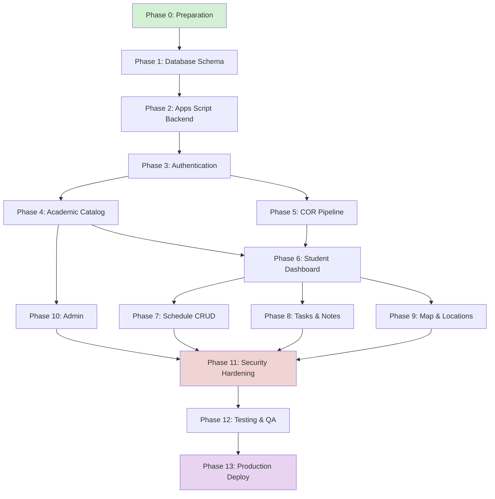
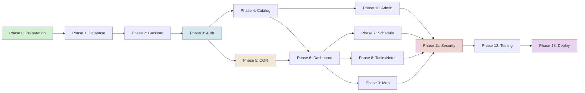
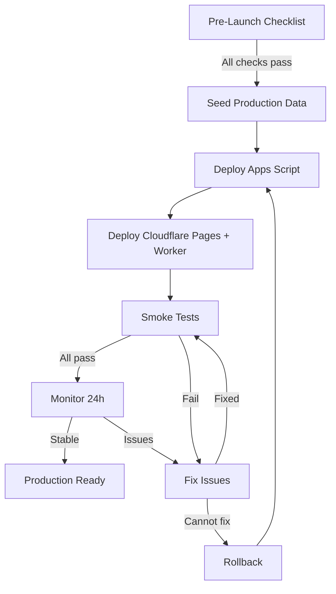

# My-Schedule Migration Strategy & Implementation Roadmap

> **Status:** Planning only. This document defines the complete implementation roadmap.
> It does not modify source/configuration files, deploy anything, or begin implementation.
>
> **Basis:** All 18 prior architecture documents
>
> **Date:** 2026-08-31

---

## 1. Final Architecture Summary

My-Schedule transforms from a personal single-student static PWA into a multi-user QCU schedule platform using:

| Layer | Technology | Responsibility |
|---|---|---|
| Browser | Static HTML/CSS/JS (no framework) | UI rendering, client-side routing, optimistic UX |
| Cloudflare Edge | Pages + Workers | Static hosting, API gateway, HMAC signing, CORS, rate limiting |
| Backend | Google Apps Script | Authentication, authorization, CRUD, file storage, AI/OCR |
| Database | Google Sheets | Persistent storage (31 sheets) |
| Storage | Google Drive | Private COR file storage |
| AI/OCR | Gemini/OpenAI | COR text extraction (provider-abstraction layer) |

### Key Architecture Decisions

- **One Apps Script web app** as the sole backend entry point (`doPost`)
- **Cloudflare Worker** as the sole API proxy (browser never sees Apps Script URL)
- **HMAC-signed envelope** for Worker-to-Apps Script communication
- **Google OIDC** for student authentication (immutable `googleSub` -> internal `userId`)
- **Batch revision model** for schedule mutations (clone -> apply -> validate -> activate)
- **Owner-scoped APIs** (server derives ownership from session, never accepts client `userId`)
- **COR pipeline** with 4 trust layers (raw -> normalized -> validated -> confirmed)

---

## 2. Dependency Graph



### Critical Path

```text
P0 -> P1 -> P2 -> P3 -> P4 -> P6 -> P7 -> P11 -> P12 -> P13
```

### Parallel Work Streams

After Phase 3 (Authentication), these can proceed in parallel:

- **Stream A**: P4 (Catalog) -> P6 (Dashboard) -> P7 (Schedule CRUD)
- **Stream B**: P5 (COR Pipeline) -> P6 (Dashboard)
- **Stream C**: P4 (Catalog) -> P10 (Admin)

After Phase 6 (Dashboard), these can proceed in parallel:

- **Stream A**: P7 (Schedule CRUD)
- **Stream B**: P8 (Tasks & Notes)
- **Stream C**: P9 (Map & Locations)

---

## 3. Implementation Phases

### Migration Phases Overview



### Phase 0 — Preparation

**Goal:** Set up the development infrastructure, verify tooling, and establish patterns before writing application code.

**Dependencies:** None

**Files affected:**
- `.github/workflows/` — CI configuration
- `wrangler.toml` — Worker configuration
- Package dependencies

**Tasks:**
1. Verify Wrangler/Cloudflare Pages local dev works
2. Set up Apps Script project in Google Cloud Console
3. Create separate Google OAuth client for development
4. Create test Google Sheet workbook with empty schema sheets
5. Create test Google Drive folder structure
6. Establish HMAC secret pair (dev)
7. Set up basic CI (HTML validation, JS lint)
8. Create test COR document fixtures (synthetic)
9. Document environment variables and local setup

**Acceptance criteria:**
- Local Wrangler dev server serves existing pages
- Apps Script project exists with `doPost` stub
- Test Sheet/Drive resources created
- CI runs on PR

**Rollback:** N/A (infrastructure setup)

---

### Phase 1 — Database Schema

**Goal:** Create the complete Google Sheets schema with all 31 sheets, header rows, indexes, and seed data.

**Dependencies:** Phase 0

**Files affected:**
- Google Sheets workbook (new)
- `DATABASE.md` (reference only)
- Apps Script repository modules (new)

**Database changes:**
- Create all 31 sheets with exact headers from `DATABASE.md`
- Create shared catalog seed: 1 campus, 4 departments, 8 programs, 3 buildings, rooms
- Create `Schema_Migrations` entry
- Create `System_Settings` with institution defaults

**API changes:** None (schema only)

**Frontend changes:** None

**Tests:**
- Verify all sheet headers match `DATABASE.md` exactly
- Verify seed data loads without constraint violations
- Verify `Schema_Migrations` records current version

**Acceptance criteria:**
- All 31 sheets exist with correct headers
- Seed data loads successfully
- No orphaned foreign keys in seed data

**Rollback:** Delete and recreate workbook

**Risk:** Incorrect header names will cascade through every module. Verify against `DATABASE.md` before committing.

---

### Phase 2 — Apps Script Backend Foundation

**Goal:** Build the core backend infrastructure: doPost entry point, action router, HMAC verification, request context, validation framework, error envelope, and repository base layer.

**Dependencies:** Phase 1

**Files affected:**
- Apps Script project (new modules)
- Google Sheets (runtime access)

**Database changes:** None (schema exists from Phase 1)

**API changes:**
- `POST /exec` — doPost entry point (internal only)
- Action router with allowlist
- HMAC verification
- Request context builder (actor resolution)
- Validation service
- Error envelope format
- Audit log append

**Frontend changes:** None

**Tests:**
- HMAC verification rejects missing/tampered/expired signatures
- Action router rejects unknown actions
- Request context resolves user from Google `sub`
- Validation rejects malformed payloads
- Error responses contain no stack traces or internals

**Acceptance criteria:**
- doPost processes a valid signed envelope
- Unknown actions return stable error
- Tampered HMAC returns `UNAUTHENTICATED`

**Rollback:** Revert Apps Script code; no data changes

---

### Phase 3 — Authentication & Session

**Goal:** Implement Google OIDC login, session creation, identity resolution, session lifecycle, and logout.

**Dependencies:** Phase 2

**Files affected:**
- Cloudflare Worker (session handling, OIDC callback)
- Apps Script (identity resolution)
- Browser (login flow, session management)

**Database changes:**
- `Users` sheet populated on first login

**API changes:**
- `POST /api/auth/login` — Google OIDC initiation
- `GET /api/auth/callback` — OIDC callback, session creation
- `POST /api/auth/logout` — Session clearing
- `GET /api/v1/bootstrap` — Identity resolution, route state

**Frontend changes:**
- Login page with "Continue with Google" button
- Session cookie handling
- Route guards (public vs authenticated)
- Logout flow

**Tests:**
- New user login creates ONBOARDING user
- Returning ACTIVE user routes to dashboard
- Session expiry returns UNAUTHENTICATED
- Logout clears all cookies
- Same Google `sub` resolves to same user (no duplicates)

**Acceptance criteria:**
- End-to-end Google login works in dev environment
- Session cookies set/cleared correctly
- Bootstrap returns correct route state per account status

**Rollback:** Disable OIDC callback; existing users unaffected (no users yet)

---

### Phase 4 — Dynamic Academic Configuration

**Goal:** Seed and expose the academic catalog: campuses, departments, programs, offerings, terms, subjects, sections, buildings, rooms. Build catalog read APIs.

**Dependencies:** Phase 3

**Files affected:**
- Apps Script (catalog services, repositories)
- Google Sheets (catalog seed data)
- Browser (bootstrap response rendering)

**Database changes:**
- Populate: Campuses, Departments, Programs, Program_Offerings, Academic_Terms, Subjects, Program_Subjects, Buildings, Rooms, Sections

**API changes:**
- `GET /api/v1/catalog/departments` — Department list
- `GET /api/v1/catalog/programs` — Program list
- `GET /api/v1/catalog/terms` — Term list
- `GET /api/v1/catalog/subjects` — Subject list
- `GET /api/v1/catalog/campuses` — Campus list
- `GET /api/v1/catalog/buildings` — Building list
- Bootstrap includes resolved academic context

**Frontend changes:**
- Dynamic branding (logo fallback chain)
- Academic context display in header
- Replace hardcoded `Habib`, `BS Computer Science`, CCS logo

**Tests:**
- Catalog returns correct entities
- Branding fallback chain works
- Bootstrap resolves academic context for active user
- Missing catalog data shows safe fallbacks

**Acceptance criteria:**
- Dynamic student name, program, campus displayed after login
- No hardcoded personal/program values remain in active code paths

**Rollback:** Revert code; seed data remains in Sheets

---

### Phase 5 — COR Upload & Extraction Pipeline

**Goal:** Implement the COR upload, private Drive storage, extraction job queue, AI/OCR provider integration, draft persistence, and student review/confirmation flow.

**Dependencies:** Phase 3

**Files affected:**
- Apps Script (COR service, extraction orchestrator, Drive storage)
- Google Drive (COR file storage)
- Google Sheets (COR_Records, Document_Assets, COR_Extracted_Fields, etc.)
- Browser (registration/onboarding pages)
- Cloudflare Worker (upload proxy)

**Database changes:**
- COR_Records, Document_Assets, COR_Extracted_Fields, COR_Draft_Subjects, COR_Draft_Meetings, Extraction_Runs populated

**API changes:**
- `POST /api/v1/onboarding/cor` — Upload COR
- `GET /api/v1/cor-records/{id}/status` — Processing status
- `PUT /api/v1/cor-records/{id}/draft` — Save review edits
- `POST /api/v1/cor-records/{id}/confirm` — Commit
- `DELETE /api/v1/cor-records/{id}` — Cancel import

**Frontend changes:**
- Registration/onboarding wizard (4 stages: Welcome, Upload, Review, Confirm)
- File upload with validation
- Processing status polling
- Review form with detected/reviewed values
- Confirmation summary

**Tests:**
- Upload validates file type, size, signature
- Extraction produces structured draft
- Review saves corrections with version checking
- Commit creates enrollment, subjects, schedule atomically
- Duplicate upload returns existing import
- Interrupted flow resumes correctly

**Acceptance criteria:**
- Full COR flow works end-to-end with synthetic test documents
- Schedule created from confirmed COR is valid and active
- Prior active schedule archived correctly

**Rollback:** Delete Drive files and COR records; re-deploy previous Apps Script version

**Risk:** AI/OCR provider latency and accuracy. Mitigate with synthetic test documents and bounded retry.

---

### Phase 6 — Student Dashboard & Application Shell

**Goal:** Build the authenticated student application: shell, navigation, dashboard, bootstrap-driven routing, loading/error states.

**Dependencies:** Phase 4, Phase 5

**Files affected:**
- Browser (all authenticated pages)
- Apps Script (bootstrap, dashboard APIs)

**Database changes:** None

**API changes:**
- `GET /api/v1/dashboard` — Composed dashboard view model
- Bootstrap response enhanced with academic context

**Frontend changes:**
- Public/private shell separation
- Authenticated navigation (bottom nav mobile, sidebar desktop)
- Dashboard with current/next class, today timeline, task/note summaries
- Loading skeletons, error states, empty states
- Responsive layout (320px - 1280px+)

**Tests:**
- Bootstrap routes to correct destination (dashboard/registration/restricted)
- Dashboard shows correct schedule data
- Loading/error/empty states render correctly
- Navigation works on all viewports
- Cache owner verification

**Acceptance criteria:**
- Student sees personalized dashboard with dynamic data
- All routes guard correctly
- Responsive at 320px, 768px, 1280px

**Rollback:** Revert frontend code; backend unaffected

---

### Phase 7 — Schedule CRUD

**Goal:** Implement schedule viewing, revision history, and the batch revision mutation model (clone -> apply -> validate -> activate).

**Dependencies:** Phase 6

**Files affected:**
- Apps Script (schedule service, revision service, conflict detection)
- Browser (schedule page, revision history)

**Database changes:**
- Schedules, Schedule_Entries populated from COR commit

**API changes:**
- `GET /api/v1/schedules/active` — Active schedule
- `GET /api/v1/schedules/{id}/revisions` — Revision history
- `POST /api/v1/schedules/{id}/revisions` — Batch revision
- `POST /api/v1/enrollments/{id}/manual-subjects` — Manual subject
- `PATCH /api/v1/enrollment-subjects/{id}` — Subject update
- `DELETE /api/v1/enrollment-subjects/{id}` — Subject remove

**Frontend changes:**
- Weekly schedule view (dynamic)
- Today-only view
- Schedule editing (batch revision form)
- Conflict detection display
- Revision history viewer

**Tests:**
- Active schedule renders correctly
- Batch revision creates new draft, validates, activates
- Conflicts detected and reported
- Prior schedule archived
- Version conflicts return VERSION_CONFLICT
- Idempotent retries return same result
- Manual subject CRUD works

**Acceptance criteria:**
- Student can view weekly schedule with correct data
- Student can correct schedule (time, location) via revision
- Conflicts shown and acknowledged
- History preserved

**Rollback:** Revert code; existing data intact

---

### Phase 8 — Tasks & Notes

**Goal:** Migrate tasks and notes from browser localStorage to server-owned, owner-scoped records with full CRUD.

**Dependencies:** Phase 6

**Files affected:**
- Apps Script (tasks service, notes service, repositories)
- Google Sheets (Tasks, Notes sheets)
- Browser (workspace page, task/note forms)

**Database changes:**
- Tasks, Notes sheets populated (initially empty; legacy import optional)

**API changes:**
- `GET /api/v1/tasks` — Task list
- `POST /api/v1/tasks` — Create task
- `PATCH /api/v1/tasks/{id}` — Update task
- `DELETE /api/v1/tasks/{id}` — Delete task
- `GET /api/v1/notes` — Note list
- `POST /api/v1/notes` — Create note
- `PATCH /api/v1/notes/{id}` — Update note
- `DELETE /api/v1/notes/{id}` — Delete note

**Frontend changes:**
- Workspace page (Tasks/Notes tabs)
- Task create/edit/delete forms
- Note create/edit/delete forms
- Subject filter from active enrollment
- Search and sort

**Tests:**
- CRUD operations work with server persistence
- Owner isolation (Student A cannot see Student B's tasks)
- Version conflicts detected
- Enrollment subject linking works
- Search and filter return correct results

**Acceptance criteria:**
- Tasks and notes persist across devices/browsers
- Subject filters use dynamic enrollment data
- Legacy localStorage import works (optional)

**Rollback:** Revert code; localStorage data preserved

---

### Phase 9 — Map & Locations

**Goal:** Make building/room data dynamic, resolve schedule locations through the catalog, and connect the map to the student's campus context.

**Dependencies:** Phase 6

**Files affected:**
- Apps Script (location service, catalog reads)
- Browser (building directory, map page, schedule location resolution)

**Database changes:** None (catalog from Phase 4)

**API changes:**
- Location resolution included in schedule/bootstrap
- `GET /api/v1/campuses/{id}/buildings` — Building list
- Building details endpoint

**Frontend changes:**
- Dynamic building directory
- Schedule entries show resolved room/building
- Map uses campus configuration
- Route 4 remains public and campus-configured

**Tests:**
- Location resolution returns correct room/building/campus chain
- Building directory shows catalog data
- Map loads with correct campus context
- Missing locations show safe fallbacks
- No horizontal scroll on mobile

**Acceptance criteria:**
- Building/room data is dynamic, not hardcoded
- Schedule shows correct locations
- Map works for San Bartolome campus

**Rollback:** Revert code; static data preserved

---

### Phase 10 — Admin

**Goal:** Build the admin dashboard for catalog management, user management, COR review, and announcements.

**Dependencies:** Phase 4

**Files affected:**
- Apps Script (admin service, capability enforcement)
- Browser (admin pages)
- Google Sheets (admin-managed sheets)

**Database changes:**
- Roles, Capabilities, Scope_Assignments populated with admin seed
- Announcements, System_Settings managed

**API changes:**
- `GET /api/v1/admin/users` — User list
- `PATCH /api/v1/admin/users/{id}` — User status change
- CRUD for catalog entities (campuses, departments, programs, etc.)
- `GET /api/v1/admin/cor/{id}` — COR review metadata
- Announcement CRUD

**Frontend changes:**
- Admin shell with separate navigation
- User management table
- Catalog management forms
- COR review interface
- Announcement editor

**Tests:**
- Capability enforcement (admin cannot bypass scope)
- Catalog CRUD with version checking
- User status changes increment version
- Audit events logged for all admin actions
- Student CANNOT access admin endpoints

**Acceptance criteria:**
- Admin can manage catalog entities within scope
- Admin can review COR metadata
- All admin actions audited

**Rollback:** Revert code; admin role seed remains

---

### Phase 11 — Security Hardening

**Goal:** Complete security hardening: CSP headers, CORS verification, HMAC rotation, rate limiting validation, XSS prevention, cache isolation, and comprehensive security testing.

**Dependencies:** Phases 7, 8, 9, 10

**Files affected:**
- Cloudflare Worker (security headers, CORS, rate limits)
- Apps Script (HMAC rotation, cache isolation)
- Browser (CSP, safe DOM rendering)

**Database changes:** None

**API changes:** None (hardening existing)

**Frontend changes:**
- CSP headers enforced
- All dynamic text uses safe DOM APIs
- Private cache namespace verified
- Logout purges all private data

**Tests:**
- All security tests from `TESTING_QA.md` pass
- XSS payloads rejected/blocked
- Cross-user isolation verified
- HMAC rotation works without downtime
- Cache never leaks across users

**Acceptance criteria:**
- All 12 security test categories pass
- No secrets in committed code
- CSP deployed and tested

**Rollback:** Revert security headers; no data impact

---

### Phase 12 — Testing & QA

**Goal:** Run the complete test suite from `TESTING_QA.md`, fix gaps, and achieve release readiness.

**Dependencies:** Phase 11

**Files affected:** Test files only

**Database changes:** Test data setup

**Tests:**
- Full regression suite
- Performance benchmarks
- Accessibility audit (axe-core + manual)
- Security penetration testing
- Responsive testing across viewports

**Acceptance criteria:**
- All acceptance criteria from `TESTING_QA.md` met
- Performance targets met
- No critical/high defects open

**Rollback:** N/A (testing phase)

---

### Phase 13 — Production Deployment

**Goal:** Deploy to production, verify smoke tests, and monitor.

**Dependencies:** Phase 12

**Files affected:**
- Cloudflare Pages (production deployment)
- Cloudflare Worker (production binding)
- Apps Script (production deployment)
- Google Sheets (production workbook)
- Google Drive (production folder)

**Database changes:**
- Production seed data loaded

**Tests:**
- Smoke test: login -> bootstrap -> dashboard -> schedule -> tasks -> notes
- Smoke test: COR upload -> review -> commit
- Smoke test: admin catalog management
- Performance verification
- Error rate monitoring

**Acceptance criteria:**
- All smoke tests pass
- No error spike in first 24 hours
- Authentication works end-to-end
- Rollback procedure confirmed

**Rollback:** Re-deploy previous Apps Script version; promote previous Cloudflare Pages deployment

---

## 4. Database Migration Strategy

### Migration Flow

```text
1. Create production Google Sheet workbook
2. Create all 31 sheets with headers (match DATABASE.md exactly)
3. Create Schema_Migrations entry (version 1)
4. Load seed data:
   - System_Settings (institution config)
   - Campuses (San Bartolome)
   - Departments (CCS, CBAA, ENG, EDUC)
   - Programs (BSCS, BSIT, BSIS, BSBA, BSENTREP, BSIE, BECED)
   - Program_Offerings (confirmed campus-program pairs)
   - Academic_Terms (AY 2026-2027)
   - Subjects (initial catalog from QCU source)
   - Buildings (NAB, Bautista, Belmonte)
   - Rooms (IL502A, IL601A, IK603 F1, SB OG)
5. Create Google Drive folder structure:
   /my-schedule/
     /cor/
       /{userId}/
         /{corRecordId}/
6. Verify all foreign keys resolve
7. Create backup copy
8. Deploy Apps Script against production
```

### Personal Data Decision

The existing personal schedule data (`data/schedule.json`, hardcoded defaults) should become **test/seed data** in the development environment, NOT the initial owner account. Rationale:

- The personal data belongs to one developer, not a representative student
- Making it the initial owner would create an unauthorized account
- Test data should use synthetic identities
- The existing schedule data can be loaded as a development fixture

### Backup Strategy

- Create automated daily backup copy of production workbook
- Store backup reference in a separate Google Sheet
- Test restore procedure before production launch

---

## 5. API Migration Strategy

### API Introduction Order

| Order | API Group | Phase | Reason |
|---|---|---|---|
| 1 | Bootstrap / Auth | 3 | Everything depends on identity |
| 2 | Catalog reads | 4 | Dashboard and all features need catalog data |
| 3 | COR upload/status/review/commit | 5 | Registration must work before dashboard |
| 4 | Dashboard read | 6 | Core authenticated experience |
| 5 | Schedule reads | 7 | Core display feature |
| 6 | Schedule mutations (batch revision) | 7 | Schedule editing |
| 7 | Task CRUD | 8 | Personal productivity |
| 8 | Note CRUD | 8 | Personal productivity |
| 9 | Location/catalog reads | 9 | Map and building integration |
| 10 | Admin CRUD | 10 | Administrative management |

### API Pattern Consistency

All APIs follow the same pattern established in `API_BACKEND.md`:

```text
Request:  { action, payload, requestId, clientVersion }
Response: { ok, data, error: { code, message, fields, issues, retryable }, meta }
```

No competing API patterns. The signed envelope is the only transport mechanism.

---

## 6. Frontend Migration Strategy

### Migration Order

```text
1. Separate public/private shells (Phase 3-4)
2. Replace hardcoded identity with bootstrap data (Phase 4)
3. Replace hardcoded schedule with API data (Phase 6)
4. Replace localStorage tasks/notes with server CRUD (Phase 8)
5. Replace hardcoded buildings with catalog data (Phase 9)
6. Add registration/COR flow (Phase 5)
7. Add admin interface (Phase 10)
8. Hardened security headers and CSP (Phase 11)
```

### Hardcoded Value Priority

| Priority | Value | Replaced By | Phase |
|---|---|---|---|
| Critical | `Habib` greeting | Bootstrap profile | 4 |
| Critical | `BS Computer Science` | Active enrollment | 4 |
| Critical | Personal schedule | Server schedule | 6 |
| Critical | `QCU_DEFAULTS` fallback | Error states | 6 |
| Critical | localStorage tasks/notes | Server CRUD | 8 |
| High | CCS logo (auth pages) | Branding resolver | 4 |
| High | Subject names/colors | Enrollment subjects | 6 |
| High | Building literals | Catalog API | 9 |
| High | `Asia/Manila` | Campus timezone | 6 |
| Medium | Route 4 copy | Campus config | 9 |
| Medium | Page titles | Route config | 4 |
| Low | Static copy labels | Static system values | 6 |

### What NOT to Rewrite

- The existing HTML/CSS structure (migrate data sources, not the whole UI)
- MapLibre map behavior (preserve and parameterize)
- Current/next class calculation logic (make dynamic)
- Task/note workspace pattern (preserve CRUD interactions)
- PWA offline shell (preserve and separate public/private caching)

---

## 7. COR Rollout Strategy

### Staged Rollout

| Stage | What | When | Fallback |
|---|---|---|---|
| 1 | Manual registration (no COR) | Phase 5 (partial) | Student enters data manually |
| 2 | COR upload only | Phase 5 | File stored; no extraction yet |
| 3 | COR extraction (AI/OCR) | Phase 5 | Extraction failure -> retry or manual |
| 4 | Student review & correction | Phase 5 | Review required for all fields |
| 5 | Confirmation & commit | Phase 5 | Validation failure -> back to review |
| 6 | Automatic schedule creation | Phase 5 | Commit failure -> keep prior schedule |

### Recovery Scenarios

| Failure | Recovery |
|---|---|
| Upload fails | Retry upload |
| Extraction fails (provider error) | Retry up to 3 times; then manual |
| Extraction fails (bad document) | Upload different file |
| Review has blocking errors | Correct and resubmit |
| Commit fails (version conflict) | Reload latest draft |
| Commit fails (student number conflict) | Support path |
| Commit fails (Sheets timeout) | Retry same mutation ID |

---

## 8. Admin Rollout Strategy

### When Admin Is Needed

Admin becomes necessary at:

1. **Phase 4** — To seed and manage academic catalog (campuses, programs, terms, subjects)
2. **Phase 5** — To review COR extraction results (imports.review capability)
3. **Phase 10** — Full admin dashboard for ongoing management

### Minimum Admin Capabilities for Launch

| Capability | Scope | Required For |
|---|---|---|
| `catalog.write` | GLOBAL or CAMPUS | Seed and maintain academic catalog |
| `users.read` | GLOBAL | User management |
| `users.status.write` | GLOBAL | Account status management |
| `imports.review` | GLOBAL | COR review |
| `documents.read.support` | PROGRAM or GLOBAL | COR original access for support |
| `announcements.write` | GLOBAL | Platform announcements |

### Admin Seed

A bootstrap admin account is created during Phase 4 by manually populating the `Roles` and `Capabilities` sheets for one Google account. This is a one-time manual operation, not an automated process.

---

## 9. Feature Prioritization

### MVP (Required for First Release)

| Feature | Phase | Why Required |
|---|---|---|
| Google login/logout | 3 | Core authentication |
| Session management | 3 | Security foundation |
| Bootstrap/routing | 3-4 | Application shell |
| Academic catalog (read) | 4 | All features need catalog |
| Dynamic branding | 4 | Replace hardcoded identity |
| COR upload & extraction | 5 | Primary onboarding path |
| COR review & confirmation | 5 | Data verification |
| Dashboard (current/next, today) | 6 | Core student experience |
| Schedule view (weekly, today) | 6-7 | Core display feature |
| Schedule editing (batch revision) | 7 | Student corrections |
| Task CRUD | 8 | Preserved existing feature |
| Note CRUD | 8 | Preserved existing feature |
| Responsive design | 6-9 | Mobile-first requirement |
| Basic security (HMAC, CORS, CSP) | 11 | Required for multi-user |

### Post-MVP (Useful but Not Launch-Critical)

| Feature | Phase | Why Not MVP |
|---|---|---|
| Admin dashboard | 10 | Catalog seed can be manual initially |
| Announcements | 10 | Nice-to-have for communication |
| Map/location integration | 9 | Schedule view works without map |
| Building directory (dynamic) | 9 | Can use hardcoded initially |
| Legacy task/note import | 8 | Clean start is acceptable |
| Accessibility audit (full WCAG) | 12 | Partial accessibility sufficient for launch |
| Performance optimization | 12 | Baseline performance acceptable |

### Future (Avoid Unless Requirements Change)

| Feature | Notes |
|---|---|
| Dark mode | Requires full token redesign and testing |
| Offline mutation sync | Complex; requires outbox, conflict resolution |
| Multi-image COR import | Schema and UX complexity |
| Live bus tracking | Requires authoritative transit feed |
| Indoor navigation | Requires floor plans and wayfinding data |
| Student collaboration | Out of scope for personal schedule tool |
| HEIC/HEIF support | Browser/Apps Script compatibility unproven |
| Concurrent program enrollments | Requires explicit QCU approval |
| Manual registration (no COR) | Policy decision pending |

---

## 10. Risk & Rollback Strategy

### Phase-Level Risks

| Phase | Highest Risk | Mitigation | Detection | Rollback |
|---|---|---|---|---|
| 1 | Wrong sheet headers cascade | Verify against DATABASE.md before committing | Schema mismatch errors | Delete and recreate sheets |
| 2 | Apps Script execution limits | Budget time per action; test early | Timeout errors | Revert code |
| 3 | OIDC misconfiguration | Test with dev OAuth client first | Login failures | Disable callback |
| 4 | Incorrect seed data | Validate against QCU source before seeding | API returns wrong data | Update seed data |
| 5 | AI/OCR provider failures | Bounded retry; synthetic test data | Extraction failures | Retry or manual path |
| 6 | Bootstrap routing bugs | Test all account states | Wrong route displayed | Revert code |
| 7 | Schedule activation concurrency | LockService; version checks | VERSION_CONFLICT spike | Revert code |
| 8 | Owner isolation failure | Cross-user tests before release | Data leakage detected | Revert code |
| 9 | Map rendering failures | Graceful degradation | Map unavailable state | Revert code |
| 10 | Admin capability bypass | Capability tests | Unauthorized access detected | Revert code |
| 11 | CSP breaks functionality | Test all pages with CSP | Console errors | Relax CSP temporarily |
| 12 | Blocking defects found | Fix before proceeding | Test failures | Fix and retest |
| 13 | Production deployment fails | Smoke test immediately | Error spike | Rollback to previous version |

### Global Rollback Strategy

```text
Frontend: Promote previous Cloudflare Pages deployment
Backend: Re-deploy previous Apps Script version
Worker: Roll back to previous Worker deployment
Data: Restore from daily backup spreadsheet
Secrets: Re-rotate if compromised
```

---

## 11. Git/Version Strategy

### Branch Strategy

```text
main — production-ready code
  |-- feat/phase-0-prep
  |-- feat/phase-1-database
  |-- feat/phase-2-backend
  |-- feat/phase-3-auth
  |-- feat/phase-4-catalog
  |-- feat/phase-5-cor
  |-- feat/phase-6-dashboard
  |-- feat/phase-7-schedule
  |-- feat/phase-8-tasks-notes
  |-- feat/phase-9-map
  |-- feat/phase-10-admin
  |-- feat/phase-11-security
```

### Commit Convention

```text
feat: create database schema with 31 sheets
feat: add Apps Script doPost entry and action router
feat: add HMAC verification and request context
feat: add Google OIDC login flow
feat: add bootstrap endpoint with identity resolution
feat: add academic catalog seed and read APIs
feat: add COR upload and Drive storage
feat: add COR extraction pipeline with provider adapter
feat: add student review and confirmation flow
feat: add dashboard with dynamic schedule
feat: add schedule batch revision with conflict detection
feat: add task CRUD with owner isolation
feat: add note CRUD with owner isolation
feat: add dynamic building directory
feat: add admin catalog management
feat: add CSP and security headers
fix: correct schedule timezone handling
fix: resolve HMAC rotation edge case
test: add cross-user isolation tests
docs: update architecture documents
```

### Rules

- One logical change per commit
- Do not mix unrelated migrations
- Each phase merges to main via PR with review
- Tests pass before merge
- No secrets in any commit

---

## 12. Testing Gates

### Per-Phase Testing Requirements

| Phase | Required Tests Before Merge |
|---|---|
| 0 | CI pipeline runs |
| 1 | Schema validation passes |
| 2 | doPost processes valid envelope; rejects invalid |
| 3 | Login/session/logout work; identity resolution correct |
| 4 | Catalog reads return correct data; branding fallback works |
| 5 | Full COR pipeline with test documents; commit atomicity |
| 6 | Dashboard renders; route guards work; responsive at 320px |
| 7 | Schedule CRUD with conflict detection; version checks |
| 8 | Task/Note CRUD; owner isolation verified |
| 9 | Location resolution; map loads; building directory works |
| 10 | Admin CRUD within scope; capability enforcement |
| 11 | All security tests pass; CSP enforced; no XSS |
| 12 | Full regression suite passes; performance targets met |
| 13 | Smoke tests pass; no error spike |

---

## 13. Production Readiness Gates

### Production Release Flow



### Pre-Launch Checklist

```text
Infrastructure:
    [ ] Production Google Sheet workbook created and seeded
    [ ] Production Google Drive folder structure created
    [ ] Production Apps Script deployed and tested
    [ ] Cloudflare Pages production deployment verified
    [ ] Cloudflare Worker production binding configured
    [ ] Production HMAC secret pair generated and stored
    [ ] Production OAuth client configured
    [ ] DNS configured and SSL verified

Security:
    [ ] No secrets in committed code
    [ ] CORS configured with explicit origins
    [ ] CSP deployed and tested
    [ ] HMAC validation rejects tampered requests
    [ ] Rate limiting active
    [ ] Session lifecycle works (login, expiry, logout)
    [ ] Cross-user isolation verified

Data:
    [ ] Seed data loaded and validated
    [ ] Backup spreadsheet created
    [ ] Restore procedure tested

Testing:
    [ ] All unit tests pass
    [ ] All API contract tests pass
    [ ] All auth/authz tests pass
    [ ] All security tests pass
    [ ] Performance targets met
    [ ] Responsive at 320px, 768px, 1280px
    [ ] Accessibility audit passed

Deployment:
    [ ] Rollback procedure documented and tested
    [ ] Monitoring configured (error rates, quota)
    [ ] Smoke test script ready
```

---

## 14. Definition of Done

The project is not considered complete until ALL of the following pass:

### Authentication
- [ ] Google OIDC login works end-to-end
- [ ] Session cookies set/cleared correctly
- [ ] Logout purges all private data
- [ ] Session expiry handled gracefully
- [ ] Duplicate Google accounts handled correctly

### Authorization
- [ ] Owner-scoped APIs prevent cross-user access
- [ ] Student cannot access admin endpoints
- [ ] Admin capabilities enforced with scope
- [ ] HMAC validation works for all endpoints
- [ ] Privacy-safe NOT_FOUND for non-owned resources

### Database
- [ ] All 31 sheets exist with correct headers
- [ ] Seed data loads without errors
- [ ] Foreign keys resolve correctly
- [ ] Optimistic concurrency (version checks) works
- [ ] Mutation receipts prevent duplicate operations

### API
- [ ] All CRUD operations work for tasks, notes, schedule
- [ ] Error responses follow standard envelope
- [ ] No internal state leaks in errors
- [ ] Rate limiting works
- [ ] Pagination works for large datasets

### COR
- [ ] Upload validates file type, size, signature
- [ ] Extraction produces structured draft
- [ ] Review allows correction of all fields
- [ ] Confirmation creates enrollment + schedule atomically
- [ ] Interrupted flow resumes correctly

### Schedule
- [ ] Active schedule displays correctly
- [ ] Current/next class calculation works with dynamic data
- [ ] Batch revision creates new revision and archives old
- [ ] Conflict detection works
- [ ] TBA subjects handled correctly

### Tasks
- [ ] CRUD operations work with server persistence
- [ ] Owner isolation verified
- [ ] Subject linking works with enrollment subjects
- [ ] Search and filter work
- [ ] Completion toggle works

### Notes
- [ ] CRUD operations work with server persistence
- [ ] Owner isolation verified
- [ ] Subject linking works
- [ ] Search and sort work

### Map
- [ ] Building/room data is dynamic
- [ ] Schedule entries show resolved locations
- [ ] Map loads for San Bartolome campus
- [ ] Route 4 information preserved
- [ ] Missing locations show safe fallbacks

### Admin
- [ ] Admin can manage catalog entities
- [ ] Admin can view user list
- [ ] Admin can review COR metadata
- [ ] All admin actions audited
- [ ] Student cannot access admin features

### Security
- [ ] No XSS vulnerabilities
- [ ] No secrets in committed code
- [ ] CSP enforced
- [ ] CORS enforced
- [ ] Cache isolation verified
- [ ] Logout purges all caches

### Responsive UI
- [ ] Works at 320px (mobile portrait)
- [ ] Works at 768px (tablet)
- [ ] Works at 1280px+ (desktop)
- [ ] No horizontal page scroll
- [ ] Touch targets >= 44px

### Accessibility
- [ ] All form fields have labels
- [ ] Keyboard navigation works
- [ ] Focus visible on all interactive elements
- [ ] Screen reader announces key content
- [ ] Reduced motion respected

### Testing
- [ ] All acceptance criteria from TESTING_QA.md met
- [ ] No critical or high defects open
- [ ] Performance targets met
- [ ] Security tests pass

### Deployment
- [ ] Production smoke tests pass
- [ ] Rollback procedure tested
- [ ] Monitoring configured
- [ ] No error spike in first 24 hours

---

## 15. Open Questions

| # | Question | Blocks | Source |
|---|---|---|---|
| 1 | Official QCU catalog data (programs, subjects, offerings) | Phase 4 seed data | ACADEMIC_STRUCTURE.md |
| 2 | Student number requirement and format | Phase 5 commit | REGISTRATION_COR.md |
| 3 | AI/OCR provider selection and privacy terms | Phase 5 extraction | COR_AI_PIPELINE.md |
| 4 | Manual registration path (no COR) approval | Phase 5 fallback | REGISTRATION_COR.md |
| 5 | Schedule TBA subjects: can they be committed? | Phase 5 commit | SCHEDULE_CRUD.md |
| 6 | Concurrent program enrollments approval | Phase 5 enrollment | SCHEDULE_CRUD.md |
| 7 | Overlap acknowledgment: student or admin? | Phase 7 editing | SCHEDULE_CRUD.md |
| 8 | Same-term COR re-import merge policy | Phase 5 re-import | SCHEDULE_CRUD.md |
| 9 | Admin correction scope and evidence requirements | Phase 10 | ADMIN_ARCHITECTURE.md |
| 10 | CLERK role approval | Phase 10 | ADMIN_ARCHITECTURE.md |
| 11 | Official building names and room codes | Phase 4 seed | LOCATION_MAP.md |
| 12 | Map configuration as runtime entity or deployment manifest | Phase 9 | LOCATION_MAP.md |
| 13 | Legacy task/note localStorage import approval | Phase 8 | PRODUCTIVITY.md |
| 14 | Note body empty: valid or required? | Phase 8 | PRODUCTIVITY.md |
| 15 | Task dueDate canonical time policy | Phase 8 | PRODUCTIVITY.md |
| 16 | Which logo/image files are officially approved | Phase 4 | ACADEMIC_STRUCTURE.md |
| 17 | Retention periods for deleted records | Phase 11 | SECURITY_PRIVACY.md |
| 18 | Exact session lifetime configuration | Phase 3 | AUTHENTICATION.md |

---

## IMPLEMENTATION ORDER

The exact order in which future coding work should happen:

1. **Phase 0**: Set up Apps Script project, Cloudflare dev environment, test resources
2. **Phase 1**: Create Google Sheets workbook with all 31 sheets and seed data
3. **Phase 2**: Build Apps Script doPost, action router, HMAC verification, request context
4. **Phase 3**: Implement Google OIDC login, session lifecycle, bootstrap endpoint
5. **Phase 4**: Seed academic catalog, build catalog read APIs, dynamic branding
6. **Phase 5**: Build COR upload, extraction pipeline, review, and commit flow
7. **Phase 6**: Build authenticated shell, dashboard, navigation, responsive layout
8. **Phase 7**: Build schedule viewing, batch revision, conflict detection
9. **Phase 8**: Build task and note CRUD with owner isolation
10. **Phase 9**: Make building/room data dynamic, resolve schedule locations
11. **Phase 10**: Build admin dashboard with capability-scoped CRUD
12. **Phase 11**: Security hardening: CSP, CORS verification, HMAC rotation, XSS prevention
13. **Phase 12**: Run full test suite, fix gaps, achieve release readiness
14. **Phase 13**: Production deployment, smoke tests, monitoring

## BLOCKERS

These must be decided or configured before implementation can safely begin:

1. **Official QCU academic catalog** — Programs, subjects, offerings, terms, buildings, rooms
2. **Google Cloud project** — Apps Script project, OAuth client, Drive/Sheets API enablement
3. **Cloudflare account** — Pages project, Worker, KV namespace
4. **AI/OCR provider account** — API key, privacy terms reviewed
5. **HMAC secret generation** — Dev and production key pairs
6. **Student number policy** — Required? Format? Uniqueness rules?
7. **COR file formats** — Confirmed accepted formats and size limits
8. **Admin bootstrap account** — Which Google account gets initial admin role
9. **Official building/room data** — Names, codes, campus assignments
10. **Logo/image approval** — Which existing assets are officially approved

## FIRST IMPLEMENTATION TASK

After planning is complete, the coding agent should:

**Set up the development environment (Phase 0):**

1. Create a Google Cloud project and enable Apps Script, Sheets, and Drive APIs
2. Create a Google Apps Script project with a `doPost(e)` stub that returns `{"ok": true}`
3. Create a test Google Sheet workbook
4. Create a test Google Drive folder
5. Generate a dev HMAC secret pair
6. Verify local Wrangler dev serves the existing static pages
7. Create a basic CI workflow (HTML validation + JS lint)

This establishes the foundation that every subsequent phase builds on.

---

## CHUNK 20 — Final Architecture Review & Implementation Readiness Audit

Design the final architecture review and implementation readiness audit for the My-Schedule platform.

**Planning only. Do not modify application source/configuration files.**

Read all planning documents and verify:

1. Every architecture document is consistent with every other document
2. Every API contract in API_BACKEND.md matches the implementation plan
3. Every database schema in DATABASE.md is referenced correctly in all services
4. Every authentication flow in AUTHENTICATION.md is tested in TESTING_QA.md
5. Every security requirement in SECURITY_PRIVACY.md has a corresponding test
6. Every feature in the implementation roadmap has a corresponding architecture document
7. Every open question is either resolved or explicitly documented as blocking

### Deliverable

Create **`READINESS_AUDIT.md`** containing:

1. Cross-document consistency verification
2. API contract completeness check
3. Database schema completeness check
4. Authentication/authorization coverage check
5. Security coverage check
6. Testing coverage check
7. Implementation dependency validation
8. Risk register completeness
9. Open question summary
10. Go/No-Go recommendation
11. Final implementation readiness score

### Constraints

- Planning only.
- Do not modify any files.
- This is the final planning document.
- After this, implementation may begin.