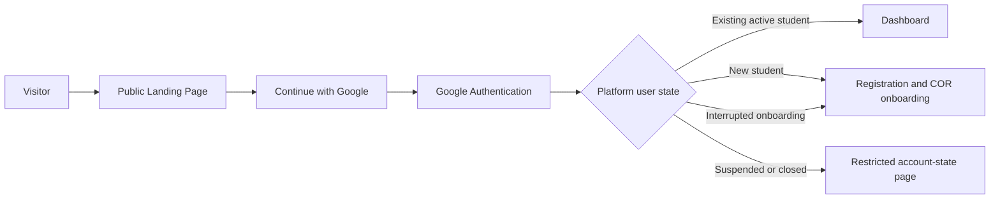

# My-Schedule Public Landing Page and Student Entry Experience

Design date: 2026-08-30  
Status: planning only  
Basis: `AUDIT.md`, `ARCHITECTURE.md`, `DATABASE.md`, `ACADEMIC_STRUCTURE.md`, and `AUTHENTICATION.md`

## Design Direction

Reading this as: a trust-first public landing page for QCU students, with an institutional, truthful, calm visual language, leaning on the existing native HTML/CSS design system and restrained public-service patterns.

```text
DESIGN_VARIANCE: 4
MOTION_INTENSITY: 2
VISUAL_DENSITY: 4
```

This is a targeted evolution of the current application, not a complete visual reset. Preserve Public Sans, the QCU blue/navy/gold identity, light mode, compact radii, clear 1px borders, mobile-first behavior, and plain factual copy. Avoid gradients, glass effects, decorative motion, generic feature-card grids, oversized marketing type, and department-specific branding.

## 1. Landing Page Purpose

`index.html` becomes the public entry point for My-Schedule. Its only primary job is to explain the product quickly and move an eligible student into secure Google authentication.

Required public message:

```text
My-Schedule
Your QCU schedule, organized.
```

Primary action:

```text
Continue with Google
```

The page must establish that My-Schedule is:

- A free schedule organizer for QCU students.
- Able to import and review COR information.
- Personal to the signed-in student.
- Separate from optional Classroom/Gmail access.
- Designed so no schedule data becomes trusted before student confirmation.

The public page must never render a student name, student number, department, program, section, subjects, schedule, tasks, notes, COR status, or cached account data.

### Page Success Criteria

A first-time visitor should understand within one viewport:

1. This is My-Schedule for QCU students.
2. It organizes the student's own schedule.
3. Google is the sign-in method.
4. The student remains in control of COR review.
5. There is exactly one obvious next action.

## 2. Information Architecture

The landing page should remain short:

```text
Public header
-> Photo-led product hero and Google CTA
-> Privacy/trust band
-> Key capabilities
-> Optional public QCU status/campus band
-> Footer and legal links
```

Do not add testimonials, pricing, statistics, partner-logo walls, a roadmap, a long FAQ, or repeated sign-up sections unless real requirements appear later.

### Route Boundaries

| Route/page group | Public or private | Responsibility |
|---|---|---|
| `index.html` | Public | Landing, session check, Google entry action |
| Future dashboard page | Authenticated | Existing current/next, today, week, status, and student header |
| Registration/onboarding page(s) | Authenticated onboarding | Profile, COR upload, processing, review, confirmation |
| `campus-eta.html` | Public or authenticated public-information route | Route 4/map, if product decision keeps it public |
| `privacy.html`, `terms.html` | Public | Legal and data-use information |
| Existing schedule/workspace/settings pages | Authenticated | Student-owned features |

The future coding phase should move the current personal Home experience out of `index.html` before replacing the root page. A dedicated `dashboard.html` is the clearest initial route, but the exact filename remains an implementation decision.

## 3. Page Sections

### Public Header

Purpose: identify the product and expose essential legal navigation without duplicating the sign-in action.

Content:

- Approved general QCU/My-Schedule logo or QCU text fallback.
- Product name `My-Schedule`.
- `Privacy` and `Terms` links.
- Optional `Campus info` link only if Route 4/building information remains public.

Rules:

- One line on desktop, no more than 72px high.
- No student greeting, live clock, department logo, program, campus enrollment, or bottom navigation.
- Do not place a second `Continue with Google` action in the header. The hero owns that intent.
- On narrow mobile screens, keep the product identity visible and move legal links to the footer if needed rather than introducing an unnecessary menu.

### Photo-Led Hero

Use a real, approved QCU campus photograph as a full-width hero background. Text sits over the image with a solid high-contrast navy scrim or opaque protected text zone. Do not place hero content inside a floating card and do not use a split text/image layout.

Recommended visible copy:

```text
My-Schedule

Your QCU schedule, organized.

Import your COR, review your classes, and keep your schedule, tasks,
notes, and campus details in one place.

[ Continue with Google ]
```

Hero rules:

- `My-Schedule` is the H1 and first-viewport product signal.
- The supporting statement is no more than 20 words in final edited copy.
- The CTA remains visible without scrolling at 320px mobile and normal desktop heights.
- The hero height must leave a visible hint of the trust band below it.
- Text must remain readable when the image fails or is disabled.
- The background image is decorative to assistive technology; all meaning remains in live text.
- No feature checklist, trust microcopy, version badge, scroll cue, status dot, or secondary CTA inside the hero.

### Asset Requirement

The repository has real QCU building images, but the inspected files are not yet sufficient for an unquestioned production hero:

- `New Academic building(1).jpg` is a real campus image but low resolution for a full-width hero.
- `QCU-BUILDING-1024x683-1.jpg` is larger but appears stylized and contains a visible watermark.
- `cropped-logo.jpg` is a useful general QCU seal candidate, not a hero photograph.

Before implementation, obtain or approve a high-resolution QCU campus image with clear usage rights, no watermark, sufficient subject detail, and a crop that works at mobile and desktop aspect ratios. Do not substitute atmospheric stock photography or a fake interface screenshot.

### Trust Band

Place a compact full-width band immediately after the hero. It should be visible at the bottom edge of the first viewport and use plain text with small familiar icons, not three floating cards.

Recommended statements:

```text
Google signs you in. My-Schedule does not store your password.
Your COR stays private and remains a draft until you confirm it.
Classroom and Gmail are optional and connected separately.
```

The final copy must match implemented behavior and approved privacy terms. Each statement should be one short sentence.

### Key Capabilities

Communicate only the five capabilities requested by the product brief:

1. Import your COR.
2. Organize your class schedule.
3. View your daily and full schedule.
4. Manage personal tasks and notes.
5. Access campus, building, and room information.

Layout recommendation:

- One wide primary capability for COR import and review.
- Four compact items arranged as a two-column grid on tablet/desktop.
- Strict single-column list on mobile.
- Use borders, spacing, icons, and one or two subtle blue-tinted surfaces rather than five identical cards.
- No fake product screenshot. A real screenshot may be added only after the authenticated schedule experience is dynamic and contains non-personal demonstration data.

Capability descriptions should be concrete and no more than 20 words each.

### Optional Public QCU Status Band

Preserving the current public suspension behavior is valuable, but it must not compete with sign-in or trigger schedule access.

Recommended initial rule:

- Include one compact below-fold `QCU status` module only if the product owner confirms it belongs on the landing page.
- Load it after the initial page paint and only when the module nears the viewport.
- Use public suspension/status endpoints only.
- Label it as institution-level public information, not the student's personalized class decision.
- Preserve fail-unknown behavior. A failed source displays `Status currently unavailable`, never `No suspension`.
- Show the official source/check time when available.
- Do not load weather maps, MapLibre, route geometry, or the student's schedule on the landing page.

If this module is not approved, retain public status on a separate public information page and link it from the footer.

### Optional Supported-Campus Information

Show supported-campus information only from public configuration. Do not hardcode San Bartolome in landing markup.

Rules:

- If one or more campuses are explicitly marked public and supported, show a short line such as `Currently available for: [configured campus names]`.
- If configuration is absent or uncertain, omit the section instead of showing zero or guessing.
- Program availability must not be inferred from campus support.

### Footer

Keep the footer small and functional:

- `Privacy`.
- `Terms`.
- Optional public campus/Route 4 link.
- Project identity such as `My-Schedule for QCU students`.
- Approved project ownership/contact text when confirmed.

Do not include build/version numbers, decorative location/time strips, social links without a requirement, or another Google CTA.

## 4. User Journey



### Entry Sequence

1. `index.html` renders only static, public-safe content.
2. A minimal same-origin session probe checks whether a platform session already exists.
3. If no session exists, the landing page remains ready for `Continue with Google`.
4. If a valid session exists, the entry controller requests the authorized bootstrap route.
5. Active users route to the dashboard.
6. New/interrupted users route to the correct onboarding state.
7. Suspended/closed users route to a restricted account-state page.
8. No private schedule/catalog API is called until authentication and authorization establish a route that needs it.

The session probe is the only required startup API call. The landing page itself does not request profile, schedule, task, note, COR, role, or academic-context data.

## 5. Authentication States

### Unauthenticated

Display the complete public landing page and enabled CTA:

```text
[ Continue with Google ]
```

The CTA starts `/api/auth/google/start` using a safe local return route.

### Checking Existing Session

The public page stays structurally stable. Avoid blanking the hero or showing a full-page spinner.

- CTA may briefly use `Checking session...` only when an existing cookie is plausibly present or the probe is active.
- Use a small inline status region with `aria-live=polite`.
- If no session is found, restore `Continue with Google` without layout movement.

### Authenticating

After activation:

```text
Signing you in...
```

- Disable repeated activation.
- Preserve button dimensions.
- Use the official Google `G` mark and visible text.
- Do not expose OAuth scopes, codes, callback parameters, or internal service names in the visible loading state.

### Existing Active User

Show a short transition only if redirect is not immediate:

```text
Opening your dashboard...
```

Do not render schedule data on the landing route while redirecting.

### New User

Route to registration with a short transition:

```text
Preparing registration...
```

The registration page, not the landing page, explains COR upload details.

### Interrupted Onboarding

```text
Returning to your registration...
```

Route using the server-authoritative onboarding state. Do not rely on a URL step number or browser-only progress.

### Authentication Error

Recommended visible message:

```text
We could not sign you in. Please try again.

[ Try Google sign-in again ]
[ Back to landing page ]
```

This dedicated error state may contain retry and return actions because their intents differ. Do not display stack traces, Google token errors, account existence, Sheet errors, or Apps Script details.

### Cancelled Google Sign-In

```text
Google sign-in was cancelled. No account changes were made.
```

Return to the landing page with the primary CTA restored.

### Suspended or Closed Account

Do not show private content. Display a factual account-state message, logout, and approved support/recovery guidance. The exact reason and data-export behavior depend on policy from `AUTHENTICATION.md`.

## 6. Existing UI Migration Plan

### Move the Current Home Experience

The following current `index.html` content belongs in the authenticated dashboard:

- Personalized greeting.
- `Student Overview` header.
- Today's class count/date.
- Today's schedule grid.
- Current/next class tracker and countdown.
- Schedule-aware suspension interpretation.
- Weekly overview and day modal.
- Bottom student navigation.

The dashboard should continue using the existing calculations and presentation after it receives user-owned API data.

### Remove from Public Root

The future public `index.html` must not load or render:

- `QCU_DEFAULTS.schedule` or `data/schedule.json`.
- Current student greeting or academic subtitle.
- CCS logo as universal identity.
- `assets/js/app.js` dashboard initialization.
- Student tasks/notes storage.
- Schedule-aware status logic.
- Day schedule modal.
- Authenticated bottom navigation.
- Google Classroom/Gmail integration status.

### Public-Safe Features

The following may remain publicly reachable if approved:

- General QCU/My-Schedule identity.
- Privacy and Terms pages.
- Institution-level public suspension/status module with fail-unknown semantics.
- Route 4/map page with source attribution and no-live-tracking disclaimer.
- Public campus/building summary that contains no student-derived schedule data.

## 7. QCU Branding Strategy

### Public Identity

The landing page uses general institution/product branding:

```text
institution.logoAssetKey
-> approved public asset registry
-> QCU/My-Schedule public header and favicon/manifest identity
```

Do not use:

- CCS logo as the public app logo.
- BSCS or BSIS program assets in the landing page.
- Department-specific colors or labels.
- A student's dynamic academic-context logo before authentication.

### Existing Brand Elements to Preserve

- `Public Sans` typography, preferably self-hosted in the future.
- QCU blue `#005BAC` as the primary action/identity color.
- Navy for protected image scrims and strong text.
- Gold as a restrained institutional detail, not a second CTA color.
- Light surfaces and daylight readability.
- Compact 4px button radius and 8px framed-section radius.
- 1px neutral borders and strong focus outlines.
- General QCU seal and QC Government companion asset only after approval.

### Theme and Shape Rules

- Light mode only, consistent with the existing outdoor/mobile use case.
- No section theme inversion.
- No drop-shadow-heavy floating cards.
- Page sections are full-width bands or unframed constrained layouts.
- Cards are reserved for genuinely framed public status or repeated capability items.
- Use one consistent radius system: 4px interactive controls, 8px framed content.
- Letter spacing is zero for normal and display text. Small uppercase labels may retain the existing restrained tracking only when they have a functional role.

### Google Button Branding

- Use the official Google `G` asset and current Google branding guidance.
- Do not redraw or recolor the Google mark.
- Visible label remains `Continue with Google`.
- Button contrast, focus, hover, active, disabled, and loading states must all be defined.

## 8. Responsive Requirements

### Mobile: 320px to 559px

- Primary design target.
- One-column flow with 14-18px horizontal padding.
- Header product name must not collide with legal navigation.
- Hero uses a mobile crop with protected text contrast.
- H1 and support text use fixed breakpoint sizes, not viewport-width font scaling.
- CTA is full-width or naturally wide, at least 48px high, with one-line label.
- Trust statements stack vertically.
- Capability list becomes one column with stable icon/title alignment.
- No horizontal scrolling or clipped long words at 320px.
- Leave a visible portion of the trust band below the hero.
- Respect safe-area insets without adding the authenticated bottom-nav padding.

### Tablet: 560px to 959px

- Hero text remains left aligned with a wider protected image area.
- CTA may size to content while retaining at least 48px height.
- Trust statements may use two columns, with the third spanning or aligning naturally.
- Capability layout uses one wide primary item plus a two-column remainder when space permits.
- Public status module remains single-column for readability.

### Desktop: 960px and above

- Constrain primary content near the existing 1120px width.
- Header remains one line and no more than 72px tall.
- Hero may reach approximately 620-680px but must still reveal the next section on common laptop displays.
- Limit text line length to approximately 55-65 characters.
- Do not increase H1 beyond the size needed for two lines maximum.
- Capability composition may use an asymmetric 5-item grid, not five equal cards.
- Footer links stay concise on one or two orderly rows.

### Stable Media Dimensions

- Reserve hero image dimensions/aspect ratio to prevent layout shift.
- Define separate mobile and desktop focal points.
- Do not place text over an uncontrolled image area.
- Validate copy at 200 percent zoom and longest expected localized/configured labels.

## 9. Accessibility Requirements

### Structure

- Semantic `header`, `nav`, `main`, `section`, and `footer` landmarks.
- One H1: `My-Schedule`.
- Logical heading order after the hero.
- A skip link to main content.
- Footer/legal navigation has an accessible label.

### Authentication Control

- Use one semantic link or button appropriate to the implemented navigation behavior.
- Visible text `Continue with Google` must remain available to screen readers.
- Google icon is decorative when the text label is present.
- Loading text is announced with `aria-live=polite`.
- Error summaries use `role=alert` and move focus only when needed.
- Disabled/loading state must not be communicated by color alone.
- Repeated clicks and keyboard activation must not start concurrent OAuth attempts.

### Keyboard and Focus

- All links and controls reachable in logical DOM order.
- High-contrast `:focus-visible` outline with at least 2px visual thickness.
- No keyboard traps.
- No focusable decorative images.
- Minimum pointer target 44px by 44px, with 48px preferred for the Google CTA.

### Contrast and Readability

- Meet WCAG AA for all body/control text; target AAA for hero copy where practical.
- Hero scrim must preserve contrast across every responsive crop.
- Never place essential text inside an image.
- Do not use gold alone for body text or control state.
- At 200 percent zoom, no control or text may overlap or disappear.

### Motion

With `MOTION_INTENSITY: 2`, use only:

- Short hover/focus/active feedback.
- A simple opacity state transition when authentication status changes.
- No automatic hero reveals, parallax, marquees, pulsing decoration, scroll hijacking, or perpetual animation.
- Respect `prefers-reduced-motion` by removing even nonessential fades/transforms.

### Images

- Hero background is decorative and receives no redundant alt text.
- General QCU logo receives accurate approved alt text.
- Broken/missing logo falls back to product/institution text.
- Do not use a watermarked image or an image without confirmed rights.

## 10. Performance Requirements

### Initial Page Budget

The landing page should use static HTML/CSS with a very small entry-state script. A frontend framework, animation library, map library, or authenticated application bundle is unnecessary.

Do not load on the public root:

- `assets/js/app.js`.
- `assets/js/status.js` unless a separated lazy public-status module is approved.
- `assets/js/eta.js` or MapLibre.
- `assets/js/google-integration.js`.
- Schedule/building JSON.
- Student bootstrap/profile/schedule APIs before session authorization.
- Mutable `lucide@latest` CDN script.

### Fonts and Icons

- Self-host the existing Public Sans files with `font-display: swap` when implementation begins.
- Use the official lightweight Google mark for the CTA.
- Reuse one reviewed icon family already chosen for the project or inline no icons beyond approved brand assets. Do not introduce multiple icon libraries for five simple items.

### Hero Image

- Produce responsive AVIF/WebP sources plus a fallback format.
- Reserve dimensions to prevent CLS.
- Preload only the selected above-fold hero source.
- Use appropriate `srcset`, `sizes`, and image compression.
- Keep the subject visible without relying on a very large file.

### Network Behavior

- One session probe at startup.
- Authentication network activity only after session resolution or CTA activation.
- Optional public status request deferred until the module nears the viewport.
- No authenticated API prefetch for unauthenticated visitors.
- `Cache-Control: no-store` for auth/session responses; cache static landing assets normally.

### Targets

- LCP below 2.5 seconds on a mid-range mobile connection.
- INP below 200 milliseconds.
- CLS below 0.1.
- Landing usable without JavaScript except session redirect and Google login enhancement; the CTA should retain a functional server URL when practical.

## 11. Error and Empty States

| State | Visible behavior | Recovery |
|---|---|---|
| Offline before sign-in | Landing remains visible; `You are offline. Connect to the internet to sign in.` | Retry automatically on connectivity change or activate CTA again |
| Session probe fails | Treat session as unknown, not authenticated; keep private data absent | Keep landing usable and allow explicit sign-in retry |
| OAuth not configured | `Google sign-in is temporarily unavailable.` | Return to landing; provide support link if approved |
| User cancels Google | Plain cancellation message; no alarm styling | Restore CTA |
| OAuth callback fails | Generic sign-in failure | Retry and return actions |
| Backend/Apps Script unavailable | `Sign-in is temporarily unavailable. Please try again later.` | Retry; no technical details |
| Domain/account ineligible under future policy | Neutral eligibility message | Try another Google account or approved support path |
| Suspended account | Restricted state, no private content | Logout and support guidance |
| Closed account | Closed state, no automatic new account | Approved recovery/support path |
| Hero image missing | Solid navy/background fallback with unchanged copy/CTA | No broken image icon |
| General logo missing | Text `My-Schedule` and approved QCU name | No department fallback |
| Supported-campus config missing | Omit the campus line | Do not show zero/unknown campuses |
| Public status source fails | `Status currently unavailable` with source-check context when possible | Link to official source; never imply clear status |

Errors must not reveal whether an email/student number exists, Google token details, Apps Script URLs, Sheet/Drive IDs, internal request signatures, stack traces, or another user's state.

## 12. Navigation Rules

### Public Navigation

- Header brand links to `/`.
- Public links are limited to Privacy, Terms, and optionally Campus info.
- No authenticated bottom navigation on the landing page.
- No direct public links to Schedule, Workspace, Settings, Google integration, Admin, or COR history.
- Public Route 4/status links must be clearly labeled as public information.

### Authenticated Routing

- A valid active session routes to the authenticated dashboard through `/api/v1/bootstrap` state.
- An onboarding session routes to the authoritative onboarding step.
- Suspended/closed sessions route to restricted account pages.
- Query parameters may carry a safe state code, but never tokens, user IDs, emails, or account details.
- Safe return paths are local and allowlisted by the authentication gateway.

### Logout and Account Switching

- After logout, return to the public landing page.
- Confirm privately cached student data was cleared before presenting `Signed out`.
- The next visitor must see only public landing content.
- `Continue with Google` should allow Google's account chooser when appropriate.
- Optional Classroom/Gmail local credentials must not remain usable by a different platform user.

## 13. Components to Preserve

| Existing component/pattern | Preserve as | Reason |
|---|---|---|
| Public Sans typography | Landing type system | Already matches institutional, mobile-readable voice |
| QCU blue/navy/gold tokens | Public identity palette | Recognizable and established |
| `.page-container` width/padding model | Landing inner-content constraint | Responsive and familiar |
| Primary button styling | Basis for Google CTA after branding/contrast review | Clear action hierarchy |
| Compact legal footer links | Public footer | Already useful and concise |
| Reduced-motion rules | Global behavior | Accessibility baseline |
| Existing focus/input patterns | Refined landing focus states | Avoid accessibility regression |
| General QCU seal candidate | Public brand asset after approval | Institution-focused, not department-specific |
| Fail-unknown public status semantics | Optional public status module | Valuable safety behavior |
| QCity Bus attribution and disclaimer | Separate public campus route | Honest existing information |
| Mobile-first 320px resilience | Landing responsive baseline | Matches student usage |

The existing `portal-card` pattern may be reused only for a genuine public status tool or repeated capability item. Do not wrap every landing section in a card.

## 14. Components to Move or Remove

### Move Behind Authentication

| Current component | Destination |
|---|---|
| Home greeting and student overview | Authenticated dashboard |
| Today's schedule grid | Authenticated dashboard |
| Current/next tracker and countdown | Authenticated dashboard |
| Weekly overview/day modal | Authenticated dashboard/schedule page |
| Schedule-aware suspension interpretation | Authenticated dashboard after owner schedule authorization |
| Buildings linked to current student's classes | Authenticated building directory |
| Tasks/notes bottom-nav entry | Authenticated application shell |
| Google Classroom/Gmail entry | Authenticated settings/integration page |

### Remove from Public Landing

- Hardcoded `Habib` greeting.
- Fixed BS Computer Science/San Bartolome subtitle.
- Universal CCS logo.
- Class count and today date metrics.
- Personal timetable fallback.
- Weekly progress bars.
- Student bottom navigation.
- Day schedule modal.
- Live application clock.
- Browser notification/settings controls.
- PWA version/build copy.
- Any localStorage-backed student data.

### Retire or Replace During Future Coding

- Replace literal `???` metadata/loading text with valid public copy.
- Replace mutable `lucide@latest` use with reviewed, pinned/self-hosted assets or no landing dependency.
- Replace Google Fonts runtime request with self-hosted Public Sans.
- Replace CCS favicon/manifest icons with approved general app identity.
- Separate public landing CSS/JS from dashboard initialization so no private feature code runs before authentication.

## 15. Open Questions

1. Which general QCU/My-Schedule logo is officially approved for the public header, favicon, manifest, and offline page?
2. Is there an approved high-resolution QCU campus photograph with usage rights and no watermark for the hero?
3. Should the public landing page include the compact QCU suspension/status module, or should status remain on a separate public page?
4. Should Route 4/campus map information remain public before login?
5. Which campuses are publicly supported at launch, and may that information be shown before login?
6. Is `dashboard.html` the preferred destination filename after moving the current Home experience?
7. What exact project ownership/contact text should appear in the footer?
8. What privacy/consent wording has been approved for COR storage, OCR processing, and Google identity?
9. Is a QCU account ever required, or should landing copy remain completely domain-neutral until policy is decided?
10. Should a returning valid session redirect automatically from `/`, or should the landing page show a short `Open dashboard` state first?
11. Is anonymous analytics permitted on the landing page, and what privacy limits apply?
12. Should PWA installation remain available from the public landing page or only after authentication?
13. What support contact/path should appear for suspended, closed, or sign-in-failure states?

## 16. Exact Future Implementation Sequence

This sequence is for a later coding phase. It is not executed in CHUNK 6.

1. Resolve the open questions for public status, Route 4 visibility, supported campuses, support contact, and landing copy.
2. Approve the general QCU/My-Schedule logo, favicon/manifest identity, and licensed high-resolution hero photograph.
3. Define the public session-probe response and routing codes from `AUTHENTICATION.md` without returning private data.
4. Choose the authenticated dashboard route and update the planned route map.
5. Create the dashboard page by moving current Home markup and behavior intact before changing the root route.
6. Add authenticated route guards to the dashboard and existing private student pages.
7. Replace `index.html` content with semantic public header, hero, trust band, capabilities, optional status/campus band, and footer.
8. Add landing-specific CSS using existing tokens, light theme, fixed breakpoint typography, stable hero media dimensions, and the approved radius system.
9. Add a minimal landing entry controller for session probe, CTA loading, OAuth state results, safe redirects, and public error states.
10. Remove dashboard, schedule, task/note, Google integration, map, and private-data scripts from the public root.
11. Replace CCS-specific public icons with the approved general app identity in page metadata, manifest, service worker, and offline page.
12. Self-host Public Sans and remove the landing page's runtime Google Fonts dependency.
13. If approved, extract a separate lazy public-status module that preserves fail-unknown behavior without loading schedule data.
14. Optimize the hero asset to responsive AVIF/WebP/fallback sources and verify LCP/CLS at mobile and desktop widths.
15. Implement keyboard/focus/live-region behavior for all authentication states and reduced-motion fallbacks.
16. Update Privacy and Terms content before enabling real login or COR collection.
17. Add tests for unauthenticated privacy, session routing, no-private-fetch behavior, OAuth result states, logout cache cleanup, and public status failure semantics.
18. Run accessibility, contrast, 200-percent zoom, 320px layout, keyboard-only, screen-reader, Lighthouse, and slow-network checks.
19. Verify the landing page never flashes a prior user's name, department, schedule, cache, or context during load, error, offline, or logout states.

## CHUNK 7 Handoff: Student Registration and COR Upload Experience

CHUNK 7 should design the authenticated onboarding experience entered by new or incomplete users after Google login. It must:

1. Define the registration page sequence from pending user through active student without repeating Google authentication.
2. Define required profile fields, which values may be prefilled from Google, and which require COR review/confirmation.
3. Define COR file selection/upload requirements, accepted formats, size guidance, private-storage disclosure, progress, cancel, retry, and duplicate-file handling.
4. Define asynchronous extraction states: uploaded, queued, processing, review required, failed, cancelled, committing, and completed.
5. Define the mobile-first review/correction interface for student identity, campus, program, term, year, section, subjects, days, times, buildings, rooms, units, and adviser.
6. Preserve source values, confidence/provenance, and reviewed values without presenting OCR output as trusted fact.
7. Define validation, duplicate student-number conflicts, unmatched catalog values, schedule overlap errors, and privacy-safe support paths.
8. Define interrupted-browser resume, repeated login, draft saving, commit idempotency, registration cancellation, and account closure behavior.
9. Define accessibility, responsive behavior, performance/file-upload constraints, and no-COR/manual-entry policy dependencies.
10. Produce onboarding flow, wireframes, copy, state contracts, and implementation handoff only. Do not implement registration, upload, OCR, API, Sheets, Drive, or source changes until a later chunk authorizes implementation.
