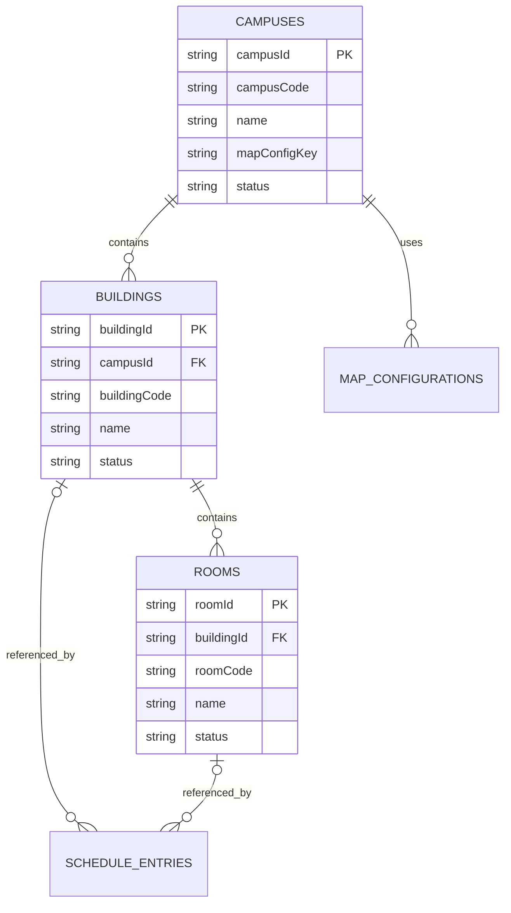
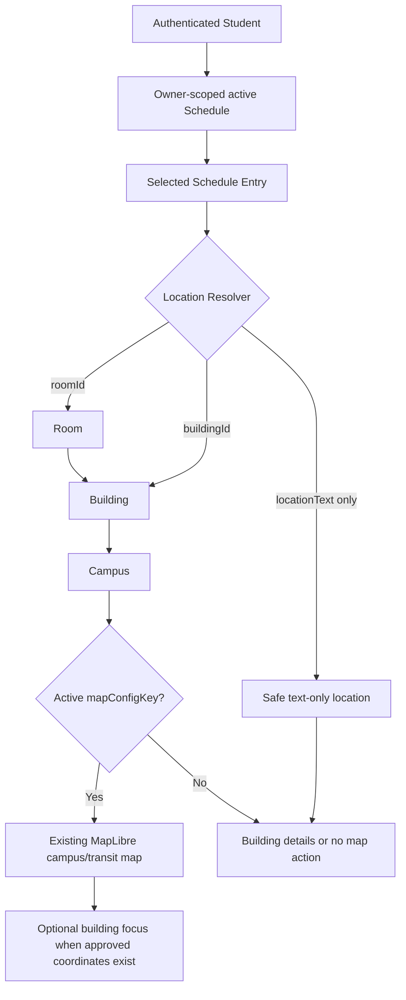
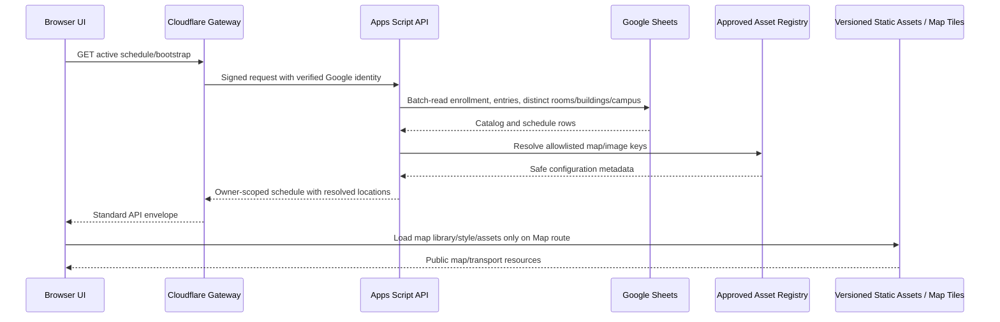

# My-Schedule Campus, Building, Room and Map Architecture

Status: planning only. This document does not modify application source/configuration, redesign the map, alter Google Sheets, implement APIs, or create location records.

Basis: `AUDIT.md`, `ARCHITECTURE.md`, `DATABASE.md`, `ACADEMIC_STRUCTURE.md`, `AUTHENTICATION.md`, `STUDENT_DASHBOARD.md`, `SCHEDULE_CRUD.md`, and the existing read-only map/building implementation.

## 1. Location Architecture

The location subsystem has three separate data classes:

| Data class | Examples | Owner | Initial storage |
|---|---|---|---|
| Shared QCU location catalog | Campuses, buildings, rooms, coordinates, approved images | QCU/application catalog | Google Sheets behind Apps Script |
| Public map/transport configuration | Map style key, Route 4 data asset, corridor asset, source/disclaimer metadata | System/admin pipeline | Small configuration record plus versioned static assets |
| Student schedule references | `buildingId`, `roomId`, reviewed `locationText` | Authenticated student through schedule | `Schedule_Entries` in Sheets |

The schedule never owns a building or room. It only references shared catalog records or preserves reviewed unresolved text.

```text
Authenticated User
-> Enrollment and active Schedule
-> Schedule Entry
-> Room and/or Building
-> Campus
-> Approved map configuration
```

### Core Boundaries

- `Campuses`, `Buildings`, and `Rooms` are shared data and are not duplicated per student.
- Schedule location is term-specific and user-owned through the schedule parent.
- Route 4 is public transportation information associated with a configured campus; it is not an academic schedule entry.
- The map receives only the selected campus/building context it needs. It does not need the student's whole schedule.
- Large route geometry remains a versioned public static asset, not a large JSON cell in Sheets.
- Arbitrary URLs, HTML, map styles, geometry files, and image paths are not accepted from students or directly rendered from Sheet text.

### Map Configuration Registry

`DATABASE.md` already defines `Campuses.mapConfigKey` as an allowlisted configuration reference. To support runtime administrator create/update/deactivate operations for map metadata, add a small logical `Map_Configurations` entity before implementation if that requirement is confirmed.

Recommended minimal fields:

| Field | Rule |
|---|---|
| `mapConfigId` | Opaque stable primary key |
| `mapConfigKey` | Unique canonical key referenced by `Campuses.mapConfigKey` |
| `campusId` | FK to `Campuses`; one active default configuration per campus initially |
| `name` | Administrative label |
| `defaultLatitude`, `defaultLongitude`, `defaultZoom` | Optional validated viewport; never invented |
| `mapStyleKey` | Allowlisted style identifier, not an arbitrary URL |
| `transportDataAssetKey` | Optional approved versioned transport-data asset |
| `geometryAssetKey` | Optional approved versioned geometry asset |
| `status` | `ACTIVE` or `INACTIVE` |
| common mutable fields | `createdAt`, `createdBy`, `updatedAt`, `updatedBy`, `version` |

The transport asset keeps route facts, stops, service windows, sources, last-verified date, and disclaimers. The geometry asset keeps the route line and its source/disclaimer. Application administrators manage the configuration record and approved asset-key assignment. Deployment operators publish or replace the actual reviewed static assets. This prevents a catalog administrator from injecting arbitrary remote resources.

If runtime map-config administration is not required for the first release, omit the new Sheet and keep the same contract in a deployment-owned manifest keyed by `mapConfigKey`. This decision must be made before schema implementation.

## 2. Campus Model

Use the `Campuses` schema from `DATABASE.md`.

| Field | Required | Purpose and validation |
|---|---:|---|
| `campusId` | Yes | Opaque immutable PK, for example `cam_<uuid>` |
| `campusCode` | Yes | Unique canonical administrative/import code; not a display-name key |
| `name` | Yes | Approved full campus name |
| `timeZone` | Yes | IANA time zone used by schedule and status logic |
| `status` | Yes | `ACTIVE` or `INACTIVE` |
| `shortName` | No | Compact approved display label |
| `address` | No | Approved postal/location text |
| `latitude`, `longitude` | No | Campus reference point; both valid or both null |
| `logoAssetKey` | No | Approved branding key |
| `mapConfigKey` | No | Approved map/transport configuration key |
| common mutable fields | Yes | Timestamps, actors, optimistic `version` |

Rules:

- Multiple campuses use the same schema and API contracts.
- The student's campus resolves through `Enrollment.offeringId -> Program_Offerings.campusId`.
- The browser does not select an institutional campus by sending arbitrary coordinates.
- Latitude must be between `-90` and `90`; longitude between `-180` and `180`.
- One coordinate without the other is invalid.
- Coordinates and address are nullable. Missing data produces a limited location view, not invented values.
- `mapConfigKey` must exist in the approved active registry when non-null.
- Deactivated campuses remain readable for historical enrollments but cannot receive new active offerings/buildings/map configurations.
- Only San Bartolome is evidenced by the current codebase. No other campus should be seeded as fact without an authoritative QCU source.

## 3. Building Model

Use the `Buildings` schema from `DATABASE.md`.

| Field | Required | Purpose and validation |
|---|---:|---|
| `buildingId` | Yes | Opaque immutable PK |
| `campusId` | Yes | FK to the owning campus |
| `buildingCode` | Yes | Canonical code unique among active buildings in that campus |
| `name` | Yes | Approved full name |
| `status` | Yes | `ACTIVE` or `INACTIVE` |
| `shortName` | No | Compact label used instead of frontend substring rules |
| `description` | No | Approved directory description |
| `imageAssetKey` | No | Key into an approved local/public asset registry |
| `latitude`, `longitude` | No | Optional approved building point; both valid or both null |
| `floorCount` | No | Positive integer only when authoritative/useful |
| common mutable fields | Yes | Timestamps, actors, optimistic `version` |

Rules:

- A building belongs to exactly one campus.
- Building codes are unique within a campus, not assumed globally unique.
- The ID, not code/name, is used for schedule relationships.
- A building may omit coordinates. The system then opens building details or the campus-level map without fabricating a building pin.
- New or updated coordinates should be checked for valid ranges and reviewed against the campus context. Do not use an arbitrary client coordinate as trusted catalog data.
- `imageAssetKey` resolves only through an allowlisted asset registry. Existing building photos are migration candidates, not automatically approved.
- Deactivation blocks new schedule selections but preserves historical references and display labels.
- `floorCount` is a directory summary. Individual room floors come from `Rooms.floorLabel`.

Do not add floor-plan geometry, room-booking state, navigation graphs, opening hours, or accessibility claims until there is an actual source and requirement.

## 4. Room Model

Use the `Rooms` schema from `DATABASE.md`.

| Field | Required | Purpose and validation |
|---|---:|---|
| `roomId` | Yes | Opaque immutable PK |
| `buildingId` | Yes | FK to the owning building |
| `roomCode` | Yes | Canonical code unique among active rooms in the building |
| `name` | Yes | Approved display name; may equal code when no distinct name exists |
| `status` | Yes | `ACTIVE` or `INACTIVE` |
| `floorLabel` | No | Approved display label such as a floor name/number |
| `roomType` | No | Controlled value only if the project needs it for display/filtering |
| `capacity` | No | Positive integer only when authoritative and useful |
| `description` | No | Approved directory description |
| common mutable fields | Yes | Timestamps, actors, optimistic `version` |

Rules:

- A room belongs to exactly one building and inherits its campus.
- Room codes are unique within a building, not assumed globally unique.
- A schedule payload cannot assign a room to a different building.
- Rooms do not require coordinates in the initial model.
- Missing floor/type/capacity remains null and is omitted from the UI rather than guessed.
- Inactive rooms remain available for historical display but cannot be selected for a new active schedule revision.
- `data/rooms.json` is currently an empty invalid placeholder and must not become an authoritative migration source.

### Campus, Building and Room Relationship



`MAP_CONFIGURATIONS` is conditional on the schema decision in Section 1. The relationship can instead resolve through a deployment manifest without changing the frontend contract.

## 5. Schedule-to-Location Relationship

`Schedule_Entries` already contains nullable `buildingId`, `roomId`, and `locationText` plus `modality`.

Resolution rules:

1. Resolve the authenticated schedule entry and its enrollment campus.
2. If `roomId` exists, load the room and its parent building.
3. If `buildingId` also exists, require it to equal the room's parent building.
4. If only `buildingId` exists, load the building without inventing a room.
5. Require the building campus to match the enrollment campus unless an explicitly approved cross-campus class model is added later.
6. Preserve `locationText` as reviewed student/COR text. It is a display fallback, not a shared catalog record.
7. Resolve the campus `mapConfigKey` and approved map assets only when a map action is possible.
8. Return one normalized location view model to Dashboard, Today, Weekly Schedule, building details, and Map.

Recommended API-safe view model:

```json
{
  "resolutionStatus": "RESOLVED",
  "displayText": "Room IL502A, New Academic Building",
  "modality": "ONSITE",
  "campus": {
    "campusId": "cam_uuid",
    "name": "Approved campus label",
    "shortName": "Approved short label",
    "mapAvailable": true
  },
  "building": {
    "buildingId": "bld_uuid",
    "code": "IL",
    "name": "New Academic Building",
    "shortName": null,
    "status": "ACTIVE",
    "hasCoordinates": false
  },
  "room": {
    "roomId": "rom_uuid",
    "code": "IL502A",
    "name": "IL502A",
    "floorLabel": "5th Floor",
    "status": "ACTIVE"
  },
  "mapAction": {
    "kind": "CAMPUS_MAP",
    "buildingId": "bld_uuid"
  },
  "warnings": []
}
```

`resolutionStatus` is a derived view-model state, not a new Sheet status. Minimum values:

- `RESOLVED`: active room/building/campus chain is valid.
- `BUILDING_ONLY`: building is resolved but room is absent/unknown.
- `TEXT_ONLY`: only reviewed `locationText` is safe to display.
- `ONLINE`: no physical map action.
- `TBA`: location is not known.
- `INACTIVE_REFERENCE`: historical/deactivated catalog reference is readable but needs review for current use.
- `INVALID_REFERENCE`: broken/cross-campus relationship; no map action and an integrity alert.

Do not call a building/room API separately for every schedule row. The schedule/bootstrap read model should include the distinct referenced catalog records and resolved locations in one bounded response.

## 6. Map Data Flow



The map route accepts an opaque campus/building context, not raw student data. A schedule link may navigate to a route such as `/map?building=bld_uuid`; the authenticated application resolves that ID and strips/ignores unauthorized or invalid context. Public Route 4 access uses only public campus/map configuration and never exposes schedule entries.

## 7. Existing Map Migration Plan

### Current Implementation

The audited map is a public Route 4 reference experience, not indoor navigation or live vehicle tracking:

- `campus-eta.html` supplies Route 4 page structure, static campus-specific copy, schedule tabs, legend, source link, and no-live-tracking disclosure.
- `assets/js/eta.js` loads `data/qcity-bus.json` and `data/route4-corridor.json` in parallel.
- MapLibre GL JS 4.7.1 renders an OpenFreeMap style.
- The map draws a static route casing/line, verified-coordinate stop circles/labels, a campus marker, terminus markers, and escaped stop popups.
- Missing stop coordinates are skipped rather than inferred.
- Missing bus/corridor data fails independently; the schedule/map uses honest unavailable states.
- WebGL/library failures show a map-unavailable panel while leaving route information usable.
- The camera fits the route corridor with separate mobile/desktop padding.
- Route service tabs implement keyboard arrow/Home/End navigation and show published service windows without inventing per-trip departures.
- The page includes source/last-verified information and states that the corridor is indicative, not an official GPS trace.
- MapLibre and tiles are third-party browser requests; the same-origin service worker does not cache them, so the basemap is not fully offline.

### Preserve

- MapLibre rendering and current visual behavior.
- Route line/casing, stop markers/labels/popups, campus marker, and termini.
- Current responsive framing, navigation control placement, map legend, and route plate.
- Keyboard-operable schedule tabs and reduced-motion handling.
- Independent unavailable/error behavior.
- Source attribution, verification date, indicative-geometry disclaimer, and no-live-tracking disclosure.
- Static Route 4 service facts and honest handling when a timetable is not published.
- Building directory cards/modal as a presentation pattern, populated dynamically later.

### Refactor During Future Implementation

- Replace `QCU_COORDS` with resolved campus/map configuration.
- Replace fixed campus marker label with the configured campus label.
- Replace fixed asset paths with `mapConfigKey` -> approved asset manifest resolution.
- Let the Map route select the active campus configuration instead of assuming every student uses San Bartolome.
- Add optional building focus only when the selected building has approved coordinates.
- Split the public Route 4 module from authenticated schedule-location selection while allowing both to reuse the same map component.
- Replace global map state with a route-scoped module that is loaded only on the map page.
- Pin/self-host reviewed MapLibre/Lucide assets and enforce a CSP before private sessions are introduced; this changes delivery hardening, not the visual design.

### Do Not Introduce

- Live bus positions, predicted arrival times, or countdowns without an authoritative feed.
- Turn-by-turn or indoor navigation claims.
- Building pins from guessed coordinates.
- A Route 4 panel for campuses that have no approved Route 4 association.
- Student schedule data inside public map/transport assets.

## 8. Existing Route 4 Handling

Route 4 is classified as follows:

| Question | Decision |
|---|---|
| Static shared information? | Yes. Route identity, stops, service windows, fare, amenities, sources, and disclaimers are public shared data. |
| Schedule-dependent? | No. It does not change based on a student's academic schedule. A schedule entry may link to the campus map, but it does not modify Route 4. |
| Campus configuration? | Yes. Route 4 is associated only with a campus whose approved `mapConfigKey` references the Route 4 assets. |
| Student-specific? | No. No student ID, program, schedule, or location history belongs in the route files. |

Initial storage:

- Keep `data/qcity-bus.json` as a reviewed, versioned public transport asset or migrate it to an equivalent versioned asset path.
- Keep `data/route4-corridor.json` as a versioned public geometry asset.
- Associate both through the approved San Bartolome map configuration only after confirming the campus/route relationship.
- Keep transport source/verification metadata inside the transport asset.
- Keep the geometry generator as an operator tool; its output remains explicitly indicative.

The current data supports service windows/headways and optionally real departures if an authoritative future source provides them. It must continue to avoid interpolating a timetable.

`functions/api/route.js` is not Route 4. It is an unused TomTom point-to-hardcoded-campus driving/traffic proxy with no current frontend caller. Keep it disabled/unowned until a defined, privacy-reviewed workflow needs point-to-campus routing. If revived later, it must resolve an allowlisted campus/building target, keep the provider key server-side, rate-limit requests, require explicit user-location consent, and avoid public wildcard CORS.

## 9. Hardcoded-Location Migration Map

This table is a future migration plan only. The current files are not changed in this chunk.

| Current source/value | New source | Required future migration action |
|---|---|---|
| `QCU_DEFAULTS.schedule` building/room/floor strings in `assets/js/app.js:7-20` | Owner-scoped `Schedule_Entries` plus `Buildings`/`Rooms` | Remove personal production fallback; map reviewed legacy rows to stable IDs only after ownership/catalog validation |
| `QCU_DEFAULTS.buildings` in `assets/js/app.js:21-25` | Shared `Buildings` and `Rooms` | Import only validated candidates; remove duplicate JavaScript catalog |
| `data/schedule.json` location strings | Migration fixture or explicit user import | Never expose as a universal schedule; match to validated catalog IDs or retain reviewed `locationText` |
| `data/buildings.json` three-building catalog | Shared catalog API | Validate official names/codes/campus/images first; split nested room arrays into `Rooms` rows |
| Empty `data/rooms.json` | `Rooms` Sheet/API | Do not import; replace production dependency with valid API/schema fixtures |
| `buildingByCode()` and schedule `code` joins | `buildingId`/`roomId` relationships | Remove text/code joins from runtime domain logic |
| `buildingShort()` name substring checks | `Buildings.shortName` | Render configured short/full label; remove name-specific conditionals |
| `classesForBuilding`, `subjectsForBuilding`, `roomsForBuilding` derived from one personal schedule | Shared building/room catalog plus separate owner-scoped usage summary | Directory lists catalog rooms; personal class/subject counts are clearly labeled as the current student's schedule |
| Building `rooms[]`, `floors` strings in cards/modal | `Rooms` rows, `floorLabel`, optional `floorCount` | Compute counts from catalog; omit unknown fields instead of deriving from personal meetings |
| Building image filenames in JSON/JS | `Buildings.imageAssetKey` -> approved asset registry | Validate existing photos and use safe fallback when missing |
| New Academic Building, Bautista Building, Belmonte Hall | Candidate `Buildings` rows | Confirm official names, canonical codes, campus assignments, status, and images before seeding |
| `IL502A`, `IL601A`, `IL606A`, `IK603 F1`, `SB OG` | Candidate `Rooms` rows | Confirm room codes, names, parent buildings, floor labels, and active status before seeding |
| `assets/js/eta.js:12` `QCU_COORDS` | `Campuses` coordinates plus map configuration | Resolve campus marker/default viewport from approved configuration |
| `assets/js/eta.js` label `QCU Campus` | `Campuses.name`/`shortName` | Render configured label; preserve generic fallback only when appropriate |
| Fixed San Bartolome/Route 4 copy and ARIA label in `campus-eta.html` | Public campus/transport configuration | Keep Route 4 page campus-specific but populate labels/facts from approved data; do not show it for unrelated campuses |
| `data/qcity-bus.json` campus stop and route facts | Versioned public transport asset associated with `mapConfigKey` | Preserve source/verification/no-live-tracking data; validate before release updates |
| `data/route4-corridor.json` | Versioned geometry asset associated with `mapConfigKey` | Preserve source/disclaimer; use immutable/versioned cache key |
| Hardcoded waypoints in `scripts/build-route4-corridor.mjs` | Operator-supplied reviewed route config | Parameterize only during implementation; retain manual review and disclaimer |
| San Bartolome coordinates/labels in `assets/js/status.js` | Active/public Campus configuration | Resolve campus weather/status context and namespace cache by campus/config version |
| San Bartolome coordinates in `functions/api/flood.js` and `functions/api/weather-alerts.js` | Trusted server-side campus config | Accept an allowlisted campus key, never arbitrary institutional coordinates |
| San Bartolome target in `functions/api/route.js` | Deferred trusted campus/building resolver | Keep disabled until owned; never take the destination directly from an untrusted client |
| San Bartolome point in `scripts/fetch-flood.mjs` | Operator-selected campus config | Parameterize the out-of-band job only after multi-campus status requirements are approved |
| `scripts/_smoke-notice.mjs` `IL502A`/`NAB` literals | Non-personal generated fixtures | Keep explicitly test-only or replace with fixture IDs; never treat as seed authority |
| Building/route assets enumerated manually in `service-worker.js` | Generated/versioned public asset manifest | Separate public catalog/map cache from private schedule cache and invalidate by version |
| Empty `temp_buildings.txt` and `temp_schedule.txt` | No runtime source | Exclude/remove later after confirming no tooling dependency; do not migrate |

## 10. Missing-Location Behavior

| Condition | Display | Allowed action |
|---|---|---|
| Room and building resolved/active | Room, building, optional floor | Building details; map when campus config exists |
| Building resolved, room missing | Building plus `Room not specified` or reviewed text | Building details; campus/building map when available |
| Room ID present but parent mismatch | `Location details unavailable` plus safe reviewed text | No map; integrity alert/review |
| Only `locationText` confirmed | Display the text with `Unmatched location` label | No fabricated pin; allow schedule correction |
| No IDs/text for onsite class | `Location TBA` | No map; edit/review action |
| Online class | `Online` plus safe optional platform/location label | No physical map action |
| Hybrid class | Resolve each meeting occurrence independently | Physical occurrence may open map; online occurrence does not |
| Building coordinates missing | Show building details | Open campus-level map only; do not focus a pin |
| Campus coordinates missing | Show building/room text | No coordinate-based map; directory remains available |
| Campus has no map config | `Campus map information is not available` | Building details only |
| Building/room inactive in current schedule | Show historical label and `Needs review` | No new selection; correction/re-import |
| Building/room inactive in historical term | Show preserved historical label/status | Read-only details; map only if still safely configured |
| Map library/WebGL/tiles fail | Keep textual campus/building/room/Route 4 information | Retry map; official source link remains |

Current schedule activation must reject broken or cross-campus foreign keys. Deactivation after activation does not silently erase a student's location; the active schedule is flagged for review and historical revisions remain readable.

## 11. Admin Ownership

Administrators manage shared location data only through explicit capabilities and trusted scopes.

Recommended capabilities:

- `catalog.read`: safe shared catalog reads where not already generally allowed.
- `catalog.write`: create/update/deactivate campuses, buildings, and rooms within assigned scope.
- `map.config.write`: create/update/deactivate map configuration metadata and assign approved asset keys.
- `audit.read`: view permitted audit events; separate from write authority.

Scope rules:

- A global assignment may manage all campuses.
- A `CAMPUS`-scoped assignment may manage buildings, rooms, and map configuration whose trusted parent is that campus.
- Department/program scopes do not automatically imply physical-campus catalog write access.
- Apps Script derives target scope from `building.campusId`, `room -> building -> campus`, or map-config campus relation.
- Admins cannot edit student schedules merely because they can edit the location catalog.
- Admins cannot upload arbitrary map code, remote styles, images, geometry, or transport files through ordinary text fields.

All writes require strict validation, `expectedVersion`, a `clientMutationId` when retryable, and audit events. Deactivation is preferred over deletion when referenced. A referenced campus cannot be casually deactivated without impact analysis for offerings, buildings, active schedules, status services, and map configuration.

## 12. Student Permissions

Students may:

- Read active campus/building/room catalog data needed for their enrollment and directory.
- Read historical inactive labels through their own schedule history.
- View building details and approved map/transport information.
- Use a schedule correction flow to select an active valid building/room or retain reviewed unresolved text.
- Open Route 4 information when the selected/active campus has the approved configuration.

Students may not:

- Create/update/deactivate shared campuses, buildings, rooms, coordinates, images, or map configuration.
- Turn free-form `locationText` into a shared catalog row.
- Submit a building/room belonging to another campus unless a future cross-campus rule explicitly allows it.
- Supply arbitrary map asset/style/source URLs.
- Use another student's schedule entry to resolve private location context.
- Cause the public map endpoint to return private schedule/profile data.

Schedule corrections remain governed by `SCHEDULE_CRUD.md`. Shared catalog changes require administration; personal reviewed location text remains user-owned through the schedule entry.

## 13. API Contract

The browser uses versioned same-origin Cloudflare routes. Cloudflare authenticates private requests and sends signed canonical actions to Apps Script. Apps Script verifies the actor, account status, capabilities/scopes, versions, foreign keys, and allowlisted configuration.

### Catalog Reads

| Browser route | Apps Script action | Access | Main behavior |
|---|---|---|---|
| `GET /api/v1/catalog/campuses` | `catalog.campus.list` | Authenticated; approved public projection may be public | Filter active/status, paginate, return catalog version |
| `GET /api/v1/catalog/campuses/{campusId}` | `catalog.campus.read` | Same | Safe campus details and map availability, not raw config secrets |
| `GET /api/v1/catalog/campuses/{campusId}/buildings` | `catalog.building.list` | Authenticated; public subset optional | Active/status filter, cursor/limit |
| `GET /api/v1/catalog/buildings/{buildingId}` | `catalog.building.read` | Authenticated | Building, parent campus summary, optional safe image key/URL |
| `GET /api/v1/catalog/buildings/{buildingId}/rooms` | `catalog.room.list` | Authenticated | Active/status filter, cursor/limit |
| `GET /api/v1/catalog/rooms/{roomId}` | `catalog.room.read` | Authenticated | Room plus parent building/campus summary |

Supported filters are allowlisted: `campusId`, `buildingId`, `status`, cursor, bounded `limit`, and optionally normalized code/name search for admin lists. The server ignores/blocks unknown owner or scope filters.

### Resolved Location Reads

Normal schedule/bootstrap responses include resolved location view models and distinct referenced catalogs. A dedicated endpoint is useful for deep links or refresh:

| Browser route | Apps Script action | Access | Validation |
|---|---|---|---|
| `GET /api/v1/schedule-entries/{id}/location` | `schedule.location.read` | Owner only | Entry -> schedule -> enrollment ownership and term visibility |
| `GET /api/v1/locations/buildings/{id}/view` | `location.building.view` | Authenticated | Active/historical projection and campus/map resolution |

The client must not make the dedicated schedule-location request once per row.

### Map/Public Transport Reads

| Browser route | Action/source | Access | Main behavior |
|---|---|---|---|
| `GET /api/v1/campuses/{campusId}/map-config` | `map.config.read` | Authenticated; approved public projection may be public | Resolve only active allowlisted config and safe asset references |
| Versioned transport asset path | Cloudflare static asset | Public | Route facts, service windows, stops, sources, verification, disclaimer |
| Versioned geometry asset path | Cloudflare static asset | Public | Validated bounded GeoJSON/coordinate data and source disclaimer |

The map-config response should expose application-owned asset URLs or keys, not Sheet names, arbitrary source URLs, filesystem paths, or secrets.

### Admin Mutations

| Browser route | Apps Script action | Authorization |
|---|---|---|
| `POST /api/v1/admin/campuses` | `catalog.campus.create` | `catalog.write` with valid scope/bootstrap policy |
| `PATCH /api/v1/admin/campuses/{id}` | `catalog.campus.update` | `catalog.write`; expected version |
| `DELETE /api/v1/admin/campuses/{id}` | `catalog.campus.deactivate` | `catalog.write`; dependency/impact validation |
| `POST/PATCH/DELETE /api/v1/admin/buildings...` | `catalog.building.create/update/deactivate` | `catalog.write` for trusted campus scope |
| `POST/PATCH/DELETE /api/v1/admin/rooms...` | `catalog.room.create/update/deactivate` | `catalog.write` derived through building campus |
| `POST/PATCH/DELETE /api/v1/admin/map-configs...` | `map.config.create/update/deactivate` | `map.config.write`; approved asset/style keys only |

### Response Envelope

```json
{
  "ok": true,
  "data": {
    "campus": {},
    "buildings": [],
    "rooms": [],
    "mapConfig": null,
    "catalogVersion": 12
  },
  "error": null,
  "meta": {
    "requestId": "req_uuid",
    "apiVersion": "v1",
    "schemaVersion": 1,
    "serverTime": "2026-08-30T04:15:00Z"
  }
}
```

Use existing stable error codes plus location-specific codes only where they improve recovery:

- `UNAUTHENTICATED`, `FORBIDDEN`, `NOT_FOUND`.
- `VALIDATION_FAILED`, `DUPLICATE`, `VERSION_CONFLICT`, `STATE_CONFLICT`.
- `CATALOG_REFERENCE_INACTIVE`.
- `LOCATION_RELATION_INVALID` for room/building/campus mismatch.
- `MAP_CONFIG_UNAVAILABLE` for an absent/inactive configuration.
- `ASSET_REFERENCE_INVALID` for a non-allowlisted asset/style key.
- `RATE_LIMITED`, `INTERNAL_ERROR`.

Admin mutations use the standard `clientMutationId`, `expectedVersion`, audit, and safe-error rules from `DATABASE.md`.

### Location API and Data Flow



## 14. Caching and Performance Strategy

### Prevent N+1 Location Requests

- `bootstrap` or active-schedule responses batch-load all distinct referenced rooms, buildings, and the one enrollment campus.
- Apps Script repositories read ranges in batches and construct ID maps in memory.
- A building directory fetches the campus's building list and only loads room detail when needed, or returns a bounded room summary.
- Repeated schedule entries share one catalog record in the response/cache.

### Versioned Shared Catalog Cache

- Return `catalogVersion` or entity-specific version metadata.
- Cache active campuses/buildings/rooms server-side for a short bounded period.
- Browser public/shared catalog cache is separate from private schedule cache.
- Admin writes invalidate the affected campus/building/room/map-config keys promptly.
- Deactivation/coordinate/map-key changes increment versions and invalidate related map view models.

### Static Map and Transport Assets

- Use content-hashed/versioned filenames for route data and geometry.
- Cache immutable versioned geometry for a long period.
- Route/service metadata may use a shorter revalidation policy because source/verification dates change.
- The configuration points to a new asset key on update rather than overwriting cached geometry in place.
- Keep map bundles and geometry lazy-loaded; Dashboard and Landing do not load them.

### Private Data

- Private schedule responses use `no-store` at the HTTP layer unless the final authenticated cache design explicitly supports encrypted/private caching.
- Any offline snapshot is namespaced by user ID, enrollment ID, schedule version, and catalog version.
- Logout/account switch purges private location/schedule views.
- Public Route 4 assets may remain available offline, but offline availability must not be confused with data freshness.

### External Provider Cost/Privacy

- The current MapLibre/OpenFreeMap path has no application API key, but map tile/style requests still disclose the user's IP/device request metadata to the provider.
- Load external map resources only when the user opens the map route.
- Avoid enabling TomTom or another routing API until a user workflow, quota, privacy notice, and rate-limit strategy are approved.

## 15. Mobile UX

Preserve the existing mobile map rather than redesigning it.

### Schedule and Dashboard

- Show room/building or safe reviewed location text directly in the class row/card.
- Provide `View building` only when `buildingId` resolves.
- Provide `Open map` only when the campus has an active map configuration.
- Do not show a disabled map button for online/TBA/text-only locations; use the correct explanatory state.
- Deduplicate today's building shortcuts.

### Building Details

- Reuse the current building card/detail pattern with dynamic catalog data.
- Show building name/code, approved image, description, floor summary, and room list only when available.
- Personal `Classes this week` or subject summaries must be clearly separate from the shared building catalog.
- A missing image uses a stable QCU/location fallback without layout shift.

### Map Route

- Keep the map full-width within the existing page layout and preserve current responsive height/padding.
- Keep zoom controls, attribution, route plate, legend, stop popups, and the text schedule/source sections reachable.
- When opened from a building, focus the building only if approved coordinates exist; otherwise keep campus/route framing and show building details above/below the map.
- Browser Back returns to the originating schedule/building view and restores useful scroll/focus position.
- Map loading/failure does not block textual location or Route 4 information.
- Do not request device geolocation merely to view campus/Route 4 data.

### Accessibility

- Map actions are real buttons/links with descriptive labels such as `Open campus map for New Academic Building`.
- The map canvas is supplemented by textual campus, building, room, route, stops, schedule, source, and disclaimer information.
- Keyboard users can reach controls without overlays covering them.
- Popup/marker content is escaped and meaningful without color alone.
- Schedule tabs retain the current ARIA tab and roving-tabindex behavior.
- Reduced-motion settings continue to disable nonessential transition animation.

## 16. Security and Authorization

### Shared vs Private Data

- Public map/Route 4 endpoints expose only approved public campus/transport data.
- Private schedule entry IDs and owner-specific location view models require authentication and owner checks.
- Do not include student name, program, schedule, COR, tasks, notes, Google identity, or user location in public map asset requests.
- Cross-user schedule-entry lookups return privacy-safe `NOT_FOUND`.

### Admin Enforcement

- Apps Script resolves roles/capabilities/scopes server-side.
- Browser admin flags and supplied campus scope are not authoritative.
- Room scope derives through room -> building -> campus.
- All creates/updates/deactivations validate FKs, status, codes, coordinates, asset keys, expected versions, and idempotency.
- Privileged writes and denials are audited without sensitive payloads.

### Content and Asset Safety

- Validate all coordinates as finite numeric pairs and bound geometry size/feature types.
- Accept only approved `mapStyleKey`, `imageAssetKey`, `transportDataAssetKey`, and `geometryAssetKey` values.
- Never render arbitrary admin/student HTML. Use safe text rendering; keep the current stop-popup escaping behavior.
- External official-source links require approved `https` origins and `rel="noopener noreferrer"`.
- Apply CSP rules for map library, style, tile, image, and API origins.
- Prefer reviewed pinned/self-hosted JavaScript/CSS over unpinned CDN dependencies before authenticated private data is displayed.
- Protect server provider keys in Cloudflare/App Script secrets; never place them in Sheets or browser code.

### Geolocation

- The existing Route 4 map does not require the student's device location.
- Any future point-to-campus routing requires explicit user action/permission, minimal retention, expiration, cache deletion, and a clear privacy statement.
- Device coordinates never become authoritative campus/building coordinates.

## 17. Implementation Dependencies

Resolve these items before location implementation:

1. Confirm the authoritative QCU owner/source for campus, building, room, address, coordinate, and image data.
2. Confirm the official San Bartolome name/code/address/coordinates and Route 4 association.
3. Validate New Academic Building, Bautista Building, Belmonte Hall, their codes, listed rooms/floors, campus assignment, and current status.
4. Review which existing building photos are official/current/licensed and assign approved asset keys/fallbacks.
5. Decide whether `Map_Configurations` becomes a Sheet entity or remains a deployment manifest for the first release.
6. Approve the map-style, transport-data, geometry, image, and external-source asset registries.
7. Decide whether the Route 4 page is public, authenticated, or one reusable page available in both states.
8. Confirm whether any campus other than San Bartolome has an initial map/transport configuration; do not seed unsupported data.
9. Approve catalog/map capabilities and campus scope rules.
10. Implement schema metadata/migrations, stable IDs, unique indexes, versions, deactivation, audit, and cache invalidation.
11. Implement Apps Script repositories and a pure location resolver with batch joins.
12. Add Cloudflare signed routes and safe public/private cache headers.
13. Build migration tooling that reports unmatched buildings/rooms without guessing and preserves `locationText`.
14. Adapt the existing building directory/modal to catalog view models.
15. Parameterize the existing map module through approved campus/map configuration without changing its visual design.
16. Preserve and test Route 4 source/disclaimer/fail-unknown behavior and the absence of live-tracking claims.
17. Generate/version service-worker public assets separately from private authenticated caches.
18. Add tests for multiple campuses, duplicate codes across campuses/buildings, missing coordinates, inactive records, invalid parent chains, online/TBA/text-only locations, map failures, stale caches, and authorization scope.
19. Run mobile/tablet/desktop and keyboard/screen-reader checks on building/map deep-link workflows.

No map or schedule implementation should depend on guessed QCU coordinates or unverified building data while these dependencies remain unresolved.

## 18. Open Questions

1. What are the official QCU campuses, canonical codes, addresses, time zones, and location-data owners?
2. Is San Bartolome officially named Main Campus in the application, and which coordinate/address source should be authoritative?
3. Are the existing building names/codes and room codes official and current?
4. Are official building coordinates available, or should the first release stop at building details plus campus-level maps?
5. Which existing building images may be published, and who approves replacements?
6. Is Route 4 confirmed as a San Bartolome-only feature?
7. Should the Route 4 page remain accessible before Google login?
8. Should the authenticated navigation label be `Map`, `Campus`, or `Map and Transit`?
9. Do any legitimate classes meet at a campus different from the enrollment campus?
10. Must rooms support types/capacity filters at launch, or should those optional fields remain unused?
11. Who may create/approve map configuration keys and publish static route/geometry assets?
12. Does the project require runtime admin CRUD for map configurations, justifying `Map_Configurations`, or is deployment-managed configuration sufficient initially?
13. What verification/update process and retention history apply to Route 4 service data?
14. Should inactive building/room references in an active schedule block the dashboard, show a warning, or open a correction task automatically?
15. Is external point-to-campus routing required at all, or should the unused TomTom function be retired later?
16. Is offline public Route 4 text/data required even when map tiles are unavailable?
17. Are additional QCU transport routes in scope later, and if so, what authoritative source owns them?

## CHUNK 12 Handoff: Tasks, Notes and Personal Productivity Architecture

CHUNK 12 should read all current planning documents, especially `DATABASE.md`, `AUTHENTICATION.md`, `STUDENT_DASHBOARD.md`, `SCHEDULE_CRUD.md`, and this document, then design the user-owned productivity subsystem. It must:

1. Define normalized Task and Note models, lifecycle states, timestamps, priorities, due dates, completion/archive behavior, and optional links to `Enrollment_Subjects` without embedding personal schedule defaults.
2. Define owner-scoped CRUD/API contracts using authenticated identity, expected versions, idempotency keys, safe errors, and backend authorization that ignores client owner IDs.
3. Preserve valuable current task/note features, filters, subject selection, modal/editor patterns, and empty states while removing browser-wide `qcu-tasks`/`qcu-notes` ownership assumptions.
4. Define how subject links behave across academic terms, removed/manual subjects, COR re-import, archived schedules, and deleted/deactivated shared catalog records.
5. Decide offline read and optional offline mutation behavior, including user-namespaced IndexedDB/cache, outbox conflict handling, logout/account-switch cleanup, and shared-device privacy.
6. Define dashboard summaries, reminders/notifications boundaries, mobile/accessibility behavior, search/filtering, loading/error states, and performance without exposing note/task content to administrators by default.
7. Define legacy localStorage migration as an explicit per-user confirmation flow that never automatically assigns shared-device data to the newly authenticated account.
8. Specify security, privacy, retention, audit boundaries, and future SQL migration considerations.
9. Produce architecture documentation only. Do not implement CRUD, change source/configuration, alter Sheets, migrate local data, or add notifications in CHUNK 12.
