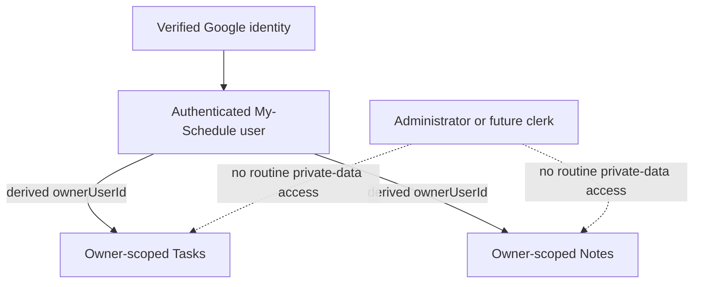
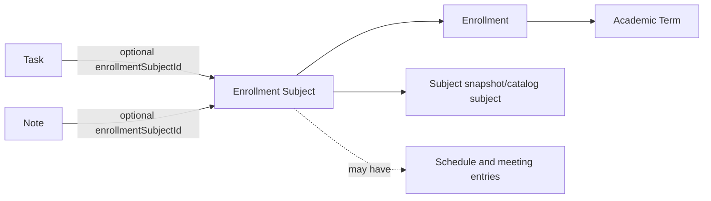
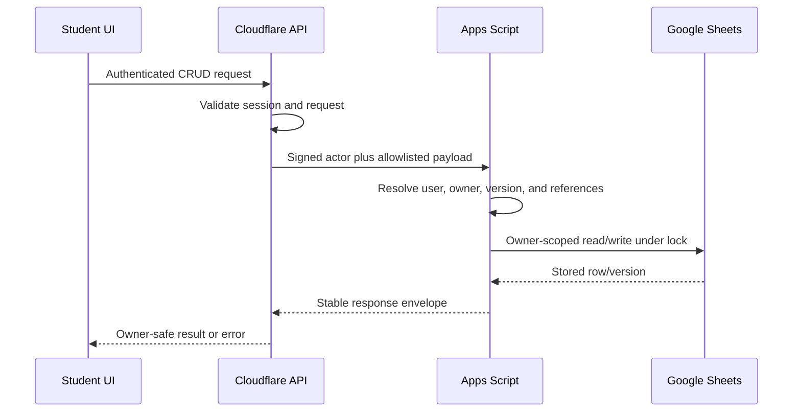

# My-Schedule Tasks, Notes, and Personal Productivity Architecture

Status: Planning only  
Scope: Authenticated student-owned Tasks and Notes  
Sources: `AUDIT.md`, `ARCHITECTURE.md`, `DATABASE.md`, `ACADEMIC_STRUCTURE.md`, `AUTHENTICATION.md`, `STUDENT_DASHBOARD.md`, `SCHEDULE_CRUD.md`, and `LOCATION_MAP.md`

This plan converts the existing browser-local workspace into private, multi-user resources while preserving its useful CRUD, filtering, sorting, completion, and subject-linking behavior. Google Sheets remains the initial database, Apps Script remains the data layer, and the browser is never authoritative for ownership or successful mutations.

## 1. Tasks Architecture

Tasks are personal action items owned by exactly one authenticated user. They are not shared academic catalog records, announcements, schedule entries, or administrator-managed content.

The initial task lifecycle is deliberately small:

```text
OPEN -> COMPLETED
COMPLETED -> OPEN
OPEN or COMPLETED -> DELETED
```

- A new task starts as `OPEN`.
- Completing a task sets `taskStatus=COMPLETED` and `completedAt`.
- Reopening a task sets `taskStatus=OPEN` and clears `completedAt`.
- Deleting a task sets `taskStatus=DELETED` and `deletedAt`; normal CRUD does not hard-delete the row.
- Deleted tasks are excluded from normal list and dashboard responses.
- Priority remains `LOW`, `MEDIUM`, or `HIGH` to preserve current behavior.
- A task may have a date deadline and may optionally reference one of the student's enrolled subjects.
- Due time, recurrence, reminders, collaboration, subtasks, labels, and attachments are outside the initial scope because the current product does not require them.

Preserved student operations:

- Create, view, edit, complete, reopen, and delete.
- Search title and description.
- Filter by open/completed state, priority, and enrolled subject.
- Sort by newest, oldest, deadline, priority, or title.

## 2. Notes Architecture

Notes are private, lightweight plain-text records owned by exactly one authenticated user. The initial release is not a document editor or collaboration system.

- A new note starts as `ACTIVE`.
- Students can create, read, update, and soft-delete notes.
- `ARCHIVED` is retained in the database enum for future use, but no archive UI or archive workflow is required in the first implementation.
- Delete sets `noteStatus=DELETED` and `deletedAt`.
- A note may optionally reference one of the student's enrolled subjects.
- Notes support title/body search, subject filtering, and newest/oldest/alphabetical sorting.
- Bodies remain plain text. HTML and Markdown authoring are not supported initially.

This preserves the existing note behavior while removing its dependency on the shared browser key `qcu-notes`.

## 3. Data Models

The canonical schemas are the `Tasks` and `Notes` sheets defined in `DATABASE.md`. Field names use stable API/database identifiers, not display labels.

### `Tasks`

| Field | Required | Type/format | Rules |
|---|---:|---|---|
| `taskId` | Yes | UUID-like string | Primary key; server generated |
| `ownerUserId` | Yes | User ID | Derived from authenticated Google identity; never accepted from the browser |
| `title` | Yes | String, 1-300 chars | Trimmed; rendered as text |
| `description` | No | String, max 4,000 chars | Plain text |
| `priority` | Yes | Enum | `LOW`, `MEDIUM`, `HIGH` |
| `taskStatus` | Yes | Enum | `OPEN`, `COMPLETED`, `DELETED` |
| `enrollmentSubjectId` | No | Enrollment-subject ID | Must belong to the same owner |
| `dueAt` | No | ISO 8601 timestamp | Canonical stored deadline; date policy must be resolved before implementation |
| `completedAt` | No | ISO 8601 timestamp | Required only while completed |
| `clientMutationId` | No | UUID-like string | Required by mutation requests; unique per owner/action receipt policy |
| `deletedAt` | No | ISO 8601 timestamp | Set when soft-deleted |
| `createdAt`, `updatedAt` | Yes | ISO 8601 timestamp | Server generated |
| `createdBy`, `updatedBy` | Yes | User ID | Authenticated actor |
| `version` | Yes | Positive integer | Incremented for every successful change |

### `Notes`

| Field | Required | Type/format | Rules |
|---|---:|---|---|
| `noteId` | Yes | UUID-like string | Primary key; server generated |
| `ownerUserId` | Yes | User ID | Derived from authenticated Google identity |
| `title` | Yes | String, 1-300 chars | Trimmed; rendered as text |
| `body` | Yes, subject to open question | String, max 12,000 chars | Plain text; current UI allows an empty body |
| `noteStatus` | Yes | Enum | `ACTIVE`, `ARCHIVED`, `DELETED` |
| `enrollmentSubjectId` | No | Enrollment-subject ID | Must belong to the same owner |
| `clientMutationId` | No | UUID-like string | Used for idempotent mutation handling |
| `deletedAt` | No | ISO 8601 timestamp | Set when soft-deleted |
| `createdAt`, `updatedAt` | Yes | ISO 8601 timestamp | Server generated |
| `createdBy`, `updatedBy` | Yes | User ID | Authenticated actor |
| `version` | Yes | Positive integer | Incremented for every successful change |

No `scheduleId`, `scheduleEntryId`, direct `enrollmentId`, or duplicated academic-term field is added initially. The optional `enrollmentSubjectId` supplies the stable student-owned academic relationship.

## 4. User Ownership

Ownership is enforced by the backend, not by hidden fields, URLs, or frontend routing.



Rules:

1. Cloudflare validates the session and sends the signed Google `sub` to Apps Script.
2. Apps Script resolves the internal `userId` and derives `ownerUserId`.
3. The API ignores client fields named `user_id`, `userId`, or `ownerUserId`.
4. Reads query by both stable record ID and derived owner ID.
5. Updates and deletes verify ownership again immediately before writing.
6. Cross-user IDs return privacy-safe `NOT_FOUND`, preventing record-existence disclosure.
7. Normal administrators do not have permission to read student task or note content.
8. Logout and account changes clear private in-memory state and the active user's cached projection.

## 5. Schedule Integration

Tasks and notes can optionally link to `Enrollment_Subjects`. This is the stable student-owned academic reference and provides subject snapshots, enrollment, term, program, and section context without coupling personal content to a versioned schedule.



Integration rules:

- Subject selectors list only `Enrollment_Subjects` owned by the authenticated user.
- New links normally use the active enrollment, with an explicit historical-term selector only if later required.
- The API verifies the enrollment-subject owner; a matching ID alone is insufficient.
- The UI displays the stored enrollment-subject snapshot/code so historical records remain understandable if the shared catalog changes.
- A removed or cancelled subject does not delete linked tasks or notes.
- Students may unlink a task or note without deleting it.
- Archiving or replacing a schedule does not affect tasks or notes.
- Tasks and notes do not link directly to a meeting row because schedule rows can be corrected, replaced, or archived.

## 6. Academic-Term Handling

Personal records are not forced into an academic term when they are general. Term context is derived only when `enrollmentSubjectId` is present.

- Linked task/note: term comes from `Enrollment_Subjects -> Enrollments -> Academic_Terms`.
- Unlinked task/note: no academic term; it remains general personal content.
- Switching the dashboard's active term changes available subject-link choices and filters, but does not hide all general records.
- Historical linked records remain readable using enrollment-subject snapshots.
- A new semester never rewrites or deletes prior tasks/notes.
- Term filtering should support `current`, a stable academic-term ID, and `all` only where the UI needs it.
- An old link can be removed, but it should not be silently remapped to a similarly coded subject in a new term.

## 7. CRUD Matrix

| Resource/action | Student owner | Other student | Administrator | System |
|---|---|---|---|---|
| List/read task | Allowed | Denied/`NOT_FOUND` | No routine access | Operational access only where required |
| Create task | Allowed for self | Denied | No | Validate and persist |
| Update/complete/reopen task | Allowed with current version | Denied/`NOT_FOUND` | No | Enforce lifecycle and version |
| Delete task | Soft-delete own task | Denied/`NOT_FOUND` | No | Retention cleanup only |
| List/read note | Allowed | Denied/`NOT_FOUND` | No routine access | Operational access only where required |
| Create note | Allowed for self | Denied | No | Validate and persist |
| Update note | Allowed with current version | Denied/`NOT_FOUND` | No | Enforce status and version |
| Delete note | Soft-delete own note | Denied/`NOT_FOUND` | No | Retention cleanup only |

Normal CRUD never transfers ownership. A task/note cannot be made public or shared in the initial model.

## 8. API Contracts

The browser uses versioned same-origin Cloudflare routes. Cloudflare authenticates the session and forwards signed canonical commands to Apps Script, following the envelope in `DATABASE.md`.

### Routes and Actions

| Browser route | Apps Script action | Purpose |
|---|---|---|
| `GET /api/v1/tasks` | `task.list` | Paginated owner-scoped task list |
| `GET /api/v1/tasks/{taskId}` | `task.read` | Read one owned task |
| `POST /api/v1/tasks` | `task.create` | Create an owned task |
| `PATCH /api/v1/tasks/{taskId}` | `task.update` | Edit, complete, or reopen |
| `DELETE /api/v1/tasks/{taskId}` | `task.delete` | Create task tombstone |
| `GET /api/v1/notes` | `note.list` | Paginated owner-scoped note list |
| `GET /api/v1/notes/{noteId}` | `note.read` | Read one owned note |
| `POST /api/v1/notes` | `note.create` | Create an owned note |
| `PATCH /api/v1/notes/{noteId}` | `note.update` | Edit fields/reference |
| `DELETE /api/v1/notes/{noteId}` | `note.delete` | Create note tombstone |

No route accepts an owner filter. Task list filters may include status, priority, `enrollmentSubjectId`, bounded search, sort, cursor, and bounded limit. Note list filters may include status, `enrollmentSubjectId`, bounded search, sort, cursor, and bounded limit.

### Create Task Request

```json
{
  "clientMutationId": "client_uuid",
  "title": "Submit problem set",
  "description": "Complete exercises 1-10.",
  "priority": "HIGH",
  "dueDate": "2026-09-15",
  "enrollmentSubjectId": "ens_uuid"
}
```

The initial UI remains date-only. The API may accept `dueDate` as `YYYY-MM-DD`, but the server-side rule for converting it to canonical `dueAt` must be decided before implementation. The client must not fabricate a user-selected due time.

### Update Note Request

```json
{
  "clientMutationId": "client_uuid",
  "expectedVersion": 4,
  "changes": {
    "title": "Database normalization",
    "body": "Review first through third normal form.",
    "enrollmentSubjectId": "ens_uuid"
  }
}
```

Only allowlisted fields are accepted. Unknown mutation fields cause `VALIDATION_FAILED`.

### Success Response

```json
{
  "ok": true,
  "data": {
    "noteId": "note_uuid",
    "version": 5,
    "updatedAt": "2026-08-30T05:20:00Z"
  },
  "error": null,
  "meta": {
    "requestId": "req_uuid",
    "apiVersion": "v1",
    "schemaVersion": 1
  }
}
```

### Error Response

```json
{
  "ok": false,
  "data": null,
  "error": {
    "code": "VERSION_CONFLICT",
    "message": "This item changed after it was opened.",
    "fields": {},
    "retryable": false
  },
  "meta": {
    "requestId": "req_uuid",
    "apiVersion": "v1",
    "schemaVersion": 1
  }
}
```

Supported errors include `UNAUTHENTICATED`, `FORBIDDEN`, `NOT_FOUND`, `VALIDATION_FAILED`, `DUPLICATE`, `VERSION_CONFLICT`, `STATE_CONFLICT`, `RATE_LIMITED`, and `INTERNAL_ERROR`.

Mutation rules:

- `clientMutationId` is required for create/update/delete and reused for a retry of the same logical operation.
- `expectedVersion` is required for updates and deletes.
- The same mutation ID and request hash return the original result rather than creating a duplicate.
- Reusing a mutation ID with a different request is rejected.
- List endpoints are cursor-paginated and never scan/return all users' rows to the client.



## 9. Authorization Rules

1. Every route requires an authenticated, permitted account state.
2. Apps Script verifies the Cloudflare signature, timestamp window, nonce, and actor identity before data access.
3. Backend ownership is derived from Google `sub -> Users.userId`.
4. Record IDs are treated as selectors, never as authorization.
5. Referenced `enrollmentSubjectId` must belong to the same authenticated user.
6. A suspended or deactivated user follows the access rules in `AUTHENTICATION.md`; private mutation access must not continue through a stale session.
7. Frontend role checks only control presentation. Apps Script independently enforces ownership/capabilities.
8. Administrator status alone does not grant access to task/note content.
9. Any future exceptional support access requires a separately approved, narrowly scoped capability and auditable procedure; it is not part of this design.
10. Task/note content is excluded from general administrator search and audit payloads.

## 10. Validation Rules

### Common

- Trim user text where appropriate and normalize line endings.
- Reject unknown fields, invalid JSON types, and over-limit payloads.
- Validate UUID-like IDs, ISO timestamps, enums, cursor, sort, and bounded limit.
- Use server timestamps for created, updated, completed, and deleted events.
- Allow past task deadlines; they represent overdue work, not invalid data.
- Reject a deleted record update unless a separately designed restore action exists.
- Search input must have a bounded length and be treated as text, not a regular expression or formula.
- Escape or neutralize spreadsheet-formula-leading content when writing to Sheets without changing the logical value returned to the user.

### Tasks

- `title`: required, 1-300 characters after validation.
- `description`: optional, maximum 4,000 characters.
- `priority`: exactly `LOW`, `MEDIUM`, or `HIGH`.
- `taskStatus`: lifecycle-controlled; clients cannot create directly as `DELETED`.
- `dueDate`: valid calendar date when used by the initial UI.
- `completedAt`: server-controlled and consistent with `taskStatus`.
- `enrollmentSubjectId`: optional, active or historical owner-linked row; cross-owner references fail.

### Notes

- `title`: required, 1-300 characters.
- `body`: plain text, maximum 12,000 characters.
- Decide before implementation whether an empty body is valid; the current UI permits it while `DATABASE.md` describes it as required.
- `noteStatus`: create as `ACTIVE`; archive behavior is deferred.
- `enrollmentSubjectId`: optional and owner-validated.

## 11. Dashboard Integration

The schedule/current-class experience remains the dashboard priority. Tasks and notes use bounded summaries rather than full collections.

### Upcoming Tasks

- Open task count.
- Overdue task count.
- Up to three nearest actionable tasks.
- Concise title, due date, priority, and optional subject label.
- Exclude completed and deleted tasks.
- A direct action opens the Tasks workspace; creation appears only after CRUD exists.

### Recent Notes

- Up to three most recently updated `ACTIVE` notes.
- Title, short plain-text preview, update time, and optional subject label.
- Do not send all note bodies in the dashboard bootstrap/summary.
- A direct action opens the Notes workspace.

Dashboard panels fail independently. A task or note summary error must not erase today's schedule, student context, announcements, or map actions.

## 12. Loading, Error, and Empty States

| State | Tasks behavior | Notes behavior | Recovery |
|---|---|---|---|
| Initial loading | Stable list/skeleton area; controls disabled | Stable list/skeleton area; controls disabled | Wait; avoid duplicate requests |
| Empty | `No tasks yet.` | `No notes yet.` | Show direct create action after CRUD is available |
| Filter has no matches | Explain that filters found no items | Same | Clear filters/search |
| API failure | Keep last authorized snapshot if available and mark stale | Same | Retry |
| Authentication expired | Stop private requests and hide private content | Same | Reauthenticate through the login flow |
| Record deleted elsewhere | Remove after confirmation or show no-longer-available state | Same | Return to list |
| Invalid record ID | Privacy-safe not-found state | Same | Return to workspace |
| Version conflict | Preserve unsaved form input and explain that the server copy changed | Same | Reload latest, review, then resubmit |
| Offline | Read-only last synchronized snapshot | Read-only last synchronized snapshot | Reconnect to create/edit/delete |

Errors must not expose another user's record existence, internal sheet row numbers, Apps Script details, stack traces, or provider credentials.

## 13. Offline and Cache Strategy

The initial release supports offline reading, not offline mutation synchronization.

- Cache the last successful authorized task/note projections in user-scoped IndexedDB.
- Do not use `localStorage` or a generic service-worker response cache as authoritative private storage.
- Key cached data by an opaque internal user namespace and data/schema version.
- Display cached private data only after bootstrap confirms the same authenticated user.
- Show `Last synchronized` and an offline/stale label.
- Create, update, complete, reopen, and delete require online server confirmation.
- Preserve unsaved form input in memory during a transient request failure, but do not mark it synchronized.
- Do not add a mutation outbox until replay order, idempotency, logout behavior, conflict UI, and shared-device cleanup are explicitly approved.
- Purge the active private cache on logout, account switch, user deactivation, or schema incompatibility.
- The service worker may cache the application shell, but it must not make private API responses available across users.

## 14. Security and Privacy Requirements

- Enforce owner scoping on every read and mutation in Apps Script.
- Validate all IDs and referenced ownership server-side.
- Use signed Cloudflare-to-Apps-Script commands with nonce and timestamp replay protection.
- Rate-limit writes, repeated searches, and mutation retries.
- Render titles, descriptions, and note bodies with text-safe DOM APIs such as `textContent`.
- Do not insert user content through `innerHTML`.
- Keep Notes plain text; if Markdown is proposed later, approve a sanitizer and allowlist before enabling it.
- Apply an appropriate Content Security Policy before private multi-user launch.
- Set payload and field-size limits server-side, not only in forms.
- Do not place task/note content in URLs, analytics, exception messages, audit logs, or notification payloads unless separately approved.
- Audit metadata may record actor, action, target type/ID, result, and timestamp, but not task/note title or body.
- Prevent spreadsheet formula injection when persisting text to Sheets.
- Do not expose sheet IDs, row numbers, Apps Script deployment secrets, or infrastructure credentials to the browser.
- Clear private memory/cache on logout and prevent sensitive content from remaining visible after session loss.
- No routine admin or future clerk read access is granted to private productivity data.

## 15. Existing-Feature Migration Plan

The combined `workspace.html` Tasks/Notes pattern and current responsive controls should be preserved. The malformed/minimal `tasks.html` and `notes.html` redirect/stub behavior should eventually be normalized as routes into the authenticated workspace, not expanded into duplicate implementations.

### Legacy Mapping

| Existing source | Existing field/behavior | Target | Migration rule |
|---|---|---|---|
| `localStorage["qcu-tasks"]` | `id` | `taskId` | Generate a new server ID; never trust legacy ID globally |
| Task | `title` | `title` | Preserve within 300-character limit |
| Task | `description` | `description` | Preserve within 4,000-character limit |
| Task | `subject` | `enrollmentSubjectId` | Match only to one unambiguous subject owned by current user; otherwise leave unlinked |
| Task | `priority` | `priority` | Map case-insensitively to `LOW`, `MEDIUM`, `HIGH`; invalid values require review/default policy |
| Task | `deadline` | `dueDate`/`dueAt` | Validate date; apply approved canonical deadline policy |
| Task | `done` | `taskStatus` | `true -> COMPLETED`; `false -> OPEN` |
| Task | `createdAt` | `createdAt` provenance | Preserve only if valid and migration policy permits; server records import time separately as needed |
| `localStorage["qcu-notes"]` | `id` | `noteId` | Generate a new server ID |
| Note | `title` | `title` | Preserve within 300-character limit |
| Note | `body` | `body` | Preserve plain text within 12,000-character limit |
| Note | `subject` | `enrollmentSubjectId` | Same unambiguous owner-owned matching rule |
| Note | `createdAt` | `createdAt` provenance | Validate before preserving |
| Existing workspace | Search/filter/sort/modals | Authenticated workspace | Preserve interaction behavior; replace storage adapter |

### Import Procedure

1. Detect legacy keys only after authenticated bootstrap.
2. Ask separately whether to import tasks and notes.
3. Warn that browser-local data may have been created by another person on a shared device.
4. Preview record counts and unmatched/invalid items before confirmation.
5. Generate a deterministic fingerprint and `clientMutationId` for each imported record so retry is idempotent.
6. Match a legacy subject code only when exactly one owner-owned enrollment subject is appropriate.
7. Import ambiguous or unmatched records as unlinked and report them; never guess.
8. Do not automatically assign data to the first account that signs in.
9. Remove legacy data only after confirmed server import and a separate explicit cleanup choice.

Accessibility migration should also correct modal focus trapping/restoration while preserving keyboard access and visible focus states.

## 16. Performance Considerations

- Use bounded cursor pagination rather than loading entire sheets.
- Apply owner/status filters in the Apps Script repository layer before producing API projections.
- Return summary projections for the dashboard and full bodies only on the Notes workspace/detail route.
- Reuse already loaded active enrollment-subject labels instead of requesting catalog data per item.
- Debounce bounded client search or submit it only after a minimum input threshold.
- Avoid clock polling for tasks/notes; recompute overdue labels at initial render, date boundary, visibility return, or relevant mutation.
- Batch Google Sheets reads/writes and use `LockService` for version-checked mutations.
- Maintain header/schema maps and indexes/caches described in `DATABASE.md`; do not rely on raw row positions as identifiers.
- Cache only user-scoped authorized projections with explicit version/expiry metadata.
- Add quotas and monitoring for list latency, mutation errors, rate limits, and sheet growth without logging private content.

## 17. Implementation Dependencies

Implementation should begin only after these dependencies are available:

1. Google authentication, signed session verification, and logout/account-switch behavior from `AUTHENTICATION.md`.
2. Stable `Users`, `Enrollments`, `Enrollment_Subjects`, `Tasks`, `Notes`, `Mutation_Receipts`, and schema-version sheet structures from `DATABASE.md`.
3. Cloudflare-to-Apps-Script signed transport with nonce, timestamp, stable error envelope, and actor resolution.
4. Apps Script owner-scoped repositories, validation helpers, locking, optimistic concurrency, tombstones, and idempotency receipts.
5. Authenticated application shell and workspace routes from `STUDENT_DASHBOARD.md`.
6. Active/historical enrollment-subject API projections from `SCHEDULE_CRUD.md`.
7. Private cache namespace, logout purge, and offline read-state rules.
8. CSP, safe text rendering, sheet-formula neutralization, request limits, and rate limiting.
9. A tested legacy import preview/confirmation/idempotency design.
10. Automated tests for ownership, cross-user ID manipulation, reference ownership, lifecycle transitions, version conflicts, duplicate retries, XSS payloads, cache account switching, and legacy import.

Recommended implementation order:

1. Build owner-scoped read APIs and workspace projections.
2. Add task mutations with version/idempotency enforcement.
3. Add note mutations with the same shared infrastructure.
4. Connect optional enrollment-subject selectors.
5. Add bounded dashboard summaries.
6. Add user-scoped offline read cache.
7. Add explicit legacy import and cleanup.

## 18. Open Questions

1. What canonical `dueAt` should represent for a date-only task: campus-local end of day, start of day, or another explicit policy?
2. Which campus/timezone determines a deadline if a student is associated with multiple campuses? The platform default is Asia/Manila, but this should be explicit configuration.
3. Should an empty note body remain valid to match the current UI, or should the database require at least one character?
4. Is `ARCHIVED` needed in the first Notes UI, or should it remain schema-only until a real workflow requires it?
5. Should students be able to choose historical enrollment subjects when creating a task/note, or only while editing/filtering existing historical records?
6. How long should deleted task/note tombstones and mutation receipts be retained in Sheets?
7. Should logout purge all private IndexedDB data immediately, or may an encrypted device cache remain for explicit offline access? Immediate purge is the safer initial policy.
8. Should task/note search be server-side from the first release or client-side within bounded loaded pages?
9. What maximum per-user active/deleted record counts are appropriate before archival or migration is required?
10. Should imported legacy timestamps be preserved as `createdAt`, or recorded separately as source timestamps while server import time remains canonical?
11. Is a combined Workspace route the permanent information architecture, with Tasks and Notes as tabs, or are separate routes required for deep links while sharing one implementation?
12. Is any exceptional private-data support process legally and operationally required? None is authorized by this design.

## CHUNK 13 Handoff: Admin/Clerk Dashboard and Management CRUD Architecture

CHUNK 13 should design the administrative application for shared QCU catalog/configuration, announcements, user status, scoped role assignments, and operational oversight. It must read all prior planning documents, define capability-scoped CRUD and audit requirements, separate student-owned data from shared/admin-managed data, and preserve the Apps Script/Sheets authorization boundary.

`CLERK` is not yet an approved role. CHUNK 13 must not assume that a clerk is equivalent to an administrator; it should define narrowly scoped capabilities and approval questions before introducing that role. Neither administrators nor any future clerk capability receive routine access to student Tasks or Notes. Any exceptional private-data access requires a separate explicit decision, least-privilege capability, reason capture, and audit design.

The next deliverable should specify admin navigation, management entities, capability matrix, scoped CRUD contracts, validation, deactivation/history behavior, audit logging, concurrency, error states, responsive behavior, implementation dependencies, risks, and open decisions without implementing the dashboard or APIs.
