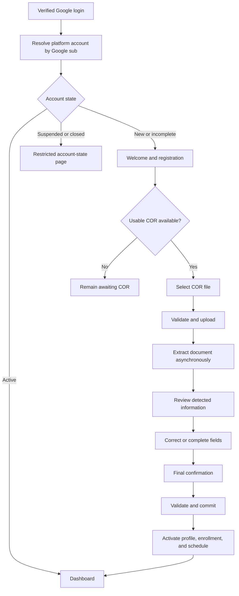
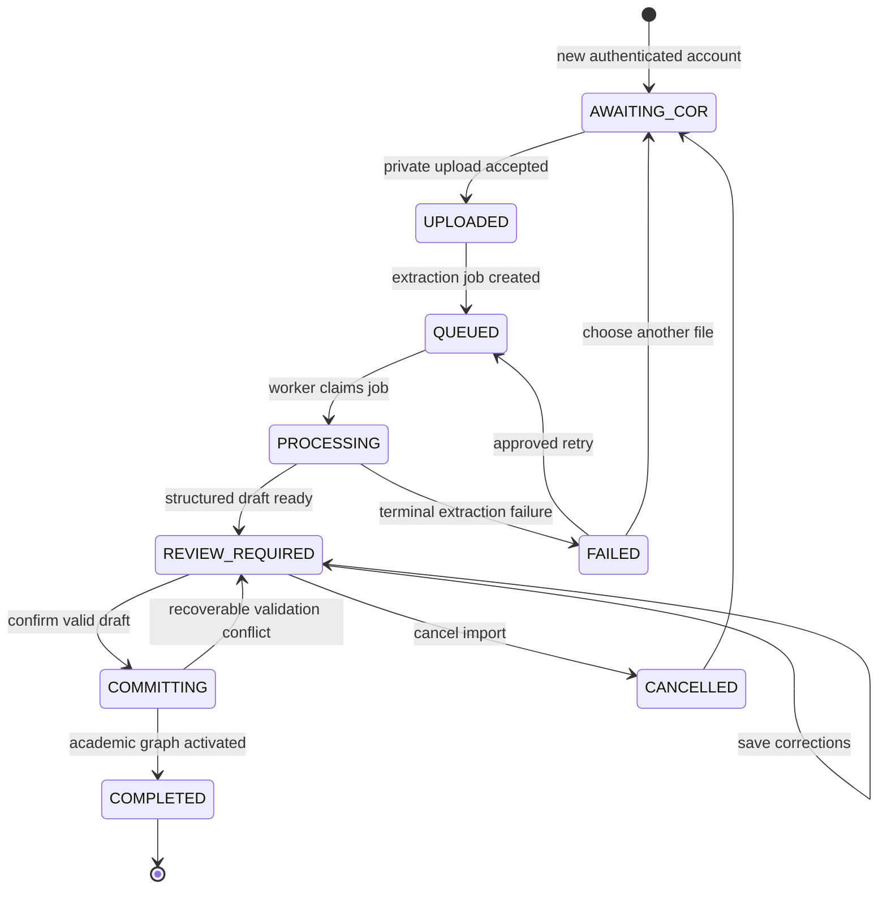

# My-Schedule Student Registration and COR Upload Experience

Design date: 2026-08-30  
Status: planning only  
Basis: `AUDIT.md`, `ARCHITECTURE.md`, `DATABASE.md`, `ACADEMIC_STRUCTURE.md`, `AUTHENTICATION.md`, and `LANDING_PAGE.md`

## Design Direction

Reading this as: an authenticated public-service-style onboarding wizard for QCU students, with a calm, task-focused interface and restrained QCU branding, leaning on the existing native HTML/CSS system and accessible form patterns.

```text
DESIGN_VARIANCE: 3
MOTION_INTENSITY: 2
VISUAL_DENSITY: 5
```

This is a multi-step form, which is outside the selected frontend skill's landing-page specialty. Only its relevant accessibility, responsive, state-completeness, visual-consistency, and anti-decoration guidance applies. The workflow uses light mode, Public Sans, QCU blue/navy/gold, 4px interactive radii, 8px framed-tool radii, clear 1px borders, and minimal motion. It does not use gradients, glass, decorative cards, fake progress, or animation that competes with document review.

## 1. Registration Flow

The onboarding route is available only after successful Google authentication. It does not repeat Google consent and does not ask the student to create a password.



### Experience Stages

Use meaningful stage names rather than generic numbered labels:

```text
Welcome
Upload COR
Review details
Confirm and finish
```

The stage tracker is informational. The server-authoritative onboarding and COR states determine the actual route. A student cannot skip to confirmation by changing a URL or browser state.

### Welcome and Registration

The welcome screen should:

- Address the signed-in user using a safe Google display name only as an account label.
- Explain that the COR supplies most student and class information.
- Explain that detected information remains a draft until reviewed and confirmed.
- State that My-Schedule does not store a password.
- Link to Privacy and Terms before file collection.
- Provide one primary action: `Upload your COR`.
- Provide `Sign out` and `Continue later` as lower-emphasis actions.

Recommended copy:

```text
Set up your student schedule

Upload your current COR. We will detect your student and class details,
then ask you to review everything before it is saved to your account.

[ Upload your COR ]
```

Do not ask for program, section, subjects, or schedule manually on this first screen. The no-COR/manual-entry path remains a policy decision.

### Activation Boundary

The account becomes `ACTIVE` only after an idempotent server commit creates or updates a consistent profile, enrollment, enrollment subjects, schedule, and schedule entries. Upload success or OCR completion alone never activates the account.

## 2. COR Upload Flow

```text
Select one file
-> client pre-check for immediate feedback
-> authenticated server validation
-> private Drive storage
-> COR record creation or duplicate resolution
-> queued extraction
```

### Upload Surface

Use a large native file-selection control with optional drag-and-drop enhancement on desktop. Drag-and-drop must never be the only method.

The upload surface should show:

- Accepted formats and current maximum size from authenticated configuration.
- Selected filename, type, and human-readable size.
- A plain privacy statement.
- `Choose file` or `Replace file`.
- `Upload COR` only after the selection passes client pre-checks.
- A remove-selection command before upload.

Recommended privacy text:

```text
Your COR is stored privately and is used only to prepare your student profile
and schedule. Detected information is not saved as confirmed data until you
review and approve it.
```

### Upload States

| UI state | Behavior | Student action |
|---|---|---|
| No file selected | Show format, size, and privacy guidance | Choose a file |
| File selected | Show file summary and pre-check result | Upload, replace, or remove |
| Validating | Check name, extension, reported MIME, size, and basic readability | Wait; no duplicate action |
| Uploading | Show determinate transferred bytes when available | Cancel only if transport supports safe abort |
| Finalizing | Server calculates hash, stores privately, and creates import metadata | Wait; do not close as if complete |
| Accepted | Show `Upload complete. Preparing your COR.` | Continue automatically to processing |
| Rejected | Explain the correctable reason | Choose another file |
| Network failed | Preserve local selection when browser permits | Retry upload |
| Duplicate active import | Resume the existing owned import | Open processing or review |

Actual upload percentage may be shown because transferred bytes are measurable. OCR progress must not use invented percentages.

### Cancel and Back Behavior

- Before upload, Back returns to Welcome without data loss.
- During upload, Cancel aborts only the current transport attempt when technically possible. It does not imply a stored file was deleted.
- After server acceptance, use `Cancel this import`, not browser Back, for a persisted import cancellation.
- Cancellation requires confirmation and explains whether the file is deleted immediately or queued for deletion.
- During `COMMITTING`, cancellation is disabled because a consistency-critical write is underway.
- Browser Back never deletes a server-side import or changes its state.

## 3. File Validation Rules

### Proposed Initial File Contract

These are recommended initial limits, not confirmed QCU facts. They must be tested with representative redacted COR files before implementation.

| Rule | Proposed initial value | Reason |
|---|---|---|
| Files per import | One | Matches one `COR_Records.originalDocumentId` and keeps deduplication clear |
| PDF | `.pdf`, `application/pdf` | Best option for multi-page COR documents |
| Image | `.jpg`, `.jpeg`, `.png` with verified JPEG/PNG signatures | Common phone capture formats with broad OCR support |
| HEIC/HEIF | Not accepted initially | Browser, Apps Script, and OCR compatibility must be proven first |
| Maximum size | 10 MiB | Conservative starting point for Cloudflare to Apps Script forwarding |
| Maximum PDF pages | 10 pages | Cost and execution safeguard; final value requires sample testing |
| Password-protected PDF | Reject | The extraction worker cannot reliably read it |
| Corrupt/empty file | Reject | No usable extraction source |

If a COR spans multiple phone images, the initial guidance should ask the student to create one PDF. Supporting multi-image imports would require an explicit schema and upload-contract revision rather than hidden client bundling.

### Server-Side Validation

Client checks are convenience only. Cloudflare and Apps Script must enforce:

1. Authenticated owner and allowed onboarding/account state.
2. Configured request and file-size limits.
3. Extension, declared MIME type, and actual file signature agreement.
4. PDF header and basic readability, including page limit where available.
5. Image decode/readability and minimum useful dimensions.
6. Non-empty content.
7. Server-calculated content hash.
8. Rate limit and duplicate policy.
9. Sanitized original filename and opaque storage name.
10. No executable or active-content interpretation by the application.

An antivirus or content-disarm service is not currently selected. The implementation must not claim malware scanning unless such a service is actually integrated. Until then, files remain private, are never executed, and may use `QUARANTINED` storage state until validation completes.

### Image Quality Guidance

Do not reject solely because OCR confidence may be low. Give actionable pre-upload warnings when detectable:

- Document is too dark or blurred.
- Text occupies too little of the image.
- Page is severely rotated or cropped.
- Glare hides important rows.

Warnings allow upload. Structural failures, unsupported types, and excessive size block upload.

### Error Copy

Use specific, non-technical messages:

| Error code | Visible message |
|---|---|
| `UNSUPPORTED_FILE_TYPE` | `Choose a PDF, JPG, or PNG file.` |
| `PAYLOAD_TOO_LARGE` | `This file is larger than the allowed limit.` |
| `PDF_LOCKED` | `This PDF is password-protected. Upload an unlocked copy.` |
| `FILE_CORRUPT` | `We could not read this file. Try exporting or photographing it again.` |
| `TOO_MANY_PAGES` | `This PDF has more pages than the current limit.` |
| `RATE_LIMITED` | `Too many upload attempts were made. Please wait and try again.` |
| `NETWORK_ERROR` | `The upload was interrupted. Your account was not changed.` |

Never show Drive paths, Sheet rows, Apps Script URLs, provider errors, stack traces, or another account's duplicate details.

## 4. Storage Strategy

### Storage Lifecycle

```text
Browser selection
-> transient Cloudflare request body
-> private Drive original
-> optional short-lived raw extraction artifact
-> normalized COR draft rows in Sheets
-> confirmed academic records
-> retention or deletion job
```

Cloudflare validates and forwards the upload but does not keep a durable copy. Apps Script stores the accepted original in the private Drive root owned by the dedicated infrastructure account.

### Private Drive Rules

- Never use `Anyone with the link`.
- Never share files directly with student accounts.
- Use opaque `userId` and `corRecordId` directory/file identifiers.
- Do not put email, student number, name, program, or section in filenames or paths.
- Return application `documentId`, never a raw Drive file ID or public URL.
- Any preview/download goes through an authorized, short-lived delivery path.
- Support access requires `documents.read.support`, an approved reason, and an audit event.
- Tasks, notes, and normal catalog administrators have no document access.

### Temporary and Permanent Data

| Data | Initial classification | Notes |
|---|---|---|
| Browser file selection | Temporary | Cleared on navigation, refresh, logout, or upload completion |
| Gateway request body | Temporary | Stream/process only; never log or persist |
| Original COR | Time-limited private source | Retained only under approved policy |
| Raw OCR/provider artifact | Short-lived private diagnostic source | Store only if support needs justify it |
| Normalized draft fields | Time-limited working data | Retain through review/recovery and policy window |
| Confirmed profile/enrollment/schedule | Application record | Retained as academic history under account policy |
| Audit event | Application security record | Contains metadata only, never full COR content |

### Proposed Retention Baseline

Final periods require privacy/legal approval. A practical starting proposal is:

- Completed import original: delete 30 days after successful commit unless the student requests earlier deletion and no legal hold applies.
- Raw OCR/provider artifact: delete within 7 days after extraction or sooner when not needed.
- Failed or cancelled import file/draft: delete within 7 days unless the student retries the same import.
- Incomplete onboarding import: expire after 30 days of inactivity, with clear notice before any automatic cleanup.
- Confirmed normalized academic records: retain with the account and academic history until account deletion/retention policy applies.
- Audit records: follow the separate security retention policy and contain no document text.

These values are recommendations only. They must be configuration values, not hardcoded frontend constants.

### Deletion Behavior

Student deletion requests transition records to `DELETION_PENDING`. A worker deletes the Drive object, marks `Document_Assets` and `COR_Records` deleted/tombstoned, and records a metadata-only audit event. A failed Drive deletion becomes `DELETE_FAILED` and is retried. The UI must not say a file is deleted until the backend confirms it.

## 5. Extraction Pipeline

```mermaid
flowchart LR
    F[Private COR file] --> V[File validation]
    V --> Q[Queued extraction job]
    Q --> O[OCR and document extraction]
    O --> N[Normalize fields and class rows]
    N --> M[Match against QCU catalog]
    M --> D[Structured untrusted draft]
    D --> R[Student review and correction]
    R --> C[Server validation and confirmation]
    C --> T[Trusted profile, enrollment, and schedule]
```



### Pipeline Responsibilities

#### Cloudflare Gateway

- Authenticate the platform session.
- Enforce request, type, size, and rate limits.
- Bind the upload to the authenticated actor.
- Calculate or verify a server-side hash.
- Forward through the signed Apps Script service contract.

#### Apps Script Upload Service

- Re-resolve the actor by signed Google `sub`.
- Generate opaque import and document IDs.
- Store the file privately.
- Create `COR_Records` and `Document_Assets` metadata.
- Apply duplicate/idempotency rules.
- Queue extraction without waiting synchronously for OCR completion.

#### Extraction Worker

- Claim queued work using `LockService`, lease fields, and status/version checks.
- Read the private original.
- Call the provider-neutral OCR/AI adapter.
- Normalize provider output into explicit fields, draft subjects, and draft meetings.
- Keep original source text separate from normalized and reviewed values.
- Attempt catalog matching without silently replacing source text.
- Store confidence/provenance and sanitized failure codes.
- Retry only retryable failures with a bounded attempt count.

#### Review and Commit Service

- Accept only owner-authenticated draft changes.
- Require current `draftVersion`.
- Revalidate all required fields and relationships.
- Use a unique `commitMutationId` for idempotency.
- Create a draft academic graph, validate it, then atomically switch active status as far as Sheets permits.
- Leave the prior active schedule valid if any commit stage fails.

### Polling and Status

The processing screen polls a safe import-status endpoint with bounded backoff. The response includes status, safe timestamps, attempt state, and whether retry/cancel is allowed. It excludes provider payloads, raw text, Drive IDs, and internal worker leases.

Suggested polling behavior:

- Begin around every 2-3 seconds.
- Back off to 10-15 seconds during longer processing.
- Pause when the page is hidden and resume when visible.
- Stop on `REVIEW_REQUIRED`, `FAILED`, `CANCELLED`, `COMPLETED`, or account/session error.
- Offer a manual `Check status` action after prolonged waiting.

Exact timing is an implementation tuning decision, not a data contract.

## 6. Expected Extracted Fields

No field is assumed to exist on every COR. Each value records source text, normalized value, confidence when available, review status, and optional source page/region.

### Student and Enrollment Header

| Field | Draft key/destination | Required for initial commit |
|---|---|---:|
| Student name | `STUDENT_NAME` -> profile name components | Yes |
| Student number | `STUDENT_NUMBER` -> profile student number | Policy dependent |
| Campus | `CAMPUS` -> program offering campus | Yes |
| Academic year | `ACADEMIC_YEAR` -> academic term | Yes |
| Semester | `SEMESTER` -> academic term | Yes |
| Program | `PROGRAM` -> program offering | Yes |
| Year level | `YEAR_LEVEL` -> enrollment | Yes |
| Section | `SECTION` -> section ID or reviewed snapshot | No unless QCU policy requires it |
| Student status | `STUDENT_STATUS` -> enrollment | No; use `UNKNOWN` if reviewed unavailable |
| Date enrolled | `DATE_ENROLLED` -> enrollment | No |
| Adviser | `ADVISER` -> enrollment snapshot | No |

The student-number requirement must be resolved before implementation. The database permits null, while the authentication plan treats activation requirements as policy dependent.

### Subject and Schedule Rows

| Field | Draft destination | Commit rule |
|---|---|---|
| Subject code | Draft subject source/reviewed code | Required for included subject |
| Subject description | Draft subject source/reviewed title | Required for included subject |
| Units | Draft subject source/reviewed units | Required for included subject |
| Class section | Draft subject class-section snapshot | Optional |
| Day | Draft meeting reviewed day | Required for included meeting |
| Start time | Draft meeting reviewed start | Required for included meeting |
| End time | Draft meeting reviewed end | Required for included meeting |
| Building | Matched building ID plus source/reviewed text | Optional if location is unresolved/TBA |
| Room | Matched room ID plus source/reviewed text | Optional if location is unresolved/TBA |
| Modality | Draft meeting modality | Required; may be `TBA` when genuinely unresolved |
| Instructor | Draft subject instructor snapshot | Optional |

One subject may have zero, one, or multiple meeting rows. A Monday/Wednesday class is represented as two draft meetings and later two schedule entries. A subject with schedule `TBA` may be retained only if the product confirms that active schedules can include a no-time meeting; otherwise it remains unresolved and blocks commit.

## 7. Validation Rules

### Profile and Enrollment Validation

- Student name is required after review and is split without discarding the original source string.
- Student number follows an approved normalization rule and uniqueness check.
- Campus, program offering, and academic term must resolve to active/selectable catalog records.
- Program must belong to the resolved department and be offered at the selected campus.
- Section, when matched, must belong to the same offering and term.
- Year level must be valid for configured QCU/program rules.
- Date enrolled, when present, must be a valid date and reasonably align with the term.
- Student status uses the configured enum; unknown source text remains visible for review.

### Subject and Meeting Validation

- Included subject code, title, and units are required.
- Units must be numeric and within the configured allowed range.
- Exact duplicate subjects within the import are merged only after explicit review or flagged. They are never silently dropped.
- Day and time strings must parse to explicit values.
- `startTime` must be earlier than `endTime`.
- A room match must belong to the selected building.
- The building campus must match the enrollment campus unless a future cross-campus rule explicitly allows it.
- Exact duplicate meetings are blocked.
- Overlapping meetings in the proposed schedule are shown as conflicts requiring correction or explicit policy-based resolution.
- Unmatched subject/building/room text may remain as a reviewed private snapshot. It must not create shared catalog rows.

### Draft Validation Levels

| Level | Meaning | Effect |
|---|---|---|
| Valid | Required value and relationship are acceptable | Can be confirmed |
| Warning | Value is usable but uncertain or unmatched | Student must acknowledge/review |
| Blocking error | Required, malformed, contradictory, duplicate, or unauthorized | Commit disabled |

Warnings do not silently change source values. Blocking errors provide field-level instructions and a summary at the top of the review screen.

## 8. Review and Confirmation UX

### Review Layout

The review route has three content groups:

1. Student information.
2. Academic enrollment.
3. Detected classes and meeting details.

The final confirmation summary appears only after all blocking issues are resolved.

### Source and Reviewed Values

Every extracted value preserves three concepts:

```text
Detected value: what the system read
Reviewed value: what will be submitted
Review status: unreviewed, confirmed, corrected, unresolved, rejected
```

For a normal matched value, show the editable reviewed field and a compact `Detected` source disclosure. After the student accepts or changes it, display a semantic `Confirmed` or `Changed` status. Status indicators must include text and cannot rely on color alone.

Do not force the student to retype correctly detected values. A group-level `Confirm student information` action may mark all valid unchanged fields in that group as confirmed. Low-confidence, unmatched, or missing fields still require individual attention.

### Student Information

Use labels above controls. Never use placeholder text as the label.

```text
Student information

Full name
[ reviewed value ]
Detected: source value

Student number
[ reviewed value ]
Detected: source value
```

The review may split a full name into structured components for persistence, but it should also show the original detected full name so the student can verify that parsing did not lose or reorder information.

### Academic Enrollment

Campus, program, academic year/semester, year level, and section use catalog-backed controls when a match exists. The selected values are stable IDs with full human-readable labels.

If there is no confident match:

```text
We could not confidently match this program. Please verify it.
```

Show the detected text before the selector. Do not replace it automatically. Ambiguous values such as `COE` remain unresolved until program context or student selection disambiguates them.

### Detected Classes

Desktop may use a compact summary table for scanning, but editing should open a clear subject editor. Mobile uses one subject disclosure/section at a time, not a horizontally scrolling editable table.

Each subject editor includes:

- Include/exclude decision with source line visible.
- Subject code, description, units, class section, and instructor.
- One or more meeting editors.
- Day, start/end time, modality, building, room, or reviewed location text.
- Match status and warnings.
- Add meeting and remove meeting commands where allowed.

Use familiar icon buttons for remove/add only when the icon meaning is clear and accompanied by an accessible label/tooltip. Destructive subject removal requires confirmation or an immediately reversible undo before final commit.

### Saving Review Progress

- Save valid edits to the server using the current `draftVersion`.
- Autosave on field blur or after a short idle debounce, not on every keystroke.
- Show `Saving...`, `Saved`, or `Could not save` near the review header.
- Announce save failures through an accessible live region.
- If the version conflicts, stop editing and offer `Reload latest review`; never overwrite silently.
- Initial onboarding requires an online connection. Do not pretend unsynchronized offline edits are saved.
- Keep unsaved values in memory long enough to retry after a transient failure, but do not place full COR data in generic localStorage.

### Final Confirmation

The confirmation page summarizes:

- Student name and masked student number.
- Campus, program, year level, section, academic year, and semester.
- Subject count, total units, and meeting count.
- Any acknowledged unmatched subjects or locations.
- Whether this creates a new term or replaces the active schedule revision for the same term.

Required confirmation statement:

```text
I reviewed the information above and confirm that it matches my current COR.
```

The checkbox is not preselected. The primary action is `Confirm and create schedule`. It becomes disabled while committing, keeps stable dimensions, and reports `Creating your schedule...`.

## 9. Duplicate Handling

### Existing Google Account

The same Google `sub` always resolves to the existing platform user. It resumes onboarding, processing, review, or the dashboard based on server state. It never creates a second profile.

### Existing Student Number

A normalized nonblank student number already attached to another active/non-redacted profile blocks commit under a lock. The visible message must not identify the other account:

```text
This student number is already linked to another account. Your information
was not activated. Contact the approved support channel for help.
```

No automatic merge, transfer, or overwrite is allowed.

### Existing COR Record and Same File

Use server-calculated `(ownerUserId, contentHash)` plus term/status context:

| Existing condition | Behavior |
|---|---|
| Same file in `UPLOADED/QUEUED/PROCESSING` | Return the existing import and resume processing |
| Same file in `REVIEW_REQUIRED` | Open the existing review draft |
| Same file in `COMMITTING` | Show commit-in-progress state; do not start another |
| Same file in `COMPLETED` for same term | Show existing completion and offer to view the active schedule |
| Same file in `FAILED` | Offer bounded retry on the same import when failure is retryable |
| Same file in `CANCELLED` | Allow a new import only after cancellation/deletion policy is satisfied |
| Same hash belongs to another user | Treat as no visible match; never disclose it |

### Updated COR

An updated COR is a new `COR_Records` import, even for the same term. It may reference the previous import as `supersedesCorRecordId` in a future schema extension if history navigation requires it. The initial database does not currently define that field, so implementation must either add it through a documented migration or derive history by owner/term/timestamps.

The new import creates a new schedule revision. The existing active schedule remains active until commit succeeds. After success, the new schedule becomes active and the previous schedule is archived. Historical enrollment subjects and provenance remain accessible according to policy.

## 10. Academic Matching

### Matching Order

Use normalized source text and context to propose, not force, catalog matches:

```text
Academic year + semester -> Academic_Term
Campus + program -> Program_Offering
Program offering + term + section label -> Section
Subject code -> Subject and Program_Subject context
Campus + building/room text -> Building and Room
```

Department is derived from the matched program. The user does not select a department independently when a program safely resolves it.

### Match Outcomes

| Outcome | UI treatment | Persistence |
|---|---|---|
| Exact unique match | Show proposed configured label and detected source | Save resolved ID after confirmation |
| Contextual unique match | Show why it matched, such as program plus campus | Save resolved ID after confirmation |
| Multiple matches | Require explicit selection with full labels | No ID until selected |
| No match, private snapshot allowed | Warn and allow reviewed text | Save snapshot, no shared catalog row |
| No match, required shared entity | Block commit and request selection/support | No guessed ID |
| Inactive historical match | Allow display only if appropriate; block new selection | Preserve source and request active option |

### No Silent Catalog Mutation

Student review can confirm personal snapshots but cannot create or rename campuses, departments, programs, terms, sections, subjects, buildings, or rooms. Unmatched values may enter an admin reconciliation queue only as sanitized suggestions, not automatic shared records.

## 11. Registration State Machine

Use the existing account, onboarding, and COR states. Do not introduce overlapping persisted states such as `NOT_STARTED`, `UPLOAD_PENDING`, or `CONFIRMED` when existing fields already represent them.



### Persisted State Responsibilities

| Layer | States/fields | Purpose |
|---|---|---|
| `Users.accountStatus` | `ONBOARDING`, `ACTIVE`, `SUSPENDED`, `CLOSED` | Overall account access |
| `Users.onboardingState` | `AWAITING_COR`, `PROCESSING`, `REVIEW_REQUIRED`, `COMPLETE`, `NOT_REQUIRED` | Route summary |
| `COR_Records.status` | `UPLOADED`, `QUEUED`, `PROCESSING`, `REVIEW_REQUIRED`, `COMMITTING`, `COMPLETED`, `FAILED`, `CANCELLED`, deletion states | Import lifecycle |
| Review fields | `UNREVIEWED`, `CONFIRMED`, `CORRECTED`, `UNRESOLVED`, `REJECTED/EXCLUDED` | Per-value trust state |
| Browser-only UI | Selecting, validating, uploading, save pending | Temporary interaction state only |

`Users.onboardingState` is updated from the latest authoritative owned import. It is not an independent workflow that may contradict `COR_Records.status`.

### Commit Failure

If commit fails before activation:

- Keep the user `ONBOARDING`.
- Keep the prior active schedule unchanged, if one exists.
- Return to `REVIEW_REQUIRED` for correctable validation/version conflicts.
- Use a safe retry state for transient backend failure with the same `commitMutationId`.
- Never create a second enrollment/schedule graph on a repeated successful request.

## 12. Interrupted Onboarding Recovery

### Server-Authoritative Resume

After login or page reload:

1. Resolve the same `Users` row by Google `sub`.
2. Request `/api/v1/bootstrap`.
3. Find the latest relevant owned non-terminal COR record.
4. Route to upload, processing, review, committing, completion, or account-state page.
5. Fetch the current `draftVersion` before allowing review edits.

Never route from a browser-only step number.

### Recovery Matrix

| Interruption | Recovery behavior |
|---|---|
| Browser closes before upload | No server import exists; return to upload |
| Browser closes during transfer | Incomplete transport is discarded; retry selection/upload |
| Browser closes after upload accepted | Resume queued/processing import |
| Browser closes during extraction | Worker continues; resume status later |
| Browser closes during saved review | Resume latest saved `draftVersion` |
| Browser closes with unsaved edits | Warn before leaving when possible; only server-saved values persist |
| Browser closes during commit | Resume `COMMITTING` status and query by mutation receipt |
| Session expires | Reauthenticate with Google, resolve same user, then resume |
| Network goes offline | Keep current screen and safe local values; disable server-dependent continuation until reconnected |
| Backend temporarily unavailable | Preserve route context and offer retry; do not restart import automatically |

### Continue Later

`Continue later` saves any valid pending review changes, returns to a neutral signed-in exit or signs out according to product decision, and leaves the import recoverable. It does not cancel or delete the COR.

## 13. Re-upload and Semester Update Strategy

### First-Time Onboarding

The confirmed import creates:

- Reviewed/confirmed `Student_Profiles` identity.
- One term-specific `Enrollments` record.
- `Enrollment_Subjects` snapshots and optional catalog links.
- A revision-1 active `Schedules` record.
- One `Schedule_Entries` row per meeting occurrence.
- Provenance links back to the COR draft/import.

### New Semester or Academic Year

An active user starts a term-renewal COR flow, not account registration. A new COR creates a new term-specific enrollment and schedule. Previous terms remain historical and are not overwritten.

If the selected academic term already has a non-cancelled enrollment, the API must route to same-term update handling instead of creating a duplicate enrollment.

### Same-Term Updated COR

For a corrected or changed COR in the same term:

1. Create a new import.
2. Review the detected changes.
3. Update the existing term enrollment or create a staged replacement according to the final repository design.
4. Create a new schedule revision.
5. Activate it only after complete validation.
6. Archive the prior active schedule.
7. Preserve prior import and schedule provenance.

The confirmation screen must state that the current schedule will be replaced for the same term. It should summarize added, changed, and removed subjects/meetings when the comparison service is available. Comparison is useful but not required for the first implementation if it would delay a correct atomic replacement.

### Re-upload After Failure

- Retry the same import for transient provider failures within the attempt limit.
- Request another file for corrupt, unreadable, or persistently low-quality content.
- Do not duplicate private Drive files when a valid owned content hash can safely reuse the existing original.
- A new file creates a new import and cancels or supersedes the prior active draft according to explicit user choice.

## 14. Privacy and Security Requirements

### Authorization

- Only `ONBOARDING` or otherwise eligible authenticated users can create own imports.
- Apps Script derives the owner from signed Google `sub`; it ignores client `userId` and `ownerUserId`.
- Every import, draft, document, enrollment, and schedule read checks direct and parent ownership.
- Cross-user lookups return privacy-safe `NOT_FOUND` where appropriate.
- UI route guards are convenience only.

### Document Protection

- No public URLs or Drive shares.
- No COR content in HTML source, static JSON, service-worker precache, URL parameters, analytics, notifications, or generic localStorage.
- Private responses use `Cache-Control: no-store` unless a deliberate user-scoped offline design later approves otherwise.
- Preview/download uses an authorized short-lived path.
- Logout purges active-user review/profile caches and cannot leave another user's COR visible.

### Logging and Observability

Logs may include request ID, import ID, status, byte size, MIME type, duration, safe failure code, and hashed operational identifiers. They must not include:

- Full OCR text or provider response.
- Student name or number.
- Subject rows or schedule details.
- Original filename when it contains identity.
- Drive ID/path.
- OAuth/access tokens, HMAC, or cookies.

### Provider Privacy

- Send only the file/content necessary for extraction.
- Do not send Google identity metadata when the document itself is sufficient.
- Select a provider only after data-processing, retention, region, quota, and cost review.
- Disable provider training/data retention where the provider supports it.
- Record provider key/version and consent/policy version without storing secrets.

### Administrative Access

`imports.review` permits safe metadata/draft support only. Original document access separately requires `documents.read.support`, a reason, valid scope/policy, and audit. Normal administrators never receive automatic access to tasks, notes, or all COR files.

## 15. Error, Empty, and Loading States

| State | Visible behavior | Recovery |
|---|---|---|
| No COR selected | Clear accepted-format guidance and upload action | Choose a file |
| No COR available | Explain that registration remains incomplete | Continue later; manual path only if approved |
| Upload validating | Inline `Checking your file...` | Wait |
| Upload in progress | Real transferred percentage/bytes | Safe cancel when supported |
| Finalizing upload | `Securing your upload...` | Wait; do not retry concurrently |
| Queued | `Your COR is waiting to be processed.` | Leave and return later |
| Processing | `Reading your COR...` plus last-updated time | Leave and return; check status |
| Long processing | Explain that processing is taking longer without claiming failure | Continue later; manual check |
| Extraction failed | Safe reason category | Retry eligible job or upload another file |
| No text detected | `We could not find readable text in this file.` | Upload a clearer copy |
| Partial extraction | Open review with missing fields clearly marked | Complete required fields |
| No classes detected | Explain that no class rows were found | Re-upload or approved manual path |
| Catalog unavailable | Do not permit guessed matches/commit | Retry when catalog returns |
| Draft save failed | Keep current in-memory edits and show unsaved state | Retry save |
| Version conflict | Stop silent autosave | Reload latest review and reconcile |
| Validation errors | Summary plus field-level errors | Correct marked fields |
| Student-number conflict | Privacy-safe block | Approved support path |
| Commit in progress | Stable summary and disabled action | Wait/resume by mutation receipt |
| Commit transient failure | State remains recoverable | Retry same mutation |
| Completed | `Your schedule is ready.` | Open dashboard |
| Offline | Explain online connection is required for onboarding | Reconnect and retry |

Use skeletons only where they match the final review layout. A plain status panel is better for processing than a fake form skeleton that suggests extraction is already complete.

## 16. Mobile and Accessibility Requirements

### Mobile First

- Support 320px width without horizontal page scrolling.
- Use one content column and 14-18px page padding.
- Keep the current stage name and save status visible without a large sticky header.
- File controls and primary actions are at least 48px high.
- Use native camera/file chooser behavior where the browser provides it, but do not require direct camera capture.
- Subject review uses stacked disclosures/editors. Do not force editable schedule tables into a narrow viewport.
- Keep final actions above safe-area insets and avoid conflict with the authenticated bottom navigation, which should not appear during focused onboarding.
- Long filenames, program names, subject descriptions, and room labels wrap safely.

### Tablet and Desktop

- Constrain form content to a readable width, approximately 720-880px.
- Review may use a two-column source/field composition only when labels and values remain aligned and readable.
- A COR preview may sit beside the review form on wide screens, but it is optional, private, and collapses below/into a dialog on smaller screens.
- Do not place the whole wizard inside a decorative card. Use an unframed page with framed upload/review tools where boundaries are useful.

### Semantic Forms

- Use one page H1 and logical section headings.
- Use `form`, `fieldset`, and `legend` for related student, academic, subject, and meeting fields.
- Labels appear above controls and remain visible.
- Required fields use text/semantic attributes, not color alone.
- Helper text is associated with inputs through `aria-describedby`.
- Error summary links focus to invalid fields.
- On failed submission, move focus to the error summary; on stage change, move focus to the new H1/heading.
- Status and autosave messages use restrained `aria-live` regions.
- File drop zone remains keyboard operable through a real file input.

### Keyboard and Focus

- Logical DOM/tab order follows the visual order.
- Visible `:focus-visible` outline meets contrast requirements.
- No keyboard traps in COR preview, dialogs, or subject editors.
- Modals trap focus, set initial focus, restore focus on close, and make the background inert.
- Add/remove subject and meeting commands have explicit accessible names.
- Destructive actions require clear confirmation and cannot be triggered by icon ambiguity.

### Contrast and Motion

- Meet WCAG AA for labels, input text, placeholders, helpers, errors, statuses, and controls.
- Detected/confirmed/warning/error states use text plus icons/borders, not color only.
- Motion is limited to direct feedback and simple state transitions.
- No animated OCR illustration, looping shimmer, progress theater, or parallax.
- Respect `prefers-reduced-motion` and keep all workflow meaning available without motion.

## 17. Implementation Dependencies

Before coding this experience, resolve or provide:

1. Approved COR formats, representative redacted samples, page counts, image dimensions, and reliable maximum size.
2. Tested Cloudflare-to-Apps-Script upload path and a fallback storage approach if 10 MiB is unreliable.
3. OCR/AI provider, credentials, data-processing terms, region, retention controls, quota, cost ceiling, and retry behavior.
4. Private Drive folders and `Document_Assets` lifecycle under the dedicated infrastructure account.
5. Exact retention/deletion periods and student-visible privacy wording.
6. Student-number requirement, normalization, uniqueness, and conflict-resolution authority.
7. Official QCU catalog seed for campuses, programs including BSIS, terms, sections, subjects, buildings, and rooms.
8. Decision on manual entry when no COR is available or extraction repeatedly fails.
9. Decision on schedule `TBA` subjects without valid day/time.
10. API routes and actions for upload, status, draft save, cancel, retry, commit, delete, and term renewal.
11. Idempotency and version fields, including whether `supersedesCorRecordId` is added.
12. Apps Script trigger/worker scheduling, leasing, timeout recovery, monitoring, and quota alerts.
13. Privacy-safe support route and exact administrator access policy.
14. Authenticated route guards, CSRF/origin protections, signed service envelope, and user-scoped cache purge.
15. CSP and text-safe rendering before displaying any OCR, Sheet, catalog, or user-entered value.
16. Accessibility test plan covering file input, progress, review errors, dialogs, autosave, and screen readers.
17. Integration tests for duplicate uploads, interrupted processing, duplicate student number, commit replay, same-term update, and failed Drive deletion.

## 18. Open Questions

1. What official COR layouts and versions must be supported at launch?
2. Are PDF, JPG, and PNG sufficient, or must HEIC/HEIF and multi-image imports be supported?
3. Is the proposed 10 MiB and 10-page limit practical for real QCU COR files?
4. Is student number mandatory for activation, and what exact format is authoritative?
5. May students proceed through manual entry when they have no COR?
6. May students proceed through manual entry after repeated extraction failure?
7. Can a subject with `TBA` schedule be committed to an active schedule?
8. Which fields may students change after commit without uploading another COR?
9. Should same-term updates compare and display added, removed, and changed classes before confirmation?
10. How long should completed, failed, cancelled, and abandoned COR originals and drafts be retained?
11. Should students be able to delete the original COR immediately after successful commit?
12. Is a private in-app COR preview required, or is source text/provenance sufficient for review?
13. Which OCR provider is acceptable, and may documents leave Google/QCU-controlled infrastructure?
14. What support role can resolve student-number conflicts, and what proof is required?
15. Should inactive onboarding accounts be automatically closed after a retention period or only have files cleaned up?
16. Is one active enrollment per student still valid, including students with concurrent programs?
17. Are academic terms institution-wide or campus/program specific?
18. Who approves catalog matches or corrections when a COR value is not represented in shared QCU data?

## CHUNK 8 Handoff: COR AI/OCR Extraction and Structured Data Pipeline

CHUNK 8 should turn this user experience and the existing COR schemas into a provider-neutral extraction specification. It must:

1. Define the accepted input contract after upload validation, including PDF/image decoding, page handling, orientation, quality checks, and safe preprocessing.
2. Compare practical OCR/AI provider options against privacy, free-tier/cost, Apps Script/Cloudflare compatibility, structured-output support, retention, region, quotas, and latency.
3. Define the exact canonical extraction JSON for COR header fields, subjects, meetings, source text, page/region provenance, confidence, warnings, and provider metadata.
4. Define parsing and normalization rules for QCU academic year, semester, program, year level, section, subject code/title/units, schedule days, times, buildings, rooms, modality, instructor, adviser, and student status.
5. Define deterministic catalog-matching rules, ambiguity handling, and confidence thresholds without silently replacing source values or creating shared catalog rows.
6. Define job claiming, leases, retries, timeout recovery, idempotency, provider error classification, cancellation, and dead-letter/support behavior within Apps Script limits.
7. Define how raw provider output is minimized, sanitized, stored outside Sheets when needed, and deleted according to retention policy.
8. Define validation fixtures using synthetic or redacted COR samples, expected outputs, field-level accuracy metrics, schedule parsing tests, and regression cases.
9. Define API-safe status/progress responses for the CHUNK 7 processing and review screens without exposing raw provider details.
10. Identify any required schema changes, such as import supersession, extraction run/version records, per-field model provenance, or multi-page/multi-file support, before implementation.

CHUNK 8 remains planning only unless a later request explicitly authorizes provider setup, real document processing, credentials, Apps Script endpoints, Sheet creation, or source changes.
