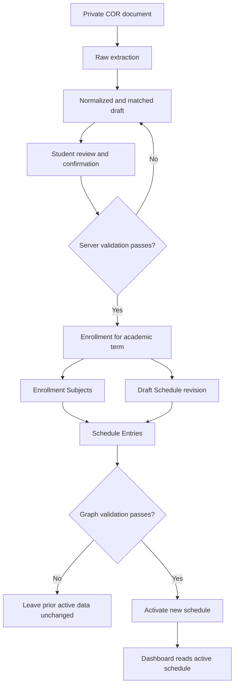
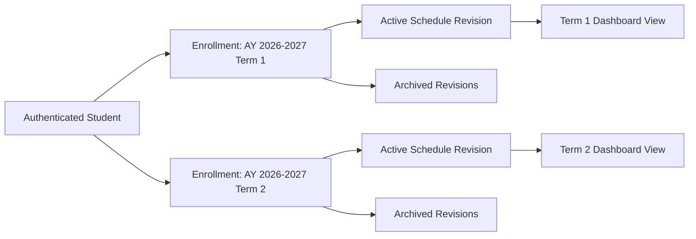
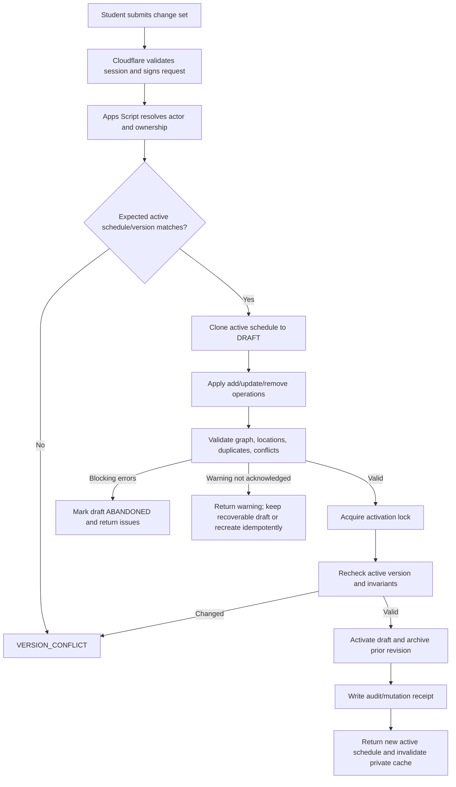

# My-Schedule Schedule CRUD and Enrollment Management

Status: planning only. This document defines the target behavior and contracts; it does not implement CRUD, change application source/configuration, alter Google Sheets, or process a COR.

Basis: `AUDIT.md`, `ARCHITECTURE.md`, `DATABASE.md`, `ACADEMIC_STRUCTURE.md`, `AUTHENTICATION.md`, `REGISTRATION_COR.md`, `COR_AI_PIPELINE.md`, and `STUDENT_DASHBOARD.md`.

## 1. Enrollment Model

An enrollment is the student's academic context for one term. It answers what program offering, section, year level, and subjects the student is enrolled in. It does not contain recurring meeting times.

The planned relationship is:

```text
Users
  -> Enrollments
       -> Enrollment_Subjects
```

### `Enrollments`

Use the `DATABASE.md` definition without denormalizing schedule rows into it:

- `enrollmentId` is the stable primary key.
- `ownerUserId` is derived by the backend from the authenticated Google identity.
- `termId` isolates academic year and semester.
- `offeringId` identifies the campus/program offering.
- `sectionId` is optional when no configured section match exists.
- `sectionLabelSnapshot`, `yearLevel`, `studentStatus`, `dateEnrolled`, and `adviserName` preserve reviewed term context.
- `sourceType` and `sourceCorRecordId` preserve how the enrollment originated.
- `status` uses `DRAFT`, `ACTIVE`, `COMPLETED`, or `CANCELLED`.

Initial invariant: a user has at most one non-cancelled enrollment per term and at most one `ACTIVE` enrollment overall. Concurrent programs must not be enabled until QCU requirements explicitly justify them.

### `Enrollment_Subjects`

Each row represents one subject associated with an enrollment:

- It may link to shared `Subjects` through `subjectId`.
- Reviewed code/title/unit snapshots remain on the row so catalog changes do not rewrite history.
- Unknown COR subjects may remain private and unmatched; students cannot create shared catalog subjects.
- A normalized subject code must be unique among active subjects in the same enrollment.
- `sourceType` distinguishes `COR_IMPORT`, `MANUAL`, and `ADMIN_MIGRATION` origins.
- `sourceCorDraftSubjectId` links back to reviewed COR evidence.
- Status uses `ACTIVE`, `DROPPED`, `COMPLETED`, or `REMOVED`.

Recommended schema decision before implementation: add `scheduleStatus` to `Enrollment_Subjects` with the minimum values `SCHEDULED`, `TBA`, and `NO_RECURRING_MEETING`. This distinguishes a confirmed TBA/asynchronous subject from an accidentally missing schedule without creating fake meeting rows.

### Official and Personal Meaning

- A COR-derived enrollment or subject is treated as an imported official claim backed by the student's confirmed document.
- A manually created subject is personal data and must be labeled `Manual` or equivalent in editing/history surfaces.
- A student schedule correction changes the student's application schedule, not the immutable COR source.
- Shared catalog data such as a subject definition, program, term, building, or room remains admin-managed.
- A personal schedule is not a room-booking system and does not assert institution-wide room occupancy.

## 2. Schedule Model

The schedule represents when and where enrolled classes meet:

```text
Enrollment
  -> Schedules
       -> Schedule_Entries
            -> Enrollment_Subject
            -> Building / Room
```

### Versioned `Schedules`

`Schedules` is a revision header, not a single class meeting. An enrollment can have many revisions, but only one may be `ACTIVE`.

- `revisionNumber` increases within the enrollment.
- `DRAFT` is editable but not used by Dashboard current/upcoming calculations.
- `ACTIVE` is the single published source used by the authenticated application.
- `ARCHIVED` is a previously active, read-only revision.
- `ABANDONED` is a failed, cancelled, or superseded draft that was never activated.
- `sourceCorRecordId` may identify the COR that initiated a revision.
- Activation and archiving occur together under a narrow `LockService` lock.

The active schedule must never be mutated row-by-row in place. The public mutation flow clones it to a draft, applies a change set, validates the whole draft, activates the draft, and archives the old revision. This avoids partially updated dashboards and retains rollback evidence.

Recommended schema decision before implementation: add `revisionReason` to `Schedules`, for example `INITIAL_COR_IMPORT`, `COR_REIMPORT`, `STUDENT_CORRECTION`, `STUDENT_MANUAL_CHANGE`, or `ADMIN_CORRECTION`. `sourceType` describes origin; `revisionReason` describes why this revision exists.

### `Schedule_Entries`

One entry represents one recurring meeting occurrence:

- Monday and Wednesday meetings are two rows.
- Each entry references an `Enrollment_Subjects` row from the same enrollment.
- `dayOfWeek` uses ISO values `1` through `7`.
- `startTime` and `endTime` are campus-local wall times in `HH:mm` format.
- `effectiveFrom` and `effectiveTo` optionally limit recurrence.
- `modality` uses `ONSITE`, `ONLINE`, `HYBRID`, or `TBA` according to the existing schema.
- `buildingId` and `roomId` are nullable and validated against campus relationships.
- `locationText` preserves a reviewed unresolved or non-catalog location.
- Status uses `ACTIVE`, `CANCELLED`, or `REMOVED`.

A completely TBA class has no meeting row. It is represented through the subject-level schedule status. If day/time are known but location is not, store the valid meeting with null location references and reviewed `locationText` where available.

Recommended schema decision before implementation: add an entry-level immutable `originType` such as `COR_IMPORT`, `STUDENT_MANUAL`, or `ADMIN_MIGRATION`. A mixed revision can then preserve the origin of each meeting. `sourceCorDraftMeetingId` remains the evidence link for COR-imported entries. If detailed revision comparison is required, also add optional `supersedesScheduleEntryId`.

## 3. COR to Enrollment to Schedule Flow

The COR pipeline creates trusted academic records only after the student confirms the reviewed draft.



Commit order is conceptual rather than permission to expose partially written rows:

1. Resolve the authenticated owner and current reviewed COR draft.
2. Verify import state, expected draft version, idempotency key, term, offering, and student-number rules.
3. Build the proposed enrollment, subject, schedule, and meeting graph in memory.
4. Validate all foreign keys, duplicates, dates, times, modalities, locations, and conflicts.
5. Write staged records using stable IDs and non-active states.
6. Re-read and verify the staged graph.
7. Under `LockService`, activate the new enrollment/schedule as applicable and archive the prior active schedule only after the replacement is complete.
8. Mark the COR commit complete and return the same result for repeated successful idempotency keys.

The original document, extracted fields, normalized draft, validation results, and student-confirmed values remain separate from trusted enrollment/schedule rows. Later edits never rewrite these source records.

## 4. Data Provenance and Source Model

Provenance needs four separate concepts:

| Concept | Purpose | Planned representation |
|---|---|---|
| Origin | Where the record first came from | `sourceType`/recommended `originType` |
| Evidence | Which reviewed COR row supports it | `sourceCorRecordId`, `sourceCorDraftSubjectId`, `sourceCorDraftMeetingId` |
| Change actor | Who made the latest persisted change | `createdBy`, `updatedBy`, authenticated audit actor |
| Revision reason | Why a replacement schedule was created | Recommended `Schedules.revisionReason` plus audit reason |

Rules:

- COR draft/source rows are immutable after commit except for retention/deletion state.
- Editing a COR-derived meeting creates a new schedule revision; it does not change the draft meeting.
- A student-created subject or meeting has no COR evidence link and is visibly personal/manual.
- Admin corrections require an actor, reason, scope, expected version, and audit event.
- `sourceType` must not be overwritten merely because a different actor later edits the trusted record.
- Audit metadata must not include full COR text, student numbers, note bodies, document URLs, or secrets.
- History views should show concise labels such as `Imported from COR`, `Edited by you`, and `Corrected by administrator` without exposing internal security identifiers.

## 5. CRUD Matrix

`C/R/U/D` below means create, read, update, and remove/deactivate through domain rules. It does not imply direct Sheet row access.

| Resource | Student Create | Student Read | Student Update | Student Delete/Deactivate | Administrator |
|---|---|---|---|---|---|
| Enrollment | Through confirmed COR or approved onboarding only | Own current/history | Limited profile-like fields only if explicitly allowed; official context normally via re-import | Cannot casually cancel official enrollment | Scoped correction/cancel with capability, reason, audit |
| COR-derived enrollment subject | Created by commit service | Own | No direct official code/title/units change; use re-import or admin correction | No direct removal | Scoped correction/drop with evidence and audit |
| Manual enrollment subject | Create within own active enrollment | Own | Own mutable snapshots/metadata with version | Mark `REMOVED` after confirmation | Scoped support correction |
| Schedule revision | Created internally by import or change-set service | Own active/history | Draft only; active revision is immutable | Draft may become `ABANDONED`; active becomes `ARCHIVED` only through replacement | Scoped creation/activation/repair |
| COR-derived meeting | Created by commit service | Own | Correct through replacement revision | May remove from personal active schedule through replacement, without deleting official subject/source | Scoped correction with audit |
| Manual meeting | Add through replacement revision | Own | Change through replacement revision | Mark absent/removed in replacement revision | Scoped support correction |
| Shared Subject | Never | Active permitted catalog fields | Never | Never | `catalog.write` within scope |
| Building/Room | Never | Active permitted catalog fields | Never | Never | `catalog.write` within scope |

Student editing principles:

- Schedule time/location corrections are allowed because they affect the student's application view.
- Official enrollment subject changes are more restricted than schedule changes.
- Removing a meeting from the personal schedule never deletes the COR record or its original extracted/confirmed rows.
- Deleting a subject with attached tasks/notes requires a defined unlink behavior; it must not cascade-delete user content.
- Personal calendar events that are not classes are outside this model. Tasks/notes should not be stored as fake schedule entries.

## 6. Student Permissions

Students may:

- Read their current enrollment, historical enrollments, subjects, active schedule, and archived revisions.
- Create a clearly labeled manual subject within their active enrollment.
- Create, correct, or remove personal meeting entries by publishing a new schedule revision.
- Preserve an unresolved private subject/location snapshot when no safe shared catalog match exists.
- View conflicts and explicitly acknowledge non-blocking overlap warnings where policy permits.
- Re-import a new or corrected COR through the COR workflow.

Students may not:

- Supply or select another student's owner ID.
- Create or modify shared academic catalog rows.
- Change the term or program offering of an official enrollment through ordinary schedule editing.
- Change official COR evidence, raw extraction, or previously confirmed draft evidence.
- Directly activate an arbitrary schedule ID or archive history outside the revision service.
- Hard-delete COR-derived subjects, enrollment history, schedule history, or audit records.
- Use manual data to claim institution-verified enrollment status.

The UI should distinguish editable personal schedule fields from restricted official enrollment fields before the user starts editing. Restrictions must also be enforced in Apps Script; disabled controls are not authorization.

## 7. Schedule Validation

Validation runs in the browser for immediate feedback and again authoritatively in Apps Script against current data.

### Subject and Enrollment

- `enrollmentSubjectId` must exist, belong to the authenticated owner's enrollment, and match the draft schedule's enrollment.
- Active subject codes are unique within an enrollment after trim, case normalization, and approved punctuation normalization.
- A matched `subjectId` must reference an active or historically valid catalog subject.
- Subject code/title snapshots are required; units must meet the configured `0-12` range and allowed precision.
- COR-derived official fields follow source restrictions even when the request payload attempts to change them.

### Day, Time, and Dates

- `dayOfWeek` is an integer from `1` to `7`.
- Times are strict zero-padded 24-hour `HH:mm` strings.
- `startTime < endTime`; overnight meetings are not supported by the initial schema.
- Effective dates, when supplied, satisfy `effectiveFrom <= effectiveTo` and reasonably intersect the academic term.
- The campus time zone is resolved from the enrollment's offering/campus, not accepted from the browser.
- Unknown day or time remains unresolved during COR review; it is not persisted as an invented active meeting.

### Modality and Location

- `ONSITE` normally requires a valid building/room or a reviewed non-empty `locationText`.
- `ONLINE` normally has no building/room; an optional safe platform/location label may use `locationText`.
- `HYBRID` may use distinct meeting rows for onsite and online occurrences when the pattern differs.
- A completely `TBA` subject has no fake meeting row.
- `roomId` must belong to `buildingId`; building and room must belong to the enrollment campus unless an explicit cross-campus rule is approved.
- Inactive building/room references cannot be added to a new revision, but historical revisions retain their snapshots/references.

### Duplicates and Conflicts

- Reject exact active duplicates on schedule, subject, day, start, and end.
- Detect overlapping active meetings after considering weekday and effective date intersection.
- Do not perform cross-student room-booking validation.
- Return all discovered validation issues in one bounded response where practical.

### Payload and Text Safety

- Allowlist mutable fields by operation and source type.
- Apply length limits and trim control characters from snapshots/location text.
- Treat all display text as untrusted and render it through safe text APIs.
- Reject unknown fields in mutation operations where strict schemas are practical.

## 8. Academic-Term Handling

All enrollment and schedule reads/writes are scoped by:

```text
Authenticated user + Enrollment + Academic term
```



Rules:

- A new term creates a new enrollment and schedule; it never replaces the previous term's rows.
- When the new term becomes active, the prior enrollment normally moves to `COMPLETED`; its active schedule may remain recorded as the final revision and is read as history.
- Historical terms are read-only for students by default.
- The term selector defaults to the active enrollment and clearly labels historical views.
- Dashboard, subjects, schedules, announcements, and location subsets reload together when the selected term changes.
- Current/upcoming calculations use exactly one selected enrollment and its one active schedule.
- No active enrollment produces an explicit registration/update state, not fallback personal data.
- If concurrent enrollments are approved later, an explicit enrollment selector and revised uniqueness policy are required; the client must never merge them implicitly.

## 9. Multi-Day and Multi-Meeting Support

Store one `Schedule_Entries` row per recurring occurrence:

```text
CS101, Monday 08:00-09:30, Room 201
CS101, Wednesday 08:00-09:30, Room 201
CS101 Laboratory, Friday 13:00-16:00, Lab 3
```

This design supports:

- Several days for the same subject.
- Lecture and laboratory meetings with different times/rooms.
- Different modalities by occurrence.
- Different effective date ranges for temporary schedule changes.
- Missing location while day/time remain known.
- A subject with no recurring meetings.

Do not store comma-separated days, combined time strings, or arrays in Sheet cells. The API may group entries by subject for presentation, but persistence remains normalized.

Initial limitations:

- Alternating-week rules, one-off exceptions, holiday overrides, and overnight classes are not modeled.
- A legitimate pattern that cannot be represented must remain a reviewed note/TBA state or wait for a future recurrence model; it must not be approximated silently.
- Combined COR cells must be split only when the parser/student can confirm the individual occurrences.

## 10. Conflict Detection

Two active entries conflict when all of the following are true:

1. They belong to the same proposed active schedule.
2. They have the same `dayOfWeek`.
3. Their effective date ranges intersect, treating null bounds as the relevant term bounds.
4. Their times overlap using `startA < endB && startB < endA`.

Conflict classes:

| Class | Default effect | Example |
|---|---|---|
| Exact duplicate | Blocking error | Same subject/day/time repeated |
| Invalid time/range | Blocking error | End before start |
| Cross-subject overlap | Review warning requiring explicit acknowledgement | Monday 08:00-10:00 and 09:00-11:00 |
| Same-subject partial overlap | Blocking until corrected unless an admin-approved exception exists | Duplicate/ambiguous extracted meetings |
| No effective-date intersection | No conflict | First-half and second-half meetings |

The server recalculates conflicts on every activation attempt. Client-supplied acknowledgements identify only warnings from the latest validated draft and cannot suppress blocking errors. If the schedule changes or validation issue fingerprint changes, acknowledgement must be requested again.

Because the initial schema lacks alternating-week/date-exception semantics, overlap acknowledgement is necessary for rare legitimate cases. The UI should present both entries, day/time, and affected dates without preventing the student from returning to edit.

## 11. Current and Upcoming Schedule Logic

Dashboard, Today, and Weekly Schedule must use one shared schedule-domain model rather than separate page-specific calculations.

An entry is eligible when:

- Its parent is the active schedule for the selected enrollment.
- Enrollment and entry statuses permit display.
- Its weekday matches the campus-local date.
- The campus-local date falls inside optional effective dates and the selected term.
- Its time values are valid.

Student-facing states remain:

| State | Rule |
|---|---|
| `ONGOING` | `start <= campusNow < end` |
| `UPCOMING` | `campusNow < start` |
| `COMPLETED` | `campusNow >= end` |
| `NO_CLASS` | No eligible active entry today |

Use the active campus `timeZone`, with a validated institution fallback only if necessary. Bootstrap/schedule responses return `serverTime`; the client computes a clock offset and recalculates locally at initialization, visibility return, minute boundaries, and known start/end boundaries. It must not poll the API or rerender the whole application every second.

After a schedule activation, the response returns the new schedule/version and cache invalidation metadata. The client replaces its owner-scoped active schedule snapshot and recalculates Today/Upcoming immediately.

## 12. API Contract

The browser calls versioned same-origin Cloudflare routes. Cloudflare authenticates the session and forwards a signed canonical request to Apps Script. Apps Script verifies the signature/replay window, resolves the user by signed Google `sub`, checks account state/capabilities/ownership, and applies domain validation.

### Read Operations

| Browser route | Apps Script action | Purpose |
|---|---|---|
| `GET /api/v1/enrollments` | `enrollment.list` | List the current user's term enrollments |
| `GET /api/v1/enrollments/{enrollmentId}` | `enrollment.read` | Read one owned enrollment and subjects |
| `GET /api/v1/schedules/active` | `schedule.active.read` | Read active schedule for active or selected owned enrollment |
| `GET /api/v1/schedules/{scheduleId}` | `schedule.read` | Read an owned active/archived/draft schedule according to state |
| `GET /api/v1/enrollments/{enrollmentId}/schedule-history` | `schedule.history.list` | Paginated owned revision history |

An optional `termId` or `enrollmentId` query selects only an owned record. It never changes ownership scope.

### Mutation Operations

| Browser route | Apps Script action | Main authorization/rule |
|---|---|---|
| `POST /api/v1/schedules/{activeScheduleId}/revisions` | `schedule.revision.createActivate` | Owner; clone, batch edit, validate, activate under lock |
| `POST /api/v1/enrollments/{enrollmentId}/manual-subjects` | `enrollment.subject.manual.create` | Owner; active enrollment; idempotent |
| `PATCH /api/v1/enrollment-subjects/{id}` | `enrollment.subject.update` | Owner; allowlisted fields; source restrictions; expected version |
| `DELETE /api/v1/enrollment-subjects/{id}` | `enrollment.subject.remove` | Owner; manual records only; audited tombstone |
| `POST /api/v1/enrollments/{id}/cor-imports` | Existing COR upload/commit actions | Owner; same-term re-import rules |
| Admin correction route | `academic.correction.apply` | Explicit capability and scope; reason, version, lock, audit |

The revision endpoint is the public equivalent of schedule-entry create/update/delete. Internal repository actions may use `schedule.entry.create/update/remove` against the staged draft, but clients do not mutate the active schedule directly.

### Batch Revision Request

```json
{
  "expectedScheduleId": "sch_uuid",
  "expectedVersion": 3,
  "clientMutationId": "client_uuid",
  "reason": "STUDENT_CORRECTION",
  "operations": [
    {
      "type": "UPDATE_ENTRY",
      "scheduleEntryId": "sme_uuid",
      "changes": {
        "dayOfWeek": 1,
        "startTime": "09:00",
        "endTime": "10:30"
      }
    }
  ],
  "acknowledgedWarnings": []
}
```

Allowed operation types should remain small and explicit: `ADD_ENTRY`, `UPDATE_ENTRY`, and `REMOVE_ENTRY`. Each operation is validated against the current active revision and then applied to newly generated draft rows. The response returns replacement entry IDs because revision rows are new records.

### Success Response

```json
{
  "ok": true,
  "data": {
    "scheduleId": "sch_new_uuid",
    "revisionNumber": 4,
    "status": "ACTIVE",
    "archivedScheduleId": "sch_old_uuid",
    "version": 1,
    "conflicts": [],
    "cacheTagsChanged": ["dashboard", "schedule", "enrollment"]
  },
  "error": null,
  "meta": {
    "requestId": "req_uuid",
    "apiVersion": "v1",
    "schemaVersion": 1,
    "serverTime": "2026-08-30T04:15:00Z"
  }
}
```

### Validation/Conflict Response

```json
{
  "ok": false,
  "data": null,
  "error": {
    "code": "SCHEDULE_CONFLICT",
    "message": "Review the overlapping class meetings.",
    "fields": {},
    "issues": [
      {
        "issueId": "issue_hash",
        "severity": "WARNING",
        "entryIds": ["sme_a", "sme_b"],
        "dayOfWeek": 1,
        "overlapStart": "09:00",
        "overlapEnd": "10:00"
      }
    ],
    "retryable": false
  },
  "meta": {
    "requestId": "req_uuid",
    "apiVersion": "v1",
    "schemaVersion": 1
  }
}
```

Use existing stable errors plus schedule-specific codes where necessary:

- `UNAUTHENTICATED`, `FORBIDDEN`, `NOT_FOUND`.
- `VALIDATION_FAILED`, `DUPLICATE`, `VERSION_CONFLICT`, `STATE_CONFLICT`.
- `SCHEDULE_CONFLICT` for structured overlap review.
- `OFFICIAL_RECORD_RESTRICTED` for disallowed student enrollment changes.
- `TERM_INACTIVE` for writes against a historical/inactive term.
- `CATALOG_REFERENCE_INACTIVE` when a new revision uses a deactivated catalog row.
- `RATE_LIMITED` and `INTERNAL_ERROR`.

Repeated successful `clientMutationId` requests return the original result. Reusing the key with a different request hash returns a state/idempotency error. No stack trace, Sheet row, Drive path, provider detail, or other student's record existence is returned.

### Schedule CRUD Flow



## 13. User-Isolation Rules

Every private operation follows this authorization sequence:

1. Cloudflare validates the encrypted platform session.
2. Cloudflare sends the verified Google identity in a signed, timestamped, nonce-protected envelope.
3. Apps Script resolves `Users` by immutable Google `sub` and checks account status.
4. Apps Script derives `actorUserId`; it ignores payload `user_id`, `userId`, and `ownerUserId`.
5. For every path ID, Apps Script loads the parent chain and verifies owner consistency: entry -> schedule -> enrollment -> user.
6. Apps Script verifies source restrictions, record state, capability/scope, expected versions, and foreign keys.
7. Cross-user lookups return privacy-safe `NOT_FOUND`; denied attempts are audited without sensitive payloads.

The same checks apply to list filters, nested resources, archived schedules, exports, cached views, and admin tools. Redundant `ownerUserId` columns are validated against the parent record and used for efficient owner-scoped indexes, not accepted from clients.

Private caches must be namespaced by the resolved internal user ID plus enrollment/schedule version. Logout, account switch, enrollment switch, and successful mutation purge or replace the relevant cache. The frontend must never fall back to `QCU_DEFAULTS.schedule`, legacy personal JSON, or another browser user's cached data.

## 14. Data-Integrity Rules

### Core Invariants

- One non-cancelled enrollment per `(ownerUserId, termId)` initially.
- At most one `ACTIVE` enrollment per user initially.
- One active enrollment subject per normalized subject code within an enrollment.
- Unique `(enrollmentId, revisionNumber)`.
- At most one `ACTIVE` schedule per enrollment.
- Every schedule/subject/entry owner matches its parent owner.
- Every entry subject belongs to the same enrollment as the schedule.
- Every room belongs to its building; the location is compatible with the enrollment campus.
- Empty days are derived from no entries; no `noClasses` row is stored.

### Configuration Changes

- Deactivating a subject, building, or room prevents new references but does not rewrite historical records.
- An active schedule referencing newly deactivated configuration remains readable and is flagged for review; it is not silently reassigned.
- Catalog rename/display changes may appear in current UI, while enrollment subject snapshots preserve what was confirmed for the term.
- Deleting a shared row with references is a deactivation/tombstone operation, not physical row deletion.

### Concurrency and Partial Failure

- All existing-row mutations require `expectedVersion`.
- Active schedule switching uses a narrow lock and rechecks state inside the lock.
- Mutation receipts make retries idempotent after browser, Cloudflare, or Apps Script timeout.
- The prior active schedule remains active until the new revision is fully written and validated.
- Failed drafts become `ABANDONED`; they are not read by the dashboard.
- A reconciliation job should detect multiple active schedules, missing parent rows, owner mismatches, incomplete activations, and expired drafts, then quarantine/report rather than guess repairs.
- Repository code must batch Sheet reads/writes and never use row number/order as identity.

### Removal

- User-facing delete normally creates a tombstone/state change.
- Removing a manual subject requires handling attached entries in the same validated operation or rejecting until they are removed.
- Tasks/notes referencing a removed subject remain owned by the user and become unlinked or retain a safe subject snapshot according to their later CRUD design.
- Physical cleanup occurs only through retention policy, backup, and foreign-key checks.

## 15. COR Re-Import and Update Strategy

### New Academic Term

After review and confirmation, create a new enrollment, enrollment subjects, schedule revision 1, and entries for the new term. Preserve the old term as history. Activate the new enrollment only after the new graph validates.

### Same-Term Updated COR

Treat the re-import as a proposed replacement, not an overwrite:

1. Keep the new `COR_Record`, extraction run, reviewed draft subjects, and meetings separate from the earlier import.
2. Compare confirmed subject and meeting fingerprints against the current enrollment/schedule.
3. Present additions, removals, field changes, unresolved matches, and conflicts for student confirmation.
4. Stage enrollment subject additions/status changes and a new schedule revision.
5. Preserve existing subject IDs where the normalized/matched identity is unambiguous; do not merge ambiguous subjects silently.
6. Activate the new schedule only after the whole same-term update validates.
7. Keep prior schedule revisions and both COR records according to retention policy.

### Student Edits During Re-Import

The product must define merge precedence before implementation. Recommended behavior:

- COR re-import proposes official enrollment and meeting data.
- Existing manual subjects/meetings are preserved by default and shown in the diff.
- Student-corrected COR-derived meetings are not silently replaced; show the imported value and current personal value, then require a choice.
- Re-import cannot resurrect a personally removed meeting without showing it as a proposed addition.
- A changed term routes to new-term creation rather than same-term merge.

Duplicate file/content hashes may reuse a successful extraction, but confirmation and commit still use current ownership, draft version, catalog, schedule version, and idempotency checks.

## 16. Admin Correction Strategy

Administration is capability-based and scope-limited. Hiding or exposing an admin page does not grant authority.

Recommended capability: `academic.correction.write`, optionally scoped by campus, college, program offering, or support assignment. It must be separate from `imports.review`; reviewing an extraction alone does not authorize changing a student's trusted enrollment or schedule.

An admin correction requires:

- Authenticated active administrator identity.
- Explicit target record and verified scope.
- Current expected versions.
- An allowlisted correction type.
- A non-empty reason suitable for the audit trail.
- Optional evidence/support reference without sensitive document content in logs.
- The same domain validation and schedule revision activation lock used for student changes.
- An append-only audit event recording target type/ID, result, scope, actor, request ID, and concise reason.

Admin corrections should create new revisions or status transitions rather than rewrite history. They must not edit raw COR output or confirmed draft evidence. Shared catalog corrections use catalog operations and must not be disguised as student-record corrections.

Emergency repair of corrupted graph state is an operator procedure, not ordinary admin CRUD. It requires backup, diagnostic output, explicit repair rules, and post-repair integrity verification.

## 17. Error, Empty, and Loading States

| Condition | User-facing state | Recovery |
|---|---|---|
| No active enrollment | `Complete registration or add your current term` | Resume onboarding/COR update |
| Enrollment has no subjects | `No enrolled subjects for this term` | Re-import or add permitted manual subject |
| Subject is TBA | `Schedule to be announced` | Edit when information becomes known |
| No classes today | `No classes scheduled today` | Open weekly schedule |
| No active schedule | Safe integrity/registration state | Retry refresh; contact support if enrollment exists |
| Draft validation fails | Field and conflict summary | Correct values and resubmit |
| Stale version | `This schedule changed in another session` | Reload latest revision and reapply changes |
| Authentication expired | Preserve non-sensitive unsaved form state briefly | Reauthenticate, then revalidate before submit |
| API/network timeout | Do not assume failure | Retry with same `clientMutationId` |
| Catalog reference inactive | Explain which location/subject needs review | Select an active option or keep allowed unresolved text |
| Historical term selected | Read-only label | Switch to active term |
| Partial/corrupt server graph | Do not render guessed schedule | Show retry/support state; server raises integrity alert |

Editing UX requirements:

- Mobile forms use native-friendly day/time controls with accessible text equivalents.
- Add/remove meeting actions have clear labels and stable focus behavior.
- Removing a manual subject or meeting requires confirmation that explains what remains in history.
- Conflict warnings are keyboard accessible and associate both affected entries.
- Loading indicators do not erase the last verified schedule during a refresh.
- Offline reads may use a verified owner-scoped cached snapshot, but schedule writes are online-only initially. Do not queue offline academic mutations until a conflict-safe outbox is explicitly designed.

## 18. Implementation Dependencies

Implementation should not begin until these dependencies are resolved in order:

1. Approve the `DATABASE.md` enrollment/schedule schemas and the schema recommendations in this document.
2. Decide `Enrollment_Subjects.scheduleStatus` semantics for TBA/no-recurring-meeting subjects.
3. Decide entry-level provenance (`originType`) and whether `supersedesScheduleEntryId` is required.
4. Approve `Schedules.revisionReason` values and history retention.
5. Confirm student-editable versus official/re-import-only enrollment fields.
6. Confirm whether overlap warnings may be acknowledged and by whom.
7. Define the same-term COR merge/diff policy, especially preservation of manual and student-corrected data.
8. Define admin correction capabilities and organizational scopes.
9. Implement schema metadata/migrations, repositories, owner indexes, version checks, mutation receipts, audit events, and integrity checks.
10. Implement and test the signed Cloudflare -> Apps Script action router and session/identity resolution.
11. Implement pure schedule-domain validators and conflict detection with fixture tests before connecting Sheets.
12. Implement draft cloning, batch operations, activation locking, idempotent retries, and failure reconciliation.
13. Implement owner-scoped read models for enrollment, active schedule, history, Today, and Weekly Schedule.
14. Add UI editing only after API contracts and authorization tests pass.
15. Migrate legacy personal schedule data through an explicit one-time migration/import decision; never expose it as a fallback to new users.
16. Test multi-user isolation, term boundaries, time zones, concurrent edits, duplicate retries, partial-write simulation, re-import diffs, inactive catalogs, and corrupted parent chains.
17. Document backup, restoration, reconciliation, audit review, and retention operations for the infrastructure account.

The map architecture in CHUNK 11 is also a dependency for final location validation and map links. Schedule CRUD can use building/room IDs before map redesign, but location contracts must not be finalized inconsistently.

## 19. Open Questions

1. May students create an active-term enrollment without a COR, and if so, what prevents personal entries from being presented as official enrollment?
2. Which COR-derived enrollment subject fields, if any, may students directly correct after confirmation?
3. Should removing a COR-derived meeting hide it only from the personal active schedule, or require an explicit `Not in my current schedule` reason?
4. May a student acknowledge overlapping classes, or must some/all overlaps require administrator approval?
5. Does QCU have legitimate alternating-week, date-specific, cross-campus, overnight, or irregular meeting patterns that require a recurrence model before launch?
6. How should asynchronous online subjects be distinguished from TBA subjects in official data and UI wording?
7. Can a student have simultaneous active enrollments/programs, or is the initial one-active-enrollment rule correct?
8. Which event wins during same-term COR re-import when a new COR conflicts with a student's prior schedule correction?
9. Should active schedules continue referencing a deactivated room/building with a warning, or require immediate student/admin correction?
10. What retention period applies to archived schedule revisions and abandoned drafts?
11. Should students see revision history and rollback controls at launch, or should rollback initially be an audited support operation?
12. Which administrator scopes and evidence requirements apply to enrollment corrections?
13. Are instructors/advisers expected to become shared catalog entities later, or should term snapshots remain sufficient?
14. How should tasks/notes linked to a removed subject be displayed and relinked?

## CHUNK 11 Handoff: Map, Campus, Building and Room Architecture

CHUNK 11 should read all current planning documents, especially `DATABASE.md`, `ACADEMIC_STRUCTURE.md`, `STUDENT_DASHBOARD.md`, and this document, then design the shared location and map subsystem. It must:

1. Define authoritative relationships and validation for Campus -> Building -> Room, including stable IDs, aliases, status, accessibility/contact metadata, and cross-campus rules without inventing unsupported QCU facts.
2. Audit the existing map assets, coordinates, route/ETA behavior, building identifiers, room-to-building assumptions, caching, and external dependencies; identify what can be preserved.
3. Define how a schedule entry resolves `buildingId`, `roomId`, or reviewed `locationText` into a safe location view model and map action.
4. Define handling for online, hybrid, TBA, unresolved, inactive, relocated, and historical locations.
5. Design admin-managed location CRUD, validation, deactivation, aliases, map coordinates/geometry, logo/image assets if applicable, and audit/authorization boundaries.
6. Define map data APIs, public/private boundaries, cache/version strategy, fallback behavior, mobile/accessibility requirements, and protection against arbitrary URLs or scriptable content.
7. Resolve whether the current map remains static/local or uses a provider, including privacy, quota, cost, routing accuracy, and future migration trade-offs.
8. Specify how schedule changes and academic-term selection update map links without duplicating schedule or location logic.
9. Produce architecture and migration documentation only. Do not redesign/implement the map, edit source/configuration, alter Sheets, or add unsupported campus/building data.
