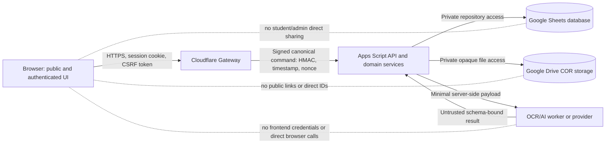
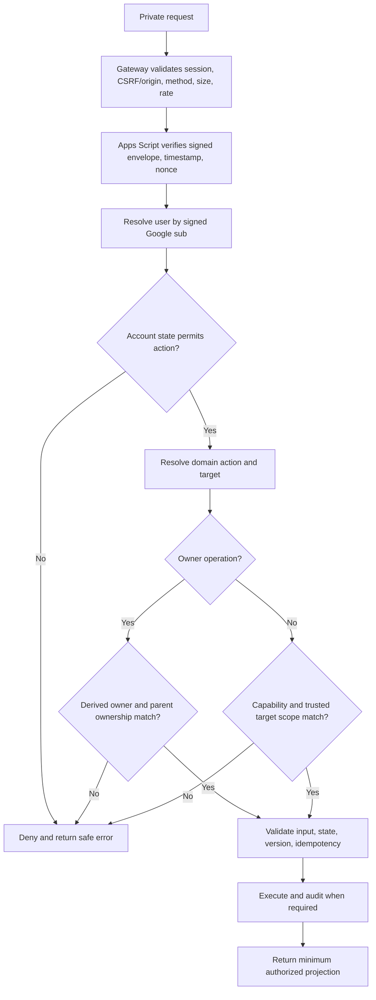

# My-Schedule Security, Privacy, and Data Protection Architecture

Status: Planning only  
Scope: Public frontend, authenticated student/admin applications, Cloudflare gateway, Apps Script API, Google Sheets, Google Drive, COR/OCR processing, private caches, integrations, and operations  
Assessment basis: Existing project audit and all architecture documents through `ADMIN_ARCHITECTURE.md`

This document defines required target controls. It does not claim that the current static application or future implementation already satisfies them. Risk ratings are architecture-level estimates based on the present audit and planned design; they must be reassessed after implementation, configuration review, testing, provider selection, and institutional/privacy approval.

## 1. Security Architecture

My-Schedule uses defense in depth across five trust zones:

1. Public browser content and unauthenticated public-data routes.
2. Authenticated browser application with an encrypted platform session cookie.
3. Cloudflare gateway enforcing web/session controls and signing canonical service requests.
4. Apps Script enforcing identity, authorization, validation, domain integrity, audit, and repository access.
5. Private Google Sheets/Drive and approved OCR/AI services controlled by the infrastructure account.

### Protected Assets

| Data/asset | Security priority | Notes |
|---|---|---|
| Google identity link | High confidentiality and integrity | Immutable Google `sub` maps to internal `userId` |
| Platform session and credentials | Critical confidentiality/integrity | Compromise can impersonate users or administrators |
| Student profile and student number | High confidentiality/integrity | Identity-critical; conflicts must not auto-merge |
| Enrollment and schedule | High confidentiality/integrity | Wrong data can misdirect students and corrupt history |
| Tasks and notes | High confidentiality | Owner-only private content |
| COR originals/drafts | Critical confidentiality | Contains identity and academic information |
| Shared QCU catalogs | High integrity, moderate availability | Incorrect terms/programs/locations affect many users |
| Roles, capabilities, scopes | Critical integrity | Determines privileged access |
| Audit/mutation history | High integrity and availability | Required for investigation and safe retries |
| Sheets, Drive, Apps Script, deployment | Critical confidentiality/integrity/availability | Infrastructure-level blast radius |

### Security Boundary



### Core Security Invariants

- No private resource is authorized from a client-provided `userId`, owner ID, role, or scope.
- No student or application administrator receives direct spreadsheet or Drive sharing access through normal product use.
- The Apps Script URL is treated as public knowledge; cryptographic request verification and application authorization protect it.
- Every mutation is validated, version checked, idempotent where retryable, and audited when privileged or sensitive.
- COR/provider content is untrusted data and never becomes a trusted academic record without validation and confirmation/correction.
- Private data is not placed in static files, public caches, URLs, analytics, or browser-global storage.
- Secrets stay in approved server-side secret stores and are independently rotatable.

## 2. Threat Model

### Assessment Scope and Constraints

This is a Tier 3 information-system architecture assessment. It covers the expected production application and its immediate Google/Cloudflare/provider dependencies. It is not a penetration test, code review of future implementation, legal opinion, provider certification, or measured availability study.

Likelihood and impact estimates are uncertain because production configuration, user volume, threat intelligence, provider contracts, and security testing do not yet exist. Reassessment is required before launch and after material changes.

### Threat Sources

| Source | Type | Realistic behavior |
|---|---|---|
| Unauthenticated internet attacker | Adversarial | Probes public/auth/API endpoints, steals credentials, uploads malicious files, abuses quotas |
| Malicious or compromised student account | Adversarial | Changes IDs, calls admin routes, attempts cross-user reads/writes, submits stored-XSS content |
| Compromised/abusive administrator | Adversarial/insider | Expands privileges, browses student/COR data, makes unauthorized corrections or exports |
| Compromised infrastructure operator/account | Adversarial | Accesses Sheets/Drive/secrets/deployment, alters logs or application behavior |
| Authorized but mistaken user/operator | Accidental | Mis-shares Drive/Sheets, deactivates referenced records, publishes wrong data, deletes files |
| Malicious document content | Adversarial data | Exploits parsers, causes decompression/resource exhaustion, injects instructions into OCR/AI |
| Third-party dependency/provider | Supply chain/structural | Leaks data, retains inputs, serves compromised scripts, fails or changes behavior |
| Platform/service failure | Structural | Apps Script quota exhaustion, Sheet lock/contention, Drive/API outage, corrupted writes |
| Connectivity/power/event outage | Environmental | Prevents access or delays processing; stale cache may be displayed |

### Attack Surfaces

- Google OIDC callback, state/nonce handling, and session creation.
- Platform and optional Google integration cookies/tokens.
- Cloudflare API routes, CORS/origin/CSRF handling, uploads, and rate limits.
- Externally reachable Apps Script deployment and signed service envelope.
- User/profile/task/note/announcement/catalog text rendered in the browser.
- Admin routes, role assignments, document access, exports, and bulk operations.
- Google Sheets formulas/cells, Drive sharing, backups, and human editor access.
- COR/PDF/image decoders, OCR/AI prompts, provider APIs, and retained artifacts.
- Service worker, IndexedDB, browser notifications, shared-device logout/account switching.
- Third-party scripts, fonts, maps, tiles, public data feeds, and GitHub Actions.

## 3. Risk Classification

### Risk Method

Each risk combines qualitative likelihood and impact. Ratings required by this project are:

| Rating | Meaning |
|---|---|
| `Critical` | Plausible mass/cross-user exposure, privileged takeover, public COR disclosure, or catastrophic integrity loss; launch blocker |
| `High` | Serious private-data, account, integrity, or sustained availability impact; must be mitigated before launch unless formally accepted |
| `Medium` | Bounded exposure/degradation with recovery available; mitigation should be planned and tested |
| `Low` | Limited impact involving mainly non-sensitive data or minor degradation; monitor and address proportionately |

`Inherent` means current exposure or expected exposure if the target controls are omitted. `Target residual` is an estimate after the planned controls are implemented and verified; it is not an attestation.

### Prioritized Risk Register

| ID | Threat event and affected assets | Likelihood | Impact | Inherent | Required treatment | Target residual |
|---|---|---|---|---|---|---|
| R-01 | Broken ownership checks let Student A read/change Student B profile, schedule, tasks, notes, or COR | High | Critical | **Critical** | Server-derived owner, parent checks, privacy-safe errors, cross-user authorization tests | Low |
| R-02 | Sheet/Drive sharing or public COR link exposes many student records/documents | Medium | Critical | **Critical** | Dedicated owner, no public links, least editors, sharing audits, API-only product access | Low |
| R-03 | Infrastructure/admin credential or role compromise gives privileged control over identity, data, or documents | Medium | Critical | **Critical** | MFA, individual operator accounts, capability scopes, no self-escalation, rotation, audit/alerts | Medium |
| R-04 | Forged or replayed requests call exposed Apps Script actions as another actor | High | High | **High** | HMAC envelope, timestamp/nonce, user re-resolution, action allowlist, idempotency receipts | Low |
| R-05 | Stored/reflected XSS or compromised unpinned dependency steals data or performs authenticated actions | High | High | **High** | Text-safe DOM, CSP, pinned/self-hosted dependencies, URL allowlists, tests | Low |
| R-06 | Malicious PDF/image exploits parser, exhausts resources, or injects instructions into OCR/AI | Medium | High | **High** | Signature/decode checks, strict limits, safe decoder boundary, quarantine, schema-only AI | Medium |
| R-07 | OAuth/session theft or faulty account linking causes unauthorized account access | Medium | High | **High** | OIDC validation, encrypted secure cookie, expiry/revocation, unique `sub`, no auto-merge | Low |
| R-08 | AI/OCR provider retains, trains on, transfers, or leaks COR content | Medium | High | **High** | Provider/privacy review, minimal payload, retention/training controls, server-only credentials | Medium pending provider |
| R-09 | Logs, analytics, URLs, caches, notifications, or error responses leak private academic/COR data | High | High | **High** | Content-free logging, `no-store`, owner-scoped cache, logout purge, safe errors | Low |
| R-10 | Privilege escalation, forged admin flag, or overly broad capability exposes admin/student data | Medium | Critical | **High** | Server role/capability/scope resolution, delegation rules, reauth for sensitive actions, audit | Low |
| R-11 | Replay, concurrent writes, or duplicate retries corrupt enrollment/schedule/COR commit state | Medium | High | **High** | Mutation IDs, expected versions, locks, staged revisions, receipts, integrity tests | Low |
| R-12 | Accidental destructive or bulk action breaks referenced catalogs or student history | Medium | High | **High** | Deactivation/archive, impact preview, change sets, backups, audited operator recovery | Low |
| R-13 | OAuth, HMAC, provider, API, or deployment secret is committed or exposed to the browser/logs | Medium | Critical | **High** | Server secret stores, scanning, separation, least privilege, documented rotation | Low |
| R-14 | Administrator/support user misuses COR document or sensitive profile access | Medium | High | **High** | Separate capabilities, reason-gated short access, minimal projection, immutable audit/alerts | Medium |
| R-15 | API/provider abuse exhausts free quotas and prevents login, schedules, or COR processing | High | Medium/High | **High** | Per-IP/user/action limits, file/job budgets, backoff, leases, truthful degraded states | Medium |
| R-16 | Backup failure, Sheet corruption, or failed deletion prevents recovery or leaves data retained | Medium | High | **High** | Private backups, restore tests, migration checksums, deletion retries/reconciliation | Medium |
| R-17 | Shared-device/private cache survives logout and exposes the prior student's data | High | Medium/High | **High** | Bootstrap owner verification, IndexedDB namespaces, DOM/memory/cache purge, tests | Low |
| R-18 | Map/public-provider requests disclose IP/device metadata or future precise location | Medium | Medium | **Medium** | Lazy load, no private context, explicit permission for geolocation, minimal retention | Low |
| R-19 | External outage or stale cache shows outdated schedule/catalog/status information | Medium | Medium | **Medium** | Versioned cache, synchronization time, fail-unknown states, online-only mutations | Low/Medium |
| R-20 | Non-sensitive public catalog/status metadata is enumerated | High | Low | **Low** | Approved projections, rate limits, no internal IDs/secrets beyond functional need | Low |

Risk treatment ownership must be assigned before implementation. Any accepted `Critical` or `High` residual risk requires an explicit authorizing decision; this document does not grant acceptance.

## 4. Authentication Security

### Google OIDC

- Use a server-side Google OIDC authorization-code flow with minimum identity scopes: `openid`, `email`, and `profile`.
- Bind callback state to a short-lived secure transaction cookie; validate state exactly once.
- Use and validate OIDC nonce. Use PKCE where supported by the selected server flow.
- Exchange the authorization code only at the server/gateway.
- Validate ID-token signature, issuer, audience, expiration, issued-at tolerance, nonce, and `email_verified`.
- Resolve identity by the immutable Google `sub`; email, name, and avatar are attributes only.
- Never accept a browser-posted email, student number, `sub`, or `userId` as proof of identity.
- Discard login ID/access tokens after required validation. Do not place them in platform sessions, localStorage, logs, or Sheets.
- Keep optional Classroom/Gmail authorization separate, with separate consent, token storage, scopes, disconnect, and cache lifecycle.

### Platform Session

Use an encrypted and authenticated random session cookie or sealed session containing only the minimum routing claims established in `AUTHENTICATION.md`.

Required cookie properties:

- `HttpOnly`.
- `Secure` outside controlled local development.
- `SameSite=Lax` or stricter where callback compatibility permits.
- `Path=/` and no JavaScript access.
- Dedicated session encryption/authentication key, separate from OAuth, integration, and HMAC keys.
- `Cache-Control: no-store` on authentication/session responses.

Provisional session policy from `AUTHENTICATION.md` is approximately 8 hours idle and 7 days absolute. Exact periods are deployment configuration requiring approval. Rotate/reseal at a bounded interval, not every request.

Apps Script revalidates `googleSub`, internal user mapping, `accountStatus`, and `Users.version`. Suspension, closure, explicit global logout, or relevant security action increments the user version so stale sessions fail.

### Logout and Reauthentication

`POST /api/auth/logout` requires same-origin/CSRF validation and:

- Clears the platform cookie even if downstream cleanup fails.
- Clears/disables the active user's optional integration credential.
- Purges private DOM/memory, IndexedDB namespaces, notification state, and service-worker private messages.
- Leaves public static caches only.
- Returns the browser to a neutral public shell with no prior-user data.

Reauthentication is required after absolute expiry, invalid/tampered cookie, account-version mismatch, secret rotation, or closed/suspended state. Sensitive role grants, COR document support, closure, and high-impact bulk operations should require a recent-authentication check if operational testing supports it; the exact window is an open decision.

### Duplicate and Linking Security

- Create users under a lock with globally unique `googleSub`.
- A repeat login resolves the same user; changed email updates an attribute after verification.
- Email collision does not merge accounts.
- Duplicate student number blocks activation/correction and reveals no other account details.
- A second Google account for the same student remains a separate onboarding account until an approved identity-resolution process.
- Initial release has no automatic account linking or record transfer.
- Any future link/transfer requires proof, old-session revocation, single surviving owner, notifications, version updates, and audit.

## 5. Authorization Model

Private access uses this decision:

```text
authenticated identity
+ account state permits action
+ action/permission is allowed
+ direct ownership OR capability and trusted scope match
+ resource lifecycle/version permits action
```



### Resource Rules

| Resource | Student | Administrator/future roles |
|---|---|---|
| User/profile | Own safe fields | `users.read`/status capability and scope; sensitive access audited |
| Enrollment/schedule | Own records under lifecycle rules | Narrow support/correction capability, scope, reason, revision/audit |
| Tasks/notes | Owner only | No routine access, including administrators/clerks |
| COR metadata/draft | Owner import workflow | `imports.review`, safe projection, scope/reason policy |
| Original COR document | Owner through authorized path | `documents.read.support`, reason, scope, short-lived access, audit |
| Shared catalogs/locations | Read approved active projection | `catalog.write` with derived scope |
| Announcements | Read matching published notices | `announcements.write` within audience scope |
| Roles/status/audit/settings | Own resolved permissions/status where appropriate | Exact capability, delegation and visibility rules |

Explicit denials:

- Student A changing `user_id` cannot read Student B's schedule, tasks, notes, profile, enrollment, or COR.
- A student session cannot call admin actions even if it discovers the URL or sends `isAdmin=true`.
- An administrator without document capability cannot open a COR original.
- `imports.review` cannot modify trusted enrollment/schedule data.
- Catalog scope cannot be supplied by the browser; it is derived from target relations.
- A future Clerk role receives only its configured capabilities and never implicit administrator equivalence.

Cross-user lookups should return privacy-safe `NOT_FOUND` where revealing existence creates risk. Denied privileged attempts are audited without sensitive payloads.

## 6. Apps Script Security

The Apps Script deployment executes as the dedicated infrastructure account. Therefore `Session.getActiveUser()` is not the end-user authentication mechanism for Cloudflare service calls.

### Signed Service Envelope

Cloudflare sends a canonical envelope containing request ID, timestamp, nonce, allowlisted action, signed Google identity attributes, session/user version, payload, key ID, and HMAC signature.

Apps Script must:

1. Reject missing, malformed, unknown-version, or oversized envelopes.
2. Select only an active verification key by allowlisted key ID.
3. Recompute HMAC over canonical bytes and compare in constant time.
4. Enforce a short timestamp/replay window.
5. Claim nonce/request ID; use durable mutation receipts where retries/concurrency matter.
6. Resolve `Users` by signed `googleSub` and compare internal user/version attributes.
7. Recheck account state, owner policy, roles, capabilities, and target scope.
8. Dispatch through a fixed action registry; never use dynamic evaluation, arbitrary function names, Sheet names, or A1 ranges from input.
9. Validate schema, allowlisted fields, relationships, state transitions, expected versions, and mutation IDs.
10. Execute only through domain/repository services and append required audit events.

An obscure deployment URL, referer check, or frontend route is not sufficient protection. Direct unsigned browser calls fail closed.

### Request and Mutation Controls

- Cloudflare performs primary per-IP, per-session/user, route/action, upload-size, and burst rate limiting.
- Apps Script applies secondary actor/action quotas where practical and provider/job ceilings.
- Every mutation uses `clientMutationId`; existing-row changes require `expectedVersion`.
- Identity creation, student-number claims, role/status changes, COR commits, schedule activation, and other critical operations use narrow `LockService` locks.
- Repeated identical mutation IDs return the original result; changed hashes are rejected.
- Long COR work uses queued jobs, leases, checkpoints, bounded retries, and timeouts instead of one long request.

### Errors and Exposure

- Return stable codes and generic safe messages.
- Never return stack traces, raw exceptions, Sheet/Drive paths, row numbers, deployment URLs, provider bodies, query internals, secrets, or another user's existence.
- Include a request ID for support correlation.
- Distinguish retryable/transient failures without revealing bypass details.
- Sensitive responses use `Cache-Control: no-store`.

### Secrets and Configuration

Apps Script verification/provider secrets live in Script Properties or an approved Google secret service if later adopted. Non-secret action/schema versions may be deployment configuration. Sheet/Drive IDs are server-only configuration even when not cryptographic secrets.

## 7. Google Sheets Security

Google Sheets has no application row-level authorization. Apps Script is the mandatory product access boundary.

### Ownership and Sharing

- The dedicated infrastructure account owns the production workbook.
- Student accounts are never viewers/editors and never receive API credentials for direct access.
- Application administrators do not gain Sheet access from their application role.
- Human operator access is individual, least privilege, MFA protected, documented, periodically reviewed, and removed promptly.
- Never enable `Anyone with the link`, public publishing, or broad domain sharing without an explicit approved non-production/public-data use.
- Use separate production and non-production workbooks and accounts/roots where practical; never copy real student/COR data into development fixtures.

Protected ranges, hidden sheets, filters, data validation, and formulas improve operator safety but are not security boundaries. Direct human edits to production should be exceptional and follow operator repair/migration procedures.

### Data and Repository Controls

- Repositories use stable IDs, owner filters, foreign-key validation, versions, status fields, and batched range access.
- Never use row order/number as identity or expose it to clients.
- Neutralize formula-leading user content before cell writes while preserving the logical value returned by APIs.
- Do not store HTML, executable formulas from users, secrets, OAuth tokens, HMAC keys, provider credentials, raw session cookies, or public document URLs.
- Cache header maps/catalogs by schema/version and invalidate after mutations.
- Prevent full-workbook scans/exports through ordinary browser APIs.

### Backup and Recovery

- Create private timestamped backups before schema migrations and destructive retention jobs.
- Record server-only backup references and migration checksums.
- Test restoration and integrity validation, not only backup creation.
- Validate headers, required sheets, IDs/FKs, uniqueness, active enrollment/schedule invariants, role assignments, and document references after restore/migration.
- Protect backups with the same or stricter access and retention policy as production data.
- A backup retention schedule must account for deletion/redaction propagation and institutional requirements.

## 8. Google Drive and COR Security

### Private Storage

- Store COR originals/artifacts in a private Drive root owned by the infrastructure account.
- Use opaque internal IDs in folder/file names; do not include email, student number, legal name, subject, or original filename in paths.
- Do not create public or permanent sharing links.
- Apps Script/approved worker is the normal access path.
- Store only opaque `documentId`, server-only `driveFileId`, owner/import IDs, hash, MIME, size, status, and retention metadata in `Document_Assets`.
- Do not expose `driveFileId` or folder structure to browsers.
- Deduplication/reuse is owner-scoped; a matching hash must never disclose another user's upload.

### Controlled Retrieval

- Owner preview/download requires current authentication and direct import/document ownership.
- Support access requires `documents.read.support`, target scope, a non-empty approved reason, and audit.
- Return a short-lived one-use or tightly time-limited authorized proxy/stream response, not a Drive URL.
- Use `Cache-Control: no-store`, safe content disposition, MIME, and filename handling.
- Do not include document thumbnails/previews in admin lists or analytics.
- Logout/account switch clears preview state and revokes browser access as far as the delivery design permits.

### Validation and Quarantine

- Validate upload size at Cloudflare and again server-side.
- Verify signature/magic bytes and successful decode, not extension or browser MIME alone.
- Reject unsupported, encrypted/locked, malformed, or limit-exceeding files.
- Apply page, pixel, dimension, decompression, and processing-time limits.
- Do not execute PDF JavaScript, macros, embedded files/actions, links, fonts, or external resources.
- Treat filenames/metadata/text/QR codes/URLs as untrusted.
- Quarantine suspicious documents and stop provider processing. A maintained malware scanner/sandbox may be added if selected architecture supports it, but type/decoder isolation remains required.

### Retention and Deletion

- Retention state is server authoritative: `ACTIVE`, `QUARANTINED`, `DELETION_PENDING`, `DELETED`, or `DELETE_FAILED` as applicable.
- Deletion is a worker operation that removes the Drive object, updates metadata/tombstone, retries failures, and records a content-free audit event.
- The UI must not claim deletion until confirmed.
- Deleting an original COR does not silently delete confirmed enrollment/schedule/history.
- Avoid duplicate original/artifact copies unless required by the extraction/provider workflow.

## 9. Data Minimization

Collect and retain only what supports authentication, student-owned scheduling, academic administration, security, and recovery.

| Data category | Minimum justified data | Avoid/discard |
|---|---|---|
| Google identity | `sub`, current verified email, display name; avatar optional; login/version metadata | Passwords; login tokens after validation; broad Google scopes |
| Student profile | Required name fields, student number if approved/required, verification state | Unrelated demographic/contact data, government IDs, unnecessary photos |
| Enrollment/schedule | Term, program offering, section/snapshot, subjects, meetings, provenance | Guessed facts, redundant full COR text, staff directory without need |
| Tasks/notes | User-entered fields and optional enrollment-subject link | Admin access, rich HTML, attachments/collaboration without requirement |
| COR source | Original temporarily; reviewed structured fields and necessary provenance | Indefinite raw OCR tokens/layout/provider output; unrelated pages/identity metadata |
| AI/OCR operations | Provider/version, status, duration, pages/units, content-free cost/failure metadata | Email, Google `sub`, platform user ID, full prompts/responses in logs |
| Logs/audit | Request/event ID, actor ID, action, target type/ID, result, scope, safe reason/metadata | COR text, student number, task/note bodies, tokens, cookies, Drive paths |
| Location/map | Campus/building IDs/config; device location only by explicit future action | Background precise-location history for normal schedule/map use |
| Browser cache | Minimum authorized view models with owner/version/sync time | COR originals/raw drafts, secrets, generic browser-wide private keys |

Prefer deterministic PDF text extraction before OCR and local academic matching before external AI. Do not send Google identity metadata to an OCR provider when the document alone is sufficient.

## 10. Data Lifecycle and Retention

### COR Privacy Lifecycle

```mermaid
flowchart LR
    C[Collect minimum COR file and notice] --> P[Process through private validation and OCR path]
    P --> R[Student reviews, confirms, or corrects draft]
    R --> S[Store trusted academic records and limited provenance]
    S --> U[Use only for authorized student/support purpose]
    U --> A[Archive source/draft under configured retention]
    A --> D[Delete original and short-lived artifacts]
    D --> X[Confirm Drive/provider deletion and reconcile failures/backups]
```



### Retention Classes

Exact periods are configuration requiring institutional/privacy/legal approval. Current architecture proposals are starting points, not policy:

| Data | Proposed behavior pending approval |
|---|---|
| OIDC callback transaction | Minutes; one-time use, then delete |
| Platform session | Approximately 8-hour idle and 7-day absolute limits; final configuration required |
| Login ID/access tokens | Discard after validation; optional integration tokens follow separate policy |
| Completed COR original | Proposed deletion 30 days after successful commit, or earlier approved owner request |
| Raw OCR/provider artifact | Proposed deletion within 7 days or sooner when support does not require it |
| Failed/cancelled COR file/draft | Proposed deletion within 7 days unless an approved retry is active |
| Incomplete onboarding import | Proposed expiry after 30 days inactivity with appropriate notice |
| Normalized COR review draft | Through review/recovery plus configured post-completion window |
| Confirmed profile/enrollment/schedule | Account academic history under approved retention/closure policy |
| Tasks/notes | Until owner deletes; tombstone/backup retention remains to be approved |
| Archived schedules/catalog references | Preserve while needed for academic/history integrity; exact period unresolved |
| Audit events | Security retention period with content-free metadata; exact period unresolved |
| Mutation receipts/nonces | Shortest period supporting replay/idempotency; configurable cleanup |
| Backups | Private, time-limited, tested, and included in deletion/redaction policy |
| Closed/deactivated accounts | Access blocked immediately; later redaction/deletion follows approved policy |

### Lifecycle Rules

- Collection pages identify purpose and do not request fields solely because a COR might contain them.
- Processing failures do not create an `ACTIVE` student/profile/schedule accidentally.
- Confirmation promotes validated draft data; raw provider output remains untrusted.
- Updates use versions and provenance rather than destructive overwrite.
- User-facing removal uses explicit states such as deactivate, archive, close, or request deletion.
- Physical cleanup occurs only after dependency, retention, backup, and approved-hold checks.
- Provider-side deletion/expiration must be verified where provider capabilities permit it.
- Backup copies must expire or be redacted through an approved process; deletion cannot be promised if backups are ignored.

## 11. Input and File Security

### Structured Input

- Validate every request with strict schemas and reject unknown fields/types.
- Enforce bounded object/array depth, item counts, string lengths, and total body size.
- IDs are opaque immutable values with allowlisted format; existence never grants access.
- Dates use validated ISO calendar dates; timestamps use ISO 8601 UTC; times use validated `HH:mm` and domain time zone.
- Enums are exact allowlisted values.
- Relationships are resolved server-side and must reference allowed active/historical states.
- Search input is bounded text, never a raw regular expression, formula, query language, or column name.
- Mutation reason fields are bounded plain text and excluded from sensitive content.

### Text, XSS, and Injection

- Render user, OCR, Sheet, catalog, announcement, admin, and provider strings with `textContent`/safe DOM APIs.
- Do not interpolate private/dynamic values into `innerHTML`, HTML attributes, script, style, or `<textarea>` templates.
- Notes remain plain text. Future Markdown requires a separately approved parser/sanitizer allowlist.
- Neutralize spreadsheet-formula-leading values before writes.
- Do not construct Apps Script actions, Sheet ranges, Drive paths, URLs, or SQL-like queries from untrusted text.
- Reject/strip unsafe control characters while preserving normal Unicode text if the final implementation supports it.
- Apply CSP before private launch and remove `latest`/unpinned third-party scripts.

### URLs and Assets

- Accept only approved HTTPS origins and allowlisted `logoAssetKey`, `mapConfigKey`, image/style/geometry/transport/source keys.
- Reject `javascript:`, `data:` except explicitly approved static cases, file paths, local-network URLs, redirects to unapproved origins, and user-provided script/style URLs.
- External links use safe target/rel behavior and never carry tokens, student IDs, or COR references.

### Files

- Sanitize display filenames, discard directory components, limit length, and never use the original name as a storage path.
- Validate extension, MIME, signature, decode result, size, pages, pixels, dimensions, decompression, and processing time.
- Reject unsupported active/encrypted content and never execute embedded behavior.
- Generate opaque server file/import IDs and calculate hashes server-side.
- Keep upload bodies and decoded data out of access logs, error trackers, and analytics.

## 12. AI/OCR Privacy

AI/OCR is an extraction service, not identity, authorization, academic matching, or source of truth.

### Provider Data Rules

- Provider calls originate server-side with dedicated credentials.
- Send only required pages/regions/content and declared extraction instructions.
- Do not add Google email, `sub`, platform `userId`, cookies, tokens, or unrelated profile data.
- Prefer embedded-text extraction and deterministic parsing before OCR/AI.
- Avoid repeated processing; reuse only owner-scoped versioned artifacts under retention policy.
- Do not send a real COR until provider review and deployment approval are complete.

### Prompt and Output Security

- Treat document content as data, never instructions.
- No browsing, tool calls, URL retrieval, code execution, or free-form provider actions.
- Request only a strict versioned schema with bounded fields/arrays.
- Never infer missing values.
- Validate provider output types, sizes, enums, and field allowlist; reject unexpected output.
- Provider output cannot choose record owner, application action, route, database ID, role, or persistence state.
- Academic matching and all authorization/validation occur in application-controlled code.
- Low-confidence, ambiguous, unknown, and conflicting values require review.

### Provider Approval Requirements

Verify before selection:

- Input/output retention and deletion behavior.
- Model-training use and available opt-out/zero-retention controls.
- Processing/storage regions and subprocessors.
- Security controls, incident notification, availability, quotas, and authentication.
- Data-processing terms and whether COR content may leave QCU/Google-controlled infrastructure.
- Whether asynchronous jobs/artifacts remain after completion.

These are provider-specific facts and institutional/privacy decisions; they cannot be assumed from marketing language.

### Failure and Logging

- Fail into recoverable review/retry/new-upload/manual-policy states.
- Bounded retries use backoff and never duplicate a completed expensive stage unnecessarily.
- Log only content-free usage/status/failure metadata.
- Raw provider prompts/responses are not placed in normal logs or API responses and are retained only if explicitly approved for short-lived support.

## 13. Logging and Monitoring

Operational logs and security audit records have different purposes. Both minimize content.

### Safe Operational Logging

Allowed examples:

- Timestamp, environment, request ID, route/action, result/status, duration.
- Pseudonymous/internal actor ID where needed, not Google `sub` or student number.
- Target type and opaque ID when required for support.
- Response class, safe error code, retry count, quota/latency values.
- Upload byte size, MIME category, page count, job status, provider key/version, content-free usage.
- Hashed/truncated IP or user-agent only if approved, useful, access restricted, and short-lived.

Never log:

- COR bytes/text/images, provider prompt/response, student number, legal name, class rows, task/note bodies.
- Passwords, ID/access/refresh tokens, session cookies, CSRF values, HMAC/API keys, authorization codes.
- Drive file IDs/paths, public/private document URLs, spreadsheet contents/ranges.
- Full request/response bodies for private endpoints.

### Security Events to Monitor

- Repeated login/callback/state/nonce/token validation failures.
- Session tampering, expired/revoked session use, and account-state denials.
- Cross-user ID attempts and repeated privacy-safe `NOT_FOUND` patterns.
- Student calls to admin actions, capability/scope denials, and self-escalation attempts.
- Apps Script HMAC/timestamp/nonce failures and unknown actions/key IDs.
- Rate-limit, upload-limit, provider-quota, lease-timeout, and repeated mutation conflicts.
- COR document access, quarantines, deletion failures, and provider failures.
- Role/status/system-setting/catalog/schedule corrections and bulk actions.
- Sharing/ownership/configuration changes for production Sheets/Drive/deployment where Google audit sources are available.
- Backup, migration, integrity-check, retention, and restore failures.

### Alerting

Alert thresholds must avoid disclosing student data in email/chat notifications. High-priority alerts include public sharing detection, credential exposure, privileged role changes, repeated document access/denials, failed deletion beyond retry threshold, mass authorization failures, and integrity-check failure.

Monitoring access is least privilege. Log retention, hashing, export, and alert recipients require approval.

## 14. Audit Trail

Use the append-only `Audit_Log` contract from `DATABASE.md` and `ADMIN_ARCHITECTURE.md`.

### Required Audited Actions

- Account suspension, reactivation, closure, session revocation, identity conflict resolution.
- Role/capability assignment, revocation, expiry, delegation denial, and self-escalation attempt.
- Sensitive profile/student-number read or correction according to policy.
- Enrollment/subject correction and schedule revision activation/archive.
- Shared academic/location/catalog create/update/deactivate.
- COR metadata review, draft support correction, original document access, quarantine, retry/cancel, retention/deletion.
- Announcement publish/unpublish/archive/material edit.
- System configuration, schema migration, backup/restore, destructive retention, and bulk action.
- Privileged operation success, denial, and material failure.

### Audit Record

Capture:

- `auditEventId`, `occurredAt`, request ID.
- Actor type and internal actor user ID when applicable.
- Action, target type, opaque target ID.
- Trusted scope type/ID.
- Result: success, denied, or failed.
- Concise bounded summary and required reason.
- Bounded content-free metadata and retention date.

Do not capture sensitive document/text values, student number, task/note content, credentials, secrets, full payloads, or permanent document links.

### Integrity and Access

- Audit rows are append-only through application APIs; no update/normal delete route exists.
- `audit.read` requires capability, mandatory filters, pagination, redaction, and reasonable time range.
- Sensitive audit searches may themselves be audited.
- Direct Sheet editors can technically alter rows, so Sheets alone is not cryptographic immutability. Restrict editors and create periodic private snapshots/exports with checksums or another tamper-evident record under operator control.
- Audit restoration/partitioning must preserve sequence, checksums, retention, and access restrictions.

## 15. Secrets Management

### Secret Inventory and Location

| Secret/configuration | Approved location | Notes |
|---|---|---|
| Google OAuth client secret | Cloudflare/deployment secret store | OAuth client ID is public configuration, not a secret |
| Platform session encryption/authentication keys | Cloudflare secret store | Separate from all other keys; key IDs support rotation |
| CSRF/session binding secret | Cloudflare secret store or derived with separate context | Never readable by browser |
| Cloudflare-to-Apps-Script HMAC keys | Cloudflare secret plus Apps Script Script Properties | Separate directions/environments; active key ID rotation |
| Optional Google integration token-encryption key | Server secret store | Separate from login session key |
| AI/OCR provider credentials | Calling worker's secret store/Script Properties | Separate development/production credentials |
| Public-data provider API keys | Server/GitHub Actions secret store as applicable | Never sent to browser unless provider explicitly uses public keys |
| Spreadsheet/Drive/deployment IDs | Server-only configuration | Not cryptographic secrets but should not be exposed to clients/logs |
| Retention limits, public asset keys, feature flags | Validated non-secret configuration/System Settings | No embedded credentials or arbitrary URLs |

Never place secrets in HTML, CSS, frontend JavaScript, service-worker assets, public Git history, Google Sheets rows, URLs/query strings, logs, screenshots, documentation examples, or client errors.

### Secret Lifecycle

- Use unique secrets per environment and purpose.
- Grant minimum API/IAM scope and avoid shared human passwords.
- Rotate on schedule appropriate to the credential and immediately after suspected exposure or personnel/access change.
- Support overlapping active/previous key IDs for controlled HMAC/session rotation, then retire old keys promptly.
- Document revocation/redeployment steps and dependencies before production.
- Restrict secret-read permissions and review them periodically.
- Run repository/CI secret scanning and prevent `.dev.vars` or local secret files from being committed.
- Development uses synthetic data and non-production credentials.

## 16. Incident Response

Use a small but explicit process: detect, triage, contain, preserve evidence, eradicate, recover, assess notifications, and review lessons. Named incident/security contacts and alternates must exist before production.

### Compromised Student Account

1. Suspend or security-lock the account as policy permits and increment `Users.version`.
2. Clear/disable platform and optional integration sessions/tokens.
3. Preserve relevant content-free auth/audit events.
4. Review owner-record modifications and restore through revisions/backups where justified.
5. Require Google reauthentication and approved identity verification before reactivation.

### Compromised Administrator or Infrastructure Account

1. Revoke role assignments, sessions, Google access, deployment access, and affected credentials.
2. Freeze privileged writes if scope is unknown.
3. Review role/status/document/audit/configuration changes and Google sharing/activity logs.
4. Rotate HMAC/session/OAuth/provider keys as affected and redeploy safely.
5. Validate Sheets/Drive ownership, sharing, data integrity, audit continuity, and backups before reopening administration.

### Exposed Credential or Source Secret

1. Revoke/rotate the credential immediately; do not wait for proof of abuse.
2. Identify exposed environments, permissions, repositories/logs/artifacts, and time window.
3. Invalidate sessions or provider jobs if the credential allowed them.
4. Search for misuse using safe metadata and document findings.
5. Remove the secret from current files/history/artifacts through the appropriate repository/security procedure without destroying evidence.

### Unauthorized Data Access or Public COR Exposure

1. Remove public sharing/delivery and contain the actor/session.
2. Preserve access/sharing/audit evidence without redistributing the document.
3. Determine affected users/records, fields, time window, downloads, and downstream caches/providers.
4. Rotate access identifiers/keys and purge caches where relevant.
5. Apply institutional/legal incident and notification decisions; this architecture does not determine legal obligations.
6. Correct the control gap and retest before restoring access.

### Malicious Upload or API Abuse

1. Quarantine the upload and stop related extraction/provider jobs.
2. Rate-limit/block the abusive actor/source proportionately and revoke a compromised session.
3. Preserve hashes, request IDs, safe parser/job metadata, and failure codes.
4. Patch/replace vulnerable parser/provider configuration and reprocess only approved clean files.
5. Review quota/cost impact and adjust limits without exposing bypass thresholds publicly.

### Database Corruption or Accidental Destruction

1. Stop affected writes and take a private forensic snapshot of current state.
2. Identify the mutation/migration/bulk action and last known valid backup.
3. Restore into a non-production validation copy first.
4. Reconcile audit events, mutation receipts, Drive references, FKs, uniqueness, and active schedule/enrollment invariants.
5. Perform controlled cutover and post-restore monitoring.

Every incident receives a concise record, root-cause/control review, assigned actions, and risk-register update. Reassess this architecture after a significant incident.

## 17. Security Checklist

### Identity and Sessions

- [ ] Google OIDC validates state, nonce, issuer, audience, signature, expiration, and verified email.
- [ ] Google `sub` is the only external identity key; email/student number never auto-link accounts.
- [ ] Session cookie is encrypted/authenticated, `HttpOnly`, `Secure`, and appropriately `SameSite`.
- [ ] Idle/absolute expiry, user-version revocation, logout, and reauthentication are tested.
- [ ] Optional Google integration tokens/scopes are separate and purged on disconnect/logout.

### Authorization and API

- [ ] Every private route re-resolves actor/account state and owner or capability/scope.
- [ ] Student A cannot read/change Student B resources in automated tests.
- [ ] Students cannot invoke admin actions; admin document access requires exact capability/reason.
- [ ] Cloudflare validates CSRF/origin/method/size/rate and signs canonical commands.
- [ ] Apps Script validates HMAC/timestamp/nonce/key ID/action and rejects direct unsigned calls.
- [ ] Mutations use allowlisted fields, expected versions, mutation IDs, locks, and safe errors.

### Data Stores and Files

- [ ] Production Sheets/Drive have no public/link/domain sharing and minimum individual editors.
- [ ] Students/admin application roles have no direct Sheet/Drive permissions.
- [ ] Production and non-production data/credentials are separated.
- [ ] COR filenames/paths use opaque IDs; Drive IDs are never returned.
- [ ] File type/signature/decode/size/page/pixel/decompression checks and quarantine are tested.
- [ ] Retention/deletion jobs retry, reconcile, audit, and do not claim success early.
- [ ] Backups are private and restoration/integrity checks have been exercised.

### Browser and Content

- [ ] All dynamic text uses safe DOM rendering; no unsafe `innerHTML`/textarea templates.
- [ ] CSP and security headers are deployed and tested.
- [ ] Third-party scripts are pinned/self-hosted or integrity-reviewed; `latest` URLs are removed.
- [ ] Private caches are owner/version scoped and purged on logout/account switch.
- [ ] No COR/private data appears in URLs, analytics, public caches, static assets, or notifications after logout.

### AI, Logging, and Operations

- [ ] OCR/AI provider privacy, retention, training, region, subprocessor, and incident terms are approved.
- [ ] Provider payloads are minimized and schema-only; document text cannot trigger tools/actions.
- [ ] Logs/audit exclude COR content, credentials, tokens, student numbers, and private bodies.
- [ ] Security alerts cover sharing, credentials, role/document access, replay, abuse, and integrity failures.
- [ ] Secret scanning, rotation, revocation, and emergency procedures are documented/tested.
- [ ] Incident contacts, containment playbooks, and privacy/legal escalation paths are approved.

## 18. Deployment Requirements

Production deployment is blocked until these requirements are completed or explicitly risk accepted:

1. Dedicated infrastructure account with MFA, recovery paths, individual operator access, and no personal sole ownership.
2. Separate production/test OAuth, Sheets, Drive, Apps Script deployments, secrets, provider credentials, and synthetic fixtures.
3. Correct Google OAuth redirect origins, consent configuration, minimum scopes, authorized domains, and verified production HTTPS origin.
4. Cloudflare HTTPS-only deployment with secure cookies, CSRF/origin controls, body/file limits, per-action rate limits, and `no-store` private responses.
5. Signed Cloudflare-to-Apps-Script envelope with key rotation, timestamp/nonce replay protection, action registry, and direct-call rejection.
6. Approved role/capability/scope seed, first-admin bootstrap, no-self-escalation, and authorization cache invalidation.
7. Google Sheets/Drive private sharing review, least editors, protected operator procedures, backup schedule, and restore test.
8. COR private folder/metadata lifecycle, safe file decoder limits, quarantine, short-lived delivery, deletion worker, and failed-deletion reconciliation.
9. Selected OCR/AI provider only after security/privacy/legal/retention/region/training/quota/cost review.
10. Exact configurable retention and account closure/redaction/deletion policy with student-facing notices and controls.
11. CSP and headers including appropriate HSTS, `X-Content-Type-Options`, `Referrer-Policy`, `Permissions-Policy`, and framing restrictions, tested against OAuth/maps/integrations.
12. Pinned/self-hosted critical frontend dependencies; review of map/tiles/fonts/public feed origins and fallback behavior.
13. Safe rendering, formula neutralization, URL/asset allowlists, strict request schemas, and malicious-input/file tests.
14. Automated auth/ownership/capability/scope, replay, concurrency, idempotency, cache-switching, XSS, and provider-output tests.
15. Logging redaction, audit retention/access, monitoring/alerts, quota dashboards, and incident contacts.
16. Vulnerability/dependency scanning and focused security review/penetration testing before real student data.
17. Privacy/terms/COR/provider/admin-access notices reviewed and published before collection.
18. Operational runbooks for credential rotation, account compromise, public sharing, failed deletion, corruption, restore, and provider outage.

Reassessment triggers include major authentication/backend changes, new provider, new file type/parser, role/capability expansion, bulk/export feature, geolocation, incident, material QCU policy change, or migration from Sheets/Drive.

## 19. Items Requiring Institutional or Legal Confirmation

This architecture does not make legal conclusions. Qualified QCU/privacy/legal reviewers must confirm:

1. Which Philippine privacy, education-record, records-management, and National Privacy Commission requirements apply to the project and operating entity.
2. Who is the responsible organization/data controller or equivalent, and who is authorized to approve purposes, providers, access, and risk acceptance.
3. The lawful/approved purpose and notice/consent requirements for Google identity, student number, COR upload, OCR/AI processing, optional Google integrations, and any geolocation.
4. Whether students may use personal Google accounts or must use an institution-managed domain.
5. Whether any users may be minors and what additional consent/notice rules apply.
6. Required privacy notice content, contact channel, correction/access/export/deletion/objection rights, and response process.
7. Exact retention/redaction/deletion periods for COR files/artifacts, academic history, tasks/notes, audit logs, sessions, closed accounts, and backups.
8. Any record hold, investigation, or archival requirement that can delay deletion and how it is communicated.
9. Which administrator/support roles may view student numbers, profiles, COR drafts, or original documents; required reason/approval and periodic review.
10. Whether COR content may be processed outside QCU/Google-controlled infrastructure or outside a required region.
11. AI/OCR provider contractual terms, subprocessors, training/retention, breach notification, deletion, audit rights, and cross-border processing.
12. Security-incident and personal-data-breach assessment, notification, documentation, and timing obligations.
13. Official QCU ownership/approval of academic/location data, branding, administrator accounts, and infrastructure resources.
14. Whether the project is an official QCU service or independent student project and what representation/disclaimer is required.
15. Backup retention and deletion propagation expectations.
16. Acceptable use, abuse enforcement, account suspension/closure, identity dispute, and appeal/support processes.

No production collection of real CORs should begin until the relevant decisions, notices, contacts, and provider terms are documented.

## 20. Open Questions

1. Who owns security/privacy risk acceptance and the production go-live decision?
2. Who bootstraps and recovers the first administrator/infrastructure account without creating a single-person dependency?
3. What exact session idle/absolute periods and recent-authentication window are approved?
4. Is per-device session inventory/revocation required, justifying a server-side session store beyond sealed cookies?
5. Must login be QCU-domain restricted, and does enforcement apply to new users or all logins?
6. What proof/process resolves duplicate student numbers, multiple Google accounts, or identity transfer?
7. Which admin capabilities/scopes are approved, especially academic correction and original COR access?
8. What exact data fields are required for student activation and which may be omitted/minimized?
9. Are the proposed 30-day/7-day COR retention baselines acceptable, and how do backups/provider copies expire?
10. May students delete an original COR immediately after successful commit?
11. Which OCR/AI providers and processing regions are acceptable, and is zero retention required?
12. Is an administrator ever allowed to inspect raw provider artifacts, not only reviewed fields/original document?
13. Which file formats, byte/page/pixel limits, malware scanning, and parser isolation are feasible in the free architecture?
14. Should audit integrity use daily checksummed exports, a separate restricted workbook, or a future immutable log service?
15. Which security events require real-time alerts and who receives them without exposing student data?
16. What audit, log, tombstone, mutation-receipt, and backup retention periods are required?
17. Is precise device geolocation required at all, or can it be excluded from the product?
18. Which third-party scripts/maps/fonts can be self-hosted, and what CSP allowlist is operationally necessary?
19. What measured concurrency/quota/latency or incident threshold forces migration away from Sheets/Apps Script?
20. What independent security testing, code review, and privacy review are required before onboarding real students?

## CHUNK 15 Handoff: Frontend UI/UX and Design System Migration Architecture

CHUNK 15 should read all existing architecture documents and design the frontend migration from the current personal static UI into distinct public, onboarding, student, and admin experiences without implementing them.

The next deliverable should inventory and preserve valuable existing visual/navigation patterns, define design tokens and dynamic QCU branding, component/state architecture, responsive navigation, forms/tables/modals, schedule/workspace/map/COR/admin patterns, accessibility, loading/error/empty states, and a file/component migration sequence. It must explicitly incorporate this document's secure UI requirements: no private rendering before authorized bootstrap, safe text rendering, CSP-compatible/pinned assets, owner-scoped cache states, logout/account-switch purge, privacy-safe errors, reason-gated admin/COR actions, non-misleading deletion states, and no secrets or sensitive identifiers in URLs/client source. Planning only; do not modify frontend source or configuration.
