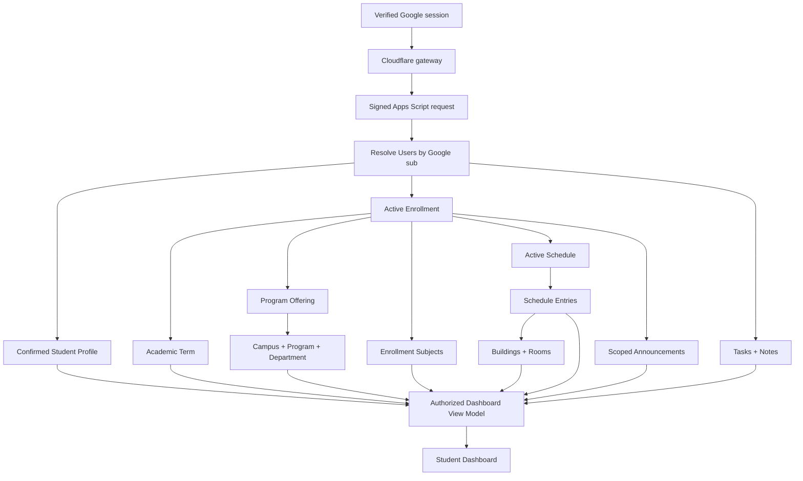
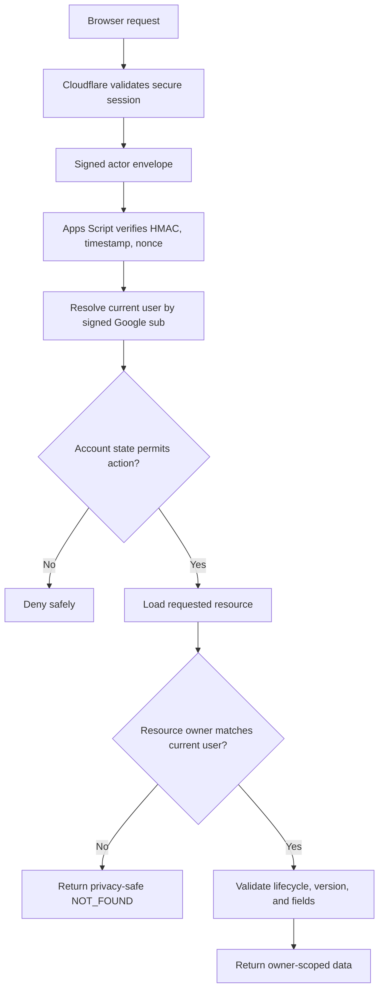
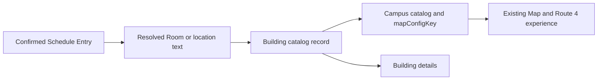

# My-Schedule Student Dashboard and Personalized Application Architecture

Design date: 2026-08-30  
Status: planning only  
Basis: `AUDIT.md`, `ARCHITECTURE.md`, `DATABASE.md`, `ACADEMIC_STRUCTURE.md`, `AUTHENTICATION.md`, `LANDING_PAGE.md`, `REGISTRATION_COR.md`, and `COR_AI_PIPELINE.md`

## Design Direction

The authenticated application is a focused student utility, not a marketing surface. It should preserve the current institutional, mobile-first visual language while replacing personal constants with authorized data. The first screen prioritizes the student's current/next class and today's schedule, followed by actionable tasks, recent notes, relevant announcements, and location access.

The dashboard must never render unconfirmed COR drafts as academic truth. It consumes only confirmed profile, enrollment, and active schedule records produced by the commit pipeline.

## 1. Authenticated Application Structure

The authenticated student application contains these logical destinations:

| Destination | Responsibility |
|---|---|
| Dashboard | Current academic context, current/next class, today's schedule, task/note summaries, announcements, and status |
| Schedule | Weekly and daily views of the confirmed active schedule |
| Tasks | Owner-only task list, filters, completion, and future CRUD |
| Notes | Owner-only notes, search, subject filters, and future CRUD |
| Map | Existing campus/Route 4 map and dynamic campus/building context |
| Profile | Confirmed student information, enrollment context, COR/import history, and term renewal entry |
| Settings | Preferences, privacy controls, Google integration, cache/data controls, and logout |

Supporting routes remain available without becoming primary navigation items:

- Building directory and building details.
- Today-only schedule view if retained as a dedicated route.
- Registration/COR renewal for incomplete or new-term states.
- Restricted account-state pages.
- Privacy and Terms.
- Optional Google Classroom/Gmail connection inside Settings.

### Route Groups

```text
Public
  /                    landing
  /privacy
  /terms
  /campus-info         optional public information

Authenticated student
  /dashboard
  /schedule
  /tasks
  /notes
  /map
  /profile
  /settings
  /buildings/:buildingId

Authenticated onboarding
  /register/*

Restricted
  /account/suspended
  /account/closed
```

Exact filenames/routes are implementation decisions. The architectural requirement is distinct public, onboarding, active-student, and restricted route guards.

### Application Shell

The shell provides:

- General My-Schedule/QCU product identity.
- Resolved student academic-context branding after bootstrap.
- One primary navigation system per viewport.
- Profile access, Settings, and Logout.
- A neutral loading shell before private bootstrap resolves.
- No hardcoded name, program, campus, section, department, or logo.

The PWA favicon, manifest, and offline identity remain general My-Schedule/QCU branding. Department/program logos appear only inside the authenticated shell after authorized academic context is available.

## 2. Dashboard Information Architecture

### First Viewport Priority

The first viewport should answer:

1. Who is signed in and which academic context is active?
2. Is a class ongoing now?
3. What class is next today?
4. What does the rest of today look like?
5. Where is the class located?

Recommended order:

```text
Compact student/academic header
-> Current or next class spotlight
-> Today's schedule timeline
-> Full schedule action
```

Do not put a full student number, large profile card, decorative statistics, or every feature above the fold.

### Secondary Dashboard Content

Below today's schedule:

1. Task summary and nearest due tasks.
2. Recent notes.
3. Relevant My-Schedule announcements.
4. Public QCU suspension/status summary.
5. Building/campus shortcuts based on today's confirmed meetings.

The order of tasks, notes, announcements, and status may adapt to available data, but current/next and today's schedule remain first.

### Student Header

Display:

- Preferred name or confirmed student name.
- Program short/full name as space permits.
- College/department short/full name.
- Year-level label and section when available.
- Campus short name.
- Academic year and semester.
- Resolved academic-context logo with approved fallback.

Do not display the full student number in the dashboard header. Use a masked value only when a product reason exists; show the full value on the Profile route where appropriate.

### Dashboard Content Limits

- Current/next spotlight: one primary class plus one next-class summary.
- Today timeline: all confirmed meetings for today, ordered by start time.
- Task preview: up to 3 actionable tasks.
- Note preview: up to 3 recent notes.
- Announcement preview: up to 3 currently relevant items.
- Building shortcuts: only locations referenced by today's classes, deduplicated.

Each preview links to its full destination. Avoid duplicating full task, note, or announcement management on the dashboard.

## 3. User Data Flow



### Startup Sequence

1. Verify the platform session through `/api/auth/session` or the established entry flow.
2. Request `/api/v1/bootstrap`.
3. Apps Script resolves account status, onboarding state, roles/capabilities, confirmed profile, active academic context, branding, and data versions.
4. Route active students to the dashboard; route incomplete users to registration/renewal and restricted users to the proper state page.
5. Request the dashboard view model if it is not included in bootstrap.
6. Render confirmed owner-scoped data.
7. Load public status separately and lazily because it has different reliability and caching rules.

### Recommended Request Model

Keep the initial dashboard to two private calls at most:

```text
GET /api/v1/bootstrap
GET /api/v1/dashboard
```

`bootstrap` returns identity, route state, academic context, branding, capabilities, and version pointers. `dashboard` returns the full active schedule needed for local calculations plus small task/note/announcement summaries and referenced location records.

The public QCU status request remains separate so its failure cannot block private dashboard content.

## 4. Dynamic Data-Resolution Strategy

### Resolved Academic Context

The frontend receives a composed view model. It does not download whole sheets or join records by name.

```text
authenticated Google sub
-> Users.userId
-> confirmed Student_Profiles
-> active Enrollments
-> Program_Offerings
-> Campus + Program + Department
-> Academic_Terms + Section
-> Enrollment_Subjects
-> active Schedule + Schedule_Entries
-> Buildings + Rooms
-> approved branding assets
```

### Dynamic Field Sources

| Display value | Authoritative source | Fallback behavior |
|---|---|---|
| Student name | `Student_Profiles.preferredName`, then confirmed name | `Users.displayName` only as account label |
| Student number | `Student_Profiles.studentNumber` | Unavailable; never infer |
| College/department | Active enrollment -> offering -> program -> department | Integrity error plus general QCU branding |
| College logo | Approved program/department/campus/institution asset chain | General QCU text/mark |
| Program | Active enrollment -> program offering -> program | No hardcoded BSCS/BSIS fallback |
| Year level | `Enrollments.yearLevel` plus configured label | `Year level unavailable` |
| Section | Matched Section or enrollment snapshot | `Section unavailable` |
| Campus | Program offering -> Campus | `Campus unavailable` and restricted location actions |
| Academic year/semester | Enrollment -> Academic Term | `Term unavailable` and integrity recovery |
| Subjects | `Enrollment_Subjects` snapshots plus optional Subject metadata | Snapshot remains usable |
| Schedule | One active Schedule plus active Schedule Entries | No personal repository fallback |
| Buildings/rooms | Schedule Entry IDs -> catalog; reviewed location text fallback | `Location TBA` or reviewed text |

### Dashboard View Model

Conceptual response:

```json
{
  "student": {
    "displayName": "Sample Student",
    "preferredName": "Sample",
    "studentNumberMasked": "20****123"
  },
  "academicContext": {
    "enrollmentId": "enr_uuid",
    "term": {},
    "campus": {},
    "department": {},
    "program": {},
    "yearLevel": 1,
    "yearLevelLabel": "Year 1",
    "section": {}
  },
  "branding": {
    "contextLogo": {},
    "contextLogoSource": "DEPARTMENT"
  },
  "schedule": {
    "scheduleId": "sch_uuid",
    "version": 3,
    "timeZone": "Asia/Manila",
    "entries": []
  },
  "tasks": {
    "openCount": 0,
    "dueSoon": []
  },
  "notes": {
    "recent": []
  },
  "announcements": [],
  "locations": {
    "buildings": [],
    "rooms": []
  },
  "meta": {
    "serverTime": "ISO-8601 timestamp",
    "catalogVersion": 1,
    "generatedAt": "ISO-8601 timestamp"
  }
}
```

The normal dashboard response excludes Google `sub`, full COR draft data, provider metadata, role assignments, raw Drive IDs, and full student number.

### Client Modules

Future frontend boundaries:

- `authBootstrapService`: session and route state.
- `dashboardService`: dashboard aggregate view model.
- `scheduleDomain`: pure schedule sorting and current-state calculations.
- `academicContextService`: labels and active-term resolution.
- `brandingResolver`: controlled logo and fallback handling.
- `workspaceService`: tasks and notes summaries/full lists.
- `locationService`: building/room and map handoff.
- `publicStatusService`: suspension/weather/flood behavior.
- `privateCache`: user-scoped IndexedDB snapshots.

Components must consume normalized view models and must not call Sheets, parse section codes, select logo paths, or infer program/campus from text.

## 5. Data-Isolation Strategy



### Student Endpoint Rules

Prefer current-user routes:

```text
GET /api/v1/me
GET /api/v1/dashboard
GET /api/v1/schedules/active
GET /api/v1/tasks
GET /api/v1/notes
GET /api/v1/enrollments
```

Do not expose normal student APIs such as:

```text
GET /api/v1/users/{userId}/schedule
GET /api/v1/tasks?ownerUserId={userId}
```

For resource-ID routes, Apps Script loads the record and verifies direct and parent ownership before returning it.

### Client-Supplied IDs

- Ignore `userId`, `ownerUserId`, Google `sub`, email, role, or admin flags supplied by the browser.
- Derive owner from the authenticated session and Apps Script user lookup.
- A changed local cache namespace or URL parameter cannot grant server access.
- Use `NOT_FOUND` instead of revealing another user's record existence where appropriate.
- Shared catalog IDs may be supplied for selection/filtering, but server validation verifies their status and relationships.

### Cache Isolation

- Namespace private IndexedDB stores by platform `userId` and schema version.
- Accept `userId` for cache naming only from authorized bootstrap, not arbitrary page parameters.
- Record owner ID/version inside cached envelopes and verify before display.
- Purge the active user's private cache on logout/account reset.
- On account switch, close the old namespace before reading the new one.
- Never cache private data in a shared service-worker asset cache.
- Public status/map/static assets use separate public cache names.

Server authorization remains mandatory even if browser cache isolation fails.

## 6. Today's Schedule UX

### Primary Content

Show:

- Campus-local current date and weekday.
- Ongoing class when one exists.
- Next class today.
- Subject code and reviewed subject title.
- Start/end time.
- Room and building or reviewed location text.
- Modality when relevant.
- Countdown/status text.
- Direct actions to Full Schedule and the relevant building/map context.

### Current/Next Spotlight

Preserve the existing current/next tracker concept. Refine it into one stable region:

| Situation | Primary spotlight | Secondary information |
|---|---|---|
| Class ongoing | Subject, time remaining, room/building | Next class today |
| No class now, later class exists | Next subject and time until start | Remaining class count |
| All classes completed | `No classes left today` | Full schedule action |
| No classes today | `No classes scheduled today` | Next relevant action, not invented next-day data |
| Schedule unavailable | Safe panel error | Retry or cached snapshot |

The initial dashboard should not calculate the next class across future dates unless a clear product need is approved. `Next` means next today, matching the current behavior and avoiding term/calendar recurrence assumptions.

### Today's Timeline

Preserve:

- Chronological class tiles.
- Break periods between confirmed meetings.
- Clear current, next, upcoming, and completed treatment.
- Subject, time, room, building, and units where useful.
- Weekly strip/day access if it remains readable.

Break periods are derived client-side from adjacent confirmed meetings and are never stored as schedule rows.

### Location Actions

Each class location may provide:

- `View building` when `buildingId` is resolved.
- `Open map` when a configured campus/map context exists.
- Plain reviewed `locationText` when no catalog match exists.
- `Location TBA` when no value is present.

Do not fabricate a map pin for an unmatched room/building.

## 7. Full Schedule UX

### Weekly View

Preserve the current full weekly timetable and mobile adaptation, backed by the active schedule view model.

Required information:

- Day.
- Start/end time.
- Subject code/title.
- Class section when available.
- Building/room or location text.
- Units.
- Modality.
- Current-day/status highlighting.

The view groups meetings by weekday and start time. Empty days are derived from no meeting rows; do not store or depend on synthetic `noClasses` records.

### Daily View

Retain the existing Today page or day modal when it materially helps phone users. It should use the same schedule-domain functions and view model as Dashboard and Weekly Schedule, not duplicate schedule logic.

### Enrolled Subjects Summary

Provide a compact subject list derived from `Enrollment_Subjects`:

- Subject code/title snapshot.
- Units.
- Class section/instructor when available.
- Meeting count.
- Match status only where useful to the student; do not expose internal OCR confidence.

Subjects with no scheduled meeting may appear with `Schedule TBA` if policy allows them in confirmed enrollment.

### Term Scope

- Default to the active enrollment/term.
- Historical terms are reached through an explicit term selector or Profile/History route.
- Never mix entries from several terms into current/next calculations.
- Archived schedules are read-only and clearly labeled.
- Term changes invalidate/reload schedule, subjects, announcements, and relevant location subsets.

Schedule editing is deferred to CHUNK 10. This chunk defines presentation and read behavior only.

## 8. Current-Class State Logic

### Existing Logic Assessment

The current `getStatus`, `getCurrentAndNext`, timeline, break, and countdown concepts are reusable. The current implementation also has limitations that must be corrected during migration:

- It uses one hardcoded `Asia/Manila` zone instead of the active campus time zone.
- Countdown dates use browser-local `Date.setHours`, which can disagree with campus time for users/devices outside that zone.
- The entire Home/Schedule/Today/Workspace rendering loop runs every second.
- It depends on string day names and personal schedule rows.
- It does not use effective dates, entry statuses, term bounds, or schedule versions.

### Canonical States

Use four student-facing states:

| State | Rule for today's active entry | Display label |
|---|---|---|
| `ONGOING` | `start <= campusNow < end` | `Ongoing` |
| `UPCOMING` | `campusNow < start` | First is `Up next`; later entries are `Upcoming` |
| `COMPLETED` | `campusNow >= end` | `Completed` |
| `NO_CLASS` | No eligible active entries today | `No class` |

Internal states such as inactive day, cancelled, removed, or outside effective dates are filtered before presentation rather than shown as normal class states.

### Eligible Entry Rules

An entry participates only when:

- The parent schedule is the active schedule for the selected enrollment.
- Entry status is `ACTIVE`.
- Enrollment/term is selected and valid for the dashboard context.
- Day matches campus-local weekday.
- Optional `effectiveFrom/effectiveTo` includes the campus-local date.
- Start/end values are valid and start is earlier than end.

Public suspension/status does not rewrite schedule states. It overlays a separately sourced advisory such as `Scheduled, but affected by a suspension announcement`, preserving fail-unknown semantics.

### Time Source

- Use the active Campus `timeZone` with institution fallback only when configuration is valid.
- Return `serverTime` with dashboard/bootstrap responses.
- Compute a client clock offset from `serverTime` to reduce device-clock drift.
- Convert the effective current instant to campus-local weekday/date/minutes through one shared time service.
- If clock drift is implausibly large, show a safe time-warning state instead of silently relying on the device.

### Boundary Rules

- Start time is inclusive.
- End time is exclusive.
- At exactly end time, the class is completed.
- Overlapping entries should be prevented by commit/CRUD validation. If corrupted data still contains overlaps, show an integrity error rather than silently choosing one as the only current class.
- Overnight meetings are not supported by the current schema because `startTime < endTime`; a future requirement needs an explicit recurrence design.

### Update Frequency

No server polling is needed for class state.

- Recalculate at initialization, page visibility return, minute boundaries, and known class start/end boundaries.
- Update a visible seconds countdown locally only when useful, without rerendering the whole dashboard.
- Pause second-level countdown updates while the page is hidden.
- Render Tasks/Notes only when their data changes, not every clock tick.
- Refresh schedule from the server only on explicit synchronization, version change, focus/reconnect policy, or user action.

## 9. Tasks and Notes Integration

### Ownership

```text
Authenticated User
-> owner-scoped Tasks
-> owner-scoped Notes
```

Tasks and notes never use a browser-wide key such as `qcu-tasks` or `qcu-notes` as authoritative storage. They are server records owned by `ownerUserId`, derived from the authenticated actor.

### Existing Features to Preserve

Tasks:

- Create/edit/delete behavior in the later CRUD phase.
- Completion toggle.
- Search.
- Pending/completed filters.
- Priority.
- Deadline.
- Sorting.
- Subject association.

Notes:

- Create/edit/delete behavior in the later CRUD phase.
- Search.
- Subject filter.
- Sorting.
- Recent-note preview.

### Subject Links

Use `enrollmentSubjectId`, not a free-form subject code, when a task/note is linked to the current enrollment. Display the subject snapshot/code from the related enrollment subject.

Rules:

- Subject selector options come from the active enrollment, not `QCU_DEFAULTS.schedule`.
- Historical task/note links continue displaying their original enrollment-subject snapshot.
- A task/note may be unlinked from a subject.
- Students cannot link to another user's enrollment subject.
- Archiving a schedule does not delete tasks/notes.

### Dashboard Summaries

- Tasks: open count, overdue count, and up to 3 nearest actionable items.
- Notes: up to 3 most recently updated active notes.
- Fetch full collections only on Tasks/Notes routes.
- Empty previews use direct creation/open actions only after CRUD is implemented.

### Legacy Local Data

On first authenticated migration, detect old browser-local tasks/notes and ask whether to import them into the signed-in account. Never attach them automatically because the browser may be shared. Import behavior belongs to a later implementation plan and must be idempotent.

### Offline Behavior

The initial safe requirement is offline read of the last synchronized task/note snapshot. Offline mutation/outbox behavior remains a product decision. Do not show an edit as synchronized until the server confirms it.

## 10. Map Integration



### Preserve the Existing Map

Keep the current MapLibre/OpenFreeMap Route 4 page, route geometry, stop markers, source attribution, public schedule, and no-live-tracking disclosure. Do not redesign its routing/transit logic in this chunk.

### Dynamic Handoff

- Schedule entries reference `roomId`, `buildingId`, or reviewed `locationText`.
- Room resolves its Building; Building resolves its Campus.
- Campus provides approved coordinates and `mapConfigKey`.
- The Map route loads configured campus/route data rather than assuming every student belongs to San Bartolome.
- Route 4 is shown only for campuses with that approved map/route configuration.

### Current Map Limitation

The audited map is a campus/transit route map, not a building-floor navigation system. Therefore:

- `View building` opens dynamic building details.
- `Open map` opens the configured campus/transit map.
- Focusing a specific building is allowed only when approved building coordinates and existing map support are available in a later implementation.
- Do not invent coordinates or imply turn-by-turn/live bus tracking.

### Data Separation

Public route geometry and bus data remain public/static or public-configured. The map does not need the student's whole schedule. It receives only the selected authorized location context needed for navigation, such as an opaque `buildingId` resolved by the backend/client catalog.

## 11. Navigation Architecture

### Navigation Principle

Use one primary navigation pattern per viewport. Do not show both a desktop sidebar and mobile bottom navigation at the same time.

### Mobile and Tablet Primary Navigation

Use a stable bottom navigation with five destinations:

```text
Dashboard
Schedule
Tasks
Notes
Map
```

Profile and Settings are accessed from the authenticated header/profile control. Logout is inside the profile/settings menu and Settings page, not a bottom-nav item.

Rules:

- Icons plus short labels.
- Minimum 44px targets, 48px preferred.
- Stable dimensions so active states do not shift layout.
- Respect safe-area insets.
- Do not put Buildings, Google, Profile, Settings, and Logout into additional competing bottom navigation.
- Registration status appears as a route/state banner only when the user needs action, not as a permanent nav item.

Tablet may retain bottom navigation until the desktop sidebar has adequate width; do not introduce a third navigation design.

### Desktop Navigation

At a suitable desktop breakpoint, use one compact left sidebar or top navigation, chosen during implementation based on the existing shell migration. Recommended sidebar groups:

```text
Dashboard
Schedule
Tasks
Notes
Map

Profile
Settings
```

Place Logout in the profile menu/settings area. The sidebar remains work-focused and no wider than necessary.

### Profile Control

The profile control shows a safe avatar/photo or initials fallback and preferred name. Its menu includes:

- Profile.
- Settings.
- Optional Google integration status entry.
- Logout.

It must not expose the full student number in the persistent header.

### Deep Links and Route Guards

- Every private route verifies bootstrap/session state.
- Active users may deep-link to student routes.
- Onboarding users return to their authoritative registration/renewal state.
- Suspended/closed users go to restricted pages.
- Safe return paths are local and contain no user IDs, emails, or tokens.
- The active navigation item is derived from the route, not duplicated page-specific markup.

## 12. Loading and Error States

### Initial Dashboard Loading

Show a neutral general-QCU shell and layout-matching skeletons for the current/next region and today's timeline. Do not show cached names, department logos, programs, or schedules until the cache owner is verified against authorized bootstrap.

### State Matrix

| Condition | Required behavior | Recovery |
|---|---|---|
| Session check pending | Neutral shell; no private data | Wait briefly |
| Session expired/invalid | Clear private UI/cache and return to login | Continue with Google |
| Account onboarding | Route to registration/renewal | Resume authoritative state |
| Account suspended/closed | Restricted page; no dashboard data | Logout/support policy |
| Dashboard loading | Stable skeleton matching final layout | Wait/retry on timeout |
| Dashboard API fails | Keep shell; show safe retry panel | Retry; use verified cache if allowed |
| Schedule subdata fails | Dashboard may show other valid panels | Retry schedule only |
| Tasks/notes summary fails | Show local panel error, not whole-page failure | Retry panel/open full route |
| Public status fails | `Status currently unavailable` | Official source link; never false clear |
| Missing profile | Integrity/onboarding recovery state | Do not guess from Google name |
| Missing active enrollment | New-term/incomplete state | Start/resume COR renewal |
| Missing academic FK/config | General QCU branding and integrity error | Refresh/support; no guessed IDs |
| Partial location data | Show reviewed text or TBA | Building/map action only when valid |
| Version conflict/stale data | Keep readable snapshot and request refresh | Reload latest version |
| Offline | Verified last-known snapshot with timestamp | Reconnect for updates/mutations |

### Partial Data

Use independent panel boundaries. A Tasks failure must not erase today's schedule. A public status failure must not block private data. A missing core profile/enrollment relation, however, is a route-level integrity problem and should not produce a partially personalized dashboard.

### Error Privacy

Never display:

- Another account's existence/data.
- Sheet row/range names.
- Drive IDs.
- Google `sub`.
- HMAC/session/token details.
- Stack traces or raw Apps Script/provider errors.

## 13. Empty States

| Empty condition | Message | Primary action |
|---|---|---|
| No active schedule | `No active schedule is available for this term.` | Upload/review COR or contact approved support path |
| No classes today | `No classes scheduled today.` | View full schedule |
| All classes completed | `No classes left today.` | View full schedule |
| No tasks | `No tasks yet.` | Add task after CRUD is available |
| No matching tasks | `No tasks match these filters.` | Clear filters |
| No notes | `No notes yet.` | Add note after CRUD is available |
| No matching notes | `No notes match this search.` | Clear search/filters |
| No announcements | `No announcements right now.` | No forced action |
| No mapped building | `Location details are not available.` | Show reviewed location text if present |
| No campus route config | `Campus map information is not available for this campus.` | Building directory or no action |
| Incomplete registration | `Complete your registration to create your schedule.` | Resume registration |
| No active term | `Add your current COR to set up this term.` | Start term renewal |

Do not render blank cards, `undefined`, empty tables, zero-value metrics with no meaning, or another student's fallback schedule.

## 14. Responsive Requirements

### Mobile: 320px to 599px

- Primary target.
- Compact authenticated header with academic context wrapping safely.
- Current/next spotlight appears before all secondary content.
- Today's timeline is one column with stable time/location alignment.
- Bottom navigation shows exactly five primary destinations.
- Touch targets are at least 44px, with 48px preferred for primary actions.
- Full schedule uses grouped day sections or the existing responsive table pattern without horizontal page scrolling.
- Subject titles, program names, building names, and room text wrap without overlap.
- Task/note previews use compact rows/items, not nested cards.
- Map is a dedicated route and does not load on the dashboard.
- No authenticated bottom navigation appears during focused onboarding.

### Tablet: 600px to 1023px

- Maintain current/next prominence.
- Dashboard may use a two-column lower section while today's schedule remains wide enough to scan.
- Bottom navigation may remain until desktop sidebar space is reliable.
- Task and note previews may sit side by side.
- Map controls and attribution remain reachable without covering the map.

### Desktop: 1024px and Above

- Use one compact sidebar/top navigation, not both.
- Constrain content near the current 1120-1200px working width.
- Use a two-column dashboard where the primary schedule column is wider than the secondary activity column.
- Keep current/next and today's schedule in the dominant column.
- Secondary column contains tasks, notes, announcements, or status summaries without nested-card composition.
- Full schedule can use the existing table with sticky/clear day grouping where useful.
- Profile/settings remain one interaction away without occupying main dashboard space.

### Accessibility

- Semantic landmarks and one H1 per page.
- Clear skip link to main content.
- Current class changes announced only when state actually changes, not every countdown second.
- Status is communicated with text, not only color/dots.
- Keyboard-visible focus and logical order.
- Modals/day details implement focus trap, initial focus, background inertness, and focus restoration.
- Reduced-motion support for all transitions.
- 200-percent zoom and long dynamic labels must not overlap.

## 15. Performance Strategy

### Initial Network Budget

- One session/bootstrap request.
- One dashboard aggregate request when bootstrap does not include it.
- One lazy public-status request.
- No map, route geometry, Google integration, task list, or note list request until its route/panel needs it.

### Reuse Loaded Data

- Include the small full active schedule in the dashboard response so Dashboard, Today, Weekly preview, and current-state logic share one snapshot.
- Reuse academic context and branding from bootstrap across routes.
- Reuse referenced building/room records by catalog/version cache.
- Fetch full Tasks/Notes only on their routes; dashboard keeps bounded summaries.
- Cache shared catalogs by `catalogVersion` and branding by `assetRegistryVersion`.

### Client Calculations

Perform schedule sorting, break derivation, current/next state, and countdown locally from the authorized active schedule snapshot. These calculations do not require repeated API calls.

Use pure functions that accept:

```text
schedule entries
campus-local current instant
selected term/date
```

They must not read global personal defaults.

### Private Caching

- Use user-scoped IndexedDB, not localStorage, for structured private snapshots.
- Cache only successful authorized view models with owner, version, and synchronization timestamps.
- Permit offline read of the last confirmed schedule/profile/task/note snapshot.
- Label stale/offline data with last synchronization time.
- Do not cache COR raw artifacts or unconfirmed drafts for dashboard use.
- Use `no-store` for auth/session and sensitive mutation responses.
- Do not let aggressive cache reuse cross user, enrollment, term, or schedule versions.

### Refresh Policy

- Refresh on explicit action, successful mutation, sign-in/resume, reconnect, relevant version change, and bounded focus policy.
- Do not poll private APIs every second/minute.
- Pause nonessential work while the page is hidden.
- Public status may use its own conservative refresh/cache policy.
- Map and Google integration bundles load only on their routes.

### Rendering

- Update countdown text/status nodes without rebuilding the entire dashboard.
- Render Tasks/Notes only when their data/filter state changes.
- Batch DOM updates.
- Reserve image/logo/map dimensions to prevent layout shift.
- Self-host/pin fonts/icons and remove mutable `@latest` dependencies before private launch.

## 16. Existing UI Migration Plan

### Preserve

| Existing capability | Target use |
|---|---|
| Current/next class concept | Dashboard primary spotlight |
| Live countdown | Local focused countdown without full rerender |
| Today's timeline and breaks | Dashboard/Today view |
| Weekly strip/day modal | Dashboard or Full Schedule if accessible |
| Full weekly timetable | Schedule route |
| Today-only cards | Mobile daily view |
| Building directory/modal | Dynamic building details route/tool |
| Tasks CRUD/filter/sort UX | Owner-scoped Tasks route in later CRUD phase |
| Notes CRUD/search/filter UX | Owner-scoped Notes route in later CRUD phase |
| Public suspension fail-unknown logic | Dashboard status overlay and public route |
| Weather/flood source behavior | Public/status service with campus context |
| Route 4 map, attribution, disclaimer | Map route |
| Optional Classroom/Gmail feed | Settings-connected integration, separate from login |
| Mobile-first layout/focus effort | Authenticated responsive baseline |

### Move

- Current personal Home content moves from `index.html` to authenticated Dashboard.
- Public `index.html` remains the landing page defined in `LANDING_PAGE.md`.
- Google integration moves under Settings/profile access rather than primary navigation.
- Buildings become a secondary location route linked from Schedule/Map/Settings as appropriate.
- Full student number and detailed identity move to Profile.

### Replace

- `Habib` -> confirmed/preferred authenticated student name.
- `BS Computer Science - San Bartolome` -> resolved Program + Campus context.
- Universal CCS logo -> approved dynamic branding fallback chain.
- `data/schedule.json` and `QCU_DEFAULTS.schedule` -> owner-scoped active schedule API/cache.
- `QCU_DEFAULTS.buildings` -> campus-filtered shared catalog.
- Subject name/color maps -> Enrollment Subject snapshots + Subject metadata/color keys.
- Browser-wide `qcu-tasks`/`qcu-notes` -> owner-scoped APIs and private cache.
- Hardcoded `Asia/Manila` -> active Campus time zone with safe institution fallback.
- Building name substring rules -> configured building labels/IDs.
- Page-specific direct fetches -> shared API/public-data clients.

### Refactor

- Split `app.js` into shell, dashboard, schedule domain, workspace, location, settings, API, and cache modules.
- Centralize current-time/schedule logic as testable pure functions.
- Centralize safe DOM text rendering.
- Remove full-page one-second render loop.
- Make status schedule-aware only after authorized schedule data loads.
- Separate public, private, onboarding, and integration initialization.

### Retire from Production Behavior

- Personal embedded schedule/building fallback.
- Hardcoded student/program/campus strings.
- Synthetic `noClasses` schedule records.
- Mutable `lucide@latest` dependency.
- Misleading class-notification copy until reminders exist.
- PWA/version clutter as dashboard content.
- Any cross-account reuse of local tasks, notes, Google updates, location, or schedule cache.

## 17. Security and Authorization Requirements

### Authentication and Route Access

- Every student route requires a valid platform session and permitted account state.
- Apps Script rechecks account status and user mapping.
- Frontend route guards never replace backend authorization.
- Platform login remains separate from optional Classroom/Gmail authorization.

### Ownership

- Owner is derived from signed Google `sub` -> `Users.userId`.
- Student routes ignore client owner/user IDs.
- Schedule ownership derives through Enrollment and Schedule parents.
- Tasks/Notes use direct owner plus optional enrollment-subject validation.
- Announcements are filtered server-side by active enrollment context.
- Location catalogs are shared, but schedule-to-location context remains private.

### Dynamic Content Safety

- Render all user, COR, Sheet, catalog, announcement, and Google text through text-safe operations.
- Avoid unescaped `innerHTML` for dynamic data.
- Enforce CSP and pinned/self-hosted dependencies before private launch.
- Validate logo/image keys against the approved asset registry.
- Never accept arbitrary image HTML/URLs from profile/catalog payloads.

### Privacy

- Do not place student names, numbers, schedules, tasks, notes, or academic context in static HTML/source JSON.
- Do not put private identifiers/data in URLs.
- Mask student number outside Profile/necessary review flows.
- Purge private caches and optional integration access on logout/account switch.
- Do not expose private schedule data to public status/map endpoints unnecessarily.
- Browser notifications must avoid stale prior-user academic details after logout.

### API Protections

- HTTPS, secure HttpOnly session cookie, CSRF, Origin checks, HMAC-signed Apps Script requests, nonce/replay protection, and request IDs.
- Strict response schemas, lengths, enums, versions, and foreign-key checks.
- Per-user/IP rate limits for private APIs.
- `Cache-Control: no-store` where required.
- Safe error codes without backend internals.
- Audit privileged/sensitive actions, not normal dashboard reads unless policy requires it.

### Shared-Device Protections

- No private content before authorized bootstrap/cache owner verification.
- Clear in-memory state, DOM, IndexedDB namespace, service-worker private messages, and optional Google integration local state on logout.
- The next visitor must see only the public landing shell.
- Do not auto-import legacy local tasks/notes into whichever student logs in first.

## 18. Implementation Dependencies

Before dashboard coding begins:

1. Implement platform authentication/session/bootstrap and Apps Script authorization described in `AUTHENTICATION.md`.
2. Create the Sheets schema/repositories and seed confirmed shared catalogs from `DATABASE.md` and `ACADEMIC_STRUCTURE.md`.
3. Implement confirmed COR commit or an approved migration path so active students have valid profile/enrollment/schedule records.
4. Finalize public landing and authenticated dashboard route filenames.
5. Define and contract-test `/api/v1/bootstrap` and `/api/v1/dashboard` view models.
6. Define active enrollment/term selection and no-active-term renewal behavior.
7. Define schedule entry read model, effective dates, modality, location snapshots, versions, and sorting.
8. Resolve official campus time zones and server-time/clock-skew handling.
9. Define user-scoped IndexedDB schema, versioning, logout purge, stale labels, and service-worker boundaries.
10. Implement text-safe rendering and CSP/pinned dependency changes before private data exposure.
11. Approve general and academic-context branding assets/fallbacks.
12. Define Tasks/Notes summary APIs while deferring mutation endpoints to their CRUD phase.
13. Define scoped Announcement read behavior and separation from suspension/Classroom feeds.
14. Decide whether Map remains public, authenticated, or both, and map each campus to approved `mapConfigKey` data.
15. Confirm Route 4's campus association and preserve no-live-tracking/source disclosures.
16. Add test fixtures for multiple users, programs including BSIS, campuses, terms, empty schedules, overlaps, missing locations, and stale caches.
17. Add authorization tests proving user A cannot access user B profile, schedule, tasks, notes, enrollment, or cache-backed UI.
18. Add schedule-domain tests for time zones, start/end boundaries, day changes, effective dates, completed days, no-class days, and clock drift.
19. Add responsive/accessibility tests for mobile bottom nav, desktop navigation, current-class announcements, schedule tables, modals, and 200-percent zoom.
20. Preserve and rerun fail-unknown suspension tests with authorized dynamic schedules.

## 19. Open Questions

1. What exact route/filename will replace the current personal `index.html` dashboard?
2. Should the dedicated Today page remain, or should Dashboard plus Full Schedule cover the workflow?
3. Should the weekly strip/day modal remain on Dashboard or move entirely to Schedule?
4. Should `Next class` mean next today only, or eventually include the next scheduled academic day?
5. Is the full student number ever needed outside Profile and COR review?
6. What exact student/profile fields should be editable after confirmation?
7. Can students have concurrent active enrollments/programs, and if so how is dashboard context selected?
8. How should users switch between active and historical academic terms?
9. Can confirmed enrollment subjects exist with no day/time (`TBA`) and how should they appear?
10. Are class exception dates, holidays, makeup classes, and one-time cancellations required before launch?
11. Should public suspension announcements visually overlay individual class entries or remain one dashboard status panel?
12. Which task/note fields and summary ordering are required for the first authenticated dashboard?
13. Is offline task/note mutation required, or is offline read sufficient initially?
14. Should Tasks and Notes remain separate primary destinations or become tabs within one Workspace route on some viewports?
15. Should Map be labeled `Map`, `Campus`, or `Map & Transit` while preserving Route 4?
16. Is the existing Route 4 page public before login, and should the authenticated Map route reuse the same page?
17. Are official building coordinates available, or should schedule links stop at building details plus campus map?
18. Which My-Schedule announcement scopes and priorities should appear on Dashboard?
19. What refresh interval, if any, is acceptable for announcements and public status?
20. Should a dashboard display a verified-cache snapshot immediately after bootstrap, or wait for a fresh dashboard response when online?

## CHUNK 10 Handoff: Schedule CRUD and Enrollment Management

CHUNK 10 should design how students manage confirmed schedules and enrollment-linked subjects after onboarding while preserving COR provenance and historical terms. It must:

1. Define schedule, enrollment-subject, and meeting CRUD boundaries for students, administrators, and COR imports.
2. Decide which imported fields students may edit directly, which require a new COR, and which are shared-catalog/admin controlled.
3. Define active enrollment and schedule revision creation, activation, archiving, rollback, and same-term replacement behavior.
4. Define create/update/remove request and response contracts with owner-derived authorization, expected versions, and idempotency keys.
5. Define validation for subject duplication, day/time syntax, overlaps, effective dates, modality, building/room relationships, campus consistency, units, and TBA meetings.
6. Define how manual subjects/meetings coexist with COR-imported provenance without altering original source rows.
7. Define term renewal, historical enrollment access, no-active-term state, concurrent-enrollment policy, and schedule selection.
8. Define conflict handling for stale edits, duplicate requests, interrupted activation, partial Sheets writes, and rollback/repair jobs.
9. Define schedule CRUD UX for mobile/desktop, confirmation for destructive changes, empty states, accessibility, and offline limitations.
10. Define how successful mutations invalidate dashboard/schedule caches and recalculate current/next state without unnecessary polling.
11. Produce entity lifecycle, API, authorization, validation, revision, and implementation plans only. Do not implement CRUD, APIs, Sheets changes, or UI changes until a later chunk authorizes implementation.
