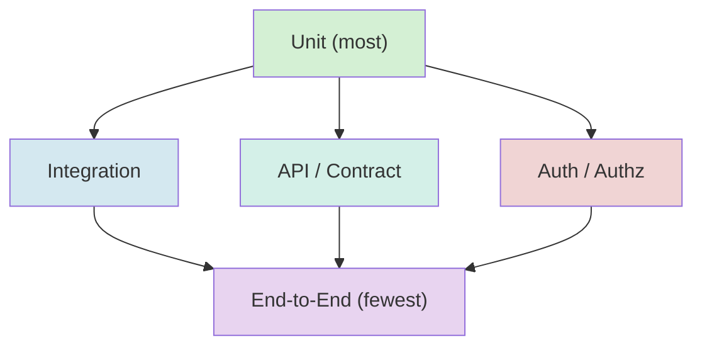
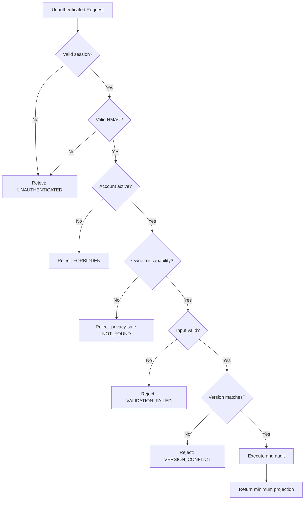
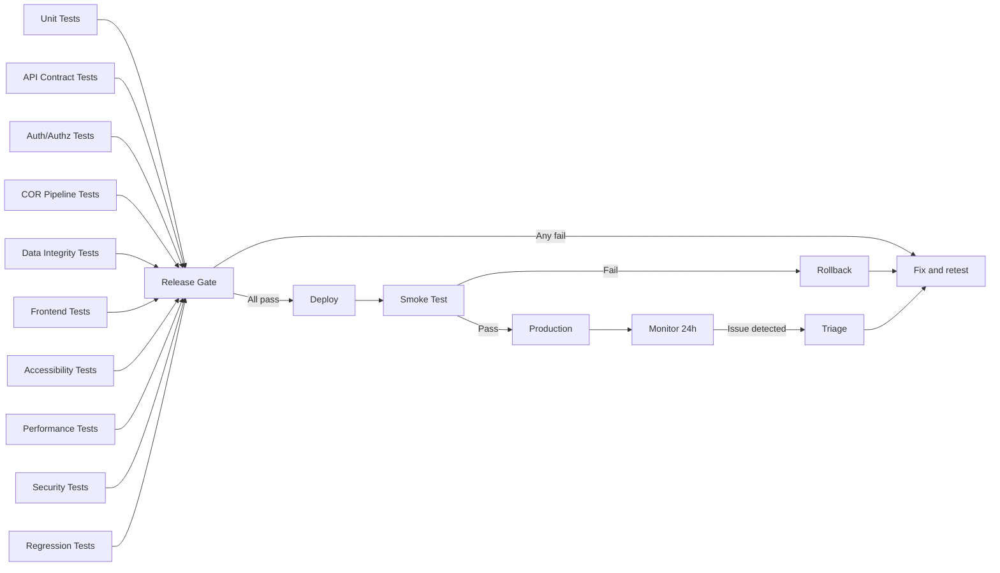

# My-Schedule Testing, Validation & Quality Assurance Architecture

> **Status:** Planning only. This document defines the target testing and QA strategy.
> It does not create test files, set up frameworks, or run tests.
>
> **Basis:** `API_BACKEND.md`, `SECURITY_PRIVACY.md`, `DATABASE.md`, `SCHEDULE_CRUD.md`,
> `REGISTRATION_COR.md`, `COR_AI_PIPELINE.md`, `ADMIN_ARCHITECTURE.md`,
> `DEPLOYMENT_INFRASTRUCTURE.md`, `AUDIT.md`, `STUDENT_DASHBOARD.md`
>
> **Date:** 2026-08-31

---

## 1. Testing Strategy Overview

### 1.1 Core Goal

Ensure the migration from a personal schedule app to a multi-user QCU platform is reliable, secure, and regression-safe. Tests cover both existing functionality identified in `AUDIT.md` and the new multi-user architecture.

### 1.2 Testing Principles

| Principle | Meaning |
|---|---|
| **Server authority** | Tests verify server-enforced ownership, authorization, and validation — not just browser guards |
| **Synthetic data only** | All test fixtures use synthetic identities and sample COR data; never real student information |
| **Privacy by default** | Test assertions verify no internal state leaks in error responses, logs, or API output |
| **Regression safety** | Every preserved existing feature has explicit regression tests before migration |
| **Authorization-first** | Cross-user isolation is tested before feature correctness for every private resource |
| **Pragmatic scope** | Testing infrastructure matches the project's simplicity — static frontend + Apps Script backend |

### 1.3 Testing Pyramid



| Layer | Volume | What it covers | Execution |
|---|---|---|---|
| **Unit** | Most tests | Pure functions: time calculation, validation rules, normalization, conflict detection, schedule state logic, template rendering | Local/fast; run on every change |
| **API / Contract** | Many tests | Endpoint request/response contracts, schema validation, error codes, envelope format | Against Apps Script test deployment or mock |
| **Auth / Authz** | Targeted tests | Identity resolution, owner enforcement, capability checks, session lifecycle, cross-user isolation | Against Apps Script test deployment |
| **Integration** | Fewer tests | COR pipeline stages, schedule revision activation, enrollment graph commit, cache invalidation | Against Apps Script test deployment |
| **End-to-End** | Fewest tests | Full user flows: login -> bootstrap -> dashboard, COR upload -> review -> commit, admin correction | Against staging environment |

---

## 2. Test Layers

### 2.1 Layer Definitions

| Layer | Scope | Example |
|---|---|---|
| **Unit** | Individual functions and modules with no external dependencies | `parseTime("1:30 PM")` returns `"13:30"` |
| **Component** | UI components in isolation with mock data | Task list renders empty state for zero tasks |
| **API Contract** | Request/response shapes, status codes, error formats | `POST /api/v1/tasks` with empty title returns `VALIDATION_FAILED` |
| **Service** | Domain services with mocked repositories | `ScheduleService.createActivation` validates conflicts before lock |
| **Integration** | Multiple services interacting through real repositories | COR upload -> Drive storage -> metadata creation |
| **Security** | Authentication, authorization, HMAC validation, CSRF | Tampered HMAC rejects with `UNAUTHENTICATED` |
| **Performance** | Response times and data volume handling | Dashboard loads in under 3 seconds with 50 schedule entries |
| **Accessibility** | WCAG 2.1 AA compliance | All form fields have associated labels; focus order is logical |
| **End-to-End** | Complete user flows across all layers | New student Google login -> COR upload -> dashboard shows schedule |

### 2.2 What NOT to Test

- Google OIDC provider internals (treat as trusted)
- Google Sheets/D_apps Script platform behavior (treat as trusted infrastructure)
- AI/OCR provider extraction quality (tested via contract mocks, not provider validation)
- Third-party CSS/JS library internals (e.g., MapLibre rendering)
- Browser native file input behavior

---

## 3. Authentication Tests

### 3.1 Login Flow Tests

| Test Case | Input | Expected Result |
|---|---|---|
| New Google login | Fresh Google account, no existing `Users.googleSub` | Creates `ONBOARDING` user, sets platform session cookie, routes to registration |
| Returning active login | Existing `ACTIVE` user with valid Google identity | Sets platform session cookie, routes to dashboard |
| Returning onboarding login | Existing `ONBOARDING` user | Sets session cookie, routes to registration/COR resume |
| Returning suspended user | Existing `SUSPENDED` user | Sets session cookie, shows restricted account page |
| Returning closed user | Existing `CLOSED` user | Sets session cookie, shows closed account page |
| Google identity invalid | Invalid or expired Google ID token | Returns to login with safe error |
| Google identity mismatch | Token issuer/audience mismatch | Returns to login with safe error |
| OAuth state mismatch | State parameter doesn't match cookie | Returns to login; no session created |
| OAuth state expired | State cookie older than 10 minutes | Returns to login with timeout error |
| Email not verified | Google `email_verified` is false | Rejects login with verification-required message |

### 3.2 Session Tests

| Test Case | Expected Result |
|---|---|
| Valid session cookie | Request proceeds; context built with correct `actorUserId` |
| Missing session cookie | Returns `UNAUTHENTICATED`; no private data exposed |
| Expired session cookie | Returns `UNAUTHENTICATED`; cookie cleared |
| Tampered session cookie | Returns `UNAUTHENTICATED`; cookie cleared |
| Session user version stale (account suspended since login) | Returns `SESSION_STALE`; Cloudflare clears cookie |
| Session renewal on activity | Cookie refreshed; `sessionUserVersion` rechecked |
| Multiple concurrent sessions for same user | Both sessions active until one expires or is revoked |

### 3.3 Logout Tests

| Test Case | Expected Result |
|---|---|
| Normal logout | Platform cookie cleared, integration cookie cleared (if present), audit event appended, browser returns to landing |
| Logout with no session | Returns safe success (idempotent) |
| API calls after logout return `UNAUTHENTICATED` | No data leakage from stale cache |
| Browser cache cleared on logout | Private IndexedDB namespaces purged; no prior-user data accessible |

### 3.4 Duplicate Account Handling

| Test Case | Expected Result |
|---|---|
| Same Google `sub` logs in again | Resolves to existing user; no duplicate created |
| Email change on re-login | `googleSub` lookup succeeds; email attribute updated |
| Email collision with different `sub` | Two separate accounts; no merge |
| Student number already claimed | Blocks activation; privacy-safe error |

---

## 4. Authorization Tests

### 4.1 Owner-Resource Isolation

```text
Student A → Student A's schedule = ALLOWED
Student A → Student B's schedule = DENIED (privacy-safe NOT_FOUND)
Student A → Student B's tasks = DENIED (privacy-safe NOT_FOUND)
Student A → Student B's notes = DENIED (privacy-safe NOT_FOUND)
Student A → Student B's COR records = DENIED (privacy-safe NOT_FOUND)
Student A → Student B's profile = DENIED (privacy-safe NOT_FOUND)
```

### 4.2 Cross-User Attack Tests

| Attack Vector | Test | Expected Result |
|---|---|---|
| Forged `userId` in payload | Send request with `userId: "other_user"` | Server ignores payload `userId`; derives from session |
| Forged `ownerUserId` in payload | Send `ownerUserId: "other_user"` in task create | Server ignores; assigns `actorUserId` as owner |
| ID tampering on resource ID | Request `/api/v1/tasks/{student_b_task_id}` | Returns `NOT_FOUND` (not `FORBIDDEN` — privacy-safe) |
| ID enumeration | Sequential UUID requests | All return `NOT_FOUND` for non-owned resources |
| Session cookie from user A used by user B | B sends A's cookie | Session resolves to A's identity; B cannot forge A's identity |
| Admin action from student session | Student calls `/api/v1/admin/users` | Returns `FORBIDDEN` |
| Student-supplied role/capability | Browser sends `isAdmin: true` or capability flags | Ignored; resolved server-side from database |

### 4.3 Admin Authorization Tests

| Test Case | Expected Result |
|---|---|
| Admin with `users.read` + correct scope reads user list | Allowed |
| Admin with `users.read` but wrong scope | `FORBIDDEN` |
| Admin without `imports.review` tries to review COR | `FORBIDDEN` |
| Admin without `documents.read.support` tries to access COR original | `FORBIDDEN` |
| Admin with `catalog.write` creates subject | Allowed within scope |
| Admin tries to self-escalate role | Blocked; audit event appended |
| Admin without `academic.correction.write` tries enrollment correction | `FORBIDDEN` |
| Expired admin role assignment | `FORBIDDEN` |

### 4.4 HMAC and Transport Security Tests

| Test Case | Expected Result |
|---|---|
| Valid HMAC signature | Request processed |
| Missing HMAC signature | `UNAUTHENTICATED` |
| Tampered HMAC signature | `UNAUTHENTICATED` |
| Expired timestamp (> 5 minutes) | `UNAUTHENTICATED` |
| Replay of used nonce | `UNAUTHENTICATED` |
| Unknown `keyId` | `UNAUTHENTICATED` |
| Unsigned direct browser call to Apps Script URL | Rejected (no valid envelope) |
| Oversized payload | Rejected before processing |

---

## 5. COR Pipeline Tests

### 5.1 Upload Validation Tests

| Test Case | File Type | Expected Result |
|---|---|---|
| Valid PDF (1 page) | `application/pdf` | Accepted; Drive stored |
| Valid JPEG image | `image/jpeg` with valid signature | Accepted; Drive stored |
| Valid PNG image | `image/png` with valid signature | Accepted; Drive stored |
| PDF exceeds page limit (> 10 pages) | PDF | Rejected; `TOO_MANY_PAGES` |
| File exceeds size limit (> 10 MiB) | Any | Rejected; `PAYLOAD_TOO_LARGE` |
| Password-protected PDF | PDF | Rejected; `PDF_LOCKED` |
| Corrupt/unreadable file | Any | Rejected; `FILE_CORRUPT` |
| Wrong extension (e.g., `.exe` renamed to `.pdf`) | Mismatched | Rejected; signature validation fails |
| Empty file (0 bytes) | Any | Rejected; `FILE_CORRUPT` |
| HEIC/HEIF image (unsupported) | `image/heic` | Rejected; `UNSUPPORTED_FILE_TYPE` |
| Duplicate upload (same hash, same user, active import) | Any | Returns existing import; no duplicate Drive file |

### 5.2 Extraction Pipeline Tests

| Test Case | Expected Result |
|---|---|
| PDF with embedded text layer | Text extracted without OCR; `hasEmbeddedText: true` |
| Scanned image (no text layer) | OCR provider called; text extracted |
| PDF with mixed text/image pages | Text pages use extraction; image pages use OCR |
| Poor quality scan | Extraction completes with low-confidence markers; review required |
| Multi-day schedule (M/W/F class) | Three meeting drafts created |
| Combined time cell (`MTh 1:00-2:30`) | Parsed into two separate meetings |
| Building/room in schedule | Matched against catalog; resolved IDs provided |
| Unknown subject code | `REVIEW_REQUIRED`; no silent catalog mutation |
| Unknown building | Reviewed snapshot preserved; no shared catalog row created |
| Ambiguous program (`COE` maps to multiple) | `REVIEW_REQUIRED` with candidate list |
| Missing required fields | Blocking validation issues; commit disabled |
| Provider timeout | Job marked retryable; bounded retry with backoff |
| Provider returns invalid schema | Output rejected; sanitized error logged |
| Provider returns unexpected field types | Output rejected; does not persist |

### 5.3 Student Review Tests

| Test Case | Expected Result |
|---|---|
| Student confirms all fields | Draft `reviewStatus` -> `CONFIRMED` |
| Student corrects a field | `reviewStatus` -> `CORRECTED`; `reviewedValue` saved |
| Student excludes a subject | Subject `includeStatus` -> `EXCLUDED` |
| Draft version conflict (concurrent save) | Returns `VERSION_CONFLICT`; no silent overwrite |
| Autosave of valid edits | `draftVersion` incremented; saved state confirmed |
| Student adds a meeting to a TBA subject | New meeting draft added; revalidated |

### 5.4 Commit Tests

| Test Case | Expected Result |
|---|---|
| Successful commit (new enrollment, schedule, entries) | `ACTIVE` enrollment; `ACTIVE` schedule revision 1; all entries created |
| Commit with blocking validation issues | Rejected; returns to `REVIEW_REQUIRED` |
| Commit with idempotent `clientMutationId` (retry) | Same result returned; no duplicate records |
| Commit with different payload but same `clientMutationId` | Rejected; idempotency conflict |
| Commit creates duplicate student number | Blocked under lock; privacy-safe error |
| Commit with same-term re-import | New enrollment/schedule replaces prior; prior archived |
| Concurrent commits (two valid requests) | First succeeds; second gets `VERSION_CONFLICT` |
| Commit partially fails (Sheets timeout mid-write) | Prior active schedule unchanged; draft recoverable |

### 5.5 COR State Machine Tests

| Transition | Test |
|---|---|
| `AWAITING_COR` -> `UPLOADED` | Valid upload accepted |
| `UPLOADED` -> `QUEUED` | Extraction job created |
| `QUEUED` -> `PROCESSING` | Worker claims job |
| `PROCESSING` -> `REVIEW_REQUIRED` | Draft ready for review |
| `PROCESSING` -> `FAILED` | Terminal extraction failure |
| `FAILED` -> `QUEUED` | Approved retry |
| `REVIEW_REQUIRED` -> `COMMITTING` | Student confirms valid draft |
| `COMMITTING` -> `COMPLETED` | Academic graph activated |
| `COMMITTING` -> `REVIEW_REQUIRED` | Recoverable validation conflict |
| `REVIEW_REQUIRED` -> `CANCELLED` | Student cancels import |
| `CANCELLED` -> `AWAITING_COR` | Ready for new upload |

---

## 6. CRUD Tests

### 6.1 Task CRUD

| Operation | Test | Expected |
|---|---|---|
| Create | Valid task payload | Task created with server-assigned ID, `ownerUserId` from session |
| Create | Empty title | `VALIDATION_FAILED` |
| Create | Title exceeds max length | `VALIDATION_FAILED` |
| Read (list) | Owner lists tasks | Returns only owner's tasks |
| Read (single) | Owner reads own task | Returns task with all fields |
| Read (single) | Owner reads another user's task | `NOT_FOUND` |
| Update | Owner updates own task title | Updated; version incremented |
| Update | Owner updates another user's task | `NOT_FOUND` |
| Update | Stale `expectedVersion` | `VERSION_CONFLICT` |
| Delete | Owner deletes own task | Soft-deleted; tombstoned |
| Delete | Owner deletes another user's task | `NOT_FOUND` |

### 6.2 Note CRUD

| Operation | Test | Expected |
|---|---|---|
| Create | Valid note payload | Note created with owner |
| Create | Empty body | `VALIDATION_FAILED` |
| Read (list) | Owner lists notes | Returns only owner's notes |
| Update | Owner updates own note | Updated |
| Update | Owner updates another user's note | `NOT_FOUND` |
| Delete | Owner deletes own note | Soft-deleted |
| Search | Owner searches notes | Only own notes returned |

### 6.3 Schedule CRUD

| Operation | Test | Expected |
|---|---|---|
| Read active schedule | Owner reads active schedule | Returns entries with resolved locations |
| Read active schedule | Non-owner reads schedule | `NOT_FOUND` |
| Create revision (batch) | Valid change set | New draft cloned, changes applied, validated, activated; old archived |
| Create revision | Overlapping meetings (warning acknowledged) | Activated with warnings |
| Create revision | Overlapping meetings (not acknowledged) | Returns `SCHEDULE_CONFLICT` |
| Create revision | Invalid time range (end before start) | `VALIDATION_FAILED` |
| Create revision | Entry references non-existent subject | `VALIDATION_FAILED` |
| Create revision | Stale `expectedVersion` | `VERSION_CONFLICT` |
| Create revision | Idempotent retry with same `clientMutationId` | Same result returned |
| Read history | Owner reads revision history | Returns paginated history |
| Manual subject create | Owner creates manual subject | Subject added to enrollment |
| Subject update | Owner updates manual subject metadata | Updated |
| Subject update | Owner tries to change COR-derived subject code | `OFFICIAL_RECORD_RESTRICTED` |
| Subject remove | Owner removes manual subject | Tombstoned; entries removed in replacement revision |

### 6.4 Admin CRUD

| Operation | Test | Expected |
|---|---|---|
| Catalog create | Admin with `catalog.write` creates subject | Created within scope |
| Catalog create | Student tries to create subject | `FORBIDDEN` |
| User list | Admin with `users.read` + scope | Returns paginated user list |
| User status change | Admin changes user status | Version incremented; audit event |
| COR review | Admin with `imports.review` reads draft metadata | Safe projection returned |
| COR original access | Admin with `documents.read.support` + reason | Short-lived delivery |
| Announcement create | Admin with `announcements.write` within scope | Created |

---

## 7. Data Integrity Tests

### 7.1 Core Invariants

| Invariant | Test | Expected |
|---|---|---|
| Unique `googleSub` | Two login attempts with same `sub` | Same user resolved; no duplicate |
| Unique student number per active profile | Two users try to activate with same number | Second blocked under lock |
| One non-cancelled enrollment per `(userId, termId)` | Attempt to create duplicate enrollment | Rejected |
| One active schedule per enrollment | Attempt to create two active schedules | Second rejected; prior unchanged |
| Unique subject code within enrollment | Two subjects with same normalized code | Rejected |
| Schedule entry references valid enrollment subject | Entry with non-existent `enrollmentSubjectId` | Rejected |
| Room belongs to building | Entry with wrong building/room pair | Rejected |
| Building belongs to campus | Entry with cross-campus building | Rejected (unless approved rule) |
| Owner chain valid | Entry owner matches schedule owner matches enrollment owner matches user | Consistency check passes |

### 7.2 Concurrency Tests

| Test | Expected |
|---|---|
| Two concurrent schedule revisions for same enrollment | First wins; second gets `VERSION_CONFLICT` |
| Two concurrent task updates (same task) | First wins; second gets `VERSION_CONFLICT` |
| Concurrent COR commits for same user | One succeeds; other blocked or queued |
| Schedule activation under lock (two workers) | One acquires lock; other waits or fails safely |
| Retry of successful commit (idempotent) | Same result; no duplicate records |
| Retry with mutated payload but same `clientMutationId` | Rejected; idempotency conflict |

### 7.3 Historical Record Tests

| Test | Expected |
|---|---|
| Archiving prior schedule preserves all entries | Prior entries unchanged after new activation |
| Historical term enrollment is read-only | Student cannot modify historical enrollment |
| Removed subject's tasks/notes remain owned | Tasks/notes not cascade-deleted |
| Deactivated catalog item in historical record | Historical record readable; new references blocked |
| COR original retention after commit | Original retained per policy; not immediately deleted |

---

## 8. Frontend Tests

### 8.1 Page Rendering Tests

| Page | Test | Expected |
|---|---|---|
| Landing page | Render without authentication | Public content visible; login CTA present |
| Dashboard | Render with active enrollment and schedule | Student name, program, current/next class, today timeline |
| Dashboard | Render with no active enrollment | Registration prompt |
| Dashboard | Render with no classes today | "No classes scheduled today" message |
| Schedule | Render weekly view | All meetings positioned by day/time |
| Schedule | Render mobile view | Stacked day sections; no horizontal scroll |
| Tasks | Render empty state | "No tasks yet" with create action |
| Tasks | Render task list | Items shown with title, priority, due date |
| Notes | Render empty state | "No notes yet" with create action |
| Map | Render with resolved building | Building info; map loads for campus |
| Map | Render with TBA location | Location text shown; no map pin |
| Profile | Render student info | Name, program, enrollment context |
| Settings | Render preferences | Notification toggle, logout, cache controls |
| Registration | Render upload surface | File selector, format guidance, privacy text |
| COR Review | Render extracted fields | Detected/reviewed values; edit controls |

### 8.2 State Management Tests

| Test | Expected |
|---|---|
| Bootstrap loads and routes correctly | Active -> dashboard; Onboarding -> registration; Suspended -> restricted |
| Cache owner verification | Cached data rejected if owner doesn't match current session |
| Logout purges private cache | No prior-user data accessible after logout |
| Term change reloads schedule data | Dashboard shows new term's schedule |
| API failure shows retry state | Error panel without private data leakage |

### 8.3 Loading and Error States

| State | Test | Expected |
|---|---|---|
| Dashboard loading | Initial fetch pending | Skeleton matching final layout |
| Dashboard API fails | Network or server error | Safe retry panel; no stale data |
| Schedule sub-fails | Partial dashboard failure | Other panels render; schedule shows error |
| Tasks summary fails | Panel-level error | Dashboard remains; tasks panel shows retry |
| Public status fails | Weather/suspension unavailable | "Status currently unavailable"; no false clear |
| Version conflict | Stale data detected | "Schedule changed" message; reload prompt |

---

## 9. Responsive Tests

### 9.1 Viewport Matrix

| Viewport | Width | Primary Navigation | Key Tests |
|---|---|---|---|
| Mobile portrait | 320px | Bottom nav (5 items) | No horizontal scroll; touch targets >= 44px; forms usable |
| Mobile landscape | 568px | Bottom nav | Same rules; schedule readable |
| Tablet portrait | 768px | Bottom nav or sidebar | Content readable; forms usable |
| Tablet landscape | 1024px | Sidebar or bottom nav | Two-column where appropriate |
| Desktop | 1280px+ | Sidebar | Full schedule table; two-column layouts |

### 9.2 Mobile-Specific Tests

| Test | Expected |
|---|---|
| Schedule table on 320px | No horizontal page scroll; grouped day sections |
| Task form on mobile | Full-width inputs; 48px+ touch targets |
| COR review on mobile | Stacked subject editors; no horizontal table |
| Bottom nav on mobile | 5 items visible; safe-area insets respected |
| File upload on mobile | Native file chooser works; drag-drop optional |
| Long text wrapping | Program names, subject titles, room labels wrap safely |
| Admin tables on mobile | Scrollable within container; not page-wide |

### 9.3 Cross-Browser Tests

| Browser | Priority | Notes |
|---|---|---|
| Chrome (latest) | Primary | Main development/test browser |
| Safari (latest) | Primary | iOS WebView behavior; cookie handling |
| Firefox (latest) | Secondary | Layout verification |
| Edge (latest) | Secondary | Layout verification |

---

## 10. Accessibility Tests

### 10.1 WCAG 2.1 AA Compliance

| Criterion | Test | Expected |
|---|---|---|
| 1.1.1 Non-text Content | Images have alt text; icons have labels | All meaningful images labeled |
| 1.3.1 Info and Relationships | Form fields use labels, fieldsets, legends | Labels visible; grouped fields have legends |
| 1.3.2 Meaningful Sequence | DOM order matches visual order | Tab order follows visual layout |
| 1.4.3 Contrast | Text meets 4.5:1 ratio (normal) / 3:1 (large) | All text passes contrast checker |
| 1.4.4 Resize | Content readable at 200% zoom | No layout breakage; text reflows |
| 2.1.1 Keyboard | All functionality available via keyboard | No keyboard traps; all actions reachable |
| 2.4.1 Skip Links | Skip navigation link present | Focus skips to main content |
| 2.4.3 Focus Order | Focus follows logical DOM order | Tab order is predictable |
| 2.4.7 Focus Visible | `:focus-visible` outline visible | Clear focus indicator on all interactive elements |
| 3.3.1 Error Identification | Errors clearly described near the field | Error summary links to invalid fields |
| 3.3.2 Labels or Instructions | Labels, helpers, required indicators | All form fields labeled above or adjacent |
| 4.1.2 Name, Role, Value | ARIA roles and states on custom controls | Custom widgets properly labeled |

### 10.2 Screen Reader Tests

| Test | Expected |
|---|---|
| Dashboard loads | Screen reader announces student name and academic context |
| Current/next class | Announced with subject, time, location |
| Task list | Each item announced with title, priority, due date |
| Form validation error | Error summary announced; focus moves to errors |
| Modal/dialog opens | Focus trapped; background inert |
| Modal closes | Focus returns to trigger element |
| Status change (autosave) | "Saved" / "Could not save" announced via live region |
| Loading state | "Loading" announced; content replaced when ready |

### 10.3 Keyboard Navigation Tests

| Test | Expected |
|---|---|
| Tab through dashboard | Logical order: header -> nav -> current class -> timeline -> secondary content |
| Tab through task form | Label -> input -> priority -> due date -> save -> cancel |
| Enter/Space on buttons | Activates the button |
| Escape closes modal | Modal closes; focus restored |
| Arrow keys in day selector | Moves between days |
| No keyboard traps | Can tab out of any element |

### 10.4 Reduced Motion Tests

| Test | Expected |
|---|---|
| `prefers-reduced-motion: reduce` | No animation; all workflow meaning preserved |
| Skeleton loading | No shimmer animation |
| State transitions | Instant; no fade/slide |
| Countdown timer | No animated digits |

---

## 11. Performance Tests

### 11.1 Measurable Targets

| Metric | Target | Measurement |
|---|---|---|
| Initial page load (HTML + CSS + JS) | < 2 seconds on 3G | Lighthouse / WebPageTest |
| Dashboard API response (bootstrap + dashboard) | < 3 seconds | End-to-end timing |
| Schedule rendering (50 entries) | < 500ms | Client-side timing |
| Task list render (100 tasks) | < 200ms | Client-side timing |
| COR upload acceptance | < 15 seconds (10 MiB file) | End-to-end timing |
| COR extraction (average) | < 60 seconds | Pipeline timing |
| COR commit | < 30 seconds | End-to-end timing |
| Schedule revision activation | < 20 seconds | End-to-end timing |
| Search (tasks/notes, 100 records) | < 100ms | Client-side timing |

### 11.2 Data Volume Tests

| Scenario | Data | Expected Behavior |
|---|---|---|
| Student with 8 subjects, 15 meetings | Normal load | All times met |
| Student with 12 subjects, 25 meetings | High load | All times met; schedule renders cleanly |
| Admin listing 500 students | Large list | Paginated; first page < 2 seconds |
| Admin listing 10,000 audit events | Large list | Paginated; cursor-based |
| COR with 10 pages, complex tables | Processing | Within Apps Script 6-minute limit |

### 11.3 Apps Script Quota Awareness

```text
Monitor during testing:
    - Execution time per action (must stay under 6-minute limit)
    - UrlFetchApp calls per day (20,000 limit)
    - Spreadsheet reads/writes per minute (200/user limit)
    - CacheService reads/writes per day (50,000 limit)
    - Trigger execution time per day (90 minutes)
```

---

## 12. Security Tests

### 12.1 Mermaid: User Security Test Flow



### 12.2 Authentication Bypass Tests

| Attack | Test | Expected |
|---|---|---|
| No session cookie | Call private endpoint | `UNAUTHENTICATED` |
| Expired session cookie | Call private endpoint | `UNAUTHENTICATED` |
| Forged session cookie | Call with random cookie value | `UNAUTHENTICATED` |
| Direct Apps Script call (no Worker) | Call doPost URL directly without HMAC | Rejected |
| Replay old request (expired timestamp) | Resend captured request after 5 minutes | `UNAUTHENTICATED` |
| Replay with same nonce | Send request with already-used nonce | `UNAUTHENTICATED` |

### 12.3 Authorization Bypass Tests

| Attack | Test | Expected |
|---|---|---|
| Student calls admin endpoint | `POST /api/v1/admin/users` from student session | `FORBIDDEN` |
| Student supplies `isAdmin: true` | Include in request payload | Ignored; not in context |
| Student reads another user's task | Request task with different owner's ID | `NOT_FOUND` |
| Student modifies another user's schedule | Batch revision with other user's schedule ID | `NOT_FOUND` |
| Admin accesses resource outside scope | Admin with PROGRAM scope accesses CAMPUS resource | `FORBIDDEN` |
| Student tries to escalate role | Attempt to assign self admin role | `FORBIDDEN`; audit event |

### 12.4 Input Validation Security Tests

| Attack | Test | Expected |
|---|---|---|
| XSS in task title | Submit `<script>alert(1)</script>` as title | Rendered as text; no script execution |
| XSS in note body | Submit `` | Rendered as text; no execution |
| XSS in student name (from COR) | OCR returns `<script>` in name | Rendered safely in profile |
| XSS in announcement body | Admin submits `<script>` in announcement | Stored and rendered safely |
| SQL injection in search | Submit `' OR 1=1 --` as search term | Treated as literal text |
| Formula injection in Sheets | Submit `=SUM(A1:A10)` as note body | Neutralized before cell write |
| Oversized payload | Send 100KB task title | Rejected; `VALIDATION_FAILED` |
| Deeply nested objects | Send 10-level nested JSON | Rejected; schema validation fails |

### 12.5 File and Upload Security Tests

| Attack | Test | Expected |
|---|---|---|
| Malicious file extension | Upload `.exe` renamed to `.pdf` | Rejected; signature check fails |
| Oversized COR upload | Upload 50 MiB file | Rejected at Cloudflare limit |
| ZIP bomb | Upload crafted compressed file | Decompression limits enforced |
| PDF with JavaScript | Upload PDF with embedded JS | Not executed; PDF treated as data |
| Filename path traversal | Upload with `../../etc/passwd` as filename | Sanitized; directory components removed |
| SVG with embedded script | Upload `.svg` file | Rejected if not in allowed types |

### 12.6 CORS and Headers Security Tests

| Test | Expected |
|---|---|
| Request from allowed origin | CORS headers present; request succeeds |
| Request from disallowed origin | CORS headers absent; request blocked |
| Preflight OPTIONS from allowed origin | 204 with correct CORS headers |
| Preflight OPTIONS from disallowed origin | No CORS headers |
| Security headers present | HSTS, X-Content-Type-Options, X-Frame-Options, CSP all set |
| CSP blocks inline script | `<script>` injected via XSS blocked by CSP |

### 12.7 Data Leakage Tests

| Test | Expected |
|---|---|
| Error response format | No stack traces, Sheet names, Drive IDs, HMAC keys, or provider details |
| 404 for non-owned resource | Same response as non-existent resource (privacy-safe) |
| API response does not include Google `sub` | Only internal opaque `userId` returned |
| API response does not include Drive file IDs | Only application `documentId` returned |
| COR draft response does not include raw OCR text | Only normalized fields and provenance |
| Logs do not contain student data | Content-free logging verified |
| Session cookie not in URL | Cookie never appears in query parameters |

### 12.8 Cache and Storage Security Tests

| Test | Expected |
|---|---|
| Private cache not shared across users | Cache keys namespaced by user ID |
| Logout purges private cache | No stale user data after logout |
| COR data not in browser localStorage | Private data stays server-side or in namespaced IndexedDB |
| COR data not in service worker cache | Private responses use `no-store` |
| COR data not in URL parameters | Document IDs never in URLs accessible to other users |

---

## 13. Regression Checklist

Based on the existing features identified in `AUDIT.md`:

### 13.1 Preserved Existing Features

| Feature | Regression Test | Status After Migration |
|---|---|---|
| Current/next class calculation | Computes correctly with server schedule data in `Asia/Manila` timezone | Dynamic data replaces hardcoded schedule |
| Live countdown | Updates every second when visible; pauses when hidden | No regression; same behavior |
| Home daily timeline | Shows today's classes chronologically with breaks | Server schedule replaces personal JSON |
| Weekly schedule view | All meetings positioned correctly by day/time | Active schedule replaces static JSON |
| Today-only cards | Shows only today's meetings | Same behavior with dynamic data |
| Building directory | Shows resolved buildings from schedule | Dynamic building catalog replaces hardcoded |
| QCity Bus Route 4 | Route information and schedule display | Preserved as public data |
| MapLibre map | Route geometry, stops, campus marker | Preserved; dynamic campus context added |
| "No live tracking" disclosure | Text present on map page | Preserved |
| Task CRUD (create/read/update/delete) | All operations work with server storage | Server replaces localStorage |
| Task filters, search, sorting | Filter/search/sort works correctly | Same behavior |
| Task completion toggle | Toggle works; state persists | Server persistence |
| Note CRUD | All operations work | Server replaces localStorage |
| Note search and filters | Work correctly | Same behavior |
| Weather display | Open-Meteo data loads for campus/user location | Preserved |
| Suspension display | Suspension scraper + fallback works | Preserved |
| Flood advisory | Google Flood proxy + fallback works | Preserved |
| Google OAuth connection | OAuth flow completes; session created | Preserved (optional integration) |
| Google Classroom updates | Course/announcement display works | Preserved |
| Google disconnect | Revokes tokens; clears session | Preserved |
| PWA installability | Install prompt works | Preserved |
| Offline shell | Application shell loads offline | Preserved |
| HTML escaping | User content escaped in rendering | Preserved; verified |

### 13.2 Removed/Replaced Features

| Feature | Replacement | Regression Test |
|---|---|---|
| Hardcoded `Habib` greeting | Server-resolved student name | Name displayed from bootstrap data |
| Fixed `BS Computer Science` subtitle | Dynamic program/department from enrollment | Correct program shown |
| `QCU_DEFAULTS.schedule` fallback | Server schedule with error state | No personal data fallback; safe error shown |
| `QCU_DEFAULTS.buildings` fallback | Server building catalog | No hardcoded fallback; error state shown |
| `localStorage` task storage | Server-scoped task records | Tasks synced to server |
| `localStorage` note storage | Server-scoped note records | Notes synced to server |
| Task/note subject filters from defaults | Filters from active enrollment subjects | Correct subject options shown |

---

## 14. Test Data Strategy

### 14.1 Synthetic Test Identities

| Identity | Google `sub` | Role | Academic Context |
|---|---|---|---|
| Student A (Alice) | `test_sub_alice_001` | Student | BSCS, Year 2, San Bartolome, AY 2026-2027 T1 |
| Student B (Bob) | `test_sub_bob_002` | Student | BSIT, Year 1, San Bartolome, AY 2026-2027 T1 |
| Student C (Carol) | `test_sub_carol_003` | Student | BSIS, Year 3, San Bartolome, AY 2026-2027 T1 |
| Student D (Dave) | `test_sub_dave_004` | Student | BSCS, Year 1, San Bartolome, ONBOARDING state |
| Student E (Eve) | `test_sub_eve_005` | Student | BSCS, Year 2, San Bartolome, SUSPENDED |
| Admin (Frank) | `test_sub_admin_006` | Admin | `users.read`, `catalog.write`, `imports.review` scope: GLOBAL |
| Admin (Grace) | `test_sub_admin_007` | Admin | `academic.correction.write` scope: PROGRAM (BSCS only) |

### 14.2 Synthetic COR Documents

| Document | Format | Content | Expected Extraction |
|---|---|---|---|
| `test_cor_valid.pdf` | PDF with text layer | Standard BSCS schedule, 6 subjects, 12 meetings | All fields extracted with high confidence |
| `test_cor_image.jpg` | JPEG scan | BSIT schedule, 5 subjects, 10 meetings | OCR extraction; lower confidence on some fields |
| `test_cor_poor_quality.png` | PNG, dark/blurry | BSCS schedule, 4 subjects | Partial extraction; REVIEW_REQUIRED |
| `test_cor_complex.pdf` | PDF with wrapped cells | Schedule with merged cells and TBA | Complex parsing; some fields UNKNOWN |
| `test_cor_empty.pdf` | PDF with no readable content | Blank pages | Extraction fails; `FILE_CORRUPT` or no text |
| `test_cor_large.pdf` | PDF, 12 pages | Exceeds page limit | Rejected; `TOO_MANY_PAGES` |

### 14.3 Test Academic Catalog

| Entity | Test Data |
|---|---|
| Campuses | San Bartolome (SB), Castanas (ST) |
| Departments | CCS, COE, CBA, CE |
| Programs | BSCS (CCS/SB), BSIT (CCS/SB), BSIS (CCS/ST), BSBA (CBA/SB) |
| Terms | AY 2026-2027 T1, AY 2026-2027 T2 |
| Subjects | CS101, CS102, IT101, IS201, MATH101, FIL1, RIZAL |
| Buildings | NAB (SB), Bautista (SB), Belmonte (SB) |
| Rooms | IL502A, IL601A, IK603 F1 |

### 14.4 Data Rules

- All test identities use clearly prefixed Google `sub` values.
- No real names, student numbers, emails, or COR images in test fixtures.
- Test data is loaded into a separate test Google Sheet, never production.
- Test data is reset/refreshed before each full test suite run.
- Performance test data is generated programmatically at scale.
- COR test documents use synthetic institutional data, not redacted real documents.

---

## 15. Environment and Testing Separation

### 15.1 Environment Matrix

| Environment | Purpose | Data | Apps Script | Cloudflare | Tests |
|---|---|---|---|---|---|
| **Local development** | Individual iteration | Local mocks or dev Sheets | Editor only (unpublished) | Wrangler dev server | Unit + component tests |
| **Test (CI)** | Automated verification | Test Google Sheet with synthetic data | Test deployment | N/A (no browser) | API contract, auth, service tests |
| **Staging** | Pre-production validation | Full synthetic dataset | Staging deployment | Preview deployment | Integration + E2E tests |
| **Production** | Live users | Real data | Production deployment | Production Pages + Workers | Smoke tests + monitoring |

### 15.2 Test Data Isolation Rules

- Production data is never used in test environments.
- Test environments never write to production Sheets/Drive.
- Test HMAC keys differ from production HMAC keys.
- Test OAuth client IDs differ from production OAuth client IDs.
- Test Google accounts are synthetic and not shared with production.
- Test COR documents are synthetic and contain no real student data.

---

## 16. Acceptance Criteria

### 16.1 Authentication

| Criterion | Pass Condition |
|---|---|
| New user login | Creates user with correct state; routes to onboarding |
| Returning user login | Resolves existing user; routes to correct destination |
| Session lifecycle | Expiry, revocation, and renewal all behave correctly |
| Logout | All cookies cleared; private cache purged; audit event created |
| Duplicate handling | Same `sub` resolves to same user; no duplicates |

### 16.2 Registration / COR

| Criterion | Pass Condition |
|---|---|
| COR upload | Accepted file stored privately; metadata created |
| Extraction | Structured draft produced with normalized fields and provenance |
| Review | Student can view detected/reviewed values; edit and save corrections |
| Commit | Active enrollment, schedule, and entries created atomically |
| Interrupted flow | Resume from any interruption point without data loss |
| Duplicate student number | Blocked; privacy-safe error |

### 16.3 Schedule

| Criterion | Pass Condition |
|---|---|
| Active schedule display | Correct entries shown for current day/week |
| Current/next class | Correctly identifies ongoing and next class |
| Schedule revision | New revision created; old archived; no data loss |
| Conflict detection | Overlapping meetings detected and reported |
| TBA handling | Subjects with no schedule shown appropriately |
| Term isolation | Different terms show different schedules |

### 16.4 Tasks and Notes

| Criterion | Pass Condition |
|---|---|
| CRUD operations | Create, read, update, delete all work with server persistence |
| Owner isolation | Each user sees only their own tasks/notes |
| Search and filter | Correct results returned for queries and filters |
| Subject linking | Tasks/notes link to active enrollment subjects |

### 16.5 Admin

| Criterion | Pass Condition |
|---|---|
| Capability enforcement | Only users with correct capabilities can perform admin actions |
| Scope enforcement | Admin actions restricted to assigned scope |
| Audit trail | Admin actions logged with actor, target, result, reason |
| User management | Status changes, role grants work correctly |

### 16.6 Security

| Criterion | Pass Condition |
|---|---|
| Cross-user isolation | No data leakage between users in any scenario |
| HMAC validation | Tampered/missing/expired requests rejected |
| Input validation | All malformed inputs rejected before database operations |
| Error privacy | No internals, stack traces, or sensitive data in errors |
| CORS enforcement | Only allowed origins can make API requests |

### 16.7 Deployment

| Criterion | Pass Condition |
|---|---|
| Frontend loads | All routes accessible; static assets cached correctly |
| API proxy works | Cloudflare Worker forwards to Apps Script correctly |
| Authentication end-to-end | Google login -> session -> API access works |
| Rollback works | Previous Apps Script version can be re-deployed |

---

## 17. Release Readiness Checklist

### Release Validation Pipeline



### 17.1 Pre-Release Gate

```text
Before production deployment:
    [ ] All unit tests pass
    [ ] All API contract tests pass
    [ ] All authorization tests pass (cross-user isolation)
    [ ] All authentication tests pass
    [ ] All COR pipeline tests pass
    [ ] All data integrity tests pass
    [ ] All frontend rendering tests pass
    [ ] All responsive tests pass (320px, 768px, 1280px)
    [ ] All accessibility tests pass (WCAG 2.1 AA)
    [ ] All security tests pass
    [ ] All regression tests pass (existing features preserved)
    [ ] Performance targets met (dashboard < 3s, schedule render < 500ms)
    [ ] No secrets in committed code
    [ ] HMAC keys stored in Worker KV + Script Properties
    [ ] CORS configured with explicit origins only
    [ ] CSP and security headers deployed
    [ ] Production Sheets/Drive sharing reviewed (no public links)
    [ ] Apps Script execute-as set to owner
    [ ] Backup spreadsheet created and tested
    [ ] Rollback procedure documented and tested
```

### 17.2 Post-Release Monitoring (First 24 Hours)

```text
Monitor:
    [ ] Authentication success/failure rate
    [ ] API error rates (4xx, 5xx)
    [ ] COR upload and processing success rate
    [ ] Apps Script execution times
    [ ] Apps Script quota consumption
    [ ] Cloudflare Worker error rate
    [ ] User-reported issues
    [ ] No sensitive data in logs or error responses

Escalation:
    [ ] Authentication failure > 5% -> investigate immediately
    [ ] API 5xx rate > 1% -> investigate immediately
    [ ] COR processing failure > 10% -> investigate within 1 hour
    [ ] Apps Script quota > 80% -> investigate and optimize
```

### 17.3 Ongoing Quality Gates

```text
Monthly:
    [ ] Run full regression test suite
    [ ] Review security test results
    [ ] Check performance targets
    [ ] Verify backup integrity
    [ ] Review error/audit logs for anomalies

Quarterly:
    [ ] Rotate test HMAC keys
    [ ] Refresh test data fixtures
    [ ] Review test coverage gaps
    [ ] Update regression checklist for new features
```

---

## 18. Testing Tool Recommendations

### 18.1 Recommended Stack

| Layer | Tool | Rationale |
|---|---|---|
| Unit testing (JS) | Vitest or Jest | Fast, modern, ESM-friendly for static JS |
| API contract testing | Custom fetch-based test harness | Apps Script doesn't have standard test runners |
| Accessibility testing | axe-core + manual screen reader testing | Automated + manual combo |
| Responsive testing | Browser DevTools device mode + real devices | Automated viewport + physical verification |
| Performance testing | Lighthouse + manual timing | Free; sufficient for initial targets |
| Security testing | Manual + OWASP checklist | Apps Script limits automated security tools |
| CI integration | GitHub Actions | Free tier sufficient; integrates with Cloudflare Pages |

### 18.2 What We Are NOT Adding

- Complex test frameworks (Playwright, Cypress) — overhead exceeds current project scope
- Mock service workers for API — Apps Script test deployment serves as the real backend
- Code coverage tools initially — focus on test completeness over metrics
- Load testing tools — performance targets validated through manual and simple scripted tests

---

## 19. Open Questions

| # | Question | Notes |
|---|---|---|
| 1 | Should we use Vitest or Jest for unit testing? | Vitest is lighter and ESM-native; Jest is more established |
| 2 | How do we mock Apps Script runtime for unit tests? | May need a thin abstraction layer over `SpreadsheetApp`, `CacheService` |
| 3 | What is the test data refresh cadence? | On every schema change? Monthly? |
| 4 | Should we add Playwright for E2E tests later? | Useful but adds infrastructure complexity |
| 5 | How do we test Cloudflare Worker HMAC signing? | May need local Worker emulation (Miniflare) |
| 6 | Who maintains test COR documents? | Need synthetic document library |
| 7 | Should accessibility testing be automated or manual-only? | axe-core catches ~30% of issues; manual needed for remaining |
| 8 | What is the test execution time budget? | Unit < 30s; API < 5min; Integration < 15min; E2E < 30min |
| 9 | Should we add visual regression testing? | Screenshot comparison for UI; adds infrastructure |
| 10 | How do we test Apps Script trigger-based jobs? | May need manual trigger invocation in test environment |

---

## CHUNK 19 — Performance, Scalability & Monitoring Architecture

Design the complete performance, scalability, and monitoring architecture for the My-Schedule platform.

**Planning only. Do not modify application source/configuration files.**

Read all previous planning documents, especially:

- `API_BACKEND.md` (Apps Script runtime model, rate limiting, caching)
- `DEPLOYMENT_INFRASTRUCTURE.md` (monitoring, quotas, failure scenarios)
- `ARCHITECTURE.md` (frontend state, data fetching)
- `DATABASE.md` (schema, indexing, query patterns)
- `SCHEDULE_CRUD.md` (revision activation, concurrency)
- `COR_AI_PIPELINE.md` (provider latency, job execution)
- `SECURITY_PRIVACY.md` (logging, monitoring)

### Performance Architecture

Define:

- Response time budgets per endpoint/action
- Database query optimization for Google Sheets
- Client-side rendering performance strategy
- Caching strategy implementation details
- CDN/edge caching configuration
- Lazy loading and progressive enhancement

### Scalability Analysis

Define:

- Expected user growth trajectory
- Apps Script quota scaling limits
- Google Sheets scaling limits (10M cells)
- Drive storage scaling for COR files
- AI/OCR provider quota management
- When to consider migration from Apps Script

### Monitoring Architecture

Define:

- Application Performance Monitoring (APM)
- Error tracking and alerting
- Uptime monitoring
- User experience monitoring
- Quota and cost monitoring
- Security event monitoring

### Capacity Planning

Define:

- Current capacity per resource
- Growth projections
- Breaking points
- Upgrade triggers
- Cost projections

### Deliverable

Create **`PERFORMANCE_SCALABILITY.md`** containing:

1. Performance architecture
2. Response time budgets
3. Database optimization
4. Client-side performance
5. Caching implementation
6. Scalability analysis
7. Capacity planning
8. Monitoring architecture
9. Alerting strategy
10. Cost projections
11. Migration triggers
12. Open questions

Include Mermaid diagrams for:

- Monitoring stack architecture
- Request lifecycle with timing
- Capacity growth projection

### Constraints

- Planning only.
- Do not modify source/configuration files.
- Do not set up monitoring infrastructure.
- Do not configure alerting.
- Follow `API_BACKEND.md` and `DEPLOYMENT_INFRASTRUCTURE.md`.

End with a precise **CHUNK 20 — Final Integration, Documentation & Launch Preparation** handoff.